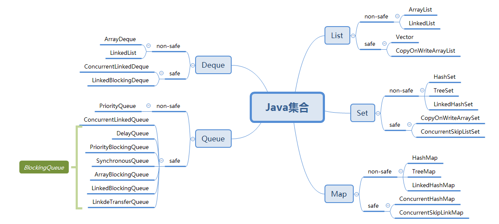

# Java集合集锦

首先来一张集合大家族：

## List
### ArrayList
- 非线程安全
- 基于数组实现，增删元素费时，查找省时，拥有快速随机访问能力
- 默认初始容量为10，可以指定初始容量，容量不足时需要扩容，默认扩容为原容量的1.5倍
- 支持序列化、克隆(浅拷贝)、排序功能
- 支持fail-fast
### LinkedList
- 非线程安全
- 基于链表实现，采用双向链表实现，增删元素省时，查找元素费时，涉及遍历的操作均费时
- 天然无限容量
- 支持序列化、克隆（浅拷贝）
- 它也可以被当作堆栈、队列或双端队列进行操作
- 支持fail-fast
### Vector
- 线程安全，内部采用synchronized实现线程安全
- 基于数组实现，增删元素费时，查找省时，拥有快速随机访问能力
- 默认初始容量为10，可以指定初始容量和增量，容量不足时需要扩容，每次扩容增量为设置的增量，如果未设置，默认扩容为原容量的2倍，
- 支持序列化、克隆(浅拷贝)、排序功能
- 支持fail-fast
### CopyOnWriteArrayList
- 线程安全
- 基于写时复制COW实现，修改集合时（写操作）将集合底层数组拷贝一份，在新数组中操作（需要加Lock锁，避免多线程操作时复制出N多的新数组），完成后将指针指向新数组，以分离读写操作，因为读取的时候并不需要复制。
- 基于数组实现，每次添加N个元素时都会新增数组，新数组会比原数组容量大N，从而实现扩容，即每次新增都会涉及扩容操作，所以需要尽量减少写操作
- 多用于读多写少的场景
- 支持序列化、排序、克隆
## Set
### HashSet
- 非线程安全
- 无序的集合，无重复元素，可存在一个null值
- 底层基于HashMap实现，其实就是以HashMap的键来表示，值为固定的PRESENT
- 可以指定初始容量，默认为16
- 可以指定负载因子，默认为0.75
- 基于HashMap的扩容原则进行扩容
- 支持序列化、克隆
- 支持fail-fast
### TreeSet
- 非线程安全
- 有序Set集合，基于Comparable或者Comparator实现排序，而这个又基于使用哪个构造器来创建集合实例
- 底层基于TreeMap实现，其实就是以TreeMap的键来表示，值为固定的PRESENT
- 支持序列化、克隆、排序
- 支持fail-fast
- 其余与TreeMap一致
### LinkedHashSet
- 非线程安全
- 有序Set集合，只支持插入顺序排序
- 底层基于LinkedHashMap和HashSet实现，几乎所有操作全部基于HashSet的对应方法，而链表方面的实现则全部基于LinkedHashMap
- 支持序列化、克隆、排序
- 支持fail-fast
### CopyOnWriteArraySet
- 线程安全
- 基于数组实现的无序的Set集合，虽然底层是数组，但仍然不支持出现重复元素
- 底层完全基于CopyOnWriteArrayList实现，所有的方法都是通过调用CopyOnWriteArrayList的对应方法来实现。
### ConcurrentSkipListSet
- 线程安全
- 基于跳表实现的有序的Set
- 底层完全依赖ConcurrentSkipListMap来实现，所有的方法基本都是通过调用ConcurrentSkipListMap的对应方法来实现的
- 支持序列化、克隆、排序
## Map
### HashMap
- 非线程安全
- 元素无序
- 支持null键和null值，其中null键只能有一个，null值不做限制
- 可以指定初始容量，默认是16，如果指定了容量，那么程序会计算一个大于等于给定容量的最小的2的次幂值作为桶数组的实际容量
- 可以指定负载因子，默认为0.75，一般不指定，这个0.75是在时间和空间成本上寻求一种折衷
- 基于哈希算法实现，采用链地址法解决哈希冲突
- 扩容将容量增加一倍
- 支持序列化、克隆
- 支持fail-fast
#### JDK1.7
- 底层基于数组+链表实现，数组用于存放链表头节点，链表用于处理Hash冲突
- 添加元素时，先进行扩容，然后在进行新元素添加
- 链表采用头插法，会导致在扩容时形成循环链表，形成原因是两个线程同时进行扩容操作后迁移数据的时候，循环中的`Entry<K,V> next = e.next;`一句，它会提前将e节点的下级节点预存起来，如果一个线程在执行完此句后中断，另一个线程完成了迁移操作，而迁移数据采用的仍然是头插法，就会导致节点的顺序颠倒过来（next颠倒），那么该线程再次开始执行时，由于next已被预存（保留的是原始的next,现在已被另一个线程修改），导致两个节点被各自的next互相引用形成循环链表
- 扩容后迁移元素时，元素被分拆成两个小链表，反向头插入新的桶数组的原位与原位+旧容量位
- 可能会导致插入的数据丢失
- [HashMap的hashSeed的问题](https://blog.csdn.net/qq_30447037/article/details/78985216)
#### JDK1.8
- 底层基于数组+链表+红黑树实现，数组用于存放链表头节点或者树根节点，链表和红黑树用于处理hash冲突
- 链表采用尾插法，避免循环链表
- 优先采用链表解决Hash冲突，当链表元素达到8个而且桶数组容量达到64以上，则将链表转换为红黑树，如果桶数组容量不足64，则优先进行扩容
- 扩容后迁移元素时，元素迁移分链表和红黑树两种情况，两种情况都会对原结构数据进行分拆，拆成两个小链表或者小红黑树保存到新数组的对应位置，而不是全部重新hash，其中一个小结构会落位于原位置，另一个落位于原位置+旧容量的位置，有一点要注意就是，红黑树分拆的小树如果容量小于6个元素，需要退化为链表。
### TreeMap
- 非线程安全
- 有序的Map集合，基于Comparable或者Comparator实现排序，而这个又基于使用哪个构造器来创建集合实例
- 基于红黑树实现，获取和添加的操作时间复杂度均为O(logn)
- 红黑树的操作主要包括：添加元素、添加修复、删除元素、删除修复、获取元素、左旋操作、右旋操作、着色操作
- 采用中序遍历排序和遍历：先左再根后右
- 支持克隆、排序、序列化
- 支持fail-fast
### LinkedHashMap
- 非线程安全
- 有序的Map集合，基于accessOrder的值来决定排序方式，true表示访问顺序（get的顺序），false表示插入顺序（put的顺序）
- 底层基于双向链表和HashMap实现，就是对HashMap中的元素又附着一层链表来表示元素的顺序。
- 该类中主要涉及的就是有关新增的链表的操作，凡是涉及map的操作一律调用HashMap中的方法来完成，拥有HashMap的所有功能
- 支持fail-fast
### WeakHashMap
- 非线程安全
- 基于hash算法实现的Map集合，使用链地址法解决hash冲突，
- 基于数组+链表方式存储数据
- 可以指定初始容量和负载因子，初始容量默认为16，负载因子默认为0.75
- 扩容默认增加一倍容量，迁移元素时需要全部重新hash进行落位
- 与HashMap不同之处在于这里使用弱键，弱引用对象将在下次GC时被回收掉（前提是没有强引用指向它）
- 弱键是通过WeakReference和ReferenceQueue实现的，使用WeakReference来定义弱键，使用ReferenceQueue来存放被GC回收的弱键，然后在需要（扩容）时根据队列将集合中对应的元素删除。
- 支持fail-fast
### HashTable
- 线程安全，几乎所有操作都通过同步原语synchronized来实现线程安全
- 不支持null键和null值
- 基于hash算法，使用链地址法解决hash冲突
- 无序的Map集合，类似于HashMap，同样以数组+链表方式存储数据
- 可自定义初始容量和负载因子，初始容量默认为11，负载因子默认0.75，如果自定义初始容量为0则默认置为1
- 当元素数量达到阈值则进行扩容，新容量为原来的2倍+1
- 支持序列化、克隆
- 支持fail-fast
### ConcurrentHashMap
- 线程安全
- 底层使用无限循环+CAS操作来保证多线程安全
- 可以指定初始容量和负载因子，初始化容量默认为16，负载因子默认为0.75
- 并发等级DEFAULT_CONCURRENCY_LEVEL是可以自定义的,默认为16，它代表的就是可以同时支持的并发量
- 扩容后迁移数据时需要拆分原结构（链表或者红黑树）将原结构中的数据分拆成两个子结构，分别位于新数组的原位置和原位置+旧容量的位置（即新数组的低位区和高位区）
- 支持序列化功能
#### JDK1.7
- 底层采用Segment数组+table数组来实现
- Segment数组可以自定义，但是一旦初始化就固定不变，默认为concurrencyLevel=16
- Segment数组的最大容量为1<<16，表示可以最多拥有1<<16个分段数组，这个值一旦初始化不可改变
- 集合容量可以初始化，这个容量是整个ConcurrentHashMap的容量，初始化后会平均分给每个Segment
- table数组的容量最小为2，可以扩容，扩容为原来的2倍，容量必须为2的次幂
- 扩容针对的是table数组，Segment数组一经初始化就固定不变了，这样扩容不会导致整个集合全部扩容，而是仅仅一个Segment数组的元素代表的table数组进行扩容和数据迁移
- 链表采用头插法实现，扩容迁移数据时也是头插法
```java
public class ConcurrentHashMap<K, V> extends AbstractMap<K, V>
        implements ConcurrentMap<K, V>, Serializable {
    public V put(K key, V value) {
        Segment<K,V> s;
        // 值不支持null
        if (value == null)
            throw new NullPointerException();
        int hash = hash(key);// 计算key的hash值
        // 计算元素的位置j，其中segmentShift和segmentMask都是在容器初始化的时候赋值的
        int j = (hash >>> segmentShift) & segmentMask;
        if ((s = (Segment<K,V>)UNSAFE.getObject          // nonvolatile; recheck
             (segments, (j << SSHIFT) + SBASE)) == null) //  in ensureSegment
            s = ensureSegment(j);// 初始化segment[j]
        return s.put(key, hash, value, false);
    }
    // 初始化分段数组segment[k]
    private Segment<K,V> ensureSegment(int k) {
        final Segment<K,V>[] ss = this.segments;
        long u = (k << SSHIFT) + SBASE; // raw offset
        Segment<K,V> seg;
        if ((seg = (Segment<K,V>)UNSAFE.getObjectVolatile(ss, u)) == null) {// 如果尚未初始化则进行初始化
            Segment<K,V> proto = ss[0]; // 使用当前的segment[0]作为原型，这个segment[0]可能已经发生过扩容
            int cap = proto.table.length;// 获取原型的内部数组长度
            float lf = proto.loadFactor;// 获取原型的加载因子
            int threshold = (int)(cap * lf);// 计算阈值
            HashEntry<K,V>[] tab = (HashEntry<K,V>[])new HashEntry[cap];// 创建一个指定容量的空数组tab
            if ((seg = (Segment<K,V>)UNSAFE.getObjectVolatile(ss, u)) == null) { // recheck,如果没有其他线程完成初始化操作，则由本线程完成
                Segment<K,V> s = new Segment<K,V>(lf, threshold, tab);// 新建一个Segment实例s
                // 通过无限循环和CAS来保证操作的原子性
                while ((seg = (Segment<K,V>)UNSAFE.getObjectVolatile(ss, u)) == null) {
                    if (UNSAFE.compareAndSwapObject(ss, u, null, seg = s))// 将上面新建的Segment实例s设置到指定的分段数组位上
                        break;
                }
            }
        }
        return seg;
    }
    // Segment类，每个Segment持有一个HashEntry数组，每个Segment实例就是一个分段
    static final class Segment<K,V> extends ReentrantLock implements Serializable {
        // 因为元素都是保存在每个分段的内部HashEntry数组中的额，所以每个put操作最后都需要调用这个put来完成添加操作
        final V put(K key, int hash, V value, boolean onlyIfAbsent) {
            // 首先尝试快速获取独占锁，如果成功node=null，否则执行scanAndLockForPut方法来获取锁
            HashEntry<K,V> node = tryLock() ? null : scanAndLockForPut(key, hash, value);
            V oldValue;
            try {
                HashEntry<K,V>[] tab = table;
                int index = (tab.length - 1) & hash;
                HashEntry<K,V> first = entryAt(tab, index);
                for (HashEntry<K,V> e = first;;) {
                    if (e != null) {
                        K k;
                        if ((k = e.key) == key ||
                            (e.hash == hash && key.equals(k))) {
                            oldValue = e.value;
                            if (!onlyIfAbsent) {
                                e.value = value;
                                ++modCount;
                            }
                            break;
                        }
                        e = e.next;
                    }
                    else {
                        if (node != null)
                            node.setNext(first);
                        else
                            node = new HashEntry<K,V>(hash, key, value, first);
                        int c = count + 1;
                        if (c > threshold && tab.length < MAXIMUM_CAPACITY)
                            rehash(node);
                        else
                            setEntryAt(tab, index, node);
                        ++modCount;
                        count = c;
                        oldValue = null;
                        break;
                    }
                }
            } finally {
                unlock();
            }
            return oldValue;
        }
        // 尝试获取锁
        private HashEntry<K,V> scanAndLockForPut(K key, int hash, V value) {
            HashEntry<K,V> first = entryForHash(this, hash);
            HashEntry<K,V> e = first;
            HashEntry<K,V> node = null;
            int retries = -1; // negative while locating node
            // 循环获取锁，成功结束循环，否则进入循环内部
            while (!tryLock()) {
                HashEntry<K,V> f; // to recheck first below
                if (retries < 0) {// 首次循环总是-1，会进来这里
                    if (e == null) {// e==null，有两种情况，一种是数组为空，另一种是遍历完一遍数组中的元素之后，然就会将次数置为0
                        if (node == null) // speculatively create node
                            node = new HashEntry<K,V>(hash, key, value, null);// 初始化node节点
                        retries = 0;// 次数置0
                    }
                    // 如果数组中已有元素，则比较新元素的key与数组中元素的key是否等，如果相等，
                    // 那么就直接替换value即可，不用再添加新元素，所有次数置0，如果不等那么走下面的遍历链表，
                    // 比较下一个元素，直到找到相等的或者遍历完所有元素
                    else if (key.equals(e.key))
                        retries = 0;
                    else
                        e = e.next;// 遍历链表
                }
                // 次数自增，每次加1，MAX_SCAN_RETRIES如果是单核值为1，多核值为64；
                // 如果retries=0，MAX_SCAN_RETRIES为1（单核），retires自增为1，等式不成立，会再次循环，
                // 还是没有获取到锁的情况下，再次走到这里，等式成立，执行lock方法，线程阻塞，
                // 直到获取到锁才能结束，break跳出循环
                else if (++retries > MAX_SCAN_RETRIES) {
                    lock();
                    break;
                }
                // 如果发现头节点发生变化，那么只能是别的线程添加了新元素导致头节点变更，
                // 这时候当前线程的流程结束，重新开始一波循环，开始前需要重置初始值
                else if ((retries & 1) == 0 &&
                         (f = entryForHash(this, hash)) != first) {
                    e = first = f; // re-traverse if entry changed
                    retries = -1;
                }
            }
            return node;
        }
    }
}
```
#### JDK1.8
- 放弃分段锁方式，恢复原始的数组+链表+红黑树方式实现
- 链表元素达到8个且桶数组容量达到64以上，则将单向链表转化为一个红黑树，其实它同时还是一个双向链表，双向链表的目的是为了退化为链表做的准备
- 数据迁移时，红黑树需进行分拆，如果小树容量低于6个则退化为单向链表
- 针对桶位节点加锁的方式来保证线程安全
- 当多线程并发进行扩容数据迁移时，需要为每个线程分配迁移区间，区间大小默认为16个数组位（分区步长）
- 重点变量：
    - sizeCtr
        - 0：default，默认值，在使用无参构造器构造实例时
        - -1：初始化桶数组
        - ((rs << RESIZE_STAMP_SHIFT)+2) +N：数组扩容，代表线程数量，但有个基数(rs << RESIZE_STAMP_SHIFT）+2，在此基数上进行增减，每有一个线程参加扩容，该值+1，否则减1，扩容结束会恢复基数值
        - 0.75*table.length：正常状态，代表扩容阈值
    - hash
        - -1：（MOVED）表示正在扩容，且当前桶位的元素已迁移完毕
        - -2：（TREEBIN）表示红黑树
- 问题：如果在递归中使用computeIfAbsent方法那么就会导致内存100%
### [ConcurrentSkipLinkMap](https://blog.csdn.net/qq_35326718/article/details/78870658)
- 线程安全，键和值不能为null
- 基于跳表实现的Map
- 有序的Map实现，基于Comparable或者Comparator实现排序
- 基于无限循环+CAS实现无锁操作来保证并发操作的安全性
- 支持序列化、克隆、排序
## Queue
### PriorityQueue
- 线程不安全
- 不支持null元素
- 有序，基于Comparable或者Compatator
- 基于**优先级堆**的**无界队列**
- 基于堆结构实现，具体是完全二叉树实现的小顶堆（任意非叶子节点的权值都不能大于其左右子节点的权值），底层采用的数组实现
- 可以指定数组初始容量，默认为11
- 添加元素的时候发现数组容量不足，先进行扩容，如果旧数组容量不足64，那么就扩容为原来的两倍+2，否则扩容为原来的1.5倍
- peek()\element()操作时间复杂度为O(1)
- add()\offer()\remove()\poll()操作的时间复杂度为O(logn)
- 支持序列化、排序
### [ConcurrentLinkedQueue](http://www.importnew.com/25668.html)
- 线程安全
- 基于哨兵模式**单向链表**的**无界队列**，采用非阻塞算法（CAS操作+无限循环）实现操作的原子性，而可见性和有序性依靠volatile实现，而这也正是并发包中Concurrent开头的并发集合的实现基础，一般基于此实现的逻辑均较为复杂，比如此处的add、offer操作
- 不支持null元素
- 支持FIFO（先进先出），新元素添加到队列尾部，取出元素从队列头部取出
- size属性一般无法保证精确度，所以size()方法会遍历集合进行数量统计，这会耗费较多时间，所以要尽量避免使用，可用isEmpty代替
- 集合持有链表的头尾节点，分别为head和tail，需要注意的是tail并不总是指向真正的尾节点，基于其内部复杂的实现，tail有多种情况需要考虑
- offer操作简单分析：多个线程同时执行添加元素的操作（各个线程添加的是不同的元素）:
```java
public class ConcurrentLinkedQueue<E> extends AbstractQueue<E>
        implements Queue<E>, java.io.Serializable {
    // 将新元素添加到队列尾部
    // newNode：代表新增节点
    // t：代表尾节点
    // p：指向的应该是真正的尾节点，每个添加元素的线程都会将p移动到当前的尾节点,通过第(4)步
    // q：永远指向p的下级节点，其实就是指向NULL(不存在的节点)，每次新增一个元素节点，其实就是插入到q所指向的位置，新的线程开始循环的时候就会将q指向新的NULL
    // t、p、q的变迁只在存在多个线程的情况才会有意义，如果是单线程那么就没有意义，只有tail有意义，第二个线程会走两次循环，第一次会执行(4)，第二次循环进行元素添加，成功之后还会执行(2)来更新tail指向，所以tail会每隔一个节点执行一次。
    public boolean offer(E e) {
        checkNotNull(e);// null校验
        final Node<E> newNode = new Node<E>(e);// 封装元素节点
        for (Node<E> t = tail, p = t;;) {// t代表尾节点tail，p初始化为t
            // 这一步将q定义为p的next执向，即NULL，但有多个线程时，会各有一个q指向NULL
            Node<E> q = p.next;
            if (q == null) {
                // p is last node
                // 执行节点添加操作，多线程情况下只能有一个线程能成功添加到这个q指向的位置，
                // 当一个线程成功之后，其余线程皆失败，失败的线程会重新循环
                if (p.casNext(null, newNode)) {// (1) 
                    // Successful CAS is the linearization point
                    // for e to become an element of this queue,
                    // and for newNode to become "live".
                    // 执行节点添加成功的线程并不一定会执行下面的tail更新操作，只有在p!=t的情况下才会执行，
                    // 那么什么时候p!=t呢：只有当前线程执行过(4)操作之后才会导致p和t不等。如果p!=t，执行下
                    // 面的tail更新操作，将tail指向当前线程刚刚新增的尾节点
                    if (p != t) // hop two nodes at a time
                        casTail(t, newNode);  // Failure is OK.(2) 这个操作隔一个节点执行一次（隔一个成功添加节点的线程执行一次）
                    return true;
                }
                // Lost CAS race to another thread; re-read next
            }
            // p==q是指遭遇其他线程的执行poll操作导致出现next指向自身的节点出现，针对这种节点p==q成立，
            // 对于遇到这种情况，需要专门进行重定位，此处重定位p的指向，如果tail指向刚刚被其他线程更新，
            // 那么可能tail指向的就是真正的尾节点，当然也有可能不是，这里可以尝试定位到tail指向的节点，
            // 否则直接定位到head头节点，然后再次循环，如果定位tail确实是尾节点，则可以顺利指向(1)，
            // 如果不是或者指向的是head节点，那么会执行(4)，将p一步一步挪到真正的尾节点，然后在执行(1)
            else if (p == q)
                // We have fallen off list.  If tail is unchanged, it
                // will also be off-list, in which case we need to
                // jump to head, from which all live nodes are always
                // reachable.  Else the new tail is a better bet.
                // 此处的比较方式好新奇，其实与线程操作栈有关，t先入栈，指向的是tail的节点，然后再次将tail赋值给t，
                // 如果在此之前其他线程更新的tail，那么新的t指向与之前入栈的t就不同了，不同就代表tail刚刚被更新了，
                // 所以直接将p指向新更新的tail，否则指向head节点，由第(4)布慢慢挪到尾节点再去执行(1)
                p = (t != (t = tail)) ? t : head;// (3)
            else
                // Check for tail updates after two hops.
                // 当竞争失败的线程再次开始循环的时候发现q不再指向NULl，而是指向了上次竞争成功的线程添加的节点时，
                // 就会到这里先把p往后挪一位，然后再去循环执行(1)
                p = (p != t && t != (t = tail)) ? t : q;// (4)
        }
    }
    // 获取并删除头节点
    // h：指向头节点
    // p：指向的应该是真正的头节点（非null节点）
    // q：指向p的next
    public E poll() {
        restartFromHead:
        for (;;) {
            for (Node<E> h = head, p = h, q;;) {
                E item = p.item;// 预存当前头节点的值
                // 如果当前p的item不为null，则p指向的是真正的头节点，那么尝试将其值更新为null，
                // 此处可能会有多个线程进行操作，执行成功的线程会尝试执行(2)
                if (item != null && p.casItem(item, null)) {// (1)
                    // Successful CAS is the linearization point
                    // for item to be removed from this queue.
                    // 执行头节点值更新成功的线程会进来校验p和h，只有p!=h，才会更新head的指向，
                    // 那么何时p会与h不等呢？其实很简单只要当前线程在更新成功之前执行过(5)操作，
                    // 那么p会发生挪移，不再与h指向同一节点，然后可以执行head指向的更新(2)
                    if (p != h) // hop two nodes at a time
                        // 如果p有下级节点，那么优先将该下级节点作为新的头节点，否则就将当前的p指向的null节点作为头节点
                        updateHead(h, ((q = p.next) != null) ? q : p);// (2)
                    return item;
                }
                // 此处定义q的值为p的next指向节点。如果q指向的是null，那么意味着当前队列中没有真正的元素节点存在
                // （可能是尚未添加任何节点，也可能是所有节点被取走或删除），此时尝试更新头节点指向
                else if ((q = p.next) == null) {
                    updateHead(h, p);// (3)
                    return null;
                }
                // p==q是在遭遇其他线程指向offer操作的时候会发生这种指向自身的节点出现，出现这种情况，直接重新开启外部循环
                else if (p == q)
                    continue restartFromHead;// (4)
                // 当竞争失败的线程再次开始循环的时候发现p的item已经为null了，那么这时候p指向
                // 的就不是真正的头节点了，需要执行下面的操作(5)将p的指向向后挪移，然后继续循环    
                else
                    p = q;// (5) 向后迁移p指向
            }
        }
    }
    final void updateHead(Node<E> h, Node<E> p) {
        // 如果h==p，代表的是尚未添加任何元素节点的情况，此种情况下，不做更新；如果h!=p，
        // 那么会是在当前线程执行过(5)操作前后队列中的所有元素被删除或取走,此时h!=p，那么
        // 尝试将头节点指向p，此处为何指向p呢：因为既然h!=p，那么就是说h的指向已经是一个值
        // 为null的节点了，p原本是一个有值的节点，不过在此期间被别的线程删除，也变成值为null的节点了，
        // 但是p作为后继节点会作为新增节点的前置节点，而不是原来的head节点，如果还保留原来的head节点，那么就会存在两个null节点了
        if (h != p && casHead(h, p))
            h.lazySetNext(h);// 将旧的head指向他自己，作为一个哨兵，为succ()方法服务
    }
}
```
- 支持序列化
### BlockingQueue
#### DelayQueue(延迟阻塞队列)
- 线程安全的有序无界阻塞队列，是按照过期优先级排序的，先过期的排前面，头节点是最先过期的元素
- 不支持null元素，保存到其中的元素必须是Delayed类型或其子类型
- 该队列中的元素都有一个延期时间，只有到期的元素才能被取出来，如果所有元素均未到期，无法取出元素，但不代表队列中无元素
- 底层基于PriorityQueue实现，其实就是针对PriorityQueue对应的方法进行加Lock锁来保证线程安全性
- 初始容量同PriorityQueue，为11，此处使用的正是无参构造器，无法初始化容量，直接采用默认初始容量11
- 扩容规则同PriorityQueue
- 由以上可知，该队列同样依据优先级堆来实现，以数组实现的完全二叉树构造的小顶堆
- 元素有序的实现：该队列基于PriorityQueue无参构造器实现，底层使用Comparable来实现排序，那么这个Comparable来自哪里呢？其实现compareTo方法定义在哪里呢？打开Delayed源码就能看到，这个接口继承了Comparable接口，那么其子类就必要实现compareTo方法，那么延迟队列中元素排序比较的依据就是在这个方法实现中定义的，示例可参照TimeQueue的DelayedTimer内部类
- 延迟队列，可用于实现缓存系统，定时调度系统，Timer就是基于此队列实现
#### PriorityBlockingQueue(优先阻塞队列)

#### SynchronousQueue(同步阻塞队列)

#### ArrayBlockingQueue(基于数组的阻塞队列)

#### LinkedBlockingQueue(基于链表的阻塞队列)

#### LinkedTransferQueue()

## Deque(双端队列)
### ArrayDeque（基于数组的双端队列）
- 非线程安全
- 不支持null元素，当做栈使用速度比Stack快，当做队列使用速度快于LinkedList
- 基于可变循环数组实现的无界双端队列，底层数组是被当做环形来使用的，
- 底层包含一个Object[]数组elements，还持有头节点和尾节点的下标索引head和tail
- 可以自定义初始容量，但是ArrayDeque有一个最小初始容量（为8）限制，如果自定义容量小于该值，则以该值为标准计算最后的容量，否则以自定义容量计算最后的容量，计算规则是找出大于等于给定容量值的最小的2的次幂值，如果是8,那么结果就是8，如果是10，那么结果是16；如果不自定义容量，那么默认初始容量为16
- 当数组容量爆满时需要扩容，扩容为原来的2倍容量，扩容后迁移数据时会将原来数组中环形存放的元素整齐存放到新数组中（指新数组从0开始存放头节点一直然后）
- 采用数组环形存放节点，有一种快速校验是否爆满的方式：
    - 首先要保证数组的长度是2的次幂，这样2<sup>n</sup>-1得到的就是末几位全是1的值（例如：2<sup>4</sup>=16，其二进制为10000，16-1的结果为15，其二进制为1111）
    - 然后用上面全1的结果与期待的逻辑位相与，就能得到逻辑位置对应到循环数组中的物理位置下标（数组满不满主要看head与tail是否将要重合，但二者分别指向头节点与尾节点，不可能等重合再进行扩容，只要将要重合，数组没有空位就需要扩容，所以此处是(tail + 1) & (elements.length - 1)的结果是否是head节点下标，如果是就需要扩容）
    - 举个例子，16位数组，head指向下标0，tail指向下标15，要判断head与tail在下一次新增节点时会不会重合，只需要在tail+1，指向逻辑上的下一个元素下标位，然后通过上面的公式计算出物理下标位，得到结果为0，与当前head下标一致，说明下一次新增节点head和tail将会重合，此时就必须扩容
- 支持序列化、克隆
- 支持fail-fast
### LinkedList（基于链表的双端队列）
同List中的LinkedList
### ConcurrentLinkedDeque
- 线程安全
- 不支持null元素
- 基于哨兵模式**双向链表**的**无界队列**，属于**双端队列**，采用非阻塞算法（CAS操作+无限循环）实现操作的原子性，而可见性和有序性依靠volatile实现，而这也正是并发包中Concurrent开头的并发集合的实现基础，一般基于此实现的逻辑均较为复杂，比如此处的add、offer操作
- 同时支持FIFO（先入先出）和FILO（先入后出），所以相较于ConcurrentLinkedQueue，实现将更加复杂
- size属性一般无法保证精确度，所以size()方法会执行一次集合遍历来统计集合容量，较为耗时，尽量避免使用，可用isEmpty代替
- 各个操作其实和ConcurrentLinkedQueue差不多，只是存在两个方向
- 支持序列化
### LinkedBlockingDeque
