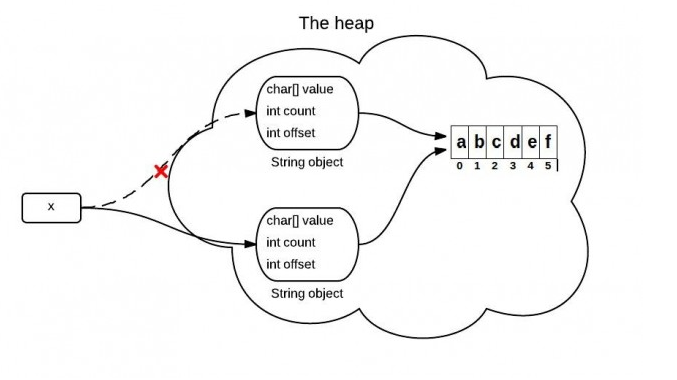
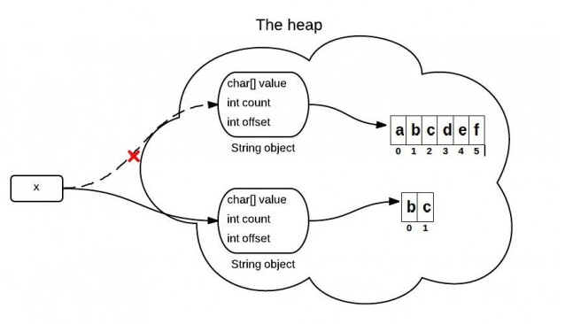

# JDK 6和JDK 7中substring的原理及区别

substring(int beginIndex, int endIndex)方法用于截取字符串，返回截取的新字符串。新字符串由当前字符串的第beginIndex到endIndex的字符组成，长度无endIndex-beginIndex。

JDK 6中的实现原理
```java
public final class String
    implements java.io.Serializable, Comparable<String>, CharSequence {
    //JDK 6
    String(int offset, int count, char value[]) {
        this.value = value;
        this.offset = offset;
        this.count = count;
    }
    
    public String substring(int beginIndex, int endIndex) {
        //check boundary
        return  new String(offset + beginIndex, endIndex - beginIndex, value);// 关键就在这里传的value，这个value就是字符数组，新的字符串延用value，只是修改了属性值
    }
}
```
substring方法返回的字符串对象时新创建的，但是底层指向的字符数组并未改变，还指向原字符串对象指向的字符数组，仅仅是使用对象中的三个属性来限制字符数组的开始位置与长度，展现给我们的就是截取完的新字符串。


JDK 7中的实现原理
```java
public final class String
    implements java.io.Serializable, Comparable<String>, CharSequence {
    //JDK 7
    public String(char value[], int offset, int count) {
        //check boundary
        this.value = Arrays.copyOfRange(value, offset, offset + count);// 关键就是这里的数组拷贝方法，这会创建一个新的底层字符数组
    }
    
    public String substring(int beginIndex, int endIndex) {
        //check boundary
        int subLen = endIndex - beginIndex;
        return new String(value, beginIndex, subLen);
    }
}
```
substring方法返回的字符串是新建的，而且底层指向的字符数组也是新的。
