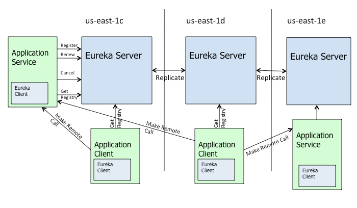

# Eureka详解
> 摘自[Spring Cloud Netflix Eureka - The Hidden Manual](https://blog.asarkar.org/technical/netflix-eureka/#)<br/>
> 摘自[spring cloud eureka](https://fengyilin.iteye.com/blog/2367265)

## 一、基础架构 


1. Eureka 包含server和client两个基本组件，以下摘自Netflix的描述
>  Eureka 提供两种组件，一是基于REST形式，用来提供负载均衡和中间层服务故障转移的Eureka server；二是一个基于Java的客户端，可以用来更好的server交互，Eureka client包含一个內建的基于round-robin（轮询）的负载均衡策略。 
2. 每一个Eureka client应用被称作一个instance。Eureka client应用和Eureka client也有着细微的差别，前者指的是我们自己的应用程序，后者代表的是框架提供的一个组件。（在maven工程中，自己的应用程序需要依赖Eureka client相关的jar） 
3. Eureka 具有很灵活的动态配置特性。既有用来设置初始配置的属性，也有用来周期性的检查这些配置是否有变化的配置。其中的大多数配置都可以在运行时修改，并在下一个刷新周期中起作用。例如：Eureka client用来注册到Eureka server的URL可以动态改变，并在5分钟后被识别（eureka.client.eurekaServiceUrlPollIntervalSeconds配置）。所有的配置属性如下： 
    - Eureka server：org.springframework.cloud.netflix.eureka.server.EurekaServerConfigBean，此类实现了com.netflix.eureka.EurekaServerConfig.所有的配置属性以eureka.server开头
    - Eureka client：org.springframework.cloud.netflix.eureka.EurekaClientConfigBean，此类实现了com.netflix.discovery.EurekaClientConfig，所有的配置属性以eureka.client开头
    - Eureka instance：org.springframework.cloud.netflix.eureka.EurekaInstanceConfigBean，此类间接实现了com.netflix.appinfo.EurekaInstanceConfig，所有的配置属性以eureka.instance开头
## 二、Eureka Instance 和Eureka client主要配置 
1. 在Eureka中，一个instance通过一个eureka.instance.instanceId 来唯一标识，如果这个值没有设置，就采用eureka.instance.metadataMap.instanceId来代替。instance之间通过eureka.instance.appName 来彼此访问，在spring cloud中默认值是spring.application.name,如果没有设置则为UNKNOWN。在实际使用中spring.application.name不可或缺,因为相同名字的应用会被Eureka合并成一个群集。eureka.instance.instanceId也可以不设置，直接使用缺省值(client.hostname:application.name:port) ,同一个appName下InstanceId不能相同。属性eureka.instance.virtualHostName目前在spring cloud中目前没有用，默认值是appName或者UNKNOWN。 
2. 如果 eureka.client.registerWithEureka设置成true（默认值true），应用启动时，会利用指定的eureka.client.serviceUrl.defaultZone注册到对应的Eureka server中。之后每隔30s（通过eureka.instance.leaseRenewalIntervalInSeconds来配置）向Eureka server发送一次心跳，如果Eureka server在90s（通过eureka.instance.leaseExpirationDurationInSeconds配置）内没有收到某个instance发来的心跳就会把这个instance从注册中心中移走。发送心跳的操作是一个异步任务，如果发送失败，则以2的指数形式延长重试的时间，直到达到eureka.instance.leaseRenewalIntervalInSeconds * eureka.client.heartbeatExecutorExponentialBackOffBound这个上限,之后一直以这个上限值作为重试间隔，直至重新连接到Eureka server，并且重新尝试连接到Eureka server的次数是不受限制的。 
3. 在Eureka server中每一个instance都由一个包含大量这个instance信息的com.netflix.appinfo.InstanceInfo标识，client向Eureka server发送心跳和更新注册信息是不相同的，InstanceInfo也以固定的频率发送到Eureka server，这些信息在Eureka client启动后的40s（通过eureka.client.initialInstanceInfoReplicationIntervalSeconds配置）首次发送，之后每隔30s(通过eureka.client.instanceInfoReplicationIntervalSeconds配置)发送一次。 
4. 如果eureka.client.fetchRegistry设置成true（默认值true），Eureka client在启动时会从Eureka server获取注册信息并缓存到本地，之后只会增量获取信息（可以把eureka.client.shouldDisableDelta设置成false来强制每次都全量获取）。获取注册信息的操作也是一个异步任务，每隔30秒执行一次（通过eureka.client.registryFetchIntervalSeconds配置），如果操作失败，也是以2的指数形式延长重试时间，直到达到eureka.client.registryFetchIntervalSeconds * eureka.client.cacheRefreshExecutorExponentialBackOffBound 这个上限，之后一直以这个上限值作为重试间隔，直至重新获取到注册信息，并且重新尝试获取注册信息的次数是不受限制的。 这些任务都是在com.netflix.discovery.DiscoveryClient中启动，spring cloud用org.springframework.cloud.netflix.eureka.CloudEurekaClient对这个类进行了扩展。 
## 三、为什么利用Eureka注册一个instance需要很长的时间
基本参照[spring-cloud-netflix#373](https://github.com/spring-cloud/spring-cloud-netflix/issues/373)
1. Eureka client注册
    首次心跳在Eureka client启动后的30s，所以在这个期间中，instance不会出现在Eureka注册中心中。 
2. Eureka server响应缓存 
    Eureka server响应缓存每隔30s更新一次（即其他Eureka client从Eureka serve 请求的注册信息每隔30s才会更新，通过eureka.server.responseCacheUpdateIntervalMs配置），所以即便instance注册过了，也不会立即出现在调用 /eureka/apps的返回结果中（因为Eureka面板http://eurekaserver:8761对应的页面绕过了响应缓存，所以刚注册过的instance会出现在Eureka面板中），另一个API/eureka/apps/<appName>/<instanceId>也绕过了响应缓存，所以如果你知道instanceId，你也可以通过此URI来获取instance的具体信息。所以，为了使Eureka client能发现新注册instance，还需要等额外的30s 
3. Eureka client缓存 
    Eureka client本地也缓存着从Eureka server获取的注册信息。这个缓存也是每隔30s刷新一次（通过eureka.client.registryFetchIntervalSeconds配置），这个在前面已经介绍过。所以这个地方又有可能需要30s来使Eureka client刷新本地缓存并把新注册的instance获取下来 
4. 负载均衡器缓存
    Ribbon是从本地的Eureka client中获取信息来执行负载均衡，ribbon自己也维护了一个缓存来避免每次请求都要调用Eureka client。ribbon缓存默认也是30s刷新一次（通过ribbon.ServerListRefreshInterval配置），所以在ribbon能利用新注册的instance之前可能还需要30s。
综上所述，一个新注册的instance在和别的instance通信之前可能需要2min的间隔。
## 四、Eureka server 
1. Eureka server还有一种peer-aware模式，可以和其他的Eureka server相互复制注册信息，从而对外提供负载均衡和弹性（即服务的持续可用性）。在默认情况下Eureka server就工作在Peer-aware模式下，所以一个Eureka server也是一个Eureka client，并把自己的信息注册到一个peer中。这也是在生产环境下Eureka的常用模式，在单机模式下，如在测试或者为了了解原理时，可以将registerWithEureka设置成false。 
2. 当一个Eureka server启动时，它将尝试从其他的peer 节点中获取注册信息。对于每一个peer节点，这个操作最多会尝试5次（通过eureka.server.numberRegistrySyncRetries配置），如果这个操作失败，这个server会在5min内（通过eureka.server.getWaitTimeInMsWhenSyncEmpty配置）阻止其他客户端从自己这里获取注册信息。
3. Eureka peer-aware模式引入了“self-preservation”的概念，这也将Eureka的复杂度提升了一个级别（可以通过将eureka.server.enableSelfPreservation设置成false来关闭此功能）。 
> 以下摘自Netflix的描述<br/>
> 当一个Eureka server 启动，它将尝试从一个相邻节点中获取所有的注册信息，如果从一个邻接点中获取信息出现问题，此server会尝试从其他节点获取，直到所有节点都失败。如果这个服务成功的从其他节点中获取到了注册信息，它将基于这些信息设置一个刷新阈值（心跳阈值）。如果某个时刻，心跳数低于这个阈值的一个百分比，这个服务将停止移除instance，从而保护当前已经注册过的instance的信息，即进入self-preservation模式。 
4. 具体数学逻辑如下：假定有两个client注册到Eureka server，每个client每30s发送一次心跳，则server需要一分钟收到4次心跳。spring 在此基础上追加了一个最小心跳值1（通过eureka.instance.registry.expectedNumberOfRenewsPerMin设置），如此一来，最小的心跳数变成了5，然后这个值还需要乘以最小阈值百分比0.85（eureka.server.renewalPercentThreshold），并近似为比本身大的最小整数 5*0.85=4.25 -->5。此阈值每15分钟才会更新一次（通过eureka.server.renewalThresholdUpdateIntervalMs设置），因此在这15分钟内的任何时间点server收到的心跳数低于5次，这个server就进入self-preservation模式，并停止移除instance信息。 
5. Eureka server假定每一个client都是以每30s一次的固定频率发送心跳。如果注册了两个client，server就期望一分钟收到(2+2+1)*0.85=5 次心跳，如果收到的次数比这个值小，就会激活self-preservation模式。假定现在每一个client发送心跳都加快（10s一次），server在一分钟内就会收到12次，即便有一个服务down掉，还能收到6次，仍然大于期望的5次，如此就不会触发原本应该触发的self-preservation模式，这也是为什么官方不建议修改eureka.instance.leaseRenewalIntervalInSeconds值。 
6. 另外还需要注意，不做特殊配置在同一个host上无法同时运行多个Eureka server。在com.netflix.eureka.cluster.PeerEurekaNodes.isThisMyUrl方法中利用host过滤掉了peer URLs，这个可能是为了防止一个server注册成为自己的peer，但是这个方法没有检查port，只有当hostname不同时peer 模式才能正常工作，所以想在一个主机上验证peer-aware模式，需要配置自己的/etc/hosts文件。 

因为Eureka已为我们做了过滤，所以在做Eureka群集时所有Eureka server的serviceUrl都可以设置的一样，不用再排除自己，如：

Eurekaserver.yml
```yaml
spring:  
  application:  
    name: eureka-server-clustered  
  profiles: 1  
server:  
  port: 8011  
eureka:  
  instance:  
    hostname: eureka-one  
  client:  
    registerWithEureka: true  
    fetchRegistry: true  
    serviceUrl:  
      defaultZone: http://eureka-one:8011/eureka/,http://eureka-two:8012/eureka/,http://eureka-three:8013/eureka/  
  
---  
spring:  
  application:  
    name: eureka-server-clustered  
  profiles: 2  
server:  
  port: 8012  
eureka:  
  instance:  
    hostname: eureka-two  
  client:  
    registerWithEureka: true  
    fetchRegistry: true  
    serviceUrl:  
      defaultZone: http://eureka-one:8011/eureka/,http://eureka-two:8012/eureka/,http://eureka-three:8013/eureka/  
  
---  
spring:  
  application:  
    name: eureka-server-clustered  
  profiles: 3  
server:  
  port: 8013  
eureka:  
  instance:  
    hostname: eureka-three  
  client:  
    registerWithEureka: true  
    fetchRegistry: true  
    serviceUrl:  
      defaultZone: http://eureka-one:8011/eureka/,http://eureka-two:8012/eureka/,http://eureka-three:8013/eureka/  
```
client配置(HA) :

Eurekaclient.yml代码
```yaml
spring:    
  application:    
    name: eurekaClient    
    
server:    
  port: 7111    
    
eureka:    
  client:    
    serviceUrl:    
      defaultZone: http://eureka-one:8011/eureka/,http://eureka-two:8012/eureka/,http://eureka-three:8013/eureka/    
  instance:     
    metadataMap:    
      instanceId: ${vcap.application.instance_id:${spring.application.name}:${spring.application.instance_id:${server.port}}}   
```