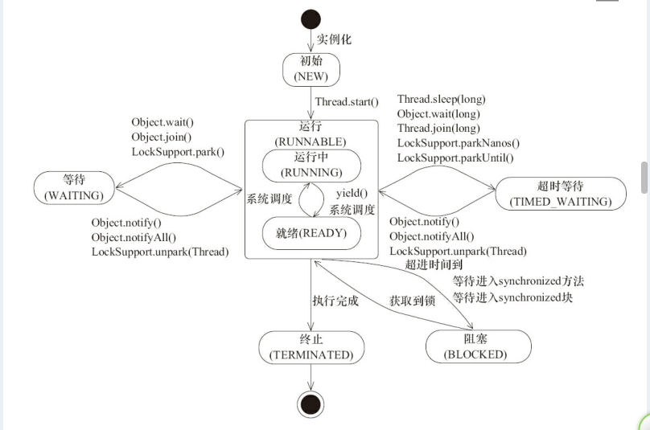
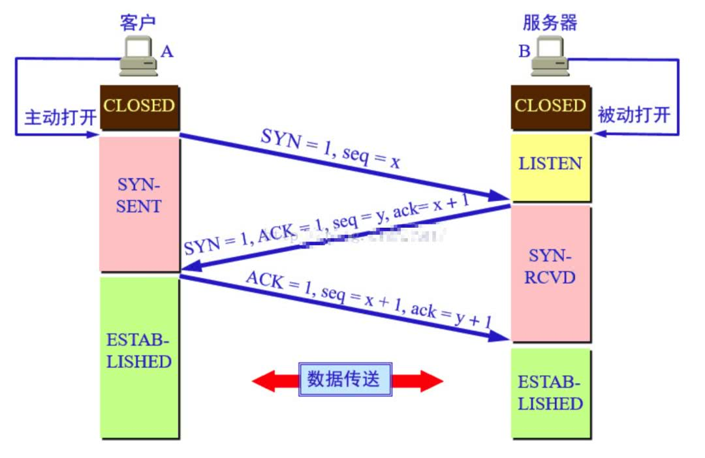

# 知识网络

- [IT技术基础](#IT技术基础)
	- [计算机原理](#计算机原理)
		- [二进制](#二进制)
		- [编码](#编码)
		- [CPU缓存，L1，L2，L3和伪共享](#CPU缓存，L1，L2，L3和伪共享)
	- [计算机网络](#计算机网络)
	- [数据结构与算法](#数据结构与算法)
		- [复杂度分析](#复杂度分析)
		- [基本算法思想](#基本算法思想)
		- [线性表](#线性表)
		- [散列表](#散列表)
		- [树](#树)
		- [图](#图)
		- [排序算法](#排序算法)
		- [搜索算法](#搜索算法)
		- [查找算法](#查找算法)
		- [字符串匹配算法](#字符串匹配算法)
		- [全排列算法](#全排列算法)
		- [分支限界法](#分支限界法)
		- [hash算法](#hash算法)
		- [递归算法](#递归算法)
		- [简单的数据结构](#简单的数据结构)
		- [排序算法](#排序算法)
		- [深度优先和广度优先搜索](#深度优先和广度优先搜索)
	- [编译原理](#编译原理)
	- [操作系统](#操作系统)
	- [数据库原理](#数据库原理)
- [Java基础](#Java基础)
	- [理念](#理念)
		- [面向对象](#面向对象)
		- [值传递](#值传递)
	- [基本数据类型](#基本数据类型)
	- [自动拆装箱](#自动拆装箱)
	- [String](#String)
	- [关键字](#关键字)
	- [集合](#集合)
	- [枚举](#枚举)
	- [注解](#注解)
	- [泛型](#泛型)
	- [异常](#异常)
	- [正则表达式](#正则表达式)
	- [IO](#IO)
	- [序列化](#序列化)
	- [第三方工具库](#第三方工具库)
	- [API&SPI](#API&SPI)
	- [编码](#编码)
	- [时间处理](#时间处理)
	- [重点接口解读](#重点接口解读)
	- [源码阅读](#源码阅读)
- [Java高级](#Java高级)
	- [设计模式](#设计模式)
	- [反射技术](#反射技术)
	- [动态代理](#动态代理)
	- [并发编程](#并发编程)
		- [并发与并行](#并发与并行)
		- [线程](#线程)
		- [线程池](#线程池)
		- [线程安全](#线程安全)
		- [锁](#锁)
		- [死锁](#死锁)
		- [synchronized](#synchronized)
		- [volatile](#volatile)
		- [sleep](#sleep)
		- [wait](#wait)
		- [notify](#notify)
		- [join操作，三个任务，如何多线程顺序执行](#join操作，三个任务，如何多线程顺序执行)
		- [Fork/Join框架，分而治之](#Fork/Join框架，分而治之)
		- [ThreadLocal](#ThreadLocal)
		- [写一个死锁的程序](#写一个死锁的程序)
		- [写代码来解决生产者消费者问题](#写代码来解决生产者消费者问题)
		- [并发包](#并发包)
		- [阅读源代码，并学会使用](#阅读源代码，并学会使用)
	- [网络编程](#网络编程)
		- [tcp、udp、http、https等常用协议](#tcp、udp、http、https等常用协议)
		- [http/1.0](#http/1.0)
		- [http/3](#http/3)
		- [Java](#Java)
		- [cookie](#cookie)
		- [用Java写一个简单的静态文件的HTTP服务器](#用Java写一个简单的静态文件的HTTP服务器)
		- [了解nginx和apache服务器的特性并搭建一个对应的服务器](#了解nginx和apache服务器的特性并搭建一个对应的服务器)
		- [用Java实现FTP、SMTP协议](#用Java实现FTP、SMTP协议)
		- [进程间通讯的方式](#进程间通讯的方式)
		- [什么是CDN？如果实现？](#什么是CDN？如果实现？)
		- [DNS？](#DNS？)
		- [反向代理](#反向代理)
		- [浏览器与服务器通讯过程](#浏览器与服务器通讯过程)
	- [NIO技术](#NIO技术)
	- [JVM技术](#JVM技术)
		- [JVM内存结构](#JVM内存结构)
		- [垃圾回收](#垃圾回收)
		- [JVM参数及调优](#JVM参数及调优)
		- [Java对象模型](#Java对象模型)
		- [HotSpot](#HotSpot)
		- [虚拟机性能监控与故障处理工具](#虚拟机性能监控与故障处理工具)
		- [平台无关性](#平台无关性)
		- [字节码、class文件格式](#字节码、class文件格式)
		- [类加载机制](#类加载机制)
		- [执行引擎（未完成）](#执行引擎（未完成）)
		- [编译与反编译](#编译与反编译)
		- [Java内存模型](#Java内存模型)
		- [尾递归，尾调用](#尾递归，尾调用)
		- [位运算](#位运算)
	- [性能优化](#性能优化)
	- [新技术](#新技术)
		- [Java8](#Java8)
		- [Java9](#Java9)
		- [Java10](#Java10)
		- [Java11](#Java11)
		- [Spring5](#Spring5)
		- [SpringBoot2.0](#SpringBoot2.0)
	- [高级源码](#高级源码)
	- [线上问题分析](#线上问题分析)
		- [dump获取](#dump获取)
		- [dump分析](#dump分析)
		- [dump分析及获取工具](#dump分析及获取工具)
		- [自己编写各种outofmemory，stackoverflow程序](#自己编写各种outofmemory，stackoverflow程序)
		- [Arthas](#Arthas)
		- [常见问题解决思路](#常见问题解决思路)
		- [使用工具尝试解决以下问题，并写下总结](#使用工具尝试解决以下问题，并写下总结)
	- [JMS](#JMS)
	- [JMX](#JMX)
- [Java框架](#Java框架)
	- [Servlet](#Servlet)
	- [Spring](#Spring)
	- [SpringBoot](#SpringBoot)
	- [SpringMVC](#SpringMVC)
	- [SpringCloud](#SpringCloud)
	- [SpringSecurity](#SpringSecurity)
	- [SpringCache](#SpringCache)
	- [MyBatis](#MyBatis)
	- [Hiberate](#Hiberate)
	- [测试](#测试)
	- [服务器](#服务器)
		- [JBoss](#JBoss)
		- [tomcat](#tomcat)
		- [jetty](#jetty)
		- [Weblogic](#Weblogic)
	- [工具](#工具)
		- [版本控制工具git](#版本控制工具git)
		- [项目管理工具maven](#项目管理工具maven)
		- [IDE](#IDE)
- [数据库](#数据库)
	- [SQL](#SQL)
	- [ORACLE](#ORACLE)
	- [MYSQL](#MYSQL)
	- [SQL](#SQL)
- [Nosql](#Nosql)
- [大数据](#大数据)
	- [Zookeeper](#Zookeeper)
	- [Solr，Lucene，ElasticSearch](#Solr，Lucene，ElasticSearch)
	- [Storm，流式计算，了解Spark，S4](#Storm，流式计算，了解Spark，S4)
	- [Hadoop，离线计算](#Hadoop，离线计算)
	- [HDFS、MapReduce](#HDFS、MapReduce)
	- [分布式日志收集](#分布式日志收集)
	- [数据挖掘，mahout](#数据挖掘，mahout)
- [网络安全](#网络安全)
- [架构](#架构)
	- [分布式](#分布式)
		- [分布式事务](#分布式事务)
		- [Dubbo](#Dubbo)
		- [分布式数据库](#分布式数据库)
		- [分布式文件系统](#分布式文件系统)
		- [分布式缓存](#分布式缓存)
		- [限流降级](#限流降级)
		- [算法](#算法)
		- [分布式ID](#分布式ID)
	- [微服务](#微服务)
		- [ServiceMesh](#ServiceMesh)
		- [Docker](#Docker)
		- [Spring](#Spring)
		- [Spring](#Spring)
	- [高并发](#高并发)
		- [分库分表](#分库分表)
		- [CDN技术](#CDN技术)
		- [消息队列](#消息队列)
	- [监控](#监控)
		- [监控什么](#监控什么)
		- [监控手段](#监控手段)
		- [监控数据采集](#监控数据采集)
		- [Dapper](#Dapper)
	- [负载均衡](#负载均衡)
	- [DNS](#DNS)
	- [CDN](#CDN)
- [扩展](#扩展)
	- [AR](#AR)

> 简单内容直接呈现，复杂内容链接文章
## IT技术基础
### 计算机原理
#### 二进制
#### 编码
#### CPU缓存，L1，L2，L3和伪共享
### 计算机网络
### 数据结构与算法
#### 复杂度分析
- 时间复杂度
    - 分析技巧
    - 分类
        - 最好时间复杂度
        - 最坏时间复杂度
        - 平均时间复杂度
        - 均摊时间复杂度
- 空间复杂度
> 空间复杂度为O(1)的排序算法属于原地排序算法，指不会占用太多额外内存
#### 基本算法思想
- 贪心算法
- 分治算法
- 动态规划算法
- 回溯算法
- 枚举算法
#### 线性表
- 数组
- 链表
- 队列
- 栈
#### 散列表

#### 树
- 二叉树
- 多路查找树
- 堆
- 其他
#### 图

#### 排序算法
- O(n2)
    - 冒泡排序
    - 插入排序
    - 选择排序
- O(nlogn)
    - 归并排序
    - 快速排序
- O(n)
    - 桶排序
    - 计数排序
    - 基数排序
- O(logn)
#### 搜索算法

#### 查找算法

#### 字符串匹配算法   KMP算法

#### 全排列算法
字典序法、递增进位制数法、递减进位制数法、邻位对换法
#### 分支限界法
#### hash算法
#### 递归算法

#### 简单的数据结构
栈、队列、链表、数组、哈希表、

栈和队列的相同和不同之处

栈通常采用的两种存储结构
#### 排序算法
稳定的排序：冒泡排序、插入排序、鸡尾酒排序、桶排序、计数排序、归并排序、原地归并排序、二叉排序树排序、鸽巢排序、基数排序、侏儒排序、图书馆排序、块排序

不稳定的排序：选择排序、希尔排序、Clover排序算法、梳排序、堆排序、平滑排序、快速排序、内省排序、耐心排序

各种排序算法和时间复杂度
#### 深度优先和广度优先搜索
二叉树的深度优先遍历与广度优先遍历

图的深度优先搜索和广度优先搜索

### 编译原理
### 操作系统
### 数据库原理
## Java基础
### 理念
#### 面向对象
- 面向对象和面向过程的区别：
    - **面向对象**：将一类事物抽象成类，将事物的属性抽象成变量，事物的行为抽象成方法，然后将其封装起来的编程思想。重点关注的是对象。
    - **面向过程**：重点关注的是执行步骤，利用函数将每个步骤实现，逐个调用的方式。
- 面向对象的三大基本特征和五大基本原则
    - **三大特征**
        - 封装：封装隐藏了类的内部实现机制，从而可以在不影响使用者的前提下改变类的内部结构，同时保护了数据
        - 继承：继承是为了重用父类代码，同时为实现多态性作准备
        - 多态：指对象的多种形态，对象可以通过继承体系来实现多态：
            - 向上转型：父类指向子类实现类
            - 向下转型：需要进行强制转换。
    - **五大原则**
        - 单一职责原则
        - 开放封闭原则
        - 里氏替换原则
        - 依赖倒置原则
        - 接口隔离原则
#### 值传递
重点：传递关注的是传递的内容本身，而不是其所代表的含义或者指向的内容。
- 值传递：表示传递的是值的拷贝，在新方法中对值进行更改不会影响原来的值
- 引用传递：表示传递的是对象的引用地址，那么新方法中针对对象的改变将会体现在原来的引用中，因为两个引用执行相同的对象
- [为什么说Java中只有值传递](https://www.cnblogs.com/wchxj/p/8729503.html)：如果某个方法的参数是一个对象，那么传递的时候就会直接传递这个对象在栈空间的句柄，那么这种是不是引用传递呢，不是，因为传递的关注点并不是对象而是那个对象地址值，在传递的时候，同样是拷贝了一封对象地址值传递的，那么这里就是值传递，引用传递指的是直接将原来的引用地址传进来。Java在这里进行了处理，并不是传原来的引用地址，而是原来引用地址的一份拷贝。
- [方法重写与重载]
    - 方法重写：重写针对的是继承体系中，子类重写父类的方法，可以使用@Override标注。
    - 方法重载：重载指的是同一个类中，多个参数形式不同的同名方法，返回值不参与区分是否重载
- [Java的继承与实现]
    - 继承：Java支持单继承，一个类只能继承一个抽象类或者普通类，一个接口可以继承多个接口，继承的目标可以使接口、抽象类、普通类
    - 实现：Java支持多实现，一个抽象类或者普通类可以实现多个接口，实现的目标只能是接口
- 构造函数与默认构造函数：Java类中可以拥有多个构造函数，型重载，多个构造函数参数必须不同。一个类默认存在一个无参构造器，但是一旦自定义了新的构造器，则无参构造器失效，需要手动添加。
- 类变量、成员变量和局部变量
    - 类变量：在类内部定义，由static修饰的变量，可由类名点用（无需创建对象使用），共享使用，在类加载阶段完成赋值操作（可直接赋值，静态块赋值，静态方法赋值）
    - 成员变量：在类内部定义，需要使用对象调用，每个对象有一个自己的变量，不共享，在创建对象时赋值（可直接赋值，构造器赋值，块赋值，成员方法赋值等）
    - 局部变量：方法内定义，只在方法内有效，天生线程安全。
- [成员变量和方法作用域]

- [接口和抽象类]
    - 接口
        - interface定义
        - 变量默认public static final-静态常量
        - 没有构造器
        - 方法默认public abstract
        - 可以定义静态方法、默认方法、重写Object的方法
        - 实现类必须实现其所有抽象方法
        - 接口的继承是多继承
    - 抽象类
        - abstract class定义
        - 拥有构造器，但是不能主动创建实例，主要被子类调用
        - 可以定义抽象方法，让子类去实现，也可以定义普通的方法
        - 可以定义main方法，并且可以运行
        - 其它基本和普通的类没有区别
        - 抽象类的继承是单继承，多实现
- [四大内部类](https://www.cnblogs.com/xrq730/p/4875907.html)
    - 成员内部类：定义在另一个类内部的非静态内部类，级别和成员变量和方法一致，依附于外部类而存在
    - 静态内部类：定义在另一个类内部的静态内部类（static修饰），超脱了外部类而存在
    - 局部内部类：定义在一个方法或者一个作用于（{}）中的内部类，与方法的局部变量一致，只在作用域内有效
    - 匿名内部类：直接通过new 接口的方式定义个内部类，不存在类名，函数式接口的匿名内部类可以使用Lambda表达式来替换。
### 基本数据类型
- 8种基本数据类型：
    - byte：1字节，-128~127（-27~27-1）
    - short：2字节，-32768~32717（-215~215-1）
    - int：4字节，-2147483648~2147483647（-231~231-1）
    - long：8字节，-9223372036854775808~9223372036854775807（-263~263-1）
    - float：4字节，单精度浮点数，二进制科学计数法表示，1.401298e-45~3.402823e+38
    - double：8字节，双精度浮点数，二进制科学计数法表示，4.9000000e-324~1.797693e+308
    - char：2字节，0~65535
    - boolean：1字节，0~1
- 基本数据类型的产生的历史原因：其实是为了兼容C语言的模式，为C语言开发者转Java提供方便
- [整型和浮点型的二进制表示形式与计算原理]
- [什么是浮点型]
- [什么是单精度和双精度]
- **为什么不能用浮点型表示金额**：因为使用浮点数能精确表示的小数很少，大部分都无法精确表示，这和十进制无法精确表达1/3一样。
- [浮点数为什么不精确？为什么银行的金额不能用浮点数计算](https://blog.csdn.net/keke_xin/article/details/84831024)
### 自动拆装箱
- **什么是包装类型**：包装类型是针对八个基本数据类型定义的包装类，用于在面向对象的Java中执行一些只有对象才能执行的操作。
- **什么是自动拆装箱**：拆装箱就是基本类型和包装类型的转换操作，由编译器来完成拆装箱操作。
- [Integer的缓存机制](Java_Technology\Java_Base_Technology\Integer的缓存机制.md)（享元模式：池）
- [Integer的缓存机制](https://blog.csdn.net/yrwan95/article/details/82785129)
- Byte、Short、Long的均是将-128到127缓存起来备用。
- 包装类型的比较需要使用equals，不能直接使用==，除非将其手动转换为基本类型。
### String
- [字符串的不可变性](https://blog.csdn.net/qunzer/article/details/25157309)：String类被final修饰，是为最终类，不可被继承修改,且底层保存字符序列的字符数组也被final修饰，一旦赋值不再改变，这是String不变的原理。这种不变性也保证了其可以作为Map中键的常客。
- [JDK 6和JDK 7中substring的原理及区别](Java_Technology\Java_Base_Technology\JDK 6和JDK 7中substring的原理及区别.md)
- replaceFirst、replaceAll、replace区别
    - replace：使用新字符替换所有旧字符，字符的替换操作
    - replaceFirst：使用给定的字符序列根据给定的正则表达式替换第一次出现的旧字符序列，字符序列的替换操作，涉及正则表达式，只替换首个出现的匹配的旧字符序列
    - replaceAll：使用给定的字符序列根据给定的正则表达式替换所有旧的字符序列，replaceFirst的加强版，替换所有匹配的旧字符序列
- String对“+”的重载：String的+操作符在编译阶段会被编译为StringBuilder的appand操作和toString操作的整合版。（语法糖）
- 字符串拼接的几种方式和区别
    - +：效率最慢，少数字符串或者数值拼接时使用，直观
    - concat方法：通过Arrays.copyOf()实现拼接，适用于字符串少的拼接
    - String.format方法：
    - StringUtils.join()：org.apache.commons.lang3中提供的方式，通过StringBuilder实现拼接
    - String.join()：JDK 1.8中新增的方式，通过StringBuilder实现拼接
    - StringBuilder：速度最快速的方式
- String.valueOf和Integer.toString的区别：前者拥有诸多重载方法，用于将各种类型的对象转换成字符串，后者是单单对整型而言的转字符串方法。
- switch对String的支持（语法糖）：JDK 1.7新增功能，switch比较的是字符串常量的哈希值（int类型），但是hash值可能会有冲突，所以还需要再调用equals方法进行二次比较。[Java1.7增加switch对字符串的支持](https://blog.csdn.net/troyaninpc/article/details/79475474)
- switch支持以下类型：
    - 基本数据类型：byte, short, char, int
    - 包装数据类型：Byte, Short, Character, Integer
    - 枚举类型：Enum
    - 字符串类型：String（Jdk 7+ 开始支持）
- 字符串常量池
    字符串常量池和运行时常量池不同，后者是class文件私有的，每个class文件有一个运行时常量池，而字符串常量池是公共的，全局的。
    JDK 1.6之前，字符串常量池位于方法区，JDK1.7开始挪到了堆内存。
    使用字面量创建字符串，会直接在字符串常量池中查找有无指定的字符串字面值，有则直接返回其引用，没有就在池中创建一个字面量并返回其引用。
    使用new方式创建字符串，会直接在堆内存中创建一个String对象，这个对象保存着一个字符串字面值，这时与字符串常量池无关。
    当我们对字符串执行intern之后，将会触发下面的操作。
- intern
intern方法的作用是在常量池中保留字符串的一份引用或者字面值。
- JDK 1.6
    - 若字符串常量池中有指定的字符串常量值，则直接返回该值的地址，将new方式在堆中创建的字符串替换为这里的地址
    - 若字符串常量池中没有指定的字符串常量值，则在常量池中创建一个同样的字符串，并将其地址返回给栈引用。
- JDK 1.7
    - 同上
    - 若字符串常量池中没有指定的字符串常量值，则在常量池中保留一份堆中字符串的引用地址。 
### 关键字
- [Java关键字](https://www.cnblogs.com/chenglc/p/6922834.html)
- transient原理及用法：使用于序列化机制中，用于屏蔽不想参与序列化的字段，被其修饰的字段不参与序列化与反序列化。一般使用writeObject和readObject方法来自定义其值的序列化与反序列化，通常是直接写入流中或从流中获取赋值。
- [instanceof原理及用法](https://www.jianshu.com/p/134891584105)
- [volatile原理及用法](https://www.jianshu.com/p/75c95a676385)
- [synchronized原理及用法]()
- [final原理及用法](https://www.jianshu.com/p/f89475e3b234)
- [static原理及用法](https://www.jianshu.com/p/f2b9aabb01c6)
- const原理及用法：C/C++中的关键字，Java中作为保留字存在，和goto一样
### 集合
- 常用集合类的使用
    - ArrayList：数组实现的列表，查找元素速度快，增删元素较慢，适用于保存偏于查询的数据
    - LinkedList：链表实现的列表，同时也是队列，增删匀速快，查询元素慢，适用于保存偏于增删操作的数据
    - HashMap：基于Hash实现的键值对集合，查找元素快，适用于做缓存，偏于查询，保存元素涉及扩容
    - HashSet：基于hash实现的无序集合，用于保存不重复的数据，可用于去重
    - TreeMap：基于红黑树实现的键值对集合，天然有序，用于保存有序的键值对数据
    - TreeSet：基于红黑树实现的无序集合，天然有序，用于保存有序的去重数据
    - **LinkedHashMap**：基于Hash和链表（循环双向链表）实现的键值对集合，保存了插入顺序。其实就是对HashMap的所有元素使用一个链表连起来罢了。视为一个有序的HashMap。有两种排序方式：
        - 插入顺序，默认为插入顺序，accessOrder=false：按照元素存入map中的顺序排序
        - 访问顺序，accessOrder=true：按照访问Map元素的顺序排序
        - 注意：以上两个排序其实都是在双向链表中实现了，这个链表和HashMap其实是并列存在的。在两个里面均保存了元素的引用。
    - **LinkedHashSet**：同上，视为有序的HashSet，它只支持按照元素的插入顺序排序。
        - 其实LinkedHashSet底层是基于LinkedHashMap实现的，
- [ArrayList和LinkedList和Vector的区别](https://www.cnblogs.com/yw-ah/p/5841327.html)
- SynchronizedList和Vector的区别
    - SynchronizedList有很好的扩展和兼容功能。他可以将所有的List的子类转成线程安全的类,Vector底层固定只能是数组
    - 使用SynchronizedList的时候，进行遍历时要手动进行同步处理
    - SynchronizedList可以指定锁定的对象
- HashMap、HashTable、ConcurrentHashMap区别
    - HashMap：线程不安全的键值对集合
    - HashTable：线程安全的键值对集合，使用synchronized加锁实现线程安全，效率较低
    - ConcurrentHashMap：线程安全的键值对集合，使用原子操作+synchronized实现，效率更高，推荐使用
- Set和List区别？
    - Set特点：无序-不可重复-可保存null值但只能有一个
    - List特点：有序-可重复-可保存多个null值
- Set如何保证元素不重复？
    Set一般底层以Map来实现，可以说Set就是一个value为固定值的Map，那么Set保存的值映射到Map，就是Map的key，key当然不能重复，如果key重复那么
- [Java 8中stream相关用法](https://www.jianshu.com/p/3dc56886c2eb)
- [apache集合处理工具类的使用]
- [不同版本的JDK中HashMap的实现的区别以及原因]()
- Collection和Collections区别
    - Collection是集合的基础接口定义了一些公共的方法。
    - Collections是集合工具类，主要用于操作集合：排序、反转、拷贝、查找、定位等功能
- Arrays.asList获得的List使用时需要注意什么
    - Arrays.asList获取到的ArrayList是Arrays的一个内部类，表示一个不可改变的列表，不同于JUC中的ArrayList。
    - 前者返回的ArrayList不能添加元素
    - 而且操作asList的时候，必须是引用类型的值（比如：Integer、Long等），不能是原始类型（比如：int、long之类）
- Enumeration和Iterator区别
    二者都是用来遍历集合的，前者是JDK 1.0就出现的遍历工具，实现者包括Vector、HashTable等，后者是在JDK 1.2中新增的，新的集合框架就是在其基础上扩展开来的。
    前者只有两个方法，只能用于遍历获取元素，后者多一个方法，可以执行元素删除操作，而且后者支持fast-fail：当多个线程对同一个集合的内容进行操作时，就可能会产生fail-fast事件。
- [fail-fast 和 fail-safe的区别](https://blog.csdn.net/u010889616/article/details/79954413)
    fail-fast：快速失败，ju包下的集合类均是快速失败的，当多个线程对同一个集合进行操作，就可能产生fail-fast。
    fail-safe：安全失败，所有针对同一集合结构的更改操作都会在一个复制的集合上进行。
- CopyOnWriteArrayList
    
- ConcurrentSkipListMap
    
### 枚举
- [深入理解Java枚举类型(enum)](https://blog.csdn.net/javazejian/article/details/71333103)
- 枚举的用法
    - 枚举可以实现多个接口
    - 可以定义新的变量
    - 可以定义新的方法
    - 可以定义根据具体枚举值而相异的类
    - 可以定义抽象方法，并由枚举值实现，使用大括号（{}）来进行定义。
- [枚举的实现原理](Java_Technology/Java_Base_Technology/枚举实现原理.md)：枚举是通过语法糖实现的额，枚举类被编译之后，就能看出其大致结构。
- **枚举与单例**：都说枚举是实现单例最简单有效的方式。确实，即使是序列化机制也不会导致多实例产生。
- Enum类：[Enum深入解析](Java_Technology/Java_Base_Technology/Enum深入解析.md)
- **Java枚举如何比较**：使用equals和==都可以进行比较，因为每个枚举都是单例的，是天然单例，其equals就是使用==实现的。[比较java枚举成员使用equal还是==](https://www.cnblogs.com/xiohao/p/7405423.html)
- **switch对枚举的支持**：枚举在jdk1.5出现，switch在jdk 1.6中支持枚举。这是一种编译器的语法糖。
    我们都知道在class文件中switch判断只支持int类型。那么枚举是怎么转换的呢？其实底层使用的是枚举类的ordinal方法，即枚举值的序列值，这和switch支持的String差不多，这也是一种语法糖，底层判断的是字符串的hashCode。
- **枚举的序列化如何实现**：[深度分析 Java 的枚举类型：枚举的线程安全性及序列化问题](http://blog.jobbole.com/94074/)
    枚举的序列化是由JVM所控制，禁用的定制方法，所以其实永远的单例。
- 枚举的线程安全性问题
### 注解
- [深入理解Java注解类型(@Annotation)](https://blog.csdn.net/javazejian/article/details/71860633)
- [元注解](Java_Technology/Java_Base_Technology/元注解.md)：用于标注注解的注解，标注在注解类之上的注解。定义注解的注解。
    - @Target：指明目标注解的作用范围
    - @Retention：指明目标注解的生命周期
    - @Documented：指明该注解将被包含在javadoc中
    - @Inherited：指明子类可以继承父类中的该注解
- [自定义注解](Java_Technology/Java_Base_Technology/自定义注解.md)
- [Java中常用注解使用](Java_Technology/Java_Base_Technology/Java中常用注解使用.md)
    - @Override：方法重写
    - @Deprecated：方法弃用
    - @Suppvisewarnings：忽略警告
- [注解与反射的结合](Java_Technology/Java_Base_Technology/注解与反射结合使用.md)
- [Spring常用注解] 
### 泛型
- **泛型**：Java编译器语法糖的一种，泛型只在编译期有效，编译器会执行类型擦除，来去掉泛型。
- 泛型与继承
- **类型擦除**：编译阶段，编译器在完成类型检查之后就会执行类型擦除，将泛型去除。
- 泛型中K T V E ? Object等的含义
    - K T V E这些其实是一样的，我们还可以使用其他任意的大写字母来替换它们，只是这几个经常使用罢了，它们表示一个具体的类型
        - K：键值对中的键key
        - V：键值对中的值value
        - T：
        - E：
        - R:
        - ?：不限定类型
        - Object：任意类型
    - ?表示不限定类型，
    - ? extends Father表示只能使用Father类型和其子类型。
    - ? super Son表示只能使用Son类型和其父类型
    - Object则表示任意类型均可以使用
- [泛型各种用法](Java_Technology/Java_Base_Technology/泛型各种用法.md)
- 限定通配符和非限定通配符
    - 限定通配符：? extends XXX、? super XXX
    - 非限定通配符：?
- 上下界限定符extends 和 super
    - 上界定符extends：将指定的类型作为上限，只允许使用指定类型及其子类型
    - 下界定符super：将指定类型作为下限，只允许使用指定类型及其父类型
- List<?>和List\<Object\>、List之间的区别
    - List：原始类型，可以使用任意类型，可以添加任意类型元素。
    - List\<?\>：通配符类型，形参，可以接受任何对应List<E>的参数化类型，包括List，来作为实参，形参并不能添加元素。
    - List\<Object\>：类型参数为Object的参数化类型，实参，仅仅能够接受List和其本身类型，可以添加任意类型元素。
### 异常
- [Java 中的异常和处理详解](http://www.importnew.com/26613.html)
- [如何优雅的设计 Java 异常](http://www.importnew.com/28000.html)
- **异常类型**
    - 错误Error
        - AssertionError：抛出断言失败错误
        - OutOfMemoryError：抛出内存溢出错误，当JVM没有多余内存来存放目标对象，并且使用GC垃圾回收之后仍然无多余内存来保存目标对象
        - StackOverflowError：堆栈溢出错误，递归太深导致堆栈溢出
    - 异常Exception
        - 受检异常（编译期异常）
            - ClassNotFoundException
            - CloneNotSupportedException
            - FileAlreadyExistsException
            - FileNotFoundException
            - InterruptedException
            - IOException
            - SQLException
            - TimeoutException
            - UnknownHostException
        - 非受检异常（运行时异常）
            - AlreadyBoundException
            - ClassCastException：类转换异常，将一个实例转化为非其真实类型的子类时发生异常
            - ConcurrentModificationException：并发修改异常，多线程修改
            - IllegalArgumentException：参数非法异常，表示方法传递了一个非法的不适合的参数
            - IllegalStateException：非法状态异常，表示方法被在不合适的时机调用
            - IndexOutOfBoundsException：下标越界异常
            - NullPointerException：空指针异常，针对空对象进行方法调用的时候触发
            - SecurityException：安全异常，由安全管理器抛出
            - UnsupportedOperationException：不支持操作异常，表示不支持指定的操作，从而抛出异常
- [正确处理异常]()
    - 如果不手动处理异常，将会由默认的异常处理器来处理异常。
- [自定义异常]()
    - 自定义受检异常：继承Exception
    - 自定义运行时异常：继承RuntimeException
    - 自定义异常需要提供以下构造器：
        - 无参构造器
        - 带有一个String参数的构造器，需传递给父类构造器
        - 带有一个Throwable参数的构造器，需传递给父类构造器
        - 带有一个String参数、一个Throwable参数的构造器，需传递给父类构造器
- **Error和Exception**
    - Error：Throwable的子类，代表的是错误，没有恢复的可能，一般是系统性错误。
    - Exception：Throwable的子类，代表的异常，存在恢复的可能，可以进行捕捉处理。
- **异常链**：在捕获异常处理的catch块中再次抛出一个异常，形成异常链，一般我们希望在异常链中保留原始异常的信息，这时就需要在抛出新异常时将原始异常作为参数来创建新的异常。
- [try-with-resources](Java_Technology/Java_Base_Technology/try-with-resources.md)
- **finally和return的执行顺序**：先执行try块或者catch块中的return，然后将结果保存起来，去执行finally中的代码，执行完后再将之前保存的返回结果返回即可，但是如果在finally块中定义了return，那么就坏菜了，程序会直接提前返回。所以，我们不能再finally块中加return。
- **异常注意事项**
子类重写父类带有throws申明异常的时候，子类只能抛出小于等于父类方法中的异常数量，而且类型必须是父类方法申明异常类型或者其子类型
- NoClassDefFoundError与ClassNotFoundException区别：
    - NoClassDefFoundError：错误（运行时错误），不需要捕捉，一般表示在类加载的解析阶段找不到指定的类的Class定义，这种情况在编译的时候类还是存在的，可能是类初始化失败导致。
    - ClassNotFoundException：受检异常（编译期异常），需要显式捕捉处理，否则无法通过编译，一般表示在反射调用目标类的时候或者使用类加载器加载某个类的时候找不到类的Class文件。其实就是不存在该类的Class文件。
### 正则表达式
- java.lang.util.regex.Pattern：规则模型
- java.lang.util.regex.Matcher：匹配器
- [JAVA正则表达式：Pattern类与Matcher类详解(转)](https://www.cnblogs.com/ggjucheng/p/3423731.html)
### IO
- IO流分类：
    - 传输格式：
        - 字符流：
            - Reader
            - Writer
        - 字节流
            - InputStream
            - OutputStream
    - 传输方向：
        - 输入流
            - InputStream
            - Reader
        - 输出流
            - OutputStream
            - Writer
- 四大概念理解：[聊聊同步、异步、阻塞与非阻塞](https://www.jianshu.com/p/aed6067eeac9)
    - 同步：调用方一直等待被调用方返回结果（等待结果，需要时刻关注被调用方是否完成）
    - 异步：调用方不等待被调用方返回结果，只要被调用方完成后主动通知调用方即可，即调用方等待的是被调用方的通知（等待通知[不等待结果-属于被动行为不需要主动触发]，不关注被调用方何时完成）
    - 阻塞：调用方等待被调用方的结果或者通知时，不做其他任何操作（干等，线程被挂起）
    - 非阻塞：调用方等待被调用方的结果或者通知时，兼职其他操作（不干等，先干点别的）
> 同步异步说的是等不等待的问题，阻塞不阻塞说的是线程是被挂起还是干点别的的事情；即使我不等待，我也可以闲着不干别的事情（异步阻塞），也可以等待，但不妨碍我期间干点别的，只要我定时返回来看看结束类就是了（同步非阻塞）
- 四大组合概念理解：
    - 同步阻塞：效率最低，等待结果，时刻关注，同时线程挂起，不执行其他内容
    - 同步非阻塞：效率较低，等待结果，时刻关注（间断性关注），线程可以执行其他任务，但需要在关注被调用者与执行其他任务之间来回切换
    - 异步阻塞：不等待、不关注被动用者，被动等待通知，线程挂起，不执行其他内容
    - 异步非阻塞：效率最高，被动等待通知，线程执行其他任务
- Linux的5种IO模型：[聊聊Linux 五种IO模型](https://www.jianshu.com/p/486b0965c296)
    - 同步阻塞 I/O（BIO）：效率最低，等待结果，时刻关注，同时线程挂起，不执行其他内容
    - 同步非阻塞 I/O（NIO）：效率较低，等待结果，时刻关注（间断性关注），线程可以执行其他任务，但需要在关注被调用者与执行其他任务之间来回切换
    - 多路复用IO：同步阻塞的一种，一个进程监听多个IO操作，只要有一个准备好数据，就执行对应的操作，如果都没有准备好，那么会阻塞执行，一直等待
    - 信号驱动I/O：不常用
    - 异步 I/O（AIO）：效率最高
- [BIO、NIO和AIO的区别、用法、原理](Java_Technology/Java_Base_Technology/BIO、NIO和AIO的区别、用法、原理.md)
    - BIO：同步阻塞IO
    - NIO：同步非阻塞IO
    - AIO：异步非阻塞IO
- Netty
### 序列化
- 什么是序列化与反序列化
    - 序列化：把对象转换为字节序列的过程
    - 反序列化：把字节序列恢复为对象的过程
- 为什么序列化
    - 为了持久化保存对象数据
    - 为了网络传递对象数据
- [序列化底层原理](https://blog.csdn.net/xlgen157387/article/details/79840134)
- 序列化与单例模式：[序列化破坏单例的解决方案](Java_Technology/Java_Base_Technology/序列化破坏单例的解决方案.md)
    - 序列化破坏单例：反序列化的时候ObjectInputStream中readObject方法中会反射调用无参构造器生成一个新的实例，这个实例不同于之前的单例，所以破坏了单例。
    - 解决方案：在单例类重定义readResolver方法，返回单例实例，那么就会忽略上面执行而是直接返回已有的单例。
- [protobuf理解](https://www.ibm.com/developerworks/cn/linux/l-cn-gpb/index.html)：一种Google使用的序列化方式
- 序列化注意事项
    - transient关键字修饰的字段不参与序列化
    - 静态变量不参与序列化
    - 子类继承自实现了Serializable接口的父类：子类父类中的属性均参与序列化
    - 子类实现了Serializable接口，父类不支持序列化：只有子类中的属性会参与序列化，父类中的被忽略，但是会调用父类的无参构造器
    - 自定义序列化：writeObject和readObject
- [为什么说序列化并不安全](https://www.jianshu.com/p/fa912ce0426f)：序列化后的数据容易被篡改，这样反序列化就会得到错误的数据，所以不安全。
- 常见的序列化方式：[几种常用序列化和反序列化方法](https://blog.csdn.net/jaryle/article/details/54893086)
    - Java原生序列化机制
    - XML序列化
    - Json序列化
        - FastJson
        - Jackson
    - ProtoBuff序列化：[Google Protocol Buffer 的使用和原理](https://www.ibm.com/developerworks/cn/linux/l-cn-gpb/index.html)
    - Thrift序列化
    - Avro序列化
### 第三方工具库
- commons.lang
- commons.*... 
- guava-libraries 
- netty
    - HashedWheelTimer：
        - [Netty工具类HashedWheelTimer源码走读(一) ](https://my.oschina.net/haogrgr/blog/489320)
        - [Netty工具类HashedWheelTimer源码走读(二)](https://my.oschina.net/haogrgr/blog/490266)
        - [Netty工具类HashedWheelTimer源码走读(三)](https://my.oschina.net/haogrgr/blog/490348)
    - 
### API&SPI
- API和SPI的关系和区别
    - API：指的是应用对服务调用方提供的接口，用于提供某种服务、功能
    - SPI：指的是应用对服务实现方提供的接口，用于实现某种服务、功能
- [SPI的使用及原理](Java_Technology/Java_Base_Technology/SPI的使用及原理.md)
- API面向的是服务调用方
- SPI面向的是服务实现方
### 编码
- Unicode编码（统一编码）：对世界上所有的字符进行了编码与标识，包括两部分，基本字符集和增补字符集
    - 基本字符集：U+0000-U+FFFF
    - 增补字符集：U+10000-U+10FFFF
- 有了Unicode为啥还需要UTF-8：因为Unicode仅仅是对所有的字符进行了编号，却并没有定义如何进行字符的二进制表示，为此专门设计了UTF-*系列二进制映射法则。
- GBK、GB2312、GB18030之间的区别
    - GB2312：最早的汉字编码，采用两个字节共16位来编码，两个字节的最高位均固定为1，剩余14位进行汉字编码，共收录7000余最常用的汉字
    - GBK：GB2312扩展而来，还是两个字节，只是放开了第二个字节首位的1限制，只有第一字节首位固定为1，新增14000余汉字，包括了繁体字，共有21000余字
    - GB18030：GBK扩展而来，采用变长编码，两个字节的就是GBK部分，新增部分全部采用四个字节编码，新增了55000余字符，总量达到了71000多字符
    - BIG5：繁体字编码，用于台湾、香港地区，2个字节编码
- UTF-8、UTF-16、UTF-32区别：都是针对Unicode编码的二进制编码映射
    - UTF-32：4个字节编码，与Unicode编号长度一致，不需要转换即可直接使用。有两种表示方式，前高后低为大端（BE）,反之为小端（LE）,较浪费空间，所以有了UTF-16和UTF-8
    - UTF-16：变长方式表示字符，基本字符采用2个字节表示，增补字符采用4个字节表示，需要经过一个转换算法来将Unicode的四字节编号转换为UTF-16的四字节（二字节）表示形式
    - UTF-8：变长方式表示字符，UTF-8兼容ASCII。
        - Unicode编号范围0X00-0X7F（0-127）：采用一个字节表示，0xxxxxxx（高位固定位0，可表示128个字符），对应ASCII
        - Unicode编号范围0X80-0X7FF（128-2047）：2个字节表示，110xxxxx 10xxxxxx（首字节高位固定110，末字节高位固定10，剩余位可表示最多2048个字符）
        - Unicode编号范围0X800-0XFFFF（2048-65535）：3个字节表示，1110xxxx 10xxxxxx 10xxxxxx（首字节高位固定1110，其余字节首位固定10，剩余16位可表示65536个字符），对应汉字编码
        - Unicode编号范围0X10000-0X10FFFF（65536-1114111）：4个字节表示，11110xxx 10xxxxxx 10xxxxxx 10xxxxxx（首字节高位固定11110，其余字节首位固定10，剩余21位可表示2097152个字符），对应增补字符
- **URL编解码**
- Big Endian和Little Endian
- 如何解决乱码问题:反向去解码，一般出现乱码的原因就是解码方式出错导致的，而且可能经过多重错误编码和解码，要获取源码，需要反向编码和解码，只需要知道你使用的错误的编码类型，如果类型未知，则较难实现数据复原。
### 时间处理
- 时区：将全球以经线均分为24个时区，相邻时区的时间相差一个小时
- 冬令时和夏令时：在冬季或者夏季将时间人为的调慢或调快1个小时，称之为冬令时或夏令时。
- 时间戳：指的是从1070年1月1号0点0分0秒到现在的总秒数
- Java中时间API
- 格林威治时间：GMT（Greenwich Mean Time），指的是格林威治平时，是指位于英国伦敦郊区的皇家格林尼治天文台当地的平太阳时，因为本初子午线被定义为通过那里的经线
- CET,UTC,GMT,CST几种常见时间的含义和关系：
    - 概念：
        - CET：欧洲中部时间，是比世界标准时间（UTC）早一个小时的时区名称之一。它被大部分欧洲国家和部分北非国家采用。冬季时间为UTC+1，夏季欧洲夏令时为UTC+2。
        - UTC：协调世界时，又称世界标准时间或世界协调时间，简称UTC，协调世界时是以原子时秒长为基础，在时刻上尽量接近于世界时的一种时间计量系统。
        - GMT：格林尼治标准时间，是指位于英国伦敦郊区的皇家格林尼治天文台的标准时间，因为本初子午线被定义在通过那里的经线。
        - CST：北京时间，又名中国标准时间，是中国的标准时间。在时区划分上，属东八区，比协调世界时早8小时，记为UTC+8，与中华民国国家标准时间（旧称“中原标准时间”）、香港时间和澳门时间和相同。
    - 关系：
        - CET=UTC/GMT + 1小时
        - CST=UTC/GMT +8 小时
        - CST=CET+9
- SimpleDateFormat的线程安全性问题：多线程情况下，SimpleDateFormat的parse方法和format方法均存在线程安全问题。解决办法有如下几种：
    - 设置为局部变量
    - 加锁
    - 使用ThreadLocal
- 如何在东八区的计算机上获取美国时间：可以通过设置时区的方式获取到，一种是在代码中设置，另一种是在计算机上设置，因为如果不显式设置使用的时区，会默认读取计算机上的时区信息。
- Java 8中的时间处理
### 重点接口解读
- Comparator：比较器，用以实现比较方式，函数式接口，一般使用Lambda方式作为参数传递
- Comparable：可比较的，多被集合类实现，表示可以进行比较，内置的比较方式，如果存在Comparator，将会失效
- Runnable：线程任务，一般用于定义一个线程的执行内容，函数式接口，可作为Lambda使用
- Callable：回调接口，函数式接口，类似Runnable，但可以有返回值或者异常
- RandomAccess：标记接口，被标记的类拥有快速随机访问，一般是数组类集合:ArrayList
- Closeable：可被关闭，实现了该接口的资源表示其可被关闭，JDK 1.7后其继承了AutoCloseable接口，那么自动拥有AutoCloseable的功能
- AutoCloseable：自动关闭，只有实现了该接口的资源才能使用try-with-resources方式，其会在try块执行完自动调用close方法关闭资源
- Appendable：表示能够被追加 char 序列和值的对象。如果某个类的实例打算接收来自 Formatter 的格式化输出，那么该类必须实现 Appendable 接口，比如StringBuffer和StringBuilder
- Flushable：可刷新流，实现了该接口的类可以将缓存中的数据刷新到流中。一般在输出流中实现

### 源码阅读
- [String源码解读]()
- [Integer源码解读]()
- [Long源码解读]()
- [Enum源码解读]()
- [BigDecimal源码解读]()
- [ArrayList源码解读](https://www.jianshu.com/p/b85cf23fef07)
- [LinkedList源码解读]()
- [HashMap源码解读]()
- [LinkedHashMap源码解读]()
- [TreeMap源码解读]()
- [HashSet源码解读](https://www.jianshu.com/p/b4c7c056a227)
- [LinkedHashSet源码解读]()
- [TreeSet源码解读]()
- ThreadLocal源码解读
- ClassLoader源码解读
- URLClassLoader源码解读

## Java高级
### 设计模式
- [设计模式的六大原则](Java_Technology/Java_Advanced_Technology/DesignPatterns/设计模式的六大原则.md)：
    - 单一职责原则（Single Responsibility Principle）：一个类只负责一个功能领域中的相应职责，或者可以定义为：就一个类而言，应该只有一个引起它变化的原因
    - 开闭原则（Open Close Principle）：一个软件实体应当对扩展开放，对修改关闭。即软件实体应尽量在不修改原有代码的情况下进行扩展
    - 里氏代换原则（Liskov Substitution Principle）：所有引用基类（父类）的地方必须能透明地使用其子类的对象
    - 依赖倒转原则（Dependence Inversion Principle）：抽象不应该依赖于细节，细节应当依赖于抽象。换言之，要针对接口编程，而不是针对实现编程
    - 接口隔离原则（Interface Segregation Principle）：使用多个专门的接口，而不使用单一的总接口，即客户端不应该依赖那些它不需要的接口
    - 迪米特法则（最少知道原则）（Demeter Principle）：一个软件实体应当尽可能少地与其他实体发生相互作用
    - 合成复用原则（Composite Reuse Principle）：尽量能使用组合就不要使用继承
- [了解23种设计模式](Java_Technology/Java_Advanced_Technology/DesignPatterns/23种设计模式.md)
    - 创建型模式：
        - 工厂模式：使用工厂接口统筹所有工厂类，新增功能后，同时新增新的工厂类，避免修改原有工厂类，针对的是一个目标类
        - 抽象工厂模式：针对的是一系列目标类，这一系列属于同一个工厂，其余与工厂模式相似
        - 单例模式：通过编程实现只有一个实例，多种实现方式：懒汉-饿汉-静态内部类-枚举-双重校验
        - 建造者模式：
        - 原型模式：
    - 结构型模式：
        - 适配器模式：涉及双方，主要用于将无关的双方连接起来，被调用的方法是固定的，发起调用的方法是抽象的
            - 类适配器：定义的适配器实现发起调用的接口，继承被调用的类，如此一来，在这个适配器中同时拥有了双方，然后重写发起调用的方法，在其中调用父类的目标方法即可
            - 对象适配器：定义的适配器实现发起调用的接口，持有被调用的类的实例，如此一来，在这个适配器中同时拥有了双方，然后重写发起调用的方法，在其中通过持有的实例调用目标方法即可
            - 接口适配器：屏蔽多余实现
        - 装饰模式：针对目标进行增强，通过实现相同的接口来在装饰类中持有目标的实例，重写接口方法调用实例的目标方法，在此之前之后即可进行增强，主要是那个持有的实例是由调用方创建并传入的
        - 代理模式：针对目标进行全权代理，通过实现相同的接口来在代理类中持有目标的实例，重写接口方法调用实例的目标方法，在此之前和之后还可以进行一些增强，主要是那个持有的实例时由代理类自己创建的
        - 外观模式：主要用于对外屏蔽复杂的模块调用，将模块调用整合到一个外观类中，统一对外提供服务
        - 桥接模式：涉及双方，用于解耦双方，使双方均能实现自由扩展。创建桥接口被调方实现桥接口，主调方定义抽象类，持有桥实例，这样一来，被调方通过实现桥接口来进行扩展，主调方通过继承抽象类来进行扩展，互不影响。
        - 组合模式：针对特定的树形接口而设的模式
        - 享元模式：池技术基础
    - 行为型模式：
        - 策略模式：策略模式用于实现完成一个功能的多种方式（成为策略），定义一个顶层策略接口，定义抽象的功能方法，由实现类来实现功能的不同实现。其实就是一个简单的一接口多实现类的模式。有时候可能会加上一个辅助工具。
        - 模版方法模式：借助抽象类的抽象方法来实现模板功能，将一段代码中需要子类实现的模块抽象出来成一个抽象方法，交给子类来实现，这个方法最好protected修饰
        - 观察者模式：订阅功能，包括观察者的注册，事件发生的通知两个重点。主要就是实现观察者方和被观察者方。观察者方需要有一个被通知方，被观察者需要持有一个观察者列表，添加、删除观察者的方法，通知观察者的方法
        - 迭代器模式：
        - 职责链模式(责任链模式)：
        - 命令模式：包括三方，命令的发出方和接收方，在加上命令方。为了实现三者的解耦，现在讲命令抽象成抽象类，发送方和接收方都是固定的类，那么可在发送方持有命令接口，命令中持有接收方，这样一来就可以实现解耦，命令可以自有扩展，有新命令直接新建一个命令子类即可
        - 备忘录模式：主要就是操作目标实例的时候将实例的原始状态值保存起来，操作完成之后还可以通过备忘系统恢复。这需要一个备忘系统，也可以叫临时存储系统，备忘录系统中需要持有一个临时存储实例，来保存原始状态。
        - 状态模式：
        - 访问者模式：
        - 中介者模式：
        - 解释器模式（Interpreter模式）：
- 会使用常用设计模式
- [单例的七种写法](Java_Technology/Java_Advanced_Technology/DesignPatterns/单例的七种写法.md)：相似点：构造器私有化，大部分都需要有静态私有的类成员（单例），公共的获取类成员的静态方法
    - 懒汉——线程不安全：线程不安全，就不要出来显了
    - 懒汉——线程安全：不安全写法的方法上加锁，线程安全了，算是一个单例实现方式了
    - 饿汉：相对懒汉式而言，丢弃了懒加载，依靠类加载器保证线程安全。
    - 饿汉——变种：所谓变种其实只是换了个写法，单例的创建位置稍变，基本与上一种一样
    - 静态内部类：这种不错，内部类只有在调用的使用才会加载，实现了懒加载，又依靠类加载器实现了线程安全性
    - 枚举：绝妙的注意
    - 双重校验锁：这个是复杂的方式，需要JDK1.5以后才能保证线程安全性。
- 适配器模式和桥接模式：二者均涉及双方
    - 适配器模式：主要用于将无关联的双方关联起来，通过新增一个类来关联，由于Java只支持但继承，而被调用方又是具体的类，那么只能继承被调方（继承），然后实现主调方；或者实现主调方，持有被调方实例（组合）
    - 桥接模式：主要用于将强关联的双方解耦，
> 工厂模式、适配器模式、策略模式、模板方法模式、观察者模式、外观模式、代理模式等必会

> 关联方式有两种，组合和继承（实现）,继承可以持有对象，实现不能

> 总结：使用抽象类可以提升抽象化层次，当然接口是可以的，但是很多情况下，已经不能定义接口了，比如目标要继承一个抽象类，这时候要抽象层次的只能是抽象类，
> 在没有任何限制的情况下，优先使用接口来进行抽象解耦，如果有限制，比如需要持有目标实例，那么就退而求其次使用抽象类来进行抽象解耦
- 不用synchronized和lock，实现线程安全的单例模式：静态内部类方式、枚举方式、饿汉式
- **实现AOP**：需要使用到代理模式和反射
- **实现IOC**：用到了多种设计模式：？？
- NIO和reactor设计模式
    处理一个或多个客户端并发请求服务的事件设计模式，当请求抵达后，服务处理程序使用I/O多路复用策略，然后同步地派发这些请求至相关的请求处理程序。
### 反射技术
- Java反射技术：反射是Java语言的一个特性，它允许程序在运行时（注意不是编译的时候）来进行自我检查并且对内部的成员进行操作。
- 获取Class的三种方式：
    - `Class class = "".getClass();`
    - `Class class = String.class;`
    - `Class class = Class.forName("java.lang.String");`
- **@CallerSensitive**：这个注解是为了堵住漏洞用的。曾经有黑客通过构造双重反射来提升权限，原理是当时反射只检查固定深度的调用者的类，看它有没有特权，例如固定看两层的调用者（getCallerClass(2)）。如果我的类本来没足够权限群访问某些信息，那我就可以通过双重反射去达到目的：反射相关的类是有很高权限的，而在 我->反射1->反射2 这样的调用链上，反射2检查权限时看到的是反射1的类，这就被欺骗了，导致安全漏洞。使用CallerSensitive后，getCallerClass不再用固定深度去寻找actual caller（“我”），而是把所有跟反射相关的接口方法都标注上CallerSensitive，搜索时凡看到该注解都直接跳过，这样就有效解决了前面举例的问题。
- 反射与工厂模式：
    - [IOC的实现原理—反射与工厂模式](https://blog.csdn.net/fuzhongmin05/article/details/61614873/)
- **反射的作用**：可以在运行时动态操作类和对象，可以创建对象，执行方法，解析注解等。
- 反射机制的优缺点：
    - 优点：可以实现动态创建对象和编译，体现出很大的灵活性
    - 缺点：对性能有影响使用反射基本上是一种解释操作，我们可以告诉JVM，我们希望做什么并且让它满足我们的要求。这类操作总是慢于直接执行相同的操作。
- 为何使用反射：
    - 静态编译：在编译时确定类型，绑定对象，即通过。
    - 动态编译：运行时确定类型，绑定对象。动态编译最大限度发挥了Java的灵活性，体现了多态的应用，有效降低类之间的耦合性。
- Class类：Class类可以算是反射的基础了，也是反射的开始，一切的原始就是先要获取到目标的Class对象，然后依此来展开一些列反射操作。
- `java.lang.reflect.*`包：这个包中都是反射使用的类
### 动态代理
- 静态代理：手动创建代理类，需要与目标类实现同一接口，当目标类较多时，需要逐一手动创建，费事
- 动态代理：通过反射来在运行时动态创建代理类
- [动态代理和反射的关系](http://blog.sina.com.cn/s/blog_548c8a8301013j6u.html)：动态代理利用反射实现的
- 动态代理的几种实现方式
    - JDK原生动态代理：基于接口实现，通过创建代理类实现
    - CGLIB动态代理：基于类实现，通过继承创建代理子类实现
- AOP：Spring中的AOP实现原理就是动态代理，同时支持JDK动态代理和CGLIB动态代理
### 并发编程
#### 并发与并行
- 并发：指的是多个任务线程一起执行，但需要抢占CPU时间片，同一时刻只能有一个任务线程在执行，可发生在单核和多核环境
- 并行：指的是多个任务线程一起执行，齐头并进，一般是指在多核CPU环境下，多个线程在不同的CPU下执行的情况
#### 线程
- 线程模型
    - 内核线程实现：轻量级进程和内核线程一对一线程模型，需要内核态与用户态的频繁切换，较耗资源，Java采用的就是这种模型
    - 用户线程实现：进程和用户线程一对多的线程模型，完全由程序来控制线程的生命周期与CPU映射，一般依赖于线程库来完成
    - 用户线程+轻量级进程混合实现：用户线程与轻量级进程多对多的线程模型，由轻量级进行来作为用户线程与内核线程之前的桥梁
- 线程调度：系统为线程分配CPU使用权
    - 协同式线程调度：由线程来管理自己的执行时间
    - 抢占式线程调度：有系统来统一调配线程的执行时间，Java采用抢占式线程调度
- 状态转换
    - NEW：新建，创建后尚未启动的线程
    - RUNNABLE：可运行，包括两种子状态
        - READY：等待执行，等待CPU为它分配时间段
        - RUNNING：正在执行
    - WAITING：等待，被一些方法设置后处于等待中，可被唤醒
    - TIMED WAITING：限时等待，被一些方法设置后处于等待中，可被唤醒，或者时限到了自动苏醒
    - BLOCKED：阻塞，抢锁失败之后，线程被挂起，阻塞，当锁被释放后重新发起抢占
    - TERMINATED：终结，线程执行完毕
- 线程状态转换图

- 线程优先级
    1. 线程的优先级分为10级，默认为5级
    2. 高优先级线程分配的时间片会多余低优先级的线程
    3. 使用Thread的成员方法setPriority(5)来设置具体线程的优先级
    4. 实际情况是我们不能依赖于设置优先级的方式来进行线程执行顺序的设置，即线程优先级不能作为程序正确性的依赖
    5. 很多操作系统并不理会Java中设置的线程优先级，部分操作系统中会存在差异
- [创建线程的多种方式](Java_Technology/Java_Advanced_Technology/Concurrent/创建线程的多种方式.md)：
    - 继承Thread类创建线程
    - 实现Runnable接口创建线程
    - 使用Callable和Future来创建线程
    - 使用线程池：Executor框架
- 守护线程：运行在JVM后台的服务线程(辅助线程、支持线程)，与其对应的是用户线程，用户线程指的是前台执行任务的线程。当用户线程全部完成结束之后，无论守护线程处于何种状态，JVM会立即关闭，即守护线程不会影响JVM的关闭操作。
- 线程与进程的区别
    - 进程：每个运行的程序都是一个进程，**进程是系统资源分配的最小单位**，比如启动一个java程序，那么系统就会为其分配一个进程来执行，在这个进程中拥有自己的资源
    - 线程：每一个任务可以看成一个线程，一个进程可以包含多个线程，一个进程内部的多个线程共享进程的资源和环境，**线程是CPU调度的最小单位**。
- 线程的操作
    - 启动：start()实例方法，启动线程必须使用start方法，直接调用run方法并不会创建新的线程
    - 中断：interrupt()实例方法，中断其实仅仅是一个标记，设置之后，如果不对该标记进行响应，那么等于无用功，只有设置响应代码（检查中断标记，若中断则执行一些操作），才能是该方法起作用。实例方法interrupt用于设置中断标记。
        - Thread.interrupted()静态方法用于返回当前线程的中断状态，同时清除中断标记
        - isInterrupted()实例方法用于返回当前线程的中断状态
    - 等待：wait()实例方法用于暂停线程执行，释放其持有的对象锁，并将该线程放到该对象的等待队列中
    - 限时等待：wait(time)实例方法
    - 唤醒：notify()/notifyAll()实例方法
    - 阻塞：等待锁，线程被挂起
    - 沉睡：sleep
    - 让步：yield
    - 插入：join，插入操作，纯粹点就是将指定的线程代码插入到此地
    - 终止：stop（弃用）
- wait与notify实现原理
    Java虚拟机为每一个对象都维护了两个队列：一个等待队列用于持有该对象上的等待线程，一个同步队列用于存储该对象上的申请锁的线程，wait方法会将当前线程释放锁并存到锁对象的等待队列，notify方法会唤醒对象等待队列中的任一线程，但是只有该线程再次获取到对象锁之后才能移出等待队列；同步队列中存放的就是处于阻塞中的线程，阻塞于获取锁，再次唤醒的线程需要与同步队列中的线程共同竞争来获取锁，如果未获取到？？
- 线程间通信：
    - 
#### 线程池
- 线程池涉及的接口与类
    - Executor（接口）：执行器接口，只有一个execute方法，表示执行任务，解耦任务的提交和执行
    - ExecutorService（接口）：继承Executor接口，扩展了执行器的功能：终止（结束）功能，提交有返回值的任务，追踪任务集合结果
    - ScheduledExecutorService（接口）
    - AbstractExecutorService（抽象类）
    - ThreadPoolExecutor（类）：线程池的核心实现类，用来执行被提交的任务
    - ForkJoinPool（类）
    - ScheduledThreadPoolExecutor（类）：可以在给定的延迟后运行命令，或者定期执行命令
    - Executors（类）：线程池工具类，可以将Runnable包装成Callable，可以创建三种固定的线程池产品和两种固定的定时线程池产品
    - Future（接口）：异步计算的结果，定义了多种功能，包括取消任务执行，校验任务是否取消或完成，获取或超时获取任务的结果
    - RunnableFuture（接口）
    - ForkJoinTask（抽象类）
    - FutureTask（类）：最常用的Future的实现类，用于承接异步任务执行的结果
    - ScheduledFuture（接口）
    - RunnableScheduledFuture（接口）
    - ScheduledFutureTask（类）
- 创建线程池参数：
    - **corePoolSize**：线程池核心线程数，当提交任务时，优先创建核心线程，当核心线程达到指定的核心线程数之后才会往队列存储，即使是存在空闲的核心线程也要新创建一个来执行新任务，目的就是优先将核心线程创建完毕
    - **maximumPoolSize**：线程池最大线程数，这是线程池允许的线程数的最大值，一般会设置的大于corePoolSize，这样当队列满了之后，将检查线程池内的线程数是否达到该数目吗，若未达到则创建新线程执行任务，否则就是走饱和策略了
    - **keepAliveTime**：线程空闲存活时间，指的是非核心线程的空闲存活时间，当非核心线程空闲时（队列空）等待keepAliveTime时间之后还没有新任务，则销毁线程
    - unit：线程空闲存活时间单位，可选单位包括：天、时、分、秒、毫秒、微秒、纳秒等，TimeUnit
    - **workQueue**：工作队列（阻塞队列），当核心线程数达到corePoolSize之后，再来的新任务就进入阻塞队列等待执行
    - threadFactory：线程工厂，用于创建线程的工厂，
    - handler：处理器，这里处理的是饱和之后的任务，针对阻塞队列满，线程池线程数满的情况下再来的新任务进行处理
        - AbortPolicy：直接抛出异常
        - CallerRunsPolicy：只用调用者所在线程来运行任务
        - DiscardOldestPolicy：丢弃队列里最近的一个任务，并执行当前任务
        - DiscardPolicy：不处理，丢弃掉
        - 实现RejectedExecutionHandler接口来自定义策略
- **线程池原理**：当提交一个任务到线程池时，按照以下流程：
    1. 判断线程池的核心线程数是否达到corePoolSize，如果未达到，则新建一个核心线程来执行任务，否则下一步
    2. 核心线程数已满，然后尝试将任务丢到队列中，如果队列未满，则入队，否则下一步
    3. 判断线程池中工作线程数量是否达到maximumPoolSize，若未达到，则创建一个非核心工作现场执行任务，否则走饱和策略
    4. 核心线程完成工作任务之后，从队列取新任务，若无任务，则等待
    5. 非核心线程完成工作任务之后，从队列取新任务，若无任务，则等待keepAliveTime时间，还是没有任务则销毁该线程
- Executor框架
    - 结构与成员：
        - 任务：**Runnable**、**Callable**
        - 执行：Executor、ExecutorService、**ThreadPoolExecutor**、**ScheduledThreadPoolExecutor**
        - 结果：Future、**FutureTask**
    - Runnable：代表无返回值的任务模型
    - Callable：有返回值的任务模型，返回值由Future来接收
    - ThreadPoolExecutor：线程池执行器
        - FixedThreadPool：
            - 特点：核心线程数等于最大线程数，线程空闲等待时间为0，采用无界队列LinkedBlockingQueue
            - 流程：首先要进行预热，创建足够的核心线程，核心线程创建完毕之后，再有任务就往无界队列保存
            - 使用：适用于为满足资源管理需求而需要限制当前线程数量的应用场景，它适用于负载比较重的服务器
        - SingleThreadPool：
            - 特点：核心线程数等于最大线程数为1，线程空闲等待时间为0，采用无界队列LinkedBlockingQueue
            - 流程：第一个任务进来会预热，创建一个核心线程执行任务，从第二个任务开始就开始保存无界队列，由于队列无界，也就不存在非核心线程的事了（它为0）
            - 使用：适用于需要保证顺序地执行各个任务；并且在任意时间点，不会有多个线程是活动的应用场景
        - CachedThreadPool：
            - 特点：核心线程数为0，最大线程数无限，线程空闲等待时间为60秒，采用无容量队列SynchronousQueue
            - 流程：由于核心线程数为0，不需要预热，由于采用无容量队列，无法保存任务，所以新任务来临，直接第三步，线程数无界，直接创建新线程执行新任务,执行完成的线程尝试从队列获取任务，这时如果有任务尝试进入队列，则会将这个任务交给这个线程执行，如果一个线程执行完成，等待60秒未获取到新任务，则销毁。
            - 使用：适用于执行很多的短期异步任务的小程序，或者是负载较轻的服务器
    - ScheduledThreadPoolExecutor：定时线程池执行器，继承自ThreadPoolExecutor，可以看做是对ThreadPoolExecutor的扩展（见下方）
        - 特点：核心线程池可以自定义，但是最大线程数无限，线程空闲等待时间为0，采用无界队列DelayedWorkQueue。
        - SingleThreadScheduledExecutor：
            - 特点：核心线程数为1，退化为单线程模式，类似Timer
        - ScheduledThreadPool：
            - 特点：核心线程数为自定义，基于此基本上不需要通过new的方式创建ScheduledThreadPoolExecutor，直接使用这个工厂方法创建即可
    - Future与FutureTask：代表异步计算的结果，用于承接任务执行的结果
        
- 向线程池提交任务
    - execute(Runnable command)：用于向线程池提交一个没有返回值的任务，即Runnable任务
    - submit(Callable<T> task)：用于向线程池提交一个有返回值的任务，即Callable任务，且返回值由Future进行接收。
- 关闭线程池：注意无法响应interrupt的任务将永远无法停止
    - shutdown()：将线程池状态标记为SHUTDOWN，然后中断所欲未执行任务的线程
    - shutdownNow()：将线程池状态标记为STOP，然后尝试中断正在执行或者暂停任务的线程，并返回等待执行任务的列表
- Future的get()和get(long timeout,TimeUnit unit)区别：前者将一直阻塞直到任务执行完毕，后者将阻塞一定时间，如果期间任务未执行完成，则返回null
- **为什么阿里不推荐使用Executors创建线程池**：因为使用Execcutors返回的线程池都是JDK原生提供的线程池，有四种:FixedThreadPool、SingleThreadPool、CachedThreadPool、ScheduledThreadPool。前两种所使用的阻塞队列是LinkedBlockingQueue，其队列长度为Integer.MAX_VALUE，易造成线程堆积，导致OOM，后两种定义的核心线程数量为Integer.MAX_VALUE，易创建大量线程造成OOM。
- Callable与Runnable的区别
    - Runnable：无返回值的任务模型，run方法定义任务内容
    - Callable：有返回值可以接收异常的任务模型，call方法定义任务模型，可以通过Executors中的方法将Runnable转换为Callable
- ScheduledThreadPoolExecutor
    - 特点：核心线程池可以自定义，但是最大线程数无限，线程空闲等待时间为0，采用无界队列DelayedWorkQueue。
    - 执行流程：
        1. 线程从无界队列中获取已到期的任务
            1. 加锁
            2. 获取任务
                1. 如果队列为空，则线程到Condition中等待，否则下一步
                2. 如果队列首个元素未到期，则线程到Condition中等待到到期时间，否则下一步
                3. 获取任务，如果队列还不为空，则唤醒Condition中的所有线程
            3. 释放锁
        2. 线程执行这个任务
        3. 线程修改这个任务的下次执行时间
        4. 线程将这个任务再次添加到无界队列中
            1. 加锁
            2. 入队任务
                1. 往队列添加任务
                2. 如果新添加的任务是队列的头元素，则唤醒Condition中的所有线程
            3. 释放锁
    - schedule方法：延迟执行一次
    - scheduleAtFixedRate方法：延迟并周期执行，该方法在initialDelay时长后第一次执行任务，以后每隔period时长，再次执行任务。注意，period是从任务开始执行算起的。开始执行任务后，定时器每隔period时长检查该任务是否完成，如果完成则再次启动任务，否则等该任务结束后才再次启动任务
    - scheduleWithFixedDelay方法：延迟并周期执行，该方法在initialDelay时长后第一次执行任务，以后每当任务执行完成后，等待delay时长，再次执行任务    
    - ScheduledThreadPoolExecutor和Timer比较
        - Timer：
            1. 基于单线程
            2. 任务的执行时间对其他任务造成影响
            3. 时间基于绝对时间，首系统时间影响
            4. 一旦某个任务执行出现异常，线程会终止，所有任务都将无法执行
        - ScheduledThreadPoolExecutor
            1. 基于多线程
            2. 每个任务执行都是单独的线程，执行时间不会造成影响
            3. 时间基于相对时间
            4. 一旦某个任务执行出现异常，线程会终止，但其他任务的线程不受影响
- FutureTask
    - cancel方法：取消任务的执行。
- 自己设计线程池
#### 线程安全
- 线程安全和内存模型的关系
#### 锁
- CAS
- 乐观锁与悲观锁
- 数据库相关锁机制
- 分布式锁
    - Redis分布式锁
    - Zokeeper分布式锁
- 偏向锁
- 轻量级锁
- 重量级锁
- monitor
- 锁优化
- 锁消除
- 锁粗化
- 自旋锁
- 可重入锁
- 阻塞锁
- 死锁
#### 死锁
死锁的原因
死锁如何排查
死锁的解决办法
#### synchronized
- synchronized是实现原理：synchronized关键字通过编译之后，会在同步块的前后分别形成monitorenter和monitorexit这两个字节码指令，
- synchronized和lock之间区别
- 不使用synchronized如何实现一个线程安全的单例：使用饿汉式、枚举、静态内部类方式实现
- synchronized和原子性、可见性和有序性之间的关系：synchronized可以同时保证操作的原子性，可见性和有序性
    - 原子性
    - 可见性
    - 有序性
#### volatile
- happens-before
- 内存屏障
- 编译器指令重排和CPU指令重排
- volatile的实现原理
 -volatile和原子性、可见性和有序性之间的关系
- 有了synchronized为什么还需要volatile：volatile是一种轻量级的锁，针对确定原子操作的变量可以实现线程安全，不需要加上繁重的synchronized

#### sleep 和 wait

#### wait 和 notify

#### notify 和 notifyAll
#### join操作，三个任务，如何多线程顺序执行
#### Fork/Join框架，分而治之
#### ThreadLocal

#### 写一个死锁的程序

#### 写代码来解决生产者消费者问题
#### 并发包
#### 阅读源代码，并学会使用
- [Thread源码解读]()
- [Runnable源码解读]()
- [Callable源码解读]()
- [ReentrantLock源码解读]()
- [ReentrantReadWriteLock源码解读]()
- [Atomic*源码解读]()
- [Semaphore源码解读]()
- [CountDownLatch源码解读]()
- [ConcurrentHashMap源码解读]()
- [Executors源码解读]()
- [ScheduledThreadPoolExecutor源码解读]()
### 网络编程
#### tcp、udp、http、https等常用协议
- TCP协议：可靠的传输控制协议
- UDP协议：不可靠的数据报传输协议
- HTTP协议：超文本传输协议
- HTTPS协议：
- [三次握手与四次挥手](https://cloud.tencent.com/developer/news/257281)：
    - 三次握手：
        - 第一次：源端发起连接SYN请求报文：`SYN=1,seq=x`,源端进入SYN_SENT状态，等待目的端响应（源端确认自己的发送能力）
        - 第二次：目的端收到请求进行响应，发送SYN+ACK报文：`SYN=1,ACK=1,seq=y,ack=x+1`,目的端进入SYN_RECV状态，等待源端的响应（目的端确认对方的发送能力，自己的接收能力）
        - 第三次：源端收到请求进行响应，发送ACK报文：`ACK=1,seq=x+1,ack=y+1`,然后源端进入ESTABLISHED状态，目的端收到响应收也进入ESTABLISHED状态（源端确认自己的接受能力、对方的接收能力和发送能力；目的端确认对方的接收能力，三次之后，双方均知道自己和对方具有发送和接收的能力，那么连接就建立起来了）
    - 四次挥手：
        - 第一次：源端发起FIN报文：`FIN=1,seq=u`,源端进入FIN_WAIT_1状态，停止向目的端发送数据
        - 第二次：目的端收到断开请求进行响应，发送ACK报文：`ACK=1,seq=v,ack=u+1`,目的端进入CLOSE_WAIT状态,此时源端不再往目的端发送数据，但目的端可以继续往源端发送数据
        - 第三次：目的端发送FIN+ACK报文：`FIN=1,ACK=1,seq=w,ack=u+1`,目的端进入LAST_ACK状态，不再往源端发送数据
        - 第四次：源端收到报文后，发出ACK报文：`ACK=1,seq=u+1,ack=w+1`,目的端接收到响应直接关闭连接，源端进入TIME_WAIT状态，并等待2MSL(最长报文端寿命)后关闭连接，挥手结束。

- 流量控制和拥塞控制
- OSI七层模型
    - 应用层
    - 表示层
    - 会话层
    - 传输层
    - 网络层
    - 数据链路层
    - 物理层
- TCP/IP四层模型/五层模型
    - 应用层
    - 传输层
    - 网络层
    - 数据链路层
    - 物理层
- tcp粘包与拆包
- TCP报文结构
- TCP协议与UDP协议的不同
    - TCP基于连接，UDP不基于连接传输数据
    - TCP对系统资源要求要多于UDP
    - UDP报文结构简单，TCP报文结构复杂
    - TCP属于流模式传递，UDP属于数据报模式传递
    - TCP是可靠的传输协议，能保证传输的顺序，UDP不可靠，可能丢包，也不保证顺序
- [TCP/IP详解学习笔记   这位仁兄写得太好了](https://www.cnblogs.com/fengzanfeng/articles/1339347.html)
#### http/1.0 http/1.1 http/2之间的区别
- http中 get和post区别
- 常见的web请求返回的状态码
    - 200
    - 302
    - 404
    - 500
#### http/3
#### Java RMI，Socket，HttpClient
- Java RMI
- Socket
- HttpClient
#### cookie 与 session
- cookie
- session
- cookie被禁用，如何实现session
#### 用Java写一个简单的静态文件的HTTP服务器

#### 了解nginx和apache服务器的特性并搭建一个对应的服务器

#### 用Java实现FTP、SMTP协议

#### 进程间通讯的方式

#### 什么是CDN？如果实现？

#### DNS？
- 什么是DNS：DNS是域名解析系统，主要用于将域名解析为IP地址
- 记录类型:A记录、CNAME记录、AAAA记录等
- 域名解析
- 根域名服务器
- DNS污染：网域服务器缓存污染或者域名服务器缓存投毒，
- DNS劫持
- 公共DNS：114 DNS、Google DNS、OpenDNS
#### 反向代理
- 正向代理
- 反向代理
- 反向代理服务器
#### 浏览器与服务器通讯过程

### NIO技术
### JVM技术
#### JVM内存结构
- 运行时数据区：
    - 程序计数器：
    - 栈：
        - Java虚拟机栈
        - 本地方法栈
    - 堆：
        - 新生代
            - Eden区
            - From Survivor区
            - To Survivor区
        - 老年代
    - 方法区（元空间）：
    - 运行时常量池：区别于Class文件常量池，后者位于Class文件中，当Class文件被虚拟机加载之后，其中的常量池部分就会进入到运行时常量池保存
    - 直接内存：
- 堆和栈区别
- Java中的对象一定在堆上分配吗？(不一定，开启对象逃逸分析，之后未发生逃逸的局部对象有可能会在栈上分配)
- 常量池：
    - Class文件常量池：存在于class文件中
    - 运行时常量池：存在于方法区中，1.7以后挪到了元空间
    - 字符串常量池：存在于方法区中，1.7以后挪到了堆中
#### 垃圾回收
- GC算法：
    - 标记清除：先标记，再清除。效率低、有空间碎片
    - 复制：先复制，再清除。空间利用率极低（50%）
    - 标记整理：先标记，再整理。
    - 分代回收：将堆划分为新生代、老年代，各区域选择适合的回收算法。
        - 新生代-复制
        - 老年代-标记清除或者标记整理
    - 增量式回收：??
- GC参数
- 对象存活的判定
    - 判定方法：
        - 引用计数
        - 可达性分析
    - 引用类型
        - 强引用：可达性分析是否回收
        - 软引用：内存不足标记为可回收
        - 弱引用：一定会被垃圾回收，只能活在两次垃圾回收期间
        - 虚引用：无影响
        - 终引用：用于执行finalize
- 垃圾收集器（CMS、G1、ZGC、Epsilon）
    - serial：新生代收集器，单线程，运行于client模式的默认新生代收集器
    - parnew：新生代收集器，serial的多线程版，server模式中配合CMS使用（重点）
    - parallel scavenge：新生代收集器，复制算法，多线程并行收集器，吞吐量控制，自适应调节策略，jdk1.6之前与serial old配合使用，之后与parallel old配合使用
    - serial old：serial的老年代版本收集器，标记整理算法，单线程，运行于client模式的默认老年代收集器，server模式与parallel scavenge配合使用，或者作为CMS的后备收集器
    - parallel old：parallel scavenge的老年代版本收集器，标记整理算法，多线程，与parallel scavenge配合使用与server模式中
    - CMS：老年代收集器，标记清除算法
        - 步骤：
            - 初始标记：需要stop the world，时间极短，仅标记GCRoot能直接关联的对象
            - 并发标记：与用户线程一起进行，执行GC Root Tracing
            - 重新标记：需要stop the world，时间较短，主要用于修正并发标记期间因用户程序继续运作而导致标记变动的那一部分对象的标记记录
            - 并发清除：与用户线程一起进行，执行清除操作
        - 使用：server模式下与parnew配合使用，并使用serialOld作为后备收集器
        - 优点：
            - 并发收集
            - 低停顿
        - 缺点：
            - 对CPU资源敏感
            - 无法处理浮动垃圾：默认老年代使用92%的情况下就会激活CMS
            - 会产生空间碎片
    - G1：CMS的继任者
        - 步骤：
            - 初始标记
            - 并发标记
            - 最终标记
            - 筛选回收
        - 优点：
            - 并行与并发：
            - 分代收集：内部包含了新生代和老年代的所有收集功能，无需与其他收集器配合使用
            - 空间整合：整体看采用标记整理算法，局部看是复制算法，不会产生空间碎片
            - 可预测停顿：
    - ZGC：
    - Epsilon：
- GC：
    - Minor GC：新生代GC，较频繁，速度快
        - 当年轻代内存满时，会引发一次普通GC，该GC仅回收年轻代。需要强调的时，年轻代满是指Eden代满，Survivor满不会引发GC
    - Full GC/Major GC：老年代GC，一般伴随一次到多次Minor GC，速度慢10倍以上
        - 当年老代满时会引发Full GC，Full GC将会同时回收年轻代、年老代
        - 当永久代满时也会引发Full GC，会导致Class、Method元信息的卸载
- 内存分配回收策略
    - 对象优先分配在Eden区：Eden区空间不足触发Minor GC
    - 大对象直接进入老年代：通过-XX:PretenureSizeThreshold参数设置对象大小，大于这个值的对象直接放到老年代，该参数只在Serial和pranew中有效
    - 长期存活的对象进入老年代：对象在新生代中被复制一次年龄加1，即熬过一次Minor GC。当年龄达到15岁（默认为15，可由参数-XX:MaxTenuringThreshold设置）将会被晋升到老年代。
    - 动态的对象年龄判断：如果Survivor中相同年龄的所有对象大小的总和大于Survivor空间的一半，则年龄大于等于该年龄的对象全部晋升老年代
    - 空间分配担保：发生Minor GC之前，先检查老年代最大可用连续空间是否大于新生代所有对象总空间，若大于则校验HandlePromotionFailure参数是否允许担保失败，若允许则再检查老年代最大可用连续空间是否历次晋升老年代对象的而平均大小，若大于则执行Minor GC，否则，或者不允许担保失败，则执行一次Full GC。
- 系统崩溃前的一些现象：
    - 每次垃圾回收的时间越来越长，由之前的10ms延长到50ms左右，FullGC的时间也有之前的0.5s延长到4、5s
    - FullGC的次数越来越多，最频繁时隔不到1分钟就进行一次FullGC
    - 年老代的内存越来越大并且每次FullGC后年老代没有内存被释放
    - 之后系统会无法响应新的请求，逐渐到达OutOfMemoryError的临界值。
#### JVM参数及调优
- -Xmx：堆容量最大值
- -Xmn：新生代容量，所以老年代容量 = 堆容量 - 新生代容量 
- -Xms：堆容量初始值
- -Xss：线程堆栈空间大小
- -XX:MaxDirectMemorySize:Direct Buffer Memory大小
- -XX:SurvivorRatio：Eden区与Survivor区的大小比值
- -XX:PermSize：永久代初始大小
- -XX:MaxPermSize：永久代最大值
- -XX:MaxTenuringThreshold：设置对象进入老年代的经历的Minor GC次数
- -XX:PretenureSizeThreshold：设置大于设定值的对象直接放到老年代
- -XX:CMSInitiatingOccupancyFraction=80:老年代使用80％后开始CMS收集
#### Java对象模型
oop-klass、对象头
#### HotSpot
- 对象
    - 创建：new指令->定位类的符号引用->类加载->分配内存->初始化0值->设置对象头->执行<init>初始化
    - 内存布局：对象头、实例数据、对齐填充
        - 对象头：Mark word、类型指针
            - Mark word：
            - 类型指针：指向对应的类元数据的指针，可以通过它确定对象的类型
        - 实例数据：主要是字段内容，包括继承自父类的字段
        - 对齐填充：占位符，用于补齐对象的实例数据部分
    - 访问定位：
        - 句柄：需要在堆中建立句柄池，用于存储对象类型数据和实例数据的指针，栈中保存句柄地址。
        - 直接指针：栈中直接保存对象实例数据地址，其中在对象头中保存类型指针，指向对象类型数据。HotSpot采用直接指针
- 即时编译器(见下方)
- 编译优化(见下方)
#### 虚拟机性能监控与故障处理工具
- jps：虚拟机进程状况工具（JVM Process Status Tool），用于罗列正在运行的虚拟机进程
    - -l：输出主类全名
    - -v：输出JVM启动参数
- jstack：Java堆栈跟踪工具（Stack Trace for Java），用于生成虚拟机当前线程快照
- jmap：Java内存映像工具（Memory Map for Java）
    - -dump：用于生成堆转储快照，即dump文件
    - -finalizerinfo：查看F-Queue中对象
    - -heap：显示Java堆信息
    - -histo：显示堆中对象的信息
    - -F：强制生成dump快照文件
- jstat：监视JVM进程的工具（JVM Statistics Monitoring Tool），可以显示本地或远程的虚拟机进程的类装载、内存、垃圾回收、JIT编译等运行数据
    - -gc：显示Java堆状况
    - -compiler：显示JIT编译器编译过的方法，耗时信息
    - -gcnew：监控新生代
    - -gcold：监控老年代
    - -class：监控类装载、卸载数量、总空间以及耗时
    - interval count：查询间隔和次数，位于命令末尾
- jconsole：Java监视与管理控制台（Java Monitoring and Management Console）是基于JMX的可视化监控工具。
- jinfo：Java配置信息工具（Configuration Info for Java），实时查看和调整Java虚拟机的各项参数
    - pid：线程ID，位于末尾，表示要查询的线程的Id
- jhat：虚拟机堆转储快照分析工具（JVM heap Analysis Tool），与jmap搭配使用
- javap：反编译工具，可以获取到可读性好的字节码文件
- btrac
- TProfiler
- Arthas
#### 平台无关性
- Java如何实现的平台无关：通过class字节码文件和JVM配合来实现的，首先使用JVM来屏蔽各种操作系统平台的不统一，统一对上层提供一致的入口。然后我们的Java程序会先被编译成class字节码然后被JVM加载执行。
- JVM还支持哪些语言（Kotlin、Groovy、JRuby、Jython、Scala）
- JVM的语言无关性，只要能编译成为同一个class字节码格式文件，无论你之前是什么语言编写的都没有关系，JVM只关心结果是它能处理的文件即可，来源无所谓。
#### 字节码、class文件格式
很复杂，可见思维导图
#### 类加载机制
- 类加载时机
    - new一个对象，调用类的静态方法、字段
    - 反射调用一个类
    - 初始化一个类的时候先初始化其父类
        - 类适用，但是接口不适用，接口在初始化时并不要求父接口全部初始化，只有在真正使用到父接口的时候才会触发其初始化
    - 虚拟机启动自动加载main方法所在主类
    - 使用动态语言时，一个MethodHandle实例解析结果是REF_getStatic、REF_putStatic、REF_invokeStatic的方法句柄对应的类
- 加载时机反例
    - 通过子类引用父类静态字段，不触发子类初始化
    - 通过数组定义来引用类，不会触发类的初始化
    - 使用常量，不会触发常量所在类的初始化，常量在编译阶段被存入调用类的常量池中，其实和常量所在类已无关
- [类加载过程]()：加载链接初始化，验证准备和解析
    - 加载
        - 功能
            - 获取类字节流：通过全限定名获取类的二进制字节流
            - 类型转换：将字节流的静态存储结构转化为方法区的运行时数据结构
            - 创建Class对象：生成一个代表这个类的Class对象（方法区）作为方法区该类各种数据的访问入口，其实这一步就是为反射做的准备
        - 数组：虚拟机创建
    - 连接
        - 验证：保证Class文件字节流中包含的信息符号当前虚拟机的要求，且不会危害虚拟机自身安全（格式验证和安全验证）
            - 文件格式验证：针对class文件字节流进行验证，只有格式满足当前虚拟机的要求，才能进行上一步中的格式转换，下面的几个验证就是在格式转换完成之后，这对方法区中的数据进行验证了。
            - 元数据验证：对类的元数据信息进行语义校验
            - 字节码验证：对数据流与控制流进行语义分析校验
            - 符号引用验证：对类自身以外的信息做匹配性校验
        - 准备：为类变量分配内存并设0值，常量（final）除外，常量直接设置为常量值
        - 解析：引用替换，将符号引用替换为直接引用
            - 类或接口的解析
            - 字段解析
            - 类方法解析
            - 接口方法解析
            - 方法类型解析
            - 方法句柄解析
            - 调用点限定符解析
    - 初始化：执行类构造器<clinit>()方法-完成类变量的自定义初始化
> 注意：此处的类构造器不是类的构造函数，而是类加载器对类的静态块和静态域整合得出的一个静态构造器，用于为静态变量赋值。
- 类加载器（classLoader）：类一般被类加载器加载，类加载器和类一起来确定一个类的唯一的。两个类的相等判断的基础是这两个要被同一个来加载器加载，否则即使是来源于同一个Class文件，不同类加载器加载的话，就不相等。
    - 架构
        - 启动类加载器（Bootstrap ClassLoader）：C语言实现，用于加载Java源码
        - 扩展类加载器（Extension ClassLoader）：Java实现，用于加载/lib/ext目录的类
        - 应用类加载器（Application ClassLoader）：Java实现，用于加载classpath下的类
        - 自定义类加载器
- 双亲委派模型：如果一个类加载器收到了类加载的请求，它首先不会自己尝试去加载这个类，而是把这个请求委派给父类加载器去完成，每一个层次的类加载器都如此。因此所有的加载请求最终都应该传送到顶层的启动类加载器中，只有当父类加载器反馈自己无法完成这个加载请求（它的搜索范围内未找到目标类）时，子加载器才会尝试去加载。
- 破坏双亲委派(三种)
    - 重写loadClass方法
    - 线程上下文类加载器
    - OSGI自定义的类加载模型
- 模块化（jboss modules、osgi、jigsaw）
- 引用分类
    - 符号引用：使用符号描述引用的目标，符号可以使任何形式的字面量，无歧义即可，定义在class文件中
    - 直接引用：指直接指向目标的指针、相对偏移量或者间接定位目标的句柄，实现于运行时环境中，和JVM内存布局相关
#### 执行引擎（未完成）
- 栈帧
    - 局部变量表：存放方法参数和局部变量，以变量槽slot为单位，一般一个slot为32位。32位的JVM数据类型可以用1个slot存储，64位的JVM必须用2个slot来存储
    - 操作数栈：先入后出的操作栈，主要作用是用于参与操作运算，不同于局部变量表，局部变量表相对来说属于内存部件，而操作栈类似于CPU寄存器部件
    - 动态连接：
    - 方法返回地址：
    - 附加信息：自定义信息
- 方法调用
    - 解析：
    - 分派：
- JVM数据类型
    - boolean：布尔型，32位
    - byte：字节型，32位
    - short：短整型数值，32位
    - char：字符型，32位
    - int：整型数值，32位
    - float：单精度浮点型数值，32位
    - reference：指向一个实例对象，32位
    - returnAddress：指向一条字节码指令地址，实现异常处理，现已废弃，32位
    - long：长整型，64位
    - double：双精度浮点型，64位
#### 编译与反编译
- 什么是编译（前端编译、后端编译）
    - 前端编译：指javac编译器，用于将java文件编译为class字节码文件
    - 后端编译：指JIT编译器，用于将class字节码编译为机器指令
- 编译工具：javac
    - 编译步骤
        - 解析和填充符号表
            - 词法、语法分析：
                - 词法分析：将字符流转变为标记集合
                - 语法分析：根据标记集合构建抽象语法树
            - 填充符号表：
        - 处理插入式注解处理器的注解
        - 语义分析并生成字节码
            - 标注检查：
                - 常量折叠
            - 数据及控制流分析
            - 语法解糖
            - 生成字节码
- 语法糖：Java中所有非常规编码方式统统是语法糖
    - Java中语法糖原理：？？？
    - 解语法糖：？？？
    - Java中的语法糖：
        - 泛型：Java的泛型称为伪泛型。采用类型擦除的方式来实现
        - switch 支持 String 与枚举：修改为基于hashcode值的switch
        - 自动装箱与拆箱：拆箱：Integer.intValue();装箱：Integer.valueOf(1)
        - 方法变长参数：数组参数
        - 枚举：
        - 内部类：
        - 条件编译：丢弃不满足条件的代码
        - 断言：增加一个静态常量布尔值用于校验是否开启断言，并在静态块赋值
        - 数值字面量
        - for-each：数组：for循环；集合：迭代器
        - try-with-resource
        - Lambda表达式
- 类型擦除：指的是在Java代码中编写的泛型在编译完成之后会被去泛型，修改成普通的Java代码。即泛型只在编译期有效，明显是一种语法糖。
- 什么是反编译
- 即时编译器
    - 解释器
    - 编译器
        - C1编译器
        - C2编译器
- 分层编译：1.7中的默认编译策略
    - 第0层：程序解释执行
    - 第1层：C1编译执行，较高的编译效率，简单的可靠的优化
    - 第2层：C2编译执行，较低的编译效率，激进的优化
- 热点代码：
    - 被多次调用的方法
    - 被多次执行的循环体
- 热点探测：找出热点代码
    - 基于采样的热点探测
    - 基于计数器的热点探测（JIT采用）
        - 方法调用计数器：统计方法的调用次数，当方法调用计数器的值和回边计数器的值之和达到阈值则发起编译请求，完成编译后，方法的入口地址被更新，执行编译完成的机器指令
            - client模式：阈值1500
            - server模式：阈值10000
            - 阈值修改参数：-XX:CompileThreshold
            - 热度衰减：经过一段时间后如果热度值还达不到进行编译的程度，就进行热度值减半处理
                - -XX: -UseCounterDecay：设置是否启用热度衰减
                - -XX: CounterHalfLifeTime：设置热衰周期（秒）
        - 回边计数器：统一方法中循环体代码执行次数
            - -XX: OnStackReplacePercentage：用于间接调整回边计数器阈值，client模式默认为933，server模式默认为140
            - 计算公式
                - client模式：阈值=方法调用计数器阈值*OSR比率/100，默认为13995
                - server模式：阈值=方法调用计数器阈值*(OSR比率-解释器监控比率)/100，监控比率默认为33，阈值默认为10700
- 编译过程
    - C1编译器：
        - 字节码->优化（方法内联、常量传播...）->HIR形式->优化（空值检查消除、范围检查消除...）->LTR->优化（寄存器分配、窥孔优化）->生成机器码
    - C2编译器：
        - 无用代码消除
        - 循环展开
        - 循环表达式外提
        - 消除公共子表达式
        - 常量传播
        - 基本块重排序
        - 范围检查消除
        - 空值检查消除
        - 守护内联
        - 分支频率预测
- JIT优化（逃逸分析、栈上分配、标量替换、锁优化）
    - 公共子表达式消除： 
    - 数组范围检查消除：重复的数组范围检查将会影响执行效率，在确保不会越界的情况下，将没有必要的数组范围检查清除，可以提高执行效率
    - 方法内联：虚方法的内联属于激进优化，需要设置逃生门
    - 逃逸分析：
        - 分类
            - 方法逃逸
            - 线程逃逸
        - 未发生逃逸的对象可进行如下优化
            - 栈上分配对象
            - 消除同步
            - 标量替换
- 什么是虚方法：虚方法就是存在继承体系，且不止一个实现的情况，这种情况下具体会调用哪个子类中的方法，需要运行时确定，称为虚方法。
- 反编译工具：
    - javap：获得可读性字节码
    - JAD：很好用但久不更新，只适用于JDK1.6以下，JDK1.7部分支持，JDK 1.8不支持
    - CRF：JAD的替代品，可以支持JDK1.8
- 如何防止反编译：
    - 代码混淆：打乱代码，并掺入随机或者特殊字符，降低代码可读性
    - 加密class：编译代码时使用插件将代码进行加密将class文件里面的内容读取成byte[]，然后进行加密后再写回到class文件，然后在启动项目代码时，指定使用我们自定义的ClassLoader进行类的加载就行了，而自定义的部分，主要就是在这里做解密工作！
    - 高级加密class：修改本地方法来进行加密和解密，黑箱运行
    - 更改JVM：
#### Java内存模型
- 计算机内存模型
- 缓存一致性
- MESI协议
- 三大特性：
    - 可见性
    - 原子性
    - 有序性
- happens-before
- 内存屏障
- synchronized
- volatile
- final
- 锁
#### 尾递归，尾调用
#### 位运算
用位运算实现加、减、乘、除、取余

### 性能优化
使用单例、使用Future模式、使用线程池、选择就绪、减少上下文切换、减少锁粒度、数据压缩、结果缓存
### 新技术
#### Java8
- [lambda表达式](https://www.cnblogs.com/figure9/archive/2014/10/24/4048421.html)
- [Stream API](https://www.jianshu.com/p/3dc56886c2eb)
- [Optional](https://www.jianshu.com/p/61e3332d7383)
- 时间API

#### Java9
- modularity System 模块系统,Jigsaw
- HTTP/2
- JShell
- 不可变集合工厂方法
- 私有接口方法
- HTML5风格的Java帮助文档
- 多版本兼容 JAR
- 统一 JVM 日志
- java9的垃圾收集机制，默认G1
- I/O 流新特性
- Reactive Streams

#### Java10

局部变量类型推断、G1的并行Full GC、ThreadLocal握手机制

#### Java11

ZGC、Epsilon、增强var、

#### Spring5
响应式编程

#### SpringBoot2.0

### 高级源码
为什么Thread里有一个ThreadLocalMap类型的变量
ThreadLocalMap为什么作为ThreadLocal的内部类
ThreadLocalMap的扩缩容机制以及碰撞检测
ThreadLocalMap的Entry为什么使用弱引用类型
有些类中的capacity,threshold,position,mark,limit这些成员变量有什么用，如何影响类内部的运算？如何设置？
### 线上问题分析
[JVM性能调优](https://www.cnblogs.com/csniper/p/5592593.html)
[Java系列笔记(4) - JVM监控与调优](http://www.cnblogs.com/zhguang/p/Java-JVM-GC.html)
#### dump获取
线程Dump、内存Dump、gc情况
#### dump分析
分析死锁、分析内存泄露
#### dump分析及获取工具
jstack、jstat、jmap、jhat、Arthas
#### 自己编写各种outofmemory，stackoverflow程序
HeapOutOfMemory、 Young OutOfMemory、MethodArea OutOfMemory、ConstantPool OutOfMemory、DirectMemory OutOfMemory、Stack OutOfMemory Stack OverFlow
#### Arthas
Arthas是什么：是一种命令式的Java应用诊断工具。
jvm相关、class/classloader相关、monitor/watch/trace相关、options、管道、后台异步任务

文档：https://alibaba.github.io/arthas/advanced-use.html
#### 常见问题解决思路
内存溢出、线程死锁、类加载冲突
#### 使用工具尝试解决以下问题，并写下总结
当一个Java程序响应很慢时如何查找问题、

当一个Java程序频繁FullGC时如何解决问题、

如何查看垃圾回收日志、

当一个Java应用发生OutOfMemory时该如何解决、

如何判断是否出现死锁、

如何判断是否存在内存泄露

使用Arthas快速排查Spring Boot应用404/401问题

使用Arthas排查线上应用日志打满问题

利用Arthas排查Spring Boot应用NoSuchMethodError
### JMS
- [JMS(Java消息服务)入门教程](https://www.cnblogs.com/chenpi/p/5559349.html)
- **什么是Java消息服务**：两个应用程序之间进行异步通信的API，它为标准消息协议和消息服务提供了一组通用接口，包括创建、发送、读取消息等，用于支持JAVA应用程序开发。
- JMS消息传送模型
    - 点对点消息传送模型：消息一对一传送，一个发送者对应一个接受者
    - 发布/订阅消息传递模型：消息一对多传送，一个发送者对应多个接受者
### JMX
java.lang.management.*、 javax.management.*
## Java框架
### Servlet
- 生命周期
- 线程安全问题
- filter和listener
- web.xml中常用配置及作用

### Spring
- Bean的初始化
- AOP原理
- 实现Spring的IOC
- spring四种依赖注入方式
### SpringBoot
- Spring Boot 2.0
- 起步依赖
- 自动配置
- Spring Boot的starter原理
- 自己实现一个starter
### SpringMVC
什么是MVC

Spring mvc与Struts mvc的区别

### SpringCloud
服务发现与注册：Eureka、Zookeeper、Consul

负载均衡：Feign、Spring Cloud Loadbalance

服务配置：Spring Cloud Config

服务限流与熔断：Hystrix

服务链路追踪：Dapper

服务网关、安全、消息

### SpringSecurity
### SpringCache
### MyBatis

### Hiberate
- 什么是ORMapping
- Hibernate的缓存机制
- Hibernate的懒加载
- Hibernate/Ibatis/MyBatis之间的区别
    - Hibernate
    - Ibatis
    - MyBatis
### 测试
- junit
- mock
- mockito
- 内存数据库（h2）
### 服务器
#### JBoss

#### tomcat

#### jetty

#### Weblogic
### 工具
#### 版本控制工具git & svn
#### 项目管理工具maven & gradle
#### IDE Intellij IDEA & Eclipse
常用插件：Maven Helper 、FindBugs-IDEA、阿里巴巴代码规约检测、GsonFormat

Lombok plugin、.ignore、Mybatis plugin

## 数据库
### SQL

### ORACLE
- VARCHAR2与NVARCHAR2的区别：
    - VARCAHR2：按字节保存数据，采用单字节存储，节省空间，适用于全部英文字符的字符串。
    - NVARCHAR2：按字符保存数据，采用双字节存储，较费空间，适用于含有汉字字符的字符串，使用统一的字符编码标准，可以有效防止乱码的出现。
### MYSQL

### SQL SERVER

## Nosql

## 大数据
### Zookeeper
- 基本概念
- 常见用法
- 特点
### Solr，Lucene，ElasticSearch

在linux上部署solr，solrcloud，ElasticSearch，新增、删除、查询索引

### Storm，流式计算，了解Spark，S4

在linux上部署storm，用zookeeper做协调，运行storm hello world，local和remote模式运行调试storm topology。

### Hadoop，离线计算

### HDFS、MapReduce

### 分布式日志收集 flume，kafka，logstash
ELK
### 数据挖掘，mahout

## 网络安全

## 架构
### 分布式
数据一致性、服务治理、服务降级
#### 分布式事务
2PC、3PC、CAP、BASE、 可靠消息最终一致性、最大努力通知、TCC
#### Dubbo
服务注册、服务发现，服务治理

http://dubbo.apache.org/zh-cn/

#### 分布式数据库
- 怎样打造一个分布式数据库
- 什么时候需要分布式数据库
- mycat
    - 概念：从定义和分类来看，它是一个开源的分布式数据库系统，是一个实现了 MySQL 协议的的Server，前端用户可以把它看作是一个数据库代理，用 MySQL 客户端工具和命令行访问，而其后端可以用MySQL 原生（Native）协议与多个 MySQL 服务器通信，也可以用 JDBC 协议与大多数主流数据库服务器通信，核心功能是分表分库，即将一个大表水平分割为 N 个小表，存储在后端 MySQL 服务器里或者其他数据库里。
    - [Mycat使用](https://github.com/MyCATApache/Mycat-Server/wiki)
    - [mycat 从入门到放弃](https://www.cnblogs.com/bingosblog/p/7171501.html)
    - 分布式事务：Mycat并没有根据二阶段提交协议实现 XA事务，而是只保证 prepare 阶段数据一致性的 弱XA事务
- otter
    - 概念：基于数据库增量日志解析，准实时同步到本机房或异地机房的mysql/oracle数据库. 一个分布式数据库同步系统
    - [otter介绍](https://github.com/alibaba/otter/wiki/Introduction)
- HBase：
    - 概念：HBase是建立在Hadoop文件系统之上的分布式面向列的数据库。HBase是一个数据模型，类似于谷歌的大表设计，可以提供快速随机访问海量结构化数据。它利用了Hadoop的文件系统（HDFS）提供的容错能力。
#### 分布式文件系统
mfs、fastdfs
#### 分布式缓存
缓存一致性、缓存命中率、缓存冗余
#### 限流降级
Hystrix、Sentinal
#### 算法
共识算法、Raft协议、Paxos 算法与 Raft 算法、拜占庭问题与算法

2PC、3PC
#### 分布式ID
- 性质:
    - 全局唯一，非单机唯一，而是分布式系统内唯一
    - 有序性，但不连续，不连续的目的是为了安全性考虑，有序性是为业务性能考虑
- 实现方式：
    - UUID：无序，不采用
    - 基于数据库自增序列：此方案局限性太大，扩展性和可靠性不足
    - 基于Snowflake雪花算法，广泛使用
        - 长度64位，一般使用Long表示
        - 结构：1个标识位+41个时间戳位+10个WorkerId位+12位序列
            - 标识位：1位正负符号位
            - 时间戳：41位，一般为System.currentTimeMillis()值
            - WorkerId：10位，一般分为5位数据中心ID+5位机器ID，组成机器编号，用于区分不同的集群节点
            - 序列位：12位，单位毫秒内可生成的序列号数目的理论极限
        - 优点：算法简单，依赖也非常少，生成的序列可预测，性能也非常好。
        - 缺点：
            - 时钟偏斜问题，时钟回拨造成时间戳重复，导致ID重复，解决思路：开启NTP，stepback设置为0，禁止回调，缓存时间戳
            - 序列号可预测性，可能会被黑客所利用，最好不要将其作为安全令牌
            - 2038年问题
### 微服务
SOA、康威定律
#### ServiceMesh
sidecar
#### Docker & Kubernets
#### Spring Boot
#### Spring Cloud
### 高并发
#### 分库分表
#### CDN技术
#### 消息队列
ActiveMQ

### 监控
#### 监控什么
CPU、内存、磁盘I/O、网络I/O等
#### 监控手段
进程监控、语义监控、机器资源监控、数据波动
#### 监控数据采集
日志、埋点
#### Dapper
### 负载均衡
tomcat负载均衡、Nginx负载均衡

四层负载均衡、七层负载均衡
### DNS
DNS原理、DNS的设计
### CDN
数据一致性
## 扩展
### AR & VR
- VR：虚拟现实技术
- AR：增强现实技术