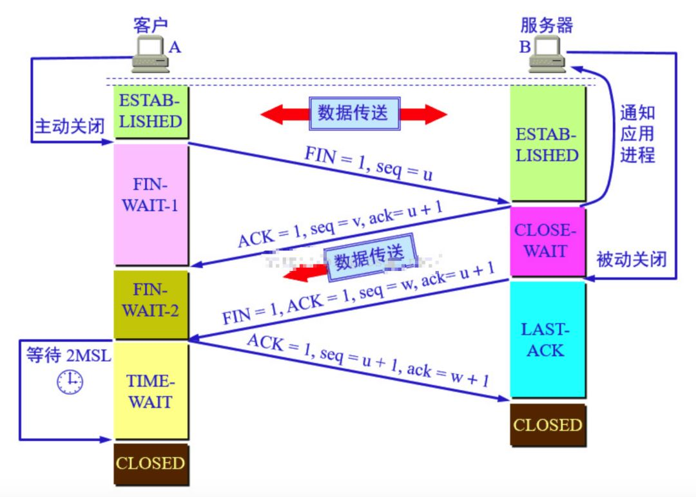

# 知识网络

- [一-IT技术基础](#一-IT技术基础)
	- [1-计算机原理](#1-计算机原理)
		- [二进制](#二进制)
		- [编码](#编码)
		- [CPU缓存，L1，L2，L3和伪共享](#CPU缓存，L1，L2，L3和伪共享)
	- [2-计算机网络](#2-计算机网络)
	- [3-算法](#3-算法)
		- [时间复杂度](#时间复杂度)
		- [空间复杂度](#空间复杂度)
		- [基本算法思想](#基本算法思想)
		- [排序算法](#排序算法)
			- [按复杂度分类](#按复杂度分类)
			- [冒泡排序](#冒泡排序)
			- [插入排序](#插入排序)
			- [选择排序](#选择排序)
			- [归并排序](#归并排序)
			- [快速排序](#快速排序)
			- [堆排序](#堆排序)
			- [桶排序](#桶排序)
			- [计数排序](#计数排序)
			- [基数排序](#基数排序)
		- [搜索算法](#搜索算法)
		- [查找算法](#查找算法)
		- [字符串匹配算法和KMP算法](#字符串匹配算法和KMP算法)
		- [全排列算法](#全排列算法)
		- [分支限界法](#分支限界法)
		- [hash算法](#hash算法)
		- [一致性Hash算法](#一致性Hash算法)
		- [递归算法](#递归算法)
		- [LRU算法](#LRU算法)
		- [LRU-K算法](#LRU-K算法)
		- [排序算法](#排序算法)
		- [深度优先和广度优先搜索](#深度优先和广度优先搜索)
	- [4-数据结构](#4-数据结构)
		- [线性表](#线性表)
		- [散列表](#散列表)
		- [树](#树)
		- [图](#图)
	- [5-编译原理](#5-编译原理)
	- [6-操作系统](#6-操作系统)
	- [7-数据库原理](#7-数据库原理)
- [二-Java基础](#二-Java基础)
	- [1-面向对象](#1-面向对象)
	- [2-值传递](#2-值传递)
	- [3-概念区分](#3-概念区分)
	- [4-内部类](#4-内部类)
	- [5-基本数据类型](#5-基本数据类型)
	- [6-自动拆装箱](#6-自动拆装箱)
	- [7-String](#7-String)
	- [8-关键字](#8-关键字)
	- [9-集合](#9-集合)
	- [10-枚举](#10-枚举)
	- [11-注解](#11-注解)
	- [12-泛型](#12-泛型)
	- [13-异常](#13-异常)
	- [14-正则表达式](#14-正则表达式)
	- [15-IO](#15-IO)
	- [16-序列化](#16-序列化)
	- [17-第三方工具库](#17-第三方工具库)
	- [18-API&SPI](#18-API&SPI)
	- [19-编码](#19-编码)
	- [20-时间处理](#20-时间处理)
	- [21-重点接口解读](#21-重点接口解读)
	- [22-源码阅读](#22-源码阅读)
- [三-Java高级](#三-Java高级)
	- [1-设计模式](#1-设计模式)
	- [2-反射技术](#2-反射技术)
	- [3-动态代理](#3-动态代理)
	- [4-并发编程](#4-并发编程)
		- [4.1-并发与并行](#4.1-并发与并行)
		- [4.2-线程](#4.2-线程)
		- [4.3-线程池](#4.3-线程池)
		- [4.4-线程安全](#4.4-线程安全)
		- [4.5-线程安全解决途径](#4.5-线程安全解决途径)
		- [4.6-synchronized](#4.6-synchronized)
		- [4.7-volatile](#4.7-volatile)
		- [4.8-Lock](#4.8-Lock)
		- [4.9-同步工具](#4.9-同步工具)
			- [CountDownLatch：直接基于AQS实现](#CountDownLatch：直接基于AQS实现)
			- [CyclicBarrier：基于ReentrantLock实现](#CyclicBarrier：基于ReentrantLock实现)
			- [Semaphore：直接基于AQS实现](#Semaphore：直接基于AQS实现)
			- [Exchanger：直接基于CAS实现](#Exchanger：直接基于CAS实现)
		- [4.10-Fork/Join框架，分而治之](#4.10-Fork/Join框架，分而治之)
		- [4.11-ThreadLocal](#4.11-ThreadLocal)
		- [4.12-死锁](#4.12-死锁)
		- [4.13-实际问题](#4.13-实际问题)
		- [4.14-阅读源代码，并学会使用](#4.14-阅读源代码，并学会使用)
	- [5-Java网络编程](#5-Java网络编程)
		- [5.1-tcp、udp、http、https等常用协议](#5.1-tcp、udp、http、https等常用协议)
		- [5.2-http/1.0，http/1.1，http/2之间的区别](#5.2-http/1.0，http/1.1，http/2之间的区别)
		- [5.3-http/3](#5.3-http/3)
		- [5.4-JavaRMI，Socket，HttpClient](#5.4-JavaRMI，Socket，HttpClient)
		- [5.5-cookie与session](#5.5-cookie与session)
		- [5.6-用Java写一个简单的静态文件的HTTP服务器](#5.6-用Java写一个简单的静态文件的HTTP服务器)
		- [5.7-了解nginx和apache服务器的特性并搭建一个对应的服务器](#5.7-了解nginx和apache服务器的特性并搭建一个对应的服务器)
		- [5.8-用Java实现FTP、SMTP协议](#5.8-用Java实现FTP、SMTP协议)
		- [5.9-进程间通讯的方式](#5.9-进程间通讯的方式)
		- [5.10-什么是CDN？如果实现？](#5.10-什么是CDN？如果实现？)
		- [5.11-DNS？](#5.11-DNS？)
		- [5.12-反向代理](#5.12-反向代理)
		- [5.13-浏览器与服务器通讯过程](#5.13-浏览器与服务器通讯过程)
	- [6-NIO技术](#6-NIO技术)
	- [7-JVM技术](#7-JVM技术)
		- [7.1-JVM内存结构](#7.1-JVM内存结构)
		- [7.2-垃圾回收](#7.2-垃圾回收)
		- [7.3-JVM参数及调优](#7.3-JVM参数及调优)
		- [7.4-Java对象模型](#7.4-Java对象模型)
		- [7.5-HotSpot](#7.5-HotSpot)
		- [7.6-虚拟机性能监控与故障处理工具](#7.6-虚拟机性能监控与故障处理工具)
		- [7.7-平台无关性](#7.7-平台无关性)
		- [7.8-字节码、class文件格式](#7.8-字节码、class文件格式)
		- [7.9-类加载机制](#7.9-类加载机制)
		- [7.10-执行引擎（未完成）](#7.10-执行引擎（未完成）)
		- [7.11-编译与反编译](#7.11-编译与反编译)
		- [7.12-Java内存模型](#7.12-Java内存模型)
		- [7.13-尾递归，尾调用](#7.13-尾递归，尾调用)
		- [7.14-位运算](#7.14-位运算)
	- [8-性能优化](#8-性能优化)
		- [8.1-Java性能优化](#8.1-Java性能优化)
	- [9-新技术](#9-新技术)
		- [9.1-Java8](#9.1-Java8)
		- [9.2-Java9](#9.2-Java9)
		- [9.3-Java10](#9.3-Java10)
		- [9.4-Java11](#9.4-Java11)
		- [9.5-Spring5](#9.5-Spring5)
		- [9.6-SpringBoot2.0](#9.6-SpringBoot2.0)
	- [10-高级源码](#10-高级源码)
	- [11-线上问题分析](#11-线上问题分析)
		- [11.1-dump获取](#11.1-dump获取)
		- [11.2-dump分析](#11.2-dump分析)
		- [11.3-dump分析及获取工具](#11.3-dump分析及获取工具)
		- [11.4-自己编写各种outofmemory，stackoverflow程序](#11.4-自己编写各种outofmemory，stackoverflow程序)
		- [11.5-Arthas](#11.5-Arthas)
		- [11.6-常见问题解决思路](#11.6-常见问题解决思路)
		- [11.7-使用工具尝试解决以下问题，并写下总结](#11.7-使用工具尝试解决以下问题，并写下总结)
	- [12-JMS](#12-JMS)
	- [13-JMX](#13-JMX)
- [四-Java框架](#四-Java框架)
	- [1-Servlet](#1-Servlet)
	- [2-Spring](#2-Spring)
	- [3-SpringBoot](#3-SpringBoot)
		- [微服务间调用方式：](#微服务间调用方式：)
		- [微服务调用的请求拦截器](#微服务调用的请求拦截器)
		- [RestTemplate](#RestTemplate)
	- [4-SpringMVC](#4-SpringMVC)
	- [5-SpringCloud](#5-SpringCloud)
		- [Eureka：服务发现](#Eureka：服务发现)
		- [Zookeeper：服务发现](#Zookeeper：服务发现)
		- [Consul：服务发现](#Consul：服务发现)
		- [Ribbon：负载均衡](#Ribbon：负载均衡)
	- [6-SpringSecurity](#6-SpringSecurity)
	- [7-SpringCache](#7-SpringCache)
	- [8-MyBatis](#8-MyBatis)
	- [9-Hiberate](#9-Hiberate)
	- [10-测试](#10-测试)
	- [11-Zookeeper](#11-Zookeeper)
	- [12-Nacos：](#12-Nacos：)
	- [13-Dubbo](#13-Dubbo)
	- [14-日志](#14-日志)
		- [日志级别](#日志级别)
		- [Log4j、Log4j2、Slf4j、Logback、Logging的关系](#Log4j、Log4j2、Slf4j、Logback、Logging的关系)
		- [Slf4j](#Slf4j)
		- [commons-logging](#commons-logging)
			- [#默认配置](##默认配置)
		- [Log4j](#Log4j)
			- [#邮件协议](##邮件协议)
			- [#邮件主题](##邮件主题)
		- [Log4j2](#Log4j2)
		- [Logback](#Logback)
		- [Logging](#Logging)
- [五-服务器](#五-服务器)
	- [1-JBoss](#1-JBoss)
	- [2-tomcat](#2-tomcat)
		- [tomcat集群实现session共享](#tomcat集群实现session共享)
	- [3-jetty](#3-jetty)
	- [4-Weblogic](#4-Weblogic)
	- [5-Nginx](#5-Nginx)
- [六-工具](#六-工具)
	- [1-svn](#1-svn)
	- [2-git](#2-git)
	- [3-maven](#3-maven)
	- [4-gradle](#4-gradle)
	- [5-IntellijIDEA](#5-IntellijIDEA)
	- [6-Eclipse](#6-Eclipse)
- [七-数据库](#七-数据库)
	- [1-基础](#1-基础)
	- [2-SQL](#2-SQL)
	- [3-ORACLE](#3-ORACLE)
	- [4-MYSQL](#4-MYSQL)
		- [基础](#基础)
		- [存储引擎](#存储引擎)
		- [排序方式](#排序方式)
		- [执行计划](#执行计划)
		- [索引](#索引)
		- [SQL优化措施](#SQL优化措施)
		- [日志](#日志)
		- [锁机制](#锁机制)
		- [约束](#约束)
		- [事务](#事务)
		- [备份恢复](#备份恢复)
		- [调优](#调优)
	- [5-SQLSERVER](#5-SQLSERVER)
- [八-Nosql](#八-Nosql)
	- [1-Redis](#1-Redis)
		- [1.1-数据结构](#1.1-数据结构)
		- [1.2-持久化](#1.2-持久化)
		- [1.3-事件](#1.3-事件)
		- [1.4-复制](#1.4-复制)
		- [1.5-哨兵](#1.5-哨兵)
		- [1.6-集群](#1.6-集群)
		- [1.7-发布订阅](#1.7-发布订阅)
		- [1.8-事务](#1.8-事务)
		- [1.9-Lua脚本](#1.9-Lua脚本)
			- [1.9.1-Lua语法](#1.9.1-Lua语法)
			- [1.9.2-Lua标准库](#1.9.2-Lua标准库)
			- [1.9.3-Lua其他库](#1.9.3-Lua其他库)
		- [1.10-慢查询日志](#1.10-慢查询日志)
	- [2-MongoDB](#2-MongoDB)
	- [3-Memcache](#3-Memcache)
	- [4-HBase](#4-HBase)
- [九-大数据](#九-大数据)
	- [Zookeeper](#Zookeeper)
	- [Solr，Lucene，ElasticSearch](#Solr，Lucene，ElasticSearch)
	- [Storm，流式计算，了解Spark，S4](#Storm，流式计算，了解Spark，S4)
	- [Hadoop，离线计算](#Hadoop，离线计算)
	- [HDFS、MapReduce](#HDFS、MapReduce)
	- [分布式日志收集flume，kafka，logstash](#分布式日志收集flume，kafka，logstash)
	- [数据挖掘，mahout](#数据挖掘，mahout)
- [十-网络安全](#十-网络安全)
- [十一-架构](#十一-架构)
	- [架构分类](#架构分类)
	- [布隆过滤器](#布隆过滤器)
	- [幂等](#幂等)
	- [集群](#集群)
		- [集群的目的](#集群的目的)
	- [分布式](#分布式)
		- [分布式事务](#分布式事务)
		- [Dubbo](#Dubbo)
		- [分布式锁](#分布式锁)
		- [分布式数据库](#分布式数据库)
		- [分布式文件系统](#分布式文件系统)
		- [分布式缓存](#分布式缓存)
		- [限流降级](#限流降级)
		- [算法](#算法)
		- [分布式ID](#分布式ID)
	- [微服务](#微服务)
		- [ServiceMesh](#ServiceMesh)
		- [Docker、Kubernets](#Docker、Kubernets)
		- [SpringBoot](#SpringBoot)
		- [SpringCloud](#SpringCloud)
	- [高并发](#高并发)
		- [分库分表](#分库分表)
		- [CDN技术](#CDN技术)
		- [消息队列](#消息队列)
	- [权限管理](#权限管理)
	- [搜索引擎](#搜索引擎)
	- [云计算](#云计算)
	- [监控](#监控)
		- [监控什么](#监控什么)
		- [监控手段](#监控手段)
		- [监控数据采集](#监控数据采集)
		- [Dapper](#Dapper)
	- [负载均衡](#负载均衡)
	- [DNS](#DNS)
	- [CDN](#CDN)
- [十二-扩展](#十二-扩展)
	- [AR&VR](#AR&VR)
	- [其他语言](#其他语言)
	- [人工智能](#人工智能)
		- [常用框架](#常用框架)
	- [区块链](#区块链)
		- [比特币](#比特币)
		- [以太坊](#以太坊)
		- [超级账本](#超级账本)
- [十三-***日常总结***](#十三-***日常总结***)
	- [数据库](#数据库)

> 简单内容直接呈现，复杂内容链接文章
## 一-IT技术基础
### 1-计算机原理
#### 二进制
#### 编码
#### CPU缓存，L1，L2，L3和伪共享
### 2-计算机网络
### 3-算法
#### 3.1-时间复杂度
- 分析技巧
- 分类
    - 最好时间复杂度
    - 最坏时间复杂度
    - 平均时间复杂度
    - 均摊时间复杂度
- 复杂度排序：O(1) < O(log<sub>2</sub>N) < O(N) < O(N * log<sub>2</sub>N) < O(N<sup>2</sup>) < O(N<sup>3</sup>)  < O(N!)
#### 3.2-空间复杂度

> 原地排序：空间复杂度为O(1)的排序算法属于原地排序算法，指不会占用太多额外内存

> 稳定排序：大小相同的元素顺序在排序前后保持不变的排序算法属于稳定的排序算法，否则为不稳定的排序算法
#### 3.3-基本算法思想
- 贪心算法
- 分治算法
- 回溯算法
- 动态规划
- 枚举算法
#### 3.4-排序算法
##### 3.4.1-按复杂度分类
- O(n<sup>2</sup>)
    - 冒泡排序
    - 插入排序
    - 选择排序
- O(nlogn)
    - 归并排序
    - 快速排序
    - 堆排序（建堆+排序）
- O(n)
    - 桶排序
    - 计数排序
    - 基数排序
- O(logn)
##### 3.4.2-冒泡排序

##### 3.4.3-插入排序
##### 3.4.4-选择排序
- java实现
```java

```
- 时间复杂度：O(nlogn)
- 空间复杂度：O(1)
##### 3.4.5-归并排序
##### 3.4.6-快速排序
##### 3.4.7-堆排序
- 步骤：
    1. 建堆——将无序数组构建成堆结构，如果要升序排序，则构建大顶堆，否则构建小顶堆
        - 第一种方式：在原数组中执行遍历依次插入堆结构（遍历到的目标元素相当于添加到堆结构的末尾，然后需要执行堆化操作进行堆重置）的方式，遍历完成后，堆结构就完成建立。这种方式采用从下往上的堆化操作来实现。
        - 第二种方式：首先将原数组看做是堆结构（大顶堆或小顶堆），但此时堆内部的元素时乱序的，需要进行重置，那么需要重置那些元素呢？这里针对非叶子节点进行堆化重置即可，这里的堆化采用从上往下的堆化操作，叶子节点没有子节点可以比较也就无从堆化，直接从最后一个非叶子节点开始执行堆化（从上往下的堆化操作其实就是比较当前节点与其两个子节点的大小，将最大或最小的节点放到当前位置，执行替换操作，不会影响到他前面的节点元素），完成一个节点之后，在对其数组前一位元素执行堆化，直到数组首个元素为止。
    2. 排序——大（小）顶堆根节点是当前堆结构中最大（小）值，将堆顶元素与末尾元素互换，然后将堆结构元素-1，并重置堆结构，将最大（小）节点元素至于数组末尾，从而实现正序（逆序）排序
- 时间复杂度：O(nlogn)
    - 建堆的时间复杂度：O(n)
    - 排序的时间复杂度：O(nlogn)
    - 总的时间复杂度为：O(nlogn)
- 空间复杂度：O(1)
- 特点：
    1. 堆排序是原地排序算法
    2. 堆排序不稳定，相同的元素顺序会发送变化
- 应用（动态数据推荐使用堆）
    1. 实现优先级队列（PriorityQueue）
        - 用于合并有序的小文件：读取每个文件的首个数据，建立小顶堆，将根节点数据写入大文件，然后再从来源文件读取下一个数据加入堆结构并重置，再次将根节点数据写入大文件，以此类推，直到所有数据全部写入大文件为止。
        - 实现高效定时器：将定时任务以执行时间构建成小顶堆，那么根节点任务就是最近需要执行的任务，执行线程计算根节点的时间据当前时间的间隔时间T，然后在T之后获取根节点任务执行，并计算堆重置后新的根节点任务的执行时间据现在的间隔T'以此类推，如果是执行一次的任务，出堆后执行完就结束，如果是循环执行的任务，那么需要再次入堆并重置堆结构。
    2. 利用堆求 Top K
        - 静态数据：维护一个K大小的堆（其实就是一个容量为K的数组），然后遍历目标数组，先将堆充满（前K个元素依次添加入堆并执行重置），从目标数组第K+1位元素开始，将目标元素与当前堆结构的根节点元素比较，若目标元素小于根节点元素，则不做处理，继续遍历；若目标元素大于根节点元素，则将根节点元素删除（并重置堆），然后将目标元素添加入堆（并执行堆重置），如此这般，待目标数组遍历结束，堆中的数据就是前K大数据，然后依次取出根节点元素到数组末尾实现逆序排列(从大到小)
        - 动态数据：同样维护一个K大小的堆，不过不是使用一次就不用，而是一直维护，当有新数据产生时，实时与堆的根节点进行比较，操作与上面相同，我们直接对堆进行操作就可以，不用每次都建堆。
    3. 利用堆求中位数
        - 静态数据：直接排序获取第n/2个数据即可
        - 动态数据：维护两个堆，一个大顶堆，一个小顶堆，保持两个堆中元素个数基本处于1:1，并且大顶堆中的元素要全部小于小顶堆中的元素。那么大顶堆的根节点元素就是我们需要的中位数。当有新数据产生，比较目标元素与两个根节点元素，如果目标元素小于大顶堆的根节点元素，则将其添加到大顶堆并重置堆，如果目标元素大于小顶堆的根节点元素，则将其添加到小顶堆并重置堆；添加完成后需要统计两个堆的元素并比较，如果两个数量比例不是1:1，则要将元素多的堆的根节点元素转移到另一个堆中，来保持平衡。
##### 3.4.8-桶排序
##### 3.4.9-计数排序
##### 3.4.10-基数排序
##### 3.4.11-其他排序算法
稳定的排序：冒泡排序、插入排序、鸡尾酒排序、桶排序、计数排序、归并排序、原地归并排序、二叉排序树排序、鸽巢排序、基数排序、侏儒排序、图书馆排序、块排序

不稳定的排序：选择排序、希尔排序、Clover排序算法、梳排序、堆排序、平滑排序、快速排序、内省排序、耐心排序
#### 3.5-搜索算法（查找算法）
#### 3.6-字符串匹配算法和KMP算法
- 单模式串匹配算法：
    - BF算法：暴力匹配算法（Brute Porce）——我们在主串中，检查起始位置分别是 0、1、2…n-m 且长度为m的n-m+1个子串，看有无与模式串匹配的，实现简单，易理解，复杂度较高
    - RK算法：Rabin-Karp 算法——BF算法的升级版，引入哈希算法，逐个比较n-m+1个子串的哈希值与模式串的哈希值，看有无匹配的。难点是哈希算法的设计，减少哈希冲突的情况
    - BM算法：Boyer-Moore算法——通过坏字符规则与好后缀规则配合来确定不匹配之后模式串在主串中向后滑动的位数来进行下一次匹配比较，以此来减少比较的次数，提高算法效率
        - 坏字符规则：
        - 好后缀规则：
    - KMP算法：Knuth Morris Pratt算法——通过模式串的各前缀子串的前缀子串与后缀子串的匹配情况来决定模式串向后滑动的位数来进行下一次匹配比较，以此来减少比较次数，提供算法效率，该算法重点就是next函数的实现。
- 多模式串匹配算法：
    - Tire树：又称字典树，专门用于处理字符串匹配的数据结构，用于解决在一组字符串集合中快速查找某个字符串的问题。它的本质是利用字符串之间的公共前缀，将重复的前缀合并在一起
        - 构造：树结构，根节点不保存字符，然后从第二层开始保存需要的字符，每个节点都拥有N个子节点，是为多叉树，每个节点保存一个字符和指向其他字符节点的指针。
        - 用途：用于查找前缀匹配的字符串，比如搜索引擎的关键字提示功能
    - AC自动机：Aho-Corasick 算法，（多模式串中的AC自动机相对于Tire树就相当于单模式串中的MKP算法相对于BF算法）
#### 3.7-全排列算法
字典序法、递增进位制数法、递减进位制数法、邻位对换法
#### 3.8-分支限界法
#### 3.9-hash算法
- 概念：Hash算法又称为散列算法、哈希算法、杂凑算法等，是一种依据数据获取固定长度输出结果的算法
- 特点：
    - 散列过程必须在有限的时间和空间内完成
    - 结果长度固定，便于获取长数据的标识，标签之类
    - 基本是单向算法，即基本不可能根据结果反推出原始数据
    - 抗碰撞性，理想的Hash函数是无碰撞的，但在实际算法的设计中很难做到这一点。
    - 数据灵敏性，任何针对原始数据的修改，都会导致散列结果的变化
- 散列函数
    - 加法Hash：把输入元素一个一个的加起来构成最后的结果
    - 位运算Hash：通过利用各种位运算（常见的是移位和异或）来充分的混合输入元素
    - 乘法Hash：利用了乘法的不相关性（乘法的这种性质，最有名的莫过于平方取头尾的随机数生成算法，虽然这种算法效果并不好）
    - 除法Hash：除法和乘法一样，同样具有表面上看起来的不相关性。不过，因为除法太慢，这种方式几乎找不到真正的应用。需要注意的是，我们在前面看到的hash的  结果除以一个prime的目的只是为了保证结果的范围
    - 查表Hash：
    - 混合Hash：混合Hash算法利用了以上各种方式。各种常见的Hash算法，比如MD5、Tiger都属于这个范围。它们一般很少在面向查找的Hash函数里面使用
- 密码学
- 常见的Hash算法
    - MD4（RFC 1320）：MIT的Ronald L. Rivest在1990年设计的，MD是Message Digest的缩写。其输出为128位。MD4已证明不够安全。
    - MD5（RFC 1321）：是Rivest于1991年对MD4的改进版本。它对输入仍以512位分组，其输出是128位。MD5比MD4复杂，并且计算速度要慢一点，更安全一些。MD5已被证明不具备"强抗碰撞性"。
    - SHA（Secure Hash Algorithm）：是一个Hash函数族，由NIST（National Institute of Standards and Technology）于1993年发布第一个算法。目前知名的SHA-1在1995年面世，它的输出为长度160位的hash值，因此抗穷举性更好。SHA-1设计时基于和MD4相同原理，并且模仿了该算法。SHA-1已被证明不具"强抗碰撞性"。
        - SHA-1：不具备强抗碰撞性
        - SHA-2：为了提高安全性，NIST 还设计出了 SHA-224、SHA-256、SHA-384，和 SHA-512 算法（统称为 SHA-2），跟 SHA-1 算法原理类似。
        - SHA-3：SHA-3 相关算法也已被提出。
#### 3.10-一致性Hash算法
- 由来：在现在的分布式缓存系统中一般都采用Hash取模的方式进行缓存定位存取，当新增缓存机器时会因为机器数量增加导致取模结果发生变化，进而导致缓存命中失败，大量的缓存失败形成穿透，威压数据库，严重导致数据库宕机，因此出现了一致性Hash算法来避免这种情况的发生
- 算法：创建一个值为0至2<sup>32</sup>-1的哈希环（0和2<sup>32</sup>重合），然后将缓存系统通过哈希算法定位到环上，数据存取时，首先通过相同的哈希算法计算结果定位到环上，然后顺时针旋转，存取到第一个发现的缓存系统。
- 优势：极大的缓解了增减缓存系统造成的影响，因为如果新增了一个缓存系统，那么只有在新系统逆时针方向的两台系统之间的数据会出现缓存不命中情况，而不会出现所有数据都无法命中的情况。
- 有关虚拟节点：如果缓存系统在哈希环中分布不均匀，可以通过在环上均匀性创建虚拟节点的方式来变相达到均匀分布，其实任然是原来的系统数量，只是将一些系统在其他位置建立了一个副本节点（虚拟节点）。
- [一致性哈希算法原理](https://www.cnblogs.com/lpfuture/p/5796398.html)
- [白话解析：一致性哈希算法 consistent hashing](http://www.zsythink.net/archives/1182)
- [对一致性Hash算法，Java代码实现的深入研究](https://www.cnblogs.com/xrq730/p/5186728.html)
#### 3.11-递归算法

#### 3.12-LRU算法
- 理解：最近最少使用（使用一次）算法
- 链表实现：新的数据插入链表头部，命中的数据移动到链表头部，链表满时删除链表尾部的数据（不推荐）
- 链表+HashMap实现：HashMap用于保存缓存键值对，链表用于维护包含缓存键值对的键的节点，在链表中，针对新的键值对的键的节点添加到链表头部，缓存命中的键值对的键的节点也移动到链表头部，这样链表末尾的就是最近最少访问的键值对的键的节点，当HashMap满的时候，就将链表尾部的节点对应的键代表的键值对删除，当然链表中也要删除这个节点（推荐的方式）
- 使用LinkedHashMap（不推荐）
#### 3.13-LRU-K算法
- 理解：最近使用K次算法
#### 3.14-加密算法
- 哈希算法：参见[3.9-hash算法](#3.9-hash算法)，主要用于生成消息摘要来验证原信息的完整性和来源的可靠性。
    - MD5算法
    - SHA算法
- 对称加密算法：通过一个密钥进行加密和解密，但存在密钥泄露的风险
    - DES算法
    - AES算法
- 非对称加密算法：通过一对密钥包括私钥和公钥进行加密与解密，可以私钥加密公钥解密，也可以公钥加密私钥解密，单独泄露公钥也不会被担心解密，因为私钥是不会被传递的，不存在被截获的可能，而被公钥加密的数据只能被私钥解密。
    - RSA算法
> 非对称加密算法中的公钥与私钥的作用其实是为了将真正的密钥由一方传递到另一方，即公钥加密私钥解密的数据其实是真正数据传输时使用的密钥，待密钥被双方得知之后，再使用这个密钥加密解密传输，密钥不会被截获，那么保证数据的安全
#### 3.15-深度优先和广度优先搜索
##### 二叉树的深度优先遍历与广度优先遍历
- 深度优先遍历
- 广度优先遍历
##### 图的深度优先搜索和广度优先搜索
- 深度优先搜索DFS（基于栈实现）（采用递归实现）：回溯思想的体现（类似走迷宫，一条路一条路尝试，不通则后退返回走另一条尝试）
    - 时间复杂度：O(E)
    - 空间复杂度：O(V)
- 广度优先搜索BFS（层级搜索）（基于队列实现）：先查找离起始顶点最近的顶点，然后是次近的，依次逐层往外搜索，每个顶点都只会被放到队列一次
    - 时间复杂度：O(E)
    - 空间复杂度：O(V)
#### 3.16-迪杰斯特拉算法
#### 3.17-最小生成树
### 4-数据结构
#### 4.1-线性表
- 数组
- 链表
- 队列
- 栈
- 跳表：
    - 时间复杂度：O(logn)，添加、删除、查找元素的时间复杂度均为O(logn)
    - 空间复杂度：O(n)
    - 
- 栈和队列的相同和不同之处
- 栈通常采用的两种存储结构
#### 4.2-散列表
- 散列表，又称为哈希表，是基于Hash算法实现的一种支持快速定位存取的数据结构。散列表中的hash算法放宽了对hash碰撞的限制，也即散列表实现中需要着重对hash碰撞进行处理。
- 结构概述：
- hash碰撞：

#### 4.3-树
- 演化：
    - 二叉树（无序）->
        - 完全二叉树（无序）——>堆（有序）
        - 满二叉树（无序）
    - 二叉查找树（有序）->
    - 平衡二叉树（有序、平衡）->
        - AVL树
        - 红黑树
    - B树——>B+树——>B*树
    - Trie树
- [各种树的特点](http://blog.jobbole.com/111680/)：
    - 二叉树：初始树，无序
    - 完全二叉树：无序，所有非叶子层节点数达到最大个数，叶子层节点全部靠左存放
    - 满二叉树：无序，所有非叶子节点均有两个子节点，所有叶子节点均在同一层
    - 堆：完全二叉树的升级，有序：所有父节点均大于或小于其子节点
    - 二叉查找树：有序，左子节点小于根节点，根节点小于等于其右子节点，可采用中序遍历获取到有序的数列
    - 平衡二叉树：有序，所有非叶子节点的左右子树的高度差绝对值不超过1，既保持基本平衡，不会退化为链表
    - AVL树：同上，通过旋转来保持平衡
    - 红黑树：带有颜色的平衡二叉树，需保证根节点为黑色，所有叶子节点（NUL节点）为黑色，每个红色节点必有两个黑色子节点，任意节点到其每个叶子节点均有相同的黑节点数等，通过旋转+着色来保持平衡
    - B树：多叉树，有序，多用于数据库系统、文件系统来实现快速查找
    - B+树：B树的升级版变体，添加叶子节点指针
    - B*树：B+树的升级版变体，添加兄弟指针
    - Trie树：字典树，单词查找树，常用于统计、搜索引擎
- 二叉树
- 多路查找树
- 堆（完全二叉树）
    - 特点：
        - 堆是一颗完全二叉树（完全二叉树，除最后一层外节点都是满的，最后一层节点全部靠左排列）
        - 堆中每一个节点的值都必须大于等于（或小于等于）其子树中每个节点的值，以此分为大顶堆和小顶堆
        - 可以使用数组实现堆结构，只要满足以下规则即可：
            1. leftIndex = parentIndex * 2 + 1
            2. rightIndex = parentIndex * 2 + 2
            3. parentIndex = (nodeNum - 1) / 2
    - 操作：
        - 插入元素（O(logn)）：需要进行堆化操作，从下往上进行堆化
        - 删除堆顶元素（O(logn)）：需要进行堆化操作，从上往下进行堆化
- Trie树：
- 二叉树的遍历方式
    - 深度优先遍历（采用栈或递归实现）
        - 前序遍历：先根再左后右
        - 中序遍历：先左再根后右
        - 后序遍历：先左再右后根
    - 广度优先遍历（层次遍历）（采用队列实现）
#### 4.4-图
##### 概念
- 无向图
- 有向图
- 顶点
- 边
- 度
- 出度
- 入度
- 权重
##### 图的存储
- 邻接矩阵（二维数组）
- 邻接表（数组+链表或者平衡二叉查找树或跳表或散列表）、逆邻接表
- 十字链表
##### 搜索算法
- 深度优先搜索（基于栈实现）：
- 广度优先搜索（层级搜索）（基于队列实现）：先查找离起始顶点最近的顶点，然后是次近的，依次逐层往外搜索，每个顶点都只会被放到队列一次
- A*
- IDA*
##### 图的生成树
图的生成树是一颗含有其所有顶点的无环连通子图,一幅加权图的最小生成树(MST)是它的一颗权值(树中的所有边的权值之和)最小的生成树
### 5-算法应用
#### 5.1-寻找无序数组的第k大元素
##### 实现一：排序法
将无序数组进行逆排序，第K个元素即为目标元素（可以使用快排，时间复杂度为O(nlogn)）
##### 实现二：插入法
维护一个K容量的有序数组，遍历目标数组，先填满有序数组（填的时候需要排序），对于第K+1个元素开始将目标元素与有序数组中的最小元素比较，如果目标元素小于有序数组中最小元素，跳过该元素继续遍历，否则将有序数组中最小元素移除并将当前元素插入有序数组（排好序），待遍历结束，有序数组中的最小元素即为第k大元素
##### 实现三：小顶堆法
维护一个容量为k的小顶堆，遍历目标数组，先填满小顶堆（添加节点需要执行堆化），对于第k+1个元素开始将目标元素与堆顶元素进行比较，如果目标元素小于堆顶元素，则跳过该元素继续遍历，否则将堆顶元素替换为目标元素并执行堆化，继续遍历，待遍历结束，堆中保存中就是前k大的元素，堆顶元素即为第k大元素
##### 实现四：分治法（不完善，有关如何选取基准值）
以某个元素值m为基准，将数组元素进行分区，大于m的位于左边，小于m的位于右边，完成之后，查看当前基准值位于数组中位置是否是第k个，如果是那么这个基准值m就是第k大元素，否则继续尝试分区
##### 扩展
- 寻找无序数组的前k大元素：比如获取关注度最高的前10个关键字，动态的，最适合使用堆实现
#### 5.2-图的最小路径
##### 无权图的最小路径
采用[广度搜索算法](#图的深度优先搜索和广度优先搜索)
##### 带权图的最小路径
采用[迪杰斯特拉算法](#3.16-迪杰斯特拉算法)
### 6-编译原理
### 7-操作系统
### 8-数据库原理
### 9-密码学
## 二-Java基础
### 1-面向对象
- 面向对象和面向过程的区别：
    - **面向对象**：将一类事物抽象成类，将事物的属性抽象成变量，事物的行为抽象成方法，然后将其封装起来的编程思想。重点关注的是对象。
    - **面向过程**：重点关注的是执行步骤，利用函数将每个步骤实现，逐个调用的方式。
- 面向对象的三大基本特征和五大基本原则
    - **三大特征**
        - 封装：封装隐藏了类的内部实现机制，从而可以在不影响使用者的前提下改变类的内部结构，同时保护了数据
        - 继承：继承是为了重用父类代码，同时为实现多态性作准备
        - 多态：指对象的多种形态，对象可以通过继承体系来实现多态：
            - 向上转型：父类指向子类实现类
            - 向下转型：需要进行强制转换
    - **五大原则**
        - 单一职责原则
        - 开放封闭原则
        - 里氏替换原则
        - 依赖倒置原则
        - 接口隔离原则
### 2-值传递
重点：传递关注的是传递的内容本身，而不是其所代表的含义或者指向的内容。
- 值传递：表示传递的是值的拷贝，在新方法中对值进行更改不会影响原来的值
- 引用传递：表示传递的是对象的引用地址，那么新方法中针对对象的改变将会体现在原来的引用中，因为两个引用执行相同的对象
- [为什么说Java中只有值传递](https://www.cnblogs.com/wchxj/p/8729503.html)：如果某个方法的参数是一个对象，那么传递的时候就会直接传递这个对象在栈空间的句柄，那么这种是不是引用传递呢，不是，因为传递的关注点并不是对象而是那个对象地址值，在传递的时候，同样是拷贝了一封对象地址值传递的，那么这里就是值传递，引用传递指的是直接将原来的引用地址传进来。Java在这里进行了处理，并不是传原来的引用地址，而是原来引用地址的一份拷贝。
### 3-概念区分
- 方法重写与重载
    - 方法重写：重写针对的是继承体系中，子类重写父类的方法，可以使用@Override标注。
    - 方法重载：重载指的是同一个类中，多个参数形式不同的同名方法，返回值不参与区分是否重载
- Java的继承与实现
    - 继承：Java支持单继承，一个类只能继承一个抽象类或者普通类，一个接口可以继承多个接口，继承的目标可以使接口、抽象类、普通类
    - 实现：Java支持多实现，一个抽象类或者普通类可以实现多个接口，实现的目标只能是接口
- 构造函数与默认构造函数：Java类中可以拥有多个构造函数，型重载，多个构造函数参数必须不同。一个类默认存在一个无参构造器，但是一旦自定义了新的构造器，则无参构造器失效，需要手动添加。
- 类变量、成员变量和局部变量
    - 类变量：在类内部定义，由static修饰的变量，可由类名点用（无需创建对象使用），共享使用，在类加载阶段完成赋值操作（可直接赋值，静态块赋值，静态方法赋值）
    - 成员变量：在类内部定义，需要使用对象调用，每个对象有一个自己的变量，不共享，在创建对象时赋值（可直接赋值，构造器赋值，块赋值，成员方法赋值等）
    - 局部变量：方法内定义，只在方法内有效，天生线程安全。
- 成员变量和方法作用域
    - 成员变量：是属于对象级的变量，区别于静态变量，静态变量是属于类级变量，成员变量在创建对象的时候进行初始化，而类变量在类加载的时候进行初始化，作用域在对象内部有效
    - 成员方法：同样属于对象级的方法，区别于静态方法，静态方法属于类级方法，成员方法必须被对象调用，作用域在对象内部有效
- 接口和抽象类
    - 接口
        - interface定义
        - 变量默认public static final-静态常量
        - 没有构造器
        - 方法默认public abstract
        - 可以定义静态方法、默认方法、重写Object的方法
        - 实现类必须实现其所有抽象方法
        - 接口的继承是多继承
    - 抽象类
        - abstract class定义
        - 拥有构造器，但是不能主动创建实例，主要被子类调用
        - 可以定义抽象方法，让子类去实现，也可以定义普通的方法
        - 可以定义main方法，并且可以运行
        - 其它基本和普通的类没有区别
        - 抽象类的继承是单继承，多实现
### 4-内部类
- [四大内部类](https://www.cnblogs.com/xrq730/p/4875907.html)
    - 成员内部类：定义在另一个类内部的非静态内部类，级别和成员变量和成员方法一致，依附于外部类而存在
        1. 成员内部类内部不可以定义静态方法
        2. 成员内部类可被public和private修饰
        3. 被public修饰的成员内部类的public方法可被外部类调用
        4. 被private修饰的成员内部类的public方法不可被外部类调用
        5. 成员内部类可以访问外部类的私有属性（非私有的一样可以访问）--因为成员内部类默认持有一份外部类的引用
        6. 实例化方式：Outer.Inner inner = new Outer().new Inner();
    - 静态内部类：定义在另一个类内部的静态内部类（static修饰），超脱了外部类而存在
        1. 静态内部类内部可以定义静态方法和非静态方法
        2. 静态内部类只能访问其外部类的静态成员与静态方法--因为静态内部类并不持有其外部类的引用，所以无法访问外部类的私有属性，而是和其他类一样只能类名点用访问外部类的静态成员，这也是证明静态内部类超脱外部类的一方面
        3. 实例化方式：Outer.Inner inner = new Outer.Inner();
    - 局部内部类：定义在一个方法或者一个作用域（{}）中的内部类，与方法的局部变量一致，只在作用域内有效
        1. 局部内部类没有访问修饰符
        2. 局部内部类只能访问外部类的final变量或者对象
    - 匿名内部类：直接通过new接口的方式定义的内部类（需要实现接口中的所有抽象方法），这种类其实是接口的实现类，只是没有显式指定类名，函数式接口的匿名内部类可以部分可使用Lambda表达式来替换（针对只存在一个抽象方法的接口）
        1. 匿名内部类只能访问外部类的final变量或者对象
        2. 匿名内部类是唯一没有构造器的类
### 5-基本数据类型
- 8种基本数据类型：
    - byte：1字节，-128~127（-2<sup>7</sup>~2<sup>7</sup>-1）
    - short：2字节，-32768~32717（-2<sup>15</sup>~2<sup>15</sup>-1）
    - int：4字节，-2147483648~2147483647（-2<sup>31</sup>~2<sup>31</sup>-1）
    - long：8字节，-9223372036854775808~9223372036854775807（-2<sup>63</sup>~2<sup>63</sup>-1）
    - float：4字节，单精度浮点数，二进制科学计数法表示，1.401298e<sup>-45</sup>~3.402823e<sup>+38</sup>
    - double：8字节，双精度浮点数，二进制科学计数法表示，4.9000000e<sup>-324</sup>~1.797693e<sup>+308</sup>
    - char：2字节，0~65535
    - boolean：1字节，0~1
- 基本数据类型的产生的历史原因：其实是为了兼容C语言的模式，为C语言开发者转型Java提供方便
- [整型和浮点型的二进制表示形式与计算原理]   //TODO
- [什么是浮点型]   //TODO
- [什么是单精度和双精度]   //TODO
- **为什么不能用浮点型表示金额**：因为使用浮点数能精确表示的小数很少，大部分都无法精确表示，这和十进制无法精确表达1/3一样。
- [浮点数为什么不精确？为什么银行的金额不能用浮点数计算](https://blog.csdn.net/keke_xin/article/details/84831024)
### 6-自动拆装箱
- **什么是包装类型**：包装类型是针对八个基本数据类型定义的包装类，用于在面向对象的Java中执行一些只有对象才能执行的操作。
- **什么是自动拆装箱**：拆装箱就是基本类型和包装类型的转换操作，由编译器来完成拆装箱操作。
- [Integer的缓存机制](Java_Technology\Java_Base_Technology\Integer的缓存机制.md)（享元模式：池）
- [Integer的缓存机制](https://blog.csdn.net/yrwan95/article/details/82785129)
- Byte、Short、Long的均是将-128到127缓存起来备用。
- 包装类型的比较需要使用equals，不能直接使用==，除非将其手动转换为基本类型。
### 7-String
- [字符串的不可变性](https://blog.csdn.net/qunzer/article/details/25157309)：String类被final修饰，是为最终类，不可被继承修改,且底层保存字符序列的字符数组也被final修饰，一旦赋值不再改变，这是String不变的原理。这种不变性也保证了其可以作为Map中键的常客。
- [JDK6和JDK7中substring的原理及区别](Java_Technology\Java_Base_Technology\JDK6和JDK7中substring的原理及区别.md)
- replaceFirst、replaceAll、replace区别
    - replace：使用新字符替换所有旧字符，字符的替换操作
    - replaceFirst：使用给定的字符序列根据给定的正则表达式替换第一次出现的旧字符序列，字符序列的替换操作，涉及正则表达式，只替换首个出现的匹配的旧字符序列
    - replaceAll：使用给定的字符序列根据给定的正则表达式替换所有旧的字符序列，replaceFirst的加强版，替换所有匹配的旧字符序列
- String对“+”的重载：String的+操作符在编译阶段会被编译为StringBuilder的appand操作和toString操作的整合版。（语法糖）
- 字符串拼接的几种方式和区别
    - +：效率最慢，少数字符串或者数值拼接时使用，直观
    - concat方法：通过Arrays.copyOf()实现拼接，适用于字符串少的拼接
    - String.format方法：通过StringBuilder来实现
    - StringUtils.join()：org.apache.commons.lang3中提供的方式，通过StringBuilder实现拼接
    - String.join()：JDK 1.8中新增的方式，通过StringBuilder实现拼接
    - StringBuilder：速度最快速的方式
- String.valueOf和Integer.toString的区别：前者拥有诸多重载方法，用于将各种类型的对象转换成字符串，后者是单单对整型而言的转字符串方法。
- switch对String的支持（语法糖）：JDK 1.7新增功能，switch比较的是字符串常量的哈希值（int类型），但是hash值可能会有冲突，所以还需要再调用equals方法进行二次比较。[Java1.7增加switch对字符串的支持](https://blog.csdn.net/troyaninpc/article/details/79475474)
- switch支持以下类型：
    - 基本数据类型：byte, short, char, int
    - 包装数据类型：Byte, Short, Character, Integer
    - 枚举类型：Enum（语法糖）
    - 字符串类型：String（Jdk 7+ 开始支持）（语法糖）
- 字符串常量池

> 字符串常量池和运行时常量池不同，后者是class文件私有的，每个class文件有一个运行时常量池，而字符串常量池是公共的，全局的。
>
> JDK 1.6之前，字符串常量池位于方法区，JDK1.7开始挪到了堆内存。
>
> 使用字面量创建字符串，会直接在字符串常量池中查找有无指定的字符串字面值，有则直接返回其引用，没有就在池中创建一个字面量并返回其引用。
>
> 使用new方式创建字符串，会直接在堆内存中创建一个String对象，这个对象保存着一个字符串字面值，这时与字符串常量池无关。
>
> 当我们对字符串执行intern之后，将会触发下面的操作。
- intern
intern方法的作用是在常量池中保留字符串的一份引用或者字面值。
    - JDK 1.6
        - 若字符串常量池中有指定的字符串常量值，则直接返回该值的地址，将new方式在堆中创建的字符串替换为这里的地址
        - 若字符串常量池中没有指定的字符串常量值，则在常量池中创建一个同样的字符串，并将其地址返回给栈引用。
    - JDK 1.7
        - 同上
        - 若字符串常量池中没有指定的字符串常量值，则在常量池中保留一份堆中字符串的引用地址。 
### 8-关键字
- [Java关键字](https://www.cnblogs.com/chenglc/p/6922834.html)
- transient原理及用法：使用于序列化机制中，用于屏蔽不想参与序列化的字段，被其修饰的字段不参与序列化与反序列化。一般使用writeObject和readObject方法来自定义其值的序列化与反序列化，通常是直接写入流中或从流中获取赋值。
- [instanceof原理及用法](https://www.cnblogs.com/V1haoge/p/8492158.html)
- [volatile原理及用法](https://www.cnblogs.com/V1haoge/p/7833881.html)
    - 可见性及其原理
    - 有序性及其原理
- [synchronized原理及用法](#synchronized)
- [final原理及用法](https://www.cnblogs.com/V1haoge/p/8482909.html)
- [static原理及用法](https://www.cnblogs.com/V1haoge/p/8477914.html)
- const原理及用法：C/C++中的关键字，Java中作为保留字存在，和goto一样
### 9-集合
- 常用集合类的使用
    - ArrayList：数组实现的列表，查找元素速度快，增删元素较慢，适用于保存偏于查询的数据
    - LinkedList：链表实现的列表，同时也是队列，增删匀速快，查询元素慢，适用于保存偏于增删操作的数据
    - HashMap：基于Hash实现的键值对集合，查找元素快，适用于做缓存，偏于查询，保存元素涉及扩容
    - HashSet：基于hash实现的无序集合，用于保存不重复的数据，可用于去重
    - TreeMap：基于红黑树实现的键值对集合，天然有序，用于保存有序的键值对数据
    - TreeSet：基于红黑树实现的无序集合，天然有序，用于保存有序的去重数据
    - **LinkedHashMap**：基于Hash和链表（循环双向链表）实现的键值对集合，保存了插入顺序。其实就是对HashMap的所有元素使用一个链表连起来罢了。视为一个有序的HashMap。有两种排序方式：
        - 插入顺序，默认为插入顺序，accessOrder=false：按照元素存入map中的顺序排序
        - 访问顺序，accessOrder=true：按照访问Map元素的顺序排序，天生的LRU实现
        - 注意：以上两个排序其实都是在双向链表中实现了，这个链表和HashMap其实是并列存在的。在两个里面均保存了元素的引用。
    - **LinkedHashSet**：同上，视为有序的HashSet，它只支持按照元素的插入顺序排序。
        - 其实LinkedHashSet底层是基于LinkedHashMap实现的，
- [ArrayList和LinkedList和Vector的区别](https://www.cnblogs.com/yw-ah/p/5841327.html)
- SynchronizedList和Vector的区别
    - SynchronizedList有很好的扩展和兼容功能。他可以将所有的List的子类转成线程安全的类,Vector底层固定只能是数组
    - 使用SynchronizedList的时候，进行遍历时要手动进行同步处理
    - SynchronizedList可以指定锁定的对象
- HashMap、HashTable、ConcurrentHashMap区别
    - HashMap：线程不安全的键值对集合
    - HashTable：线程安全的键值对集合，使用synchronized加锁实现线程安全，效率较低
    - ConcurrentHashMap：线程安全的键值对集合，使用原子操作+synchronized实现，效率更高，推荐使用
- Set和List区别
    - Set特点：无序-不可重复-可保存null值但只能有一个
    - List特点：有序-可重复-可保存多个null值
- Set如何保证元素不重复
    Set一般底层以Map来实现，可以说Set就是一个value为固定值的Map，那么Set保存的值映射到Map，就是Map的key，key当然不能重复，所以这个问题可以引申到Map中的key不重复是怎么保证的，其实主要原理就在添加元素的代码中，在添加新元素的时候，首先就会对元素对的键进行hash来进行桶定位，确定好桶位之后，如果桶位没有元素，直接添加，如果有元素，那么就要遍历桶位的链表或者红黑树，通过新元素的键与旧元素的键进行比较，如果没有相同的键，则新元素添加到链表或者树中，否则只是替换相同键的value值。相对于set来说，就是没有添加进去，重点在于比较，这里的比较使用equals进行比较。
- [Java 8中stream相关用法](https://www.jianshu.com/p/3dc56886c2eb)
- [apacheCommons工具类的使用](https://www.cnblogs.com/crazylqy/p/4872236.html)
    - **Collections**：java集合框架操作.
    - **Lang**：Java基本对象方法的工具类包 如：StringUtils,ArrayUtils等等.
    - **BeanUtils**：提供了对于JavaBean进行各种操作，克隆对象,属性等等.
    - **DBCP**：提供数据库连接池服务.
    - **FileUpload**：提供文件上传功能.
    - Betwixt：XML与Java对象之间相互转换.
    - Codec：处理常用的编码方法的工具类包 例如DES、SHA1、MD5、Base64等.
    - Compress：Java提供文件打包 压缩类库.
    - Configuration：一个java应用程序的配置管理类库.
    - DbUtils：提供对jdbc 的操作封装来简化数据查询和记录读取操作.
    - Email：java发送邮件 对javamail的封装.
    - HttpClient：提供HTTP客户端与服务器的各种通讯操作. 现在已改成HttpComponents
    - IO：io工具的封装.
    - Logging：提供的是一个Java 的日志接口.
    - Validator：提供了客户端和服务器端的数据验证框架.
- [不同版本的JDK中HashMap的实现的区别以及原因](http://www.importnew.com/28263.html)
- Collection和Collections区别
    - Collection是集合的基础接口定义了一些公共的方法。
    - Collections是集合工具类，主要用于操作集合：排序、反转、拷贝、查找、定位等功能
- Arrays.asList获得的List使用时需要注意什么
    - Arrays.asList获取到的ArrayList是Arrays的一个内部类，表示一个不可改变的列表，不同于JUC中的ArrayList。
    - 前者返回的ArrayList不能添加元素
    - 而且操作asList的时候，必须是引用类型的值（比如：Integer、Long等），不能是原始类型（比如：int、long之类）
- Enumeration和Iterator区别
    二者都是用来遍历集合的，前者是JDK 1.0就出现的遍历工具，实现者包括Vector、HashTable等，后者是在JDK 1.2中新增的，新的集合框架就是在其基础上扩展开来的。
    前者只有两个方法，只能用于遍历获取元素，后者多一个方法，可以执行元素删除操作，而且后者支持fast-fail：当多个线程对同一个集合的内容进行操作时，就可能会产生fail-fast事件。
- [fail-fast 和 fail-safe的区别](https://blog.csdn.net/u010889616/article/details/79954413)
    fail-fast：快速失败，ju包下的集合类均是快速失败的，当多个线程对同一个集合进行操作，就可能产生fail-fast。
    fail-safe：安全失败，所有针对同一集合结构的更改操作都会在一个复制的集合上进行。

### 10-枚举
- [深入理解Java枚举类型(enum)](https://blog.csdn.net/javazejian/article/details/71333103)
- 枚举的用法
    - 枚举可以实现多个接口
    - 可以定义新的变量
    - 可以定义新的方法
    - 可以定义根据具体枚举值而相异的类
    - 可以定义抽象方法，并由枚举值实现，使用大括号（{}）来进行定义。
- [枚举的实现原理](Java_Technology/Java_Base_Technology/枚举实现原理.md)：枚举是通过语法糖实现的额，枚举类被编译之后，就能看出其大致结构。
- **枚举与单例**：都说枚举是实现单例最简单有效的方式。确实，即使是序列化机制也不会导致多实例产生。
- Enum类：[Enum深入解析](Java_Technology/Java_Base_Technology/Enum深入解析.md)
- **Java枚举如何比较**：使用equals和==都可以进行比较，因为每个枚举都是单例的，是天然单例，其equals就是使用==实现的。[比较java枚举成员使用equal还是==](https://www.cnblogs.com/xiohao/p/7405423.html)
- **switch对枚举的支持**：枚举在jdk1.5出现，switch在jdk 1.6中支持枚举。这是一种编译器的语法糖。
    我们都知道在class文件中switch判断只支持int类型。那么枚举是怎么转换的呢？其实底层使用的是枚举类的ordinal方法，即枚举值的序列值，这和switch支持的String差不多，这也是一种语法糖，底层判断的是字符串的hashCode。
- **枚举的序列化如何实现**：[深度分析 Java 的枚举类型：枚举的线程安全性及序列化问题](http://blog.jobbole.com/94074/)
    枚举的序列化是由JVM所控制，禁用的定制方法，所以其实永远的单例。
- 枚举的线程安全性问题
### 11-注解
- [深入理解Java注解类型(@Annotation)](https://blog.csdn.net/javazejian/article/details/71860633)
- [元注解](Java_Technology/Java_Base_Technology/元注解.md)：用于标注注解的注解，标注在注解类之上的注解。定义注解的注解。
    - @Target：指明目标注解的作用范围
    - @Retention：指明目标注解的生命周期
    - @Documented：指明该注解将被包含在javadoc中
    - @Inherited：指明子类可以继承父类中的该注解
- [自定义注解](Java_Technology/Java_Base_Technology/自定义注解.md)
- [Java中常用注解使用](Java_Technology/Java_Base_Technology/Java中常用注解使用.md)
    - @Override：方法重写
    - @Deprecated：方法弃用
    - @Suppvisewarnings：忽略警告
- [注解与反射的结合](Java_Technology/Java_Base_Technology/注解与反射结合使用.md)
- [Spring常用注解](#Spring)
### 12-泛型
- **泛型**：Java编译器语法糖的一种，泛型只在编译期有效，编译器会执行类型擦除，来去掉泛型。
- 泛型与继承
- **类型擦除**：编译阶段，编译器在完成类型检查之后就会执行类型擦除，将泛型去除。
- 泛型中K T V E ? Object等的含义
    - K T V E这些其实是一样的，我们还可以使用其他任意的大写字母来替换它们，只是这几个经常使用罢了，它们表示一个具体的类型
        - K：键值对中的键key
        - V：键值对中的值value
        - T：表示参数parameter
        - E：异常类Exception
        - R：表示返回值result
        - ?：不限定类型
        - Object：任意类型
    - ?表示不限定类型
    - ? extends Father表示只能使用Father类型和其子类型
    - ? super Son表示只能使用Son类型和其父类型
    - Object则表示任意类型均可以使用
- [泛型各种用法](Java_Technology/Java_Base_Technology/泛型各种用法.md)
- 限定通配符和非限定通配符
    - 限定通配符：? extends XXX、? super XXX
    - 非限定通配符：?
- 上下界限定符extends 和 super
    - 上界定符extends：将指定的类型作为上限，只允许使用指定类型及其子类型
    - 下界定符super：将指定类型作为下限，只允许使用指定类型及其父类型
- List<?>和List\<Object\>、List之间的区别
    - List：原始类型，可以使用任意类型，可以添加任意类型元素。
    - List\<?\>：通配符类型，形参，可以接受任何对应List<E>的参数化类型，包括List，来作为实参，形参并不能添加元素。
    - List\<Object\>：类型参数为Object的参数化类型，实参，仅仅能够接受List和其本身类型，可以添加任意类型元素。
### 13-异常
- [Java中的异常和处理详解](http://www.importnew.com/26613.html)
- [如何优雅的设计Java异常](http://www.importnew.com/28000.html)
- **异常类型**
    - 错误Error
        - AssertionError：抛出断言失败错误
        - OutOfMemoryError：抛出内存溢出错误，当JVM没有多余内存来存放目标对象，并且使用GC垃圾回收之后仍然无多余内存来保存目标对象
        - StackOverflowError：堆栈溢出错误，递归太深导致堆栈溢出
    - 异常Exception
        - 受检异常（编译期异常，必须手动处理）
            - ClassNotFoundException：找不到指定的类定义
            - CloneNotSupportedException：不支持clone功能，未实现Cloneable而调用clone方法
            - FileAlreadyExistsException：已存在文件异常
            - FileNotFoundException：找不到指定文件异常
            - InterruptedException：中断异常
            - IOException：IO异常
            - SQLException：SQL异常
            - TimeoutException：超时异常
            - UnknownHostException：未知主机异常
        - 非受检异常（运行时异常，可不处理）
            - AlreadyBoundException：已绑定再次尝试绑定抛出异常
            - ClassCastException：类转换异常，将一个实例转化为非其真实类型的子类时发生异常
            - ConcurrentModificationException：并发修改异常，多线程修改
            - IllegalArgumentException：参数非法异常，表示方法传递了一个非法的不适合的参数
            - IllegalStateException：非法状态异常，表示方法被在不合适的时机调用
            - IndexOutOfBoundsException：下标越界异常
            - NullPointerException：空指针异常，针对空对象进行方法调用的时候触发
            - SecurityException：安全异常，由安全管理器抛出
            - UnsupportedOperationException：不支持操作异常，表示不支持指定的操作，从而抛出异常
- 正确处理异常
    - 如果不手动处理异常，将会由默认的异常处理器来处理异常。
    - finally代码块总是会在方法返回或方法抛出异常前执行，而try-catch-finally代码块后面的代码就有可能不会再执行
    - finally代码块里面不推荐使用return语句或throw语句。
    - try代码块一定要求要有一个catch代码块或finally代码块（二者取其一就行）。
    - catch处理器的优先级比声明异常语句要高。
    - 如果多处抛出异常，finally代码块里面的异常会压抑其他异常
- Java异常实践原则
    - 使用异常，而不使用返回码
    - 利用运行时异常设定方法使用规则：设定方法的使用规则，遇到不合法的使用方式时，立刻抛出一个运行时异常，这样既不会让主流程代码变复杂，也不会制造不必要的BUG。为什么是运行时异常而不是检查异常呢？这是为了强迫用户修改代码或者改正使用方式——这属于用户的使用错误。
    - 消除运行时异常：当你的程序发生运行时异常，通常都是因为你使用别人的方法的方式不正确，所以，一般都是采取修改代码的方式，而不是新增一个异常流程。
    - 正确处理检查异常：
        - 处理检查异常的时候，处理器一定要做到下面的要求才算合格：
            - 返回到一种安全状态，并能够让用户执行一些其他的命令；
            - 允许用户保存所有操作的结果，并以适当的方式终止程序。
        - 好的实践方式：
            - 让可以处理这个异常的方法去处理。衡量的标准就是在你这个方法写一个处理器，这个处理器能不能做到前面的那两个要求，如果不能，就往上抛。如果你不能知道所有用户的所有需求，你通常就做不到那两个要求。
            - 有必要的时候可以通过链式异常包装一下，再抛出。
            - 最终的处理器一定要做到本节开头的那两个要求。
    - 使主流程代码保持整洁：一个try代码块后面可以跟多个catch代码块，这就让一些可能会发生不同异常的代码可以写在一块，让代码看起来很清晰。相反，在一个方法里写多个try-catch，或者写嵌套的try-catch，就会让主流程代码变得很混乱。
    - 使用try-with-resources
    - 尽量处理最具体的异常：同一个try语句中，比较具体的异常的catch代码块应写在前面，比较通用的异常的catch代码块应写在后面。
    - 设计自己的异常类型要遵循的原则
        - 确定什么场景下，需要创建自己的异常类型
        - 为你的接口方法的使用规则创建一组运行时异常
        - 包装别人的检查异常的时候，一定也要用检查异常。这样异常才能传递给上层方法处理
        - 设计一组有层次结构的异常，而不是设计一堆零零散散的异常
        - 区分清楚异常发生的原因，然后决定你的异常是检查异常还是运行时异常
        - 模块内部不需要处理自己定义的异常（重要）
- 自定义异常
    - 自定义受检异常：继承Exception
    - 自定义运行时异常：继承RuntimeException
    - 自定义异常需要提供以下构造器：
        - 无参构造器
        - 带有一个String参数的构造器，需传递给父类构造器
        - 带有一个Throwable参数的构造器，需传递给父类构造器
        - 带有一个String参数、一个Throwable参数的构造器，需传递给父类构造器
- **Error和Exception**
    - Error：Throwable的子类，代表的是错误，没有恢复的可能，一般是系统性错误。
    - Exception：Throwable的子类，代表的异常，存在恢复的可能，可以进行捕捉处理。
- **异常链**：在捕获异常处理的catch块中再次抛出一个异常，形成异常链，一般我们希望在异常链中保留原始异常的信息，这时就需要在抛出新异常时将原始异常作为参数来创建新的异常。
- [try-with-resources](Java_Technology/Java_Base_Technology/try-with-resources.md)
- **finally和return的执行顺序**：先执行try块或者catch块中的return，然后将结果保存起来，去执行finally中的代码，执行完后再将之前保存的返回结果返回即可，但是如果在finally块中定义了return，那么就坏菜了，程序会直接提前返回。所以，我们不能再finally块中加return。
- **异常注意事项**
子类重写父类带有throws申明异常的时候，子类只能抛出小于等于父类方法中的异常数量，而且类型必须是父类方法申明异常类型或者其子类型
- NoClassDefFoundError与ClassNotFoundException区别：
    - NoClassDefFoundError：错误（运行时错误），不需要捕捉，一般表示在类加载的解析阶段找不到指定的类的Class定义，这种情况在编译的时候类还是存在的，可能是类初始化失败导致。
    - ClassNotFoundException：受检异常（编译期异常），需要显式捕捉处理，否则无法通过编译，一般表示在反射调用目标类的时候或者使用类加载器加载某个类的时候找不到类的Class文件。其实就是不存在该类的Class文件。
### 14-正则表达式
- java.lang.util.regex.Pattern：规则模型
- java.lang.util.regex.Matcher：匹配器
- [JAVA正则表达式：Pattern类与Matcher类详解(转)](https://www.cnblogs.com/ggjucheng/p/3423731.html)
### 15-IO
- IO流分类：
    - 传输格式：
        - 字符流：
            - Reader：输入字符流
            - Writer：输出字符流
        - 字节流
            - InputStream：输入字节流
            - OutputStream：输出字节流
    - 传输方向：
        - 输入流
            - InputStream
            - Reader
        - 输出流
            - OutputStream
            - Writer
    - 功能流：
        - 缓冲流：
- 四大概念理解：[聊聊同步、异步、阻塞与非阻塞](https://www.jianshu.com/p/aed6067eeac9)
    - 同步：调用方一直等待被调用方返回结果（等待结果，需要时刻关注被调用方是否完成）
    - 异步：调用方不等待被调用方返回结果，只要被调用方完成后主动通知调用方即可，即调用方等待的是被调用方的通知（等待通知[不等待结果-属于被动行为不需要主动触发]，不关注被调用方何时完成）
    - 阻塞：调用方等待被调用方的结果或者通知时，不做其他任何操作（干等，线程被挂起）
    - 非阻塞：调用方等待被调用方的结果或者通知时，兼职其他操作（不干等，先干点别的）
> 同步异步说的是等不等待的问题，阻塞不阻塞说的是线程是被挂起还是干点别的的事情；即使我不等待，我也可以闲着不干别的事情（异步阻塞），也可以等待，但不妨碍我期间干点别的，只要我定时返回来看看结束类就是了（同步非阻塞）
- 四大组合概念理解：
    - 同步阻塞：效率最低，等待结果，时刻关注，同时线程挂起，不执行其他内容
    - 同步非阻塞：效率较低，等待结果，时刻关注（间断性关注），线程可以执行其他任务，但需要在关注被调用者与执行其他任务之间来回切换
    - 异步阻塞：不等待、不关注被动用者，被动等待通知，线程挂起，不执行其他内容
    - 异步非阻塞：效率最高，被动等待通知，线程执行其他任务
- Linux的5种IO模型：[聊聊Linux 五种IO模型](https://www.jianshu.com/p/486b0965c296)
    - 同步阻塞 I/O（BIO）：效率最低，等待结果，时刻关注，同时线程挂起，不执行其他内容
    - 同步非阻塞 I/O（NIO）：效率较低，等待结果，时刻关注（间断性关注），线程可以执行其他任务，但需要在关注被调用者与执行其他任务之间来回切换
    - 多路复用IO：同步阻塞的一种，一个进程监听多个IO操作，只要有一个准备好数据，就执行对应的操作，如果都没有准备好，那么会阻塞执行，一直等待
    - 信号驱动I/O：不常用
    - 异步 I/O（AIO）：效率最高
- [BIO、NIO和AIO的区别、用法、原理](Java_Technology/Java_Base_Technology/BIO、NIO和AIO的区别、用法、原理.md)    // TODO
    - BIO：同步阻塞IO：
    - NIO：同步非阻塞IO：基于通道来实现多路复用
    - AIO：异步非阻塞IO：基于事件和回调机制
- Netty   //TODO
### 16-序列化
- 什么是序列化与反序列化
    - 序列化：把对象转换为字节序列的过程
    - 反序列化：把字节序列恢复为对象的过程
- 为什么序列化
    - 为了持久化保存对象数据
    - 为了网络传递对象数据
- [序列化底层原理](https://blog.csdn.net/xlgen157387/article/details/79840134)
- 序列化与单例模式：[序列化破坏单例的解决方案](Java_Technology/Java_Base_Technology/序列化破坏单例的解决方案.md)
    - 序列化破坏单例：反序列化的时候ObjectInputStream中readObject方法中会反射调用无参构造器生成一个新的实例，这个实例不同于之前的单例，所以破坏了单例。
    - 解决方案：在单例类重定义readResolver方法，返回单例实例，那么就会忽略上面执行而是直接返回已有的单例。
- [protobuf理解](https://www.ibm.com/developerworks/cn/linux/l-cn-gpb/index.html)：一种Google使用的序列化方式
- 序列化注意事项
    - transient关键字修饰的字段不参与序列化
    - 静态变量不参与序列化
    - 子类继承自实现了Serializable接口的父类：子类父类中的属性均参与序列化
    - 子类实现了Serializable接口，父类不支持序列化：只有子类中的属性会参与序列化，父类中的被忽略，但是会调用父类的无参构造器
    - 自定义序列化：writeObject和readObject
- [为什么说序列化并不安全](https://www.jianshu.com/p/fa912ce0426f)：序列化后的数据容易被篡改，这样反序列化就会得到错误的数据，所以不安全。
- 常见的序列化方式：[几种常用序列化和反序列化方法](https://blog.csdn.net/jaryle/article/details/54893086)
    - Java原生序列化机制
    - XML序列化
    - Json序列化
        - FastJson
        - Jackson
    - ProtoBuff序列化：[Google Protocol Buffer 的使用和原理](https://www.ibm.com/developerworks/cn/linux/l-cn-gpb/index.html)
    - Thrift序列化
    - Avro序列化
### 17-第三方工具库
- commons.lang
- commons.*... 
- guava-libraries 
- netty
    - HashedWheelTimer：
        - [Netty工具类HashedWheelTimer源码走读(一) ](https://my.oschina.net/haogrgr/blog/489320)
        - [Netty工具类HashedWheelTimer源码走读(二)](https://my.oschina.net/haogrgr/blog/490266)
        - [Netty工具类HashedWheelTimer源码走读(三)](https://my.oschina.net/haogrgr/blog/490348)
    - 
### 18-API&SPI
- API和SPI的关系和区别
    - API：指的是应用对服务调用方提供的接口，用于提供某种服务、功能
    - SPI：指的是应用对服务实现方提供的接口，用于实现某种服务、功能
- [SPI的使用及原理](Java_Technology/Java_Base_Technology/SPI的使用及原理.md)
- API面向的是服务调用方
- SPI面向的是服务实现方
### 19-编码
- Unicode编码（统一编码）：对世界上所有的字符进行了编码与标识，包括两部分，基本字符集和增补字符集
    - 基本字符集：U+0000-U+FFFF
    - 增补字符集：U+10000-U+10FFFF
- 有了Unicode为啥还需要UTF-8：因为Unicode仅仅是对所有的字符进行了编号，却并没有定义如何进行字符的二进制表示，为此专门设计了UTF-*系列二进制映射法则。
- GBK、GB2312、GB18030之间的区别
    - GB2312：最早的汉字编码，采用两个字节共16位来编码，两个字节的最高位均固定为1，剩余14位进行汉字编码，共收录7000余最常用的汉字
    - GBK：GB2312扩展而来，还是两个字节，只是放开了第二个字节首位的1限制，只有第一字节首位固定为1，新增14000余汉字，包括了繁体字，共有21000余字
    - GB18030：GBK扩展而来，采用变长编码，两个字节的就是GBK部分，新增部分全部采用四个字节编码，新增了55000余字符，总量达到了71000多字符
    - BIG5：繁体字编码，用于台湾、香港地区，2个字节编码
- UTF-8、UTF-16、UTF-32区别：都是针对Unicode编码的二进制编码映射方案
    - UTF-32：4个字节编码，与Unicode编号长度一致，不需要转换即可直接使用。有两种表示方式，前高后低为大端（BE）,反之为小端（LE）,较浪费空间，所以有了UTF-16和UTF-8
    - UTF-16：变长方式表示字符，基本字符采用2个字节表示，增补字符采用4个字节表示，需要经过一个转换算法来将Unicode的四字节编号转换为UTF-16的四字节（二字节）表示形式
    - UTF-8：变长方式表示字符，UTF-8兼容ASCII。
        - Unicode编号范围0X00-0X7F（0-127）：采用一个字节表示，0xxxxxxx（高位固定位0，可表示128个字符），对应ASCII
        - Unicode编号范围0X80-0X7FF（128-2047）：2个字节表示，110xxxxx 10xxxxxx（首字节高位固定110，末字节高位固定10，剩余位可表示最多2048个字符）
        - Unicode编号范围0X800-0XFFFF（2048-65535）：3个字节表示，1110xxxx 10xxxxxx 10xxxxxx（首字节高位固定1110，其余字节首位固定10，剩余16位可表示65536个字符），对应汉字编码
        - Unicode编号范围0X10000-0X10FFFF（65536-1114111）：4个字节表示，11110xxx 10xxxxxx 10xxxxxx 10xxxxxx（首字节高位固定11110，其余字节首位固定10，剩余21位可表示2097152个字符），对应增补字符
- **URL编解码**
- Big Endian和Little Endian
- 如何解决乱码问题:反向去解码，一般出现乱码的原因就是解码方式出错导致的，而且可能经过多重错误编码和解码，要获取源码，需要反向编码和解码，只需要知道你使用的错误的编码类型，如果类型未知，则较难实现数据复原。
### 20-时间处理
- 时区：将全球以经线均分为24个时区，相邻时区的时间相差一个小时
- 冬令时和夏令时：在冬季或者夏季将时间人为的调慢或调快1个小时，称之为冬令时或夏令时。
- 时间戳：指的是从1070年1月1号0点0分0秒到现在的总秒数
- Java中时间API
- 格林威治时间：GMT（Greenwich Mean Time），指的是格林威治平时，是指位于英国伦敦郊区的皇家格林尼治天文台当地的平太阳时，因为本初子午线被定义为通过那里的经线
- CET,UTC,GMT,CST几种常见时间的含义和关系：
    - 概念：
        - CET：欧洲中部时间，是比世界标准时间（UTC）早一个小时的时区名称之一。它被大部分欧洲国家和部分北非国家采用。冬季时间为UTC+1，夏季欧洲夏令时为UTC+2。
        - UTC：协调世界时，又称世界标准时间或世界协调时间，简称UTC，协调世界时是以原子时秒长为基础，在时刻上尽量接近于世界时的一种时间计量系统。
        - GMT：格林尼治标准时间，是指位于英国伦敦郊区的皇家格林尼治天文台的标准时间，因为本初子午线被定义在通过那里的经线。
        - CST：北京时间，又名中国标准时间，是中国的标准时间。在时区划分上，属东八区，比协调世界时早8小时，记为UTC+8，与中华民国国家标准时间（旧称“中原标准时间”）、香港时间和澳门时间和相同。
    - 关系：
        - CET=UTC/GMT + 1小时
        - CST=UTC/GMT +8 小时
        - CST=CET+9
- SimpleDateFormat的线程安全性问题：多线程情况下，SimpleDateFormat的parse方法和format方法均存在线程安全问题。解决办法有如下几种：
    - 设置为局部变量
    - 加锁
    - 使用ThreadLocal
- 如何在东八区的计算机上获取美国时间：可以通过设置时区的方式获取到，一种是在代码中设置，另一种是在计算机上设置，因为如果不显式设置使用的时区，会默认读取计算机上的时区信息。
- Java 8中的时间处理

### 21-重点接口解读
- Comparator：比较器，用以实现比较方式，函数式接口，一般使用Lambda方式作为参数传递
- Comparable：可比较的，多被集合类实现，表示可以进行比较，内置的比较方式，如果存在Comparator，将会失效
- Runnable：线程任务，一般用于定义一个线程的执行内容，函数式接口，可作为Lambda使用
- Callable：回调接口，函数式接口，类似Runnable，但可以有返回值或者异常
- RandomAccess：标记接口，被标记的类拥有快速随机访问，一般是数组类集合:ArrayList
- Closeable：可被关闭，实现了该接口的资源表示其可被关闭，JDK 1.7后其继承了AutoCloseable接口，那么自动拥有AutoCloseable的功能
- AutoCloseable：自动关闭，只有实现了该接口的资源才能使用try-with-resources方式，其会在try块执行完自动调用close方法关闭资源
- Appendable：表示能够被追加 char 序列和值的对象。如果某个类的实例打算接收来自 Formatter 的格式化输出，那么该类必须实现 Appendable 接口，比如StringBuffer和StringBuilder
- Flushable：可刷新流，实现了该接口的类可以将缓存中的数据刷新到流中。一般在输出流中实现

### 22-源码阅读
- [String源码解读]()   // TODO
- [Integer源码解读]()   // TODO
- [Long源码解读]()   // TODO
- [Enum源码解读]()   // TODO
- [BigDecimal源码解读]()   // TODO
- [ArrayList源码解读](https://www.jianshu.com/p/b85cf23fef07)
- [LinkedList源码解读]()   // TODO
- [HashMap源码解读]()   // TODO
- [LinkedHashMap源码解读]()   // TODO
- [TreeMap源码解读]()   // TODO
- [HashSet源码解读](https://www.jianshu.com/p/b4c7c056a227)
- [LinkedHashSet源码解读]()   // TODO
- [TreeSet源码解读]()   // TODO
- [ThreadLocal源码解读]()   // TODO
- [ClassLoader源码解读]()   // TODO
- [URLClassLoader源码解读]()   // TODO
## 三-Java高级
### 1-设计模式
- [设计模式的六大原则](Java_Technology/Java_Advanced_Technology/DesignPatterns/设计模式的六大原则.md)：
    - 单一职责原则（Single Responsibility Principle）：一个类只负责一个功能领域中的相应职责，或者可以定义为：就一个类而言，应该只有一个引起它变化的原因
    - 开闭原则（Open Close Principle）：一个软件实体应当对扩展开放，对修改关闭。即软件实体应尽量在不修改原有代码的情况下进行扩展
    - 里氏代换原则（Liskov Substitution Principle）：所有引用基类（父类）的地方必须能透明地使用其子类的对象
    - 依赖倒转原则（Dependence Inversion Principle）：抽象不应该依赖于细节，细节应当依赖于抽象。换言之，要针对接口编程，而不是针对实现编程
    - 接口隔离原则（Interface Segregation Principle）：使用多个专门的接口，而不使用单一的总接口，即客户端不应该依赖那些它不需要的接口
    - 迪米特法则（最少知道原则）（Demeter Principle）：一个软件实体应当尽可能少地与其他实体发生相互作用
    - 合成复用原则（Composite Reuse Principle）：尽量能使用组合就不要使用继承
- [了解23种设计模式](Java_Technology/Java_Advanced_Technology/DesignPatterns/23种设计模式.md)     // TODO
    - 创建型模式：
        - 工厂模式：使用工厂接口统筹所有工厂类，新增功能后，同时新增新的工厂类，避免修改原有工厂类，针对的是一个目标类
        - 抽象工厂模式：针对的是一系列目标类，这一系列属于同一个工厂，其余与工厂模式相似
        - 单例模式：通过编程实现只有一个实例，多种实现方式：懒汉-饿汉-静态内部类-枚举-双重校验
        - 建造者模式：
        - 原型模式：
    - 结构型模式：
        - 适配器模式：涉及双方，主要用于将无关的双方连接起来，被调用的方法是固定的，发起调用的方法是抽象的
            - 类适配器：定义的适配器实现发起调用的接口，继承被调用的类，如此一来，在这个适配器中同时拥有了双方，然后重写发起调用的方法，在其中调用父类的目标方法即可
            - 对象适配器：定义的适配器实现发起调用的接口，持有被调用的类的实例，如此一来，在这个适配器中同时拥有了双方，然后重写发起调用的方法，在其中通过持有的实例调用目标方法即可
            - 接口适配器：屏蔽多余实现
        - 装饰模式：针对目标进行增强，通过实现相同的接口来在装饰类中持有目标的实例，重写接口方法调用实例的目标方法，在此之前之后即可进行增强，主要是那个持有的实例是由调用方创建并传入的
        - 代理模式：针对目标进行全权代理，通过实现相同的接口来在代理类中持有目标的实例，重写接口方法调用实例的目标方法，在此之前和之后还可以进行一些增强，主要是那个持有的实例时由代理类自己创建的
        - 外观模式：主要用于对外屏蔽复杂的模块调用，将模块调用整合到一个外观类中，统一对外提供服务
        - 桥接模式：涉及双方，用于解耦双方，使双方均能实现自由扩展。创建桥接口被调方实现桥接口，主调方定义抽象类，持有桥实例，这样一来，被调方通过实现桥接口来进行扩展，主调方通过继承抽象类来进行扩展，互不影响。
        - 组合模式：针对特定的树形接口而设的模式
        - 享元模式：池技术基础
    - 行为型模式：
        - 策略模式：策略模式用于实现完成一个功能的多种方式（成为策略），定义一个顶层策略接口，定义抽象的功能方法，由实现类来实现功能的不同实现。其实就是一个简单的一接口多实现类的模式。有时候可能会加上一个辅助工具。
        - 模版方法模式：借助抽象类的抽象方法来实现模板功能，将一段代码中需要子类实现的模块抽象出来成一个抽象方法，交给子类来实现，这个方法最好protected修饰
        - 观察者模式：订阅功能，包括观察者的注册，事件发生的通知两个重点。主要就是实现观察者方和被观察者方。观察者方需要有一个被通知方，被观察者需要持有一个观察者列表，添加、删除观察者的方法，通知观察者的方法
        - 迭代器模式：
        - 职责链模式(责任链模式)：
        - 命令模式：包括三方，命令的发出方和接收方，在加上命令方。为了实现三者的解耦，现在讲命令抽象成抽象类，发送方和接收方都是固定的类，那么可在发送方持有命令接口，命令中持有接收方，这样一来就可以实现解耦，命令可以自有扩展，有新命令直接新建一个命令子类即可
        - 备忘录模式：主要就是操作目标实例的时候将实例的原始状态值保存起来，操作完成之后还可以通过备忘系统恢复。这需要一个备忘系统，也可以叫临时存储系统，备忘录系统中需要持有一个临时存储实例，来保存原始状态。
        - 状态模式：
        - 访问者模式：
        - 中介者模式：
        - 解释器模式（Interpreter模式）：
- 会使用常用设计模式   // TODO
- [单例的七种写法](Java_Technology/Java_Advanced_Technology/DesignPatterns/单例的七种写法.md)：相似点：构造器私有化，大部分都需要有静态私有的类成员（单例），公共的获取类成员的静态方法
    - 懒汉——线程不安全：线程不安全，就不要出来显了
    - 懒汉——线程安全：不安全写法的方法上加锁，线程安全了，算是一个单例实现方式了
    - 饿汉：相对懒汉式而言，丢弃了懒加载，依靠类加载器保证线程安全。
    - 饿汉——变种：所谓变种其实只是换了个写法，单例的创建位置稍变，基本与上一种一样
    - 静态内部类：这种不错，内部类只有在调用的使用才会加载，实现了懒加载，又依靠类加载器实现了线程安全性
    - 枚举：绝妙的注意
    - 双重校验锁：这个是复杂的方式，需要JDK1.5以后才能保证线程安全性。
- 适配器模式和桥接模式：二者均涉及双方
    - 适配器模式：主要用于将无关联的双方关联起来，通过新增一个类来关联，由于Java只支持但继承，而被调用方又是具体的类，那么只能继承被调方（继承），然后实现主调方；或者实现主调方，持有被调方实例（组合）
    - 桥接模式：主要用于将强关联的双方解耦，
> 工厂模式、适配器模式、策略模式、模板方法模式、观察者模式、外观模式、代理模式等必会

> 关联方式有两种，组合和继承（实现）,继承可以持有对象，实现不能

> 总结：使用抽象类可以提升抽象化层次，当然接口是可以的，但是很多情况下，已经不能定义接口了，比如目标要继承一个抽象类，这时候要抽象层次的只能是抽象类，
> 在没有任何限制的情况下，优先使用接口来进行抽象解耦，如果有限制，比如需要持有目标实例，那么就退而求其次使用抽象类来进行抽象解耦
- 不用synchronized和lock，实现线程安全的单例模式：静态内部类方式、枚举方式、饿汉式
- **实现AOP**：需要使用到代理模式和反射   // TODO
- **实现IOC**：用到了多种设计模式：？？   // TODO
- NIO和reactor设计模式   // TODO
    处理一个或多个客户端并发请求服务的事件设计模式，当请求抵达后，服务处理程序使用I/O多路复用策略，然后同步地派发这些请求至相关的请求处理程序。
### 2-反射技术
- Java反射技术：反射是Java语言的一个特性，它允许程序在运行时（注意不是编译的时候）来进行自我检查并且对内部的成员进行操作。
- 获取Class的三种方式：
    - `Class class = "".getClass();`
    - `Class class = String.class;`
    - `Class class = Class.forName("java.lang.String");`
- **@CallerSensitive**：这个注解是为了堵住漏洞用的。曾经有黑客通过构造双重反射来提升权限，原理是当时反射只检查固定深度的调用者的类，看它有没有特权，例如固定看两层的调用者（getCallerClass(2)）。如果我的类本来没足够权限群访问某些信息，那我就可以通过双重反射去达到目的：反射相关的类是有很高权限的，而在 我->反射1->反射2 这样的调用链上，反射2检查权限时看到的是反射1的类，这就被欺骗了，导致安全漏洞。使用CallerSensitive后，getCallerClass不再用固定深度去寻找actual caller（“我”），而是把所有跟反射相关的接口方法都标注上CallerSensitive，搜索时凡看到该注解都直接跳过，这样就有效解决了前面举例的问题。
- 反射与工厂模式：
    - [IOC的实现原理—反射与工厂模式](https://blog.csdn.net/fuzhongmin05/article/details/61614873/)
- **反射的作用**：可以在运行时动态操作类和对象，可以创建对象，执行方法，解析注解等。
- 反射机制的优缺点：
    - 优点：可以实现动态创建对象和编译，体现出很大的灵活性
    - 缺点：对性能有影响使用反射基本上是一种解释操作，我们可以告诉JVM，我们希望做什么并且让它满足我们的要求。这类操作总是慢于直接执行相同的操作。
- 为何使用反射：
    - 静态编译：在编译时确定类型，绑定对象，即通过。
    - 动态编译：运行时确定类型，绑定对象。动态编译最大限度发挥了Java的灵活性，体现了多态的应用，有效降低类之间的耦合性。
- Class类：Class类可以算是反射的基础了，也是反射的开始，一切的原始就是先要获取到目标的Class对象，然后依此来展开一些列反射操作。
- `java.lang.reflect.*`包：这个包中都是反射使用的类
- 反射尽量不要在程序运行期执行，尽量放到程序的启动初始化阶段执行，因为反射执行效率要比直接调用低很多
### 3-动态代理
- 静态代理：手动创建代理类，需要与目标类实现同一接口，当目标类较多时，需要逐一手动创建，费事
- 动态代理：通过反射来在运行时动态创建代理类
- 静态代理与动态代理的区别：
    - 静态代理有明确的目标类和接口，在编译期完成代理类的创建
    - 动态代理没有明确的目标类和接口，需要在运行期动态获取并创建代理类
- [动态代理和反射的关系](http://blog.sina.com.cn/s/blog_548c8a8301013j6u.html)：动态代理利用反射实现的
- 动态代理的几种实现方式
    - JDK原生动态代理：基于接口实现，通过创建代理类实现，代理类与目标类实现同一接口，底层通过反射机制实现代理
        - 原理：[深入理解JDK动态代理机制](https://www.jianshu.com/p/471c80a7e831)
        - 优势：JDK内置机制，速度快
        - 劣势：只能基于接口实现，局限性较大
    - CGLIB动态代理：基于类实现，基于类实现，通过继承创建代理子类实现，代理子类继承自目标类，final类不支持，也不支持代理调用final方法，底层通过
        - 原理：[深入理解CGLIB动态代理机制](https://www.jianshu.com/p/9a61af393e41?from=timeline)
        - 优势：适用性强于JDK动态代理，基于类来实现，去除了接口的限制
        - 劣势：不支持代理final类和final方法
- AOP：Spring中的AOP实现原理就是动态代理，同时支持JDK动态代理和CGLIB动态代理
- JDK动态代理实现步骤：
    1. 创建InvocationHandler接口实现类Handler
    2. 持有被代理类Target的对象target，这里是Object类型
    3. 实现InvocationHandler接口中的invoke方法，在方法中反射调用目标类的目标方法，该方法三个参数：
        - Object proxy：生成的代理对象
        - Method method：被代理的方法
        - Object[] args：被代理方法的参数列表
    4. 反射创建代理类的实例，使用Proxy.newProxyInstance(ClassLoader loader, Class<?>[] interfaces, InvocationHandler h)方法，然后使用代理类实例调用目标方法
        - ClassLoader loader：使用第1-3步创建的InvocationHandler实现类的实例的类加载器handler.getClass().getClassLoader()
        - Class<?>[] interfaces：基于的接口，target.getClass().getIntrefaces()------可见JDK动态代理也是基于接口实现的
        - InvocationHandler h：InvocationHandler实例，就是第1-3步创建的InvocationHandler实现类的实例
- CGLIB实现动态代理的步骤：
    1. 创建MethodInterceptor实现类Interceptor
    2. 实现MethodInterceptor接口的intercept方法，在方法中调用父类（目标类）的目标方法，intercept方法有四个参数：
        - Object o：代理类实例
        - Method method：目标方法
        - Object[] objects：目标方法参数
        - MethodProxy methodProxy：代理方法的MethodProxy实例
    3. 创建一个Enhancer实例enhancer，设置其超类为目标类，设置回调为Interceptor实例，设置好二者之后，就可以调用create方法来创建代理类实例，然后发起调用即可
- [JDK动态代理实现原理](https://www.jianshu.com/p/471c80a7e831)
- [CGLIB动态代理实现原理](https://www.jianshu.com/p/9a61af393e41?from=timeline)
### 4-并发编程
#### 4.1-并发与并行
- 并发：指的是多个任务线程一起执行，但需要抢占CPU时间片，同一时刻只能有一个任务线程在执行，可发生在单核和多核环境
- 并行：指的是多个任务线程一起执行，齐头并进，一般是指在多核CPU环境下，多个线程在不同的CPU下执行的情况
#### 4.2-线程
- 线程模型
    - 内核线程实现：轻量级进程和内核线程一对一线程模型，需要内核态与用户态的频繁切换，较耗资源，Java采用的就是这种模型
    - 用户线程实现：进程和用户线程一对多的线程模型，完全由程序来控制线程的生命周期与CPU映射，一般依赖于线程库来完成
    - 用户线程+轻量级进程混合实现：用户线程与轻量级进程多对多的线程模型，由轻量级进行来作为用户线程与内核线程之前的桥梁
- 线程调度：系统为线程分配CPU使用权
    - 协同式线程调度：由线程来管理自己的执行时间
    - 抢占式线程调度：有系统来统一调配线程的执行时间，Java采用抢占式线程调度
- 状态转换
    - NEW：新建，创建后尚未启动的线程
    - RUNNABLE：可运行，包括两种子状态
        - READY：等待执行，等待CPU为它分配时间段
        - RUNNING：正在执行
    - WAITING：等待，被一些方法设置后处于等待中，可被唤醒
    - TIMED WAITING：限时等待，被一些方法设置后处于等待中，可被唤醒，或者时限到了自动苏醒
    - BLOCKED：阻塞，抢锁失败之后，线程被挂起，阻塞，当锁被释放后重新发起抢占
    - TERMINATED：终结，线程执行完毕
- 线程状态转换图


- 线程优先级
    1. 线程的优先级分为10级，默认为5级
    2. 高优先级线程分配的时间片会多余低优先级的线程
    3. 使用Thread的成员方法setPriority(5)来设置具体线程的优先级
    4. 实际情况是我们不能依赖于设置优先级的方式来进行线程执行顺序的设置，即线程优先级不能作为程序正确性的依赖
    5. 很多操作系统并不理会Java中设置的线程优先级，部分操作系统中会存在差异
- [创建线程的多种方式](Java_Technology/Java_Advanced_Technology/Concurrent/创建线程的多种方式.md)：
    - 继承Thread类创建线程
    - 实现Runnable接口创建线程
    - 使用Callable和Future来创建线程
    - 使用线程池：Executor框架
- 守护线程：运行在JVM后台的服务线程(辅助线程、支持线程)，与其对应的是用户线程，用户线程指的是前台执行任务的线程。当用户线程全部完成结束之后，无论守护线程处于何种状态，JVM会立即关闭，即守护线程不会影响JVM的关闭操作。
- 线程与进程的区别
    - 进程：每个运行的程序都是一个进程，**进程是系统资源分配的最小单位**，比如启动一个java程序，那么系统就会为其分配一个进程来执行，在这个进程中拥有自己的资源
    - 线程：每一个任务可以看成一个线程，一个进程可以包含多个线程，一个进程内部的多个线程共享进程的资源和环境，**线程是CPU调度的最小单位**。
- 线程的操作
    - 启动：start()实例方法，启动线程必须使用start方法，直接调用run方法并不会创建新的线程
    - 中断：interrupt()实例方法，中断其实仅仅是一个标记，设置之后，如果不对该标记进行响应，那么等于无用功，只有设置响应代码（检查中断标记，若中断则执行一些操作），才能是该方法起作用。实例方法interrupt用于设置中断标记。
        - Thread.interrupted()静态方法用于返回当前线程的中断状态，同时清除中断标记
        - isInterrupted()实例方法用于返回当前线程的中断状态
    - 等待：wait()实例方法用于暂停线程执行，释放其持有的对象锁，并将该线程放到该对象的等待队列中
    - 限时等待：wait(time)实例方法
    - 唤醒：notify()/notifyAll()实例方法
    - 阻塞：等待锁，线程被挂起
    - 沉睡：sleep
    - 让步：yield
    - 插入：join，插入操作，纯粹点就是将指定的线程代码插入到此地
    - 终止：stop（弃用）
- wait与notify实现原理
    Java虚拟机为每一个对象都维护了两个队列：一个等待队列用于持有该对象上的等待线程，一个同步队列用于存储该对象上的申请锁的线程，wait方法会将当前线程释放锁并存到锁对象的等待队列，notify方法会唤醒对象等待队列中的任一线程，但是只有该线程再次获取到对象锁之后才能移出等待队列；同步队列中存放的就是处于阻塞中的线程，阻塞于获取锁，再次唤醒的线程需要与同步队列中的线程共同竞争来获取锁，如果未获取到？？
- 线程间通信

#### 4.3-线程池
- 线程池涉及的接口与类
    - Executor（接口）：执行器接口，只有一个execute方法，表示执行任务，解耦任务的提交和执行
    - ExecutorService（接口）：继承Executor接口，扩展了执行器的功能：终止（结束）功能，提交有返回值的任务，追踪任务集合结果
    - ScheduledExecutorService（接口）
    - AbstractExecutorService（抽象类）
    - ThreadPoolExecutor（类）：线程池的核心实现类，用来执行被提交的任务
    - ForkJoinPool（类）
    - ScheduledThreadPoolExecutor（类）：可以在给定的延迟后运行命令，或者定期执行命令
    - Executors（类）：线程池工具类，可以将Runnable包装成Callable，可以创建三种固定的线程池产品和两种固定的定时线程池产品
    - Future（接口）：异步计算的结果，定义了多种功能，包括取消任务执行，校验任务是否取消或完成，获取或超时获取任务的结果
    - RunnableFuture（接口）
    - ForkJoinTask（抽象类）
    - FutureTask（类）：最常用的Future的实现类，用于承接异步任务执行的结果
    - ScheduledFuture（接口）
    - RunnableScheduledFuture（接口）
    - ScheduledFutureTask（类）
- 创建线程池参数：
    - **corePoolSize**：线程池核心线程数，当提交任务时，优先创建核心线程，当核心线程达到指定的核心线程数之后才会往队列存储，即使是存在空闲的核心线程也要新创建一个来执行新任务，目的就是优先将核心线程创建完毕
    - **maximumPoolSize**：线程池最大线程数，这是线程池允许的线程数的最大值，一般会设置的大于corePoolSize，这样当队列满了之后，将检查线程池内的线程数是否达到该数目吗，若未达到则创建新线程执行任务，否则就是走饱和策略了
    - **keepAliveTime**：线程空闲存活时间，指的是非核心线程的空闲存活时指的是非核心线程的空闲存活时间，当非核心线程空闲时（队列空）等待keepAliveTime时间之后还没有新任务，则销毁线程
    - unit：线程空闲存活时间单位，可选单位包括：天、时、分、秒、毫秒、微秒、纳秒等，TimeUnit
    - **workQueue**：工作队列（阻塞队列），当核心线程数达到corePoolSize之后，再来的新任务就进入阻塞队列等待执行，通常去以下三种类型：
        - ArrayBlockingQueue：基于数组的FIFO队列，创建时必须指定大小
        - LinkedBlockingQueue：基于链表的FIFO队列，默认大小为Integer.MAX_VALUE，也可以指定大小
        - synchronousQueue：同步队列，容量为0，用于配对线程和任务，提交一个任务到该队列，当有线程试图从队列取任务时，就将这个任务直接拨给该线程。
    - threadFactory：线程工厂，用于创建线程的工厂，
    - handler：处理器，这里处理的是饱和之后的任务，针对阻塞队列满，线程池线程数满的情况下再来的新任务进行处理
        - AbortPolicy：丢弃任务并抛出RejectedExecutionException异常
        - DiscardPolicy：丢弃任务，不处理，不抛异常
        - DiscardOldestPolicy：丢弃队列里最近的一个任务（队列最前方的任务），并执行当前任务（重复此过程）
        - CallerRunsPolicy：由调用者所在线程来执行任务
        - 实现RejectedExecutionHandler接口来自定义策略
- **线程池原理**：当提交一个任务到线程池时，按照以下流程：
    1. 判断线程池的核心线程数是否达到corePoolSize，如果未达到，则新建一个核心线程来执行任务，否则下一步
    2. 核心线程数已满，然后尝试将任务丢到队列中，如果队列未满，则入队，否则下一步
    3. 判断线程池中工作线程数量是否达到maximumPoolSize，若未达到，则创建一个非核心工作现场执行任务，否则走饱和策略
    4. 核心线程完成工作任务之后，从队列取新任务，若无任务，则等待
    5. 非核心线程完成工作任务之后，从队列取新任务，若无任务，则等待keepAliveTime时间，还是没有任务则销毁该线程
- Executor框架
    - 结构与成员：
        - 任务：**Runnable**、**Callable**
        - 执行：Executor、ExecutorService、**ThreadPoolExecutor**、**ScheduledThreadPoolExecutor**
        - 结果：Future、**FutureTask**
    - Runnable：代表无返回值的任务模型
    - Callable：有返回值的任务模型，返回值由Future来接收
    - ThreadPoolExecutor：线程池执行器
        - FixedThreadPool：
            - 特点：核心线程数等于最大线程数，线程空闲等待时间为0，采用无界队列LinkedBlockingQueue
            - 流程：首先要进行预热，创建足够的核心线程，核心线程创建完毕之后，再有任务就往无界队列保存
            - 使用：适用于为满足资源管理需求而需要限制当前线程数量的应用场景，它适用于负载比较重的服务器
        - SingleThreadPool：
            - 特点：核心线程数等于最大线程数为1，线程空闲等待时间为0，采用无界队列LinkedBlockingQueue
            - 流程：第一个任务进来会预热，创建一个核心线程执行任务，从第二个任务开始就开始保存无界队列，由于队列无界，也就不存在非核心线程的事了（它为0）
            - 使用：适用于需要保证顺序地执行各个任务；并且在任意时间点，不会有多个线程是活动的应用场景
        - CachedThreadPool：
            - 特点：核心线程数为0，最大线程数无限，线程空闲等待时间为60秒，采用无容量队列SynchronousQueue
            - 流程：由于核心线程数为0，不需要预热，由于采用无容量队列，无法保存任务，所以新任务来临，直接第三步，线程数无界，直接创建新线程执行新任务,执行完成的线程尝试从队列获取任务，这时如果有任务尝试进入队列，则会将这个任务交给这个线程执行，如果一个线程执行完成，等待60秒未获取到新任务，则销毁。
            - 使用：适用于执行很多的短期异步任务的小程序，或者是负载较轻的服务器
    - ScheduledThreadPoolExecutor：定时线程池执行器，继承自ThreadPoolExecutor，可以看做是对ThreadPoolExecutor的扩展（见下方）
        - 特点：核心线程池可以自定义，但是最大线程数无限，线程空闲等待时间为0，采用无界队列DelayedWorkQueue。
        - SingleThreadScheduledExecutor：
            - 特点：核心线程数为1，退化为单线程模式，类似Timer
        - ScheduledThreadPool：
            - 特点：核心线程数为自定义，基于此基本上不需要通过new的方式创建ScheduledThreadPoolExecutor，直接使用这个工厂方法创建即可
    - Future与FutureTask：代表异步计算的结果，用于承接任务执行的结果
        
- 向线程池提交任务
    - execute(Runnable command)：用于向线程池提交一个没有返回值的任务，即Runnable任务
    - submit(Callable<T> task)：用于向线程池提交一个有返回值的任务，即Callable任务，且返回值由Future进行接收。
- 关闭线程池：注意无法响应interrupt的任务将永远无法停止
    - shutdown()：将线程池状态标记为SHUTDOWN，然后中断所欲未执行任务的线程
    - shutdownNow()：将线程池状态标记为STOP，然后尝试中断正在执行或者暂停任务的线程，并返回等待执行任务的列表
- Future的get()和get(long timeout,TimeUnit unit)区别：前者将一直阻塞直到任务执行完毕，后者将阻塞一定时间，如果期间任务未执行完成，则返回null
- **为什么阿里不推荐使用Executors创建线程池**：因为使用Execcutors返回的线程池都是JDK原生提供的线程池，有四种:FixedThreadPool、SingleThreadPool、CachedThreadPool、ScheduledThreadPool。前两种所使用的阻塞队列是LinkedBlockingQueue，其队列长度为Integer.MAX_VALUE，易造成线程堆积，导致OOM，后两种定义的核心线程数量为Integer.MAX_VALUE，易创建大量线程造成OOM。
- Callable与Runnable的区别
    - Runnable：无返回值的任务模型，run方法定义任务内容
    - Callable：有返回值可以接收异常的任务模型，call方法定义任务模型，可以通过Executors中的方法将Runnable转换为Callable
- ScheduledThreadPoolExecutor
    - 特点：核心线程池可以自定义，但是最大线程数无限，线程空闲等待时间为0，采用无界队列DelayedWorkQueue。
    - 执行流程：
        1. 线程从无界队列中获取已到期的任务
            1. 加锁
            2. 获取任务
                1. 如果队列为空，则线程到Condition中等待，否则下一步
                2. 如果队列首个元素未到期，则线程到Condition中等待到到期时间，否则下一步
                3. 获取任务，如果队列还不为空，则唤醒Condition中的所有线程
            3. 释放锁
        2. 线程执行这个任务
        3. 线程修改这个任务的下次执行时间
        4. 线程将这个任务再次添加到无界队列中
            1. 加锁
            2. 入队任务
                1. 往队列添加任务
                2. 如果新添加的任务是队列的头元素，则唤醒Condition中的所有线程
            3. 释放锁
    - schedule方法：延迟执行一次
    - scheduleAtFixedRate方法：延迟并周期执行，该方法在initialDelay时长后第一次执行任务，以后每隔period时长，再次执行任务。注意，period是从任务开始执行算起的。开始执行任务后，定时器每隔period时长检查该任务是否完成，如果完成则再次启动任务，否则等该任务结束后才再次启动任务
    - scheduleWithFixedDelay方法：延迟并周期执行，该方法在initialDelay时长后第一次执行任务，以后每当任务执行完成后，等待delay时长，再次执行任务    
    - ScheduledThreadPoolExecutor和Timer比较
        - Timer：
            1. 基于单线程
            2. 任务的执行时间对其他任务造成影响
            3. 时间基于绝对时间，首系统时间影响
            4. 一旦某个任务执行出现异常，线程会终止，所有任务都将无法执行
        - ScheduledThreadPoolExecutor
            1. 基于多线程
            2. 每个任务执行都是单独的线程，执行时间不会造成影响
            3. 时间基于相对时间
            4. 一旦某个任务执行出现异常，线程会终止，但其他任务的线程不受影响
- FutureTask
    - cancel方法：取消任务的执行。
- 如何合理配置线程池的大小
    - CPU密集型任务：尽量压榨CPU，参考设置为NCPU+1
    - IO密集型任务：参考设置为2*NCPU
- 自己设计线程池（自定义线程池）
#### 4.4-线程安全
- 什么是线程安全：多线程环境下各个线程执行并发访问共享资源可能发生线程安全问题
- 线程安全和内存模型的关系：Java内存模型主要指的是主内存与线程工作内存的关系，线程访问某个共享变量需要先从工作内存读取，如果工作内存中不存在要访问的变量的副本，则线程才会访问主内存，同时在工作内存保留一份副本。这样一来当多线程同时访问一个共享变量时，在各自的工作内存中保留有该变量的副本，如果其中一个线程修改了变量副本的值，其他线程是不知道的，因为它们工作内存有这个变量副本，它们访问的时候直接从工作内存读取，根本不知道该变量已经被更改了，读取到的还是旧值。
#### 4.5-线程安全解决途径
- 乐观锁与悲观锁
    - 悲观锁：总是很悲观的认为如果不加锁就会出错，所以直接加锁
    - 乐观锁：总是很乐观的认为不会出错而先尝试执行，如果失败则再次尝试，直到成功
- 阻塞同步（悲观策略）：锁
    - 分类：
        - 内部锁：[synchronized](#synchronized)
        - 显式锁：[Lock](#Lock)
    - 锁的开销
        - 申请锁、释放锁的开销
        - 锁导致的上下文切换开销
    - 锁优化
        - 自旋锁（jdk1.6开启）:默认自旋10次，10次之后无法获取锁则线程挂起
        - 自适应自旋锁（jdk1.6引入）:根据锁上次获取的情况来决定自旋次数
        - 锁消除：对于未发生逃逸的方法内的锁执行编译时锁消除
        - 锁粗化:针对同一锁对象的连续加锁在编译时可以执行锁粗化，使用一个大锁覆盖所有小锁的控制范围
        - 偏向锁:针对仅有一个线程执行同步块时使用，一旦发生多线程竞争即撤销偏向锁
        - 轻量级锁:针对多个线程交替执行同步块时使用，如果出现并发访问同步块的情况则升级为重量级锁
    - 锁升级：偏向锁->轻量级锁->重量级锁
    - 问题：
        - 死锁:多个线程相互持有其他线程等待获取的锁的情况，简单的比如两个线程A和B，A持有1锁的情况下获取2锁，B持有2锁的情况下获取1锁，那么这两个线程就可能发生死锁。
        - 锁死
        - 活锁
        - 饥饿
- 非阻塞同步（乐观策略）
    - 原子类
    - CAS操作
- 无同步方案
    - volatile
    - final
    - ThreadLocal
    - 并发工具
        - 并发集合
            - CopyOnWriteArrayList：并发List实现
            - CopyOnWriteArraySet：并发Set实现
            - ConcurrentHashMap：并发Map实现
            - ConcurrentLinkedQueue：并发Queue实现
            - BlockingQueue：阻塞Queue实现
                - ArrayBlockingQueue：基于数组实现的阻塞队列
                - LinkedBlockingQueue：基于链表实现的阻塞队列
                - SynchronousQueue：无容量的阻塞队列
                - PriorityBlockingQueue：优先级阻塞队列
                - LinkedTransferQueue：
                - DelayQueue
            - ConcurrentLinkedDeque：并发Dueue实现
            - BlockingDueue：阻塞Dueue实现
                - LinkedBlockingDueue
        - CountDownLatch
        - CyclicBarrier
        - Semaphore
        - Exchanger
- 可重入锁
- 阻塞锁

#### 4.6-synchronized
- synchronized是实现原理：synchronized关键字通过编译之后，会在同步块的前后分别添加monitorenter和monitorexit这两个字节码指令（class字节码中）
- synchronized和lock之间区别
    - synchronized是Java原生的锁机制，Lock是编程实现的显示锁机制
    - synchronized的加锁和释放锁操作都由虚拟机来自动完成，Lock需要在程序中手动进行控制，前者使用简单，后者则较为复杂，需要手动进行锁的释放，复杂但是可操作性强
    - Lock还可以实现许多synchronized无法实现的复杂功能：超时获取锁，可中断获取锁等
- 不使用synchronized如何实现一个线程安全的单例：使用饿汉式、枚举、静态内部类方式实现
- synchronized和原子性、可见性和有序性之间的关系：synchronized可以同时保证操作的原子性，可见性和有序性
    - 原子性：synchronized通过将临界区代码的执行串行化的方式来保证操作的原子性，因为串行化，相互之间不会有影响
    - 可见性：加锁会触发刷新处理器缓存操作，保证读取到内存中的最新值，释放锁会触发冲刷处理器缓存，保证变量最新值存入主内存，从而保证可见性
    - 有序性：临界区的代码无法重排序到临界区之外，内部可随意重排序，但对外而言是和未重排序效果一致的。
- synchronized 锁升级原理：在锁对象的对象头里面有一个 threadid 字段，在第一次访问的时候 threadid 为空，jvm 让其持有偏向锁，并将 threadid 设置为其线程 id，再次进入的时候会先判断 threadid 是否与其线程 id 一致，如果一致则可以直接使用此对象，如果不一致，则升级偏向锁为轻量级锁，通过自旋循环一定次数来获取锁，执行一定次数之后，如果还没有正常获取到要使用的对象，此时就会把锁从轻量级升级为重量级锁，此过程就构成了 synchronized 锁的升级。
#### 4.7-volatile
- happens-before
- 内存屏障
- 编译器指令重排和CPU指令重排
- volatile的实现原理：
    - 可见性原理：基于JMM（Java 内存模型）
    - 有序性原理：使用了内存屏障来防止编译期和CPU进行指令重排序
- volatile和原子性、可见性和有序性之间的关系
- 有了synchronized为什么还需要volatile：volatile是一种轻量级的锁，针对确定原子操作的变量可以实现线程安全，不需要加上繁重的synchronized
#### 4.8-Lock
- [AQS解读]()：AQS是实现同步组件的基础同步器，作为各同步组件的内部类存在。
- 实现
    - 重入锁：[ReentrantLock]()：
        - 特点：
            - 可重入
            - 互斥
            - 默认非公平锁，也可设置为公平锁
    - 读写锁：[ReentrantReadWriteLock]()：
        - 特点：
            - 可重入
            - 默认非公平锁，也可设置为公平锁
            - 读写分离锁，读锁可共享，写锁互斥，读写互斥
            - 锁降级：当前线程持有写锁，再获取读锁，然后释放写锁，写锁降级为读锁
- 工具：[LockSupport]()：
    - 阻塞线程：
        - park()：阻塞当前线程
        - parkNanos(long)：阻塞当前线程，最长为指定时间，超时自动苏醒
        - parkUntil(long)：阻塞当前线程，直到指定的时间为止
    - 唤醒线程：
        - unpark(Thread)：唤醒指定线程
- 等待条件：[Condition]()：
    - 创建：Condition condition = lock.newCondition();// Condition与Lock关联，每个锁可持有多个Condition
    - 等待：
        - condition.await()：当前线程进入等待状态直到被唤醒或中断
        - condition.awaitUninterruptibly()：当前线程进入等待状态直到被唤醒，不响应中断
        - condition.awaitNanos(long)：当前线程进入等待状态直到被唤醒或中断或超时，返回值为剩余时间
        - condition.awaitUntil(Date)：当前线程进入等待状态直到被唤醒或中断或直到指定时间，到了指定时间返回false，未到指定时间唤醒返回true
    - 唤醒：
        - condition.signal()：唤醒一个等待在Condition上的线程，返回的线程必然获取了Condition相关的锁
        - condition.signalAll()：唤醒所有等待在Condition上的线程，返回的线程必然获取了Condition相关的锁
#### 4.9-同步工具
- [Java并发编程：CountDownLatch、CyclicBarrier和 Semaphore](http://www.importnew.com/21889.html)
##### CountDownLatch：计数器，直接基于AQS实现
- 概念：CountDownLatch是一个同步组件，可以使一个或多个线程等待其他线程执行后再执行
- 原理：CountDownLatch内部维护了一个计数器，这个计数器其实就是AbstractQueuedSynchronizer（AQS）的state，CountDownLatch的构造器在创建countDownLatch实例时会指定计数量，然后提供了countDown方法用于将计数值减1，执行一次减1，并提供了await方法用于等待计数值降为0,await方法底层在尝试可中断的共享式获取锁，如果获取锁失败会挂起直到获取成功，才能退出await方法，而获取成功的条件是同步器的state值为0
- 场景
- 源码
```java
public class CountDownLatch {
    // AQS的实现类Sync作为CountDownLatch的内部类，用AQS的state来持有计数count值
    private static final class Sync extends AbstractQueuedSynchronizer {
        private static final long serialVersionUID = 4982264981922014374L;
        // 构造器，构建同步器
        Sync(int count) {
            setState(count);
        }
        // 获取当前的计数值，即同步器的state值
        int getCount() {
            return getState();
        }
        // 尝试共享式获取同步状态
        protected int tryAcquireShared(int acquires) {
            return (getState() == 0) ? 1 : -1;
        }
        // 尝试共享式释放同步状态
        protected boolean tryReleaseShared(int releases) {
            // Decrement count; signal when transition to zero
            for (;;) {
                int c = getState();
                if (c == 0)
                    return false;
                int nextc = c-1;
                if (compareAndSetState(c, nextc))
                    return nextc == 0;
            }
        }
    }
    // CountDownLatch实例中持有同步器Sync
    private final Sync sync;

    // CountDownLatch构造器，必须指定计数值count
    public CountDownLatch(int count) {
        if (count < 0) throw new IllegalArgumentException("count < 0");
        this.sync = new Sync(count);
    }

    /**
     * Causes the current thread to wait until the latch has counted down to
     * zero, unless the thread is {@linkplain Thread#interrupt interrupted}.
     *
     * <p>If the current count is zero then this method returns immediately.
     *
     * <p>If the current count is greater than zero then the current
     * thread becomes disabled for thread scheduling purposes and lies
     * dormant until one of two things happen:
     * <ul>
     * <li>The count reaches zero due to invocations of the
     * {@link #countDown} method; or
     * <li>Some other thread {@linkplain Thread#interrupt interrupts}
     * the current thread.
     * </ul>
     *
     * <p>If the current thread:
     * <ul>
     * <li>has its interrupted status set on entry to this method; or
     * <li>is {@linkplain Thread#interrupt interrupted} while waiting,
     * </ul>
     * then {@link InterruptedException} is thrown and the current thread's
     * interrupted status is cleared.
     *
     * @throws InterruptedException if the current thread is interrupted
     *         while waiting
     */
    public void await() throws InterruptedException {
        sync.acquireSharedInterruptibly(1);
    }

    /**
     * Causes the current thread to wait until the latch has counted down to
     * zero, unless the thread is {@linkplain Thread#interrupt interrupted},
     * or the specified waiting time elapses.
     *
     * <p>If the current count is zero then this method returns immediately
     * with the value {@code true}.
     *
     * <p>If the current count is greater than zero then the current
     * thread becomes disabled for thread scheduling purposes and lies
     * dormant until one of three things happen:
     * <ul>
     * <li>The count reaches zero due to invocations of the
     * {@link #countDown} method; or
     * <li>Some other thread {@linkplain Thread#interrupt interrupts}
     * the current thread; or
     * <li>The specified waiting time elapses.
     * </ul>
     *
     * <p>If the count reaches zero then the method returns with the
     * value {@code true}.
     *
     * <p>If the current thread:
     * <ul>
     * <li>has its interrupted status set on entry to this method; or
     * <li>is {@linkplain Thread#interrupt interrupted} while waiting,
     * </ul>
     * then {@link InterruptedException} is thrown and the current thread's
     * interrupted status is cleared.
     *
     * <p>If the specified waiting time elapses then the value {@code false}
     * is returned.  If the time is less than or equal to zero, the method
     * will not wait at all.
     *
     * @param timeout the maximum time to wait
     * @param unit the time unit of the {@code timeout} argument
     * @return {@code true} if the count reached zero and {@code false}
     *         if the waiting time elapsed before the count reached zero
     * @throws InterruptedException if the current thread is interrupted
     *         while waiting
     */
    public boolean await(long timeout, TimeUnit unit)
        throws InterruptedException {
        return sync.tryAcquireSharedNanos(1, unit.toNanos(timeout));
    }

    /**
     * Decrements the count of the latch, releasing all waiting threads if
     * the count reaches zero.
     *
     * <p>If the current count is greater than zero then it is decremented.
     * If the new count is zero then all waiting threads are re-enabled for
     * thread scheduling purposes.
     *
     * <p>If the current count equals zero then nothing happens.
     */
    public void countDown() {
        sync.releaseShared(1);
    }

    /**
     * Returns the current count.
     *
     * <p>This method is typically used for debugging and testing purposes.
     *
     * @return the current count
     */
    public long getCount() {
        return sync.getCount();
    }

    /**
     * Returns a string identifying this latch, as well as its state.
     * The state, in brackets, includes the String {@code "Count ="}
     * followed by the current count.
     *
     * @return a string identifying this latch, as well as its state
     */
    public String toString() {
        return super.toString() + "[Count = " + sync.getCount() + "]";
    }
}

```
##### CyclicBarrier：栅栏，基于ReentrantLock实现
- 概念：可以实现让一组线程等待至某个状态之后一起同时执行
- 原理：底层使用ReentrantLock锁来实现，在创建CyclicBarrier实例的时候会初始化一个parties值，这个值表示有多少个线程要同时执行，同时count=parties，然后在每个线程中都调用await方法来等待，每当有一个线程调用该方法，底层就会对count进行自减，一旦count结果为0，即表示最后一个线程调用了await方法，那么同时唤醒所有线程。这里的等待和唤醒是依靠Condition实现的。
- 场景
    - 最常用的就是测试环境模拟高并发
- 源码
```java
ublic class CyclicBarrier {
    /**
     * Each use of the barrier is represented as a generation instance.
     * The generation changes whenever the barrier is tripped, or
     * is reset. There can be many generations associated with threads
     * using the barrier - due to the non-deterministic way the lock
     * may be allocated to waiting threads - but only one of these
     * can be active at a time (the one to which {@code count} applies)
     * and all the rest are either broken or tripped.
     * There need not be an active generation if there has been a break
     * but no subsequent reset.
     */
    private static class Generation {
        boolean broken = false;
    }

    /** The lock for guarding barrier entry */
    private final ReentrantLock lock = new ReentrantLock();
    /** Condition to wait on until tripped */
    private final Condition trip = lock.newCondition();
    /** The number of parties */
    private final int parties;
    /* The command to run when tripped */
    private final Runnable barrierCommand;
    /** The current generation */
    private Generation generation = new Generation();

    /**
     * Number of parties still waiting. Counts down from parties to 0
     * on each generation.  It is reset to parties on each new
     * generation or when broken.
     */
    private int count;

    /**
     * Updates state on barrier trip and wakes up everyone.
     * Called only while holding lock.
     */
    private void nextGeneration() {
        // signal completion of last generation
        trip.signalAll();
        // set up next generation
        count = parties;
        generation = new Generation();
    }

    /**
     * Sets current barrier generation as broken and wakes up everyone.
     * Called only while holding lock.
     */
    private void breakBarrier() {
        generation.broken = true;
        count = parties;
        trip.signalAll();
    }

    /**
     * Main barrier code, covering the various policies.
     */
    private int dowait(boolean timed, long nanos)
        throws InterruptedException, BrokenBarrierException,
               TimeoutException {
        final ReentrantLock lock = this.lock;
        lock.lock();
        try {
            final Generation g = generation;

            if (g.broken)
                throw new BrokenBarrierException();

            if (Thread.interrupted()) {
                breakBarrier();
                throw new InterruptedException();
            }

            int index = --count;
            if (index == 0) {  // tripped
                boolean ranAction = false;
                try {
                    final Runnable command = barrierCommand;
                    if (command != null)
                        command.run();
                    ranAction = true;
                    nextGeneration();
                    return 0;
                } finally {
                    if (!ranAction)
                        breakBarrier();
                }
            }

            // loop until tripped, broken, interrupted, or timed out
            for (;;) {
                try {
                    if (!timed)
                        trip.await();
                    else if (nanos > 0L)
                        nanos = trip.awaitNanos(nanos);
                } catch (InterruptedException ie) {
                    if (g == generation && ! g.broken) {
                        breakBarrier();
                        throw ie;
                    } else {
                        // We're about to finish waiting even if we had not
                        // been interrupted, so this interrupt is deemed to
                        // "belong" to subsequent execution.
                        Thread.currentThread().interrupt();
                    }
                }

                if (g.broken)
                    throw new BrokenBarrierException();

                if (g != generation)
                    return index;

                if (timed && nanos <= 0L) {
                    breakBarrier();
                    throw new TimeoutException();
                }
            }
        } finally {
            lock.unlock();
        }
    }

    /**
     * Creates a new {@code CyclicBarrier} that will trip when the
     * given number of parties (threads) are waiting upon it, and which
     * will execute the given barrier action when the barrier is tripped,
     * performed by the last thread entering the barrier.
     *
     * @param parties the number of threads that must invoke {@link #await}
     *        before the barrier is tripped
     * @param barrierAction the command to execute when the barrier is
     *        tripped, or {@code null} if there is no action
     * @throws IllegalArgumentException if {@code parties} is less than 1
     */
    public CyclicBarrier(int parties, Runnable barrierAction) {
        if (parties <= 0) throw new IllegalArgumentException();
        this.parties = parties;
        this.count = parties;
        this.barrierCommand = barrierAction;
    }

    /**
     * Creates a new {@code CyclicBarrier} that will trip when the
     * given number of parties (threads) are waiting upon it, and
     * does not perform a predefined action when the barrier is tripped.
     *
     * @param parties the number of threads that must invoke {@link #await}
     *        before the barrier is tripped
     * @throws IllegalArgumentException if {@code parties} is less than 1
     */
    public CyclicBarrier(int parties) {
        this(parties, null);
    }

    /**
     * Returns the number of parties required to trip this barrier.
     *
     * @return the number of parties required to trip this barrier
     */
    public int getParties() {
        return parties;
    }

    /**
     * Waits until all {@linkplain #getParties parties} have invoked
     * {@code await} on this barrier.
     *
     * <p>If the current thread is not the last to arrive then it is
     * disabled for thread scheduling purposes and lies dormant until
     * one of the following things happens:
     * <ul>
     * <li>The last thread arrives; or
     * <li>Some other thread {@linkplain Thread#interrupt interrupts}
     * the current thread; or
     * <li>Some other thread {@linkplain Thread#interrupt interrupts}
     * one of the other waiting threads; or
     * <li>Some other thread times out while waiting for barrier; or
     * <li>Some other thread invokes {@link #reset} on this barrier.
     * </ul>
     *
     * <p>If the current thread:
     * <ul>
     * <li>has its interrupted status set on entry to this method; or
     * <li>is {@linkplain Thread#interrupt interrupted} while waiting
     * </ul>
     * then {@link InterruptedException} is thrown and the current thread's
     * interrupted status is cleared.
     *
     * <p>If the barrier is {@link #reset} while any thread is waiting,
     * or if the barrier {@linkplain #isBroken is broken} when
     * {@code await} is invoked, or while any thread is waiting, then
     * {@link BrokenBarrierException} is thrown.
     *
     * <p>If any thread is {@linkplain Thread#interrupt interrupted} while waiting,
     * then all other waiting threads will throw
     * {@link BrokenBarrierException} and the barrier is placed in the broken
     * state.
     *
     * <p>If the current thread is the last thread to arrive, and a
     * non-null barrier action was supplied in the constructor, then the
     * current thread runs the action before allowing the other threads to
     * continue.
     * If an exception occurs during the barrier action then that exception
     * will be propagated in the current thread and the barrier is placed in
     * the broken state.
     *
     * @return the arrival index of the current thread, where index
     *         {@code getParties() - 1} indicates the first
     *         to arrive and zero indicates the last to arrive
     * @throws InterruptedException if the current thread was interrupted
     *         while waiting
     * @throws BrokenBarrierException if <em>another</em> thread was
     *         interrupted or timed out while the current thread was
     *         waiting, or the barrier was reset, or the barrier was
     *         broken when {@code await} was called, or the barrier
     *         action (if present) failed due to an exception
     */
    public int await() throws InterruptedException, BrokenBarrierException {
        try {
            return dowait(false, 0L);
        } catch (TimeoutException toe) {
            throw new Error(toe); // cannot happen
        }
    }

    /**
     * Waits until all {@linkplain #getParties parties} have invoked
     * {@code await} on this barrier, or the specified waiting time elapses.
     *
     * <p>If the current thread is not the last to arrive then it is
     * disabled for thread scheduling purposes and lies dormant until
     * one of the following things happens:
     * <ul>
     * <li>The last thread arrives; or
     * <li>The specified timeout elapses; or
     * <li>Some other thread {@linkplain Thread#interrupt interrupts}
     * the current thread; or
     * <li>Some other thread {@linkplain Thread#interrupt interrupts}
     * one of the other waiting threads; or
     * <li>Some other thread times out while waiting for barrier; or
     * <li>Some other thread invokes {@link #reset} on this barrier.
     * </ul>
     *
     * <p>If the current thread:
     * <ul>
     * <li>has its interrupted status set on entry to this method; or
     * <li>is {@linkplain Thread#interrupt interrupted} while waiting
     * </ul>
     * then {@link InterruptedException} is thrown and the current thread's
     * interrupted status is cleared.
     *
     * <p>If the specified waiting time elapses then {@link TimeoutException}
     * is thrown. If the time is less than or equal to zero, the
     * method will not wait at all.
     *
     * <p>If the barrier is {@link #reset} while any thread is waiting,
     * or if the barrier {@linkplain #isBroken is broken} when
     * {@code await} is invoked, or while any thread is waiting, then
     * {@link BrokenBarrierException} is thrown.
     *
     * <p>If any thread is {@linkplain Thread#interrupt interrupted} while
     * waiting, then all other waiting threads will throw {@link
     * BrokenBarrierException} and the barrier is placed in the broken
     * state.
     *
     * <p>If the current thread is the last thread to arrive, and a
     * non-null barrier action was supplied in the constructor, then the
     * current thread runs the action before allowing the other threads to
     * continue.
     * If an exception occurs during the barrier action then that exception
     * will be propagated in the current thread and the barrier is placed in
     * the broken state.
     *
     * @param timeout the time to wait for the barrier
     * @param unit the time unit of the timeout parameter
     * @return the arrival index of the current thread, where index
     *         {@code getParties() - 1} indicates the first
     *         to arrive and zero indicates the last to arrive
     * @throws InterruptedException if the current thread was interrupted
     *         while waiting
     * @throws TimeoutException if the specified timeout elapses.
     *         In this case the barrier will be broken.
     * @throws BrokenBarrierException if <em>another</em> thread was
     *         interrupted or timed out while the current thread was
     *         waiting, or the barrier was reset, or the barrier was broken
     *         when {@code await} was called, or the barrier action (if
     *         present) failed due to an exception
     */
    public int await(long timeout, TimeUnit unit)
        throws InterruptedException,
               BrokenBarrierException,
               TimeoutException {
        return dowait(true, unit.toNanos(timeout));
    }

    /**
     * Queries if this barrier is in a broken state.
     *
     * @return {@code true} if one or more parties broke out of this
     *         barrier due to interruption or timeout since
     *         construction or the last reset, or a barrier action
     *         failed due to an exception; {@code false} otherwise.
     */
    public boolean isBroken() {
        final ReentrantLock lock = this.lock;
        lock.lock();
        try {
            return generation.broken;
        } finally {
            lock.unlock();
        }
    }

    /**
     * Resets the barrier to its initial state.  If any parties are
     * currently waiting at the barrier, they will return with a
     * {@link BrokenBarrierException}. Note that resets <em>after</em>
     * a breakage has occurred for other reasons can be complicated to
     * carry out; threads need to re-synchronize in some other way,
     * and choose one to perform the reset.  It may be preferable to
     * instead create a new barrier for subsequent use.
     */
    public void reset() {
        final ReentrantLock lock = this.lock;
        lock.lock();
        try {
            breakBarrier();   // break the current generation
            nextGeneration(); // start a new generation
        } finally {
            lock.unlock();
        }
    }

    /**
     * Returns the number of parties currently waiting at the barrier.
     * This method is primarily useful for debugging and assertions.
     *
     * @return the number of parties currently blocked in {@link #await}
     */
    public int getNumberWaiting() {
        final ReentrantLock lock = this.lock;
        lock.lock();
        try {
            return parties - count;
        } finally {
            lock.unlock();
        }
    }
}
```
##### Semaphore：信号量，直接基于AQS实现
- 概念：用于控制可同时访问的线程个数
- 原理：创建信号量时，会指定一个量值permits（许可），表示同时只能有permits个线程访问目标（当permits为1时，效果和锁一致），当一个线程要访问目标资源时，需要通过acquire方法来获取一个许可，如果获取不到则阻塞线程，直到获取到为止，而在任务执行完成后要通过release方法来释放这个许可，如此来看的话，其实它就是一种另类的锁，锁只允许同一时刻有一个线程可以访问目标资源，而信号量允许同一时刻有指定数量个线程可以访问目标资源。相同的是它同样支持公平锁和非公平锁两种模式，默认采用非公平锁模式。
- 场景
- 源码
```java
public class Semaphore implements java.io.Serializable {
    private static final long serialVersionUID = -3222578661600680210L;
    /** All mechanics via AbstractQueuedSynchronizer subclass */
    private final Sync sync;

    /**
     * Synchronization implementation for semaphore.  Uses AQS state
     * to represent permits. Subclassed into fair and nonfair
     * versions.
     */
    abstract static class Sync extends AbstractQueuedSynchronizer {
        private static final long serialVersionUID = 1192457210091910933L;

        Sync(int permits) {
            setState(permits);
        }

        final int getPermits() {
            return getState();
        }

        final int nonfairTryAcquireShared(int acquires) {
            for (;;) {
                int available = getState();
                int remaining = available - acquires;
                if (remaining < 0 ||
                    compareAndSetState(available, remaining))
                    return remaining;
            }
        }

        protected final boolean tryReleaseShared(int releases) {
            for (;;) {
                int current = getState();
                int next = current + releases;
                if (next < current) // overflow
                    throw new Error("Maximum permit count exceeded");
                if (compareAndSetState(current, next))
                    return true;
            }
        }

        final void reducePermits(int reductions) {
            for (;;) {
                int current = getState();
                int next = current - reductions;
                if (next > current) // underflow
                    throw new Error("Permit count underflow");
                if (compareAndSetState(current, next))
                    return;
            }
        }

        final int drainPermits() {
            for (;;) {
                int current = getState();
                if (current == 0 || compareAndSetState(current, 0))
                    return current;
            }
        }
    }

    /**
     * NonFair version
     */
    static final class NonfairSync extends Sync {
        private static final long serialVersionUID = -2694183684443567898L;

        NonfairSync(int permits) {
            super(permits);
        }

        protected int tryAcquireShared(int acquires) {
            return nonfairTryAcquireShared(acquires);
        }
    }

    /**
     * Fair version
     */
    static final class FairSync extends Sync {
        private static final long serialVersionUID = 2014338818796000944L;

        FairSync(int permits) {
            super(permits);
        }

        protected int tryAcquireShared(int acquires) {
            for (;;) {
                if (hasQueuedPredecessors())
                    return -1;
                int available = getState();
                int remaining = available - acquires;
                if (remaining < 0 ||
                    compareAndSetState(available, remaining))
                    return remaining;
            }
        }
    }

    /**
     * Creates a {@code Semaphore} with the given number of
     * permits and nonfair fairness setting.
     *
     * @param permits the initial number of permits available.
     *        This value may be negative, in which case releases
     *        must occur before any acquires will be granted.
     */
    public Semaphore(int permits) {
        sync = new NonfairSync(permits);
    }

    /**
     * Creates a {@code Semaphore} with the given number of
     * permits and the given fairness setting.
     *
     * @param permits the initial number of permits available.
     *        This value may be negative, in which case releases
     *        must occur before any acquires will be granted.
     * @param fair {@code true} if this semaphore will guarantee
     *        first-in first-out granting of permits under contention,
     *        else {@code false}
     */
    public Semaphore(int permits, boolean fair) {
        sync = fair ? new FairSync(permits) : new NonfairSync(permits);
    }

    /**
     * Acquires a permit from this semaphore, blocking until one is
     * available, or the thread is {@linkplain Thread#interrupt interrupted}.
     *
     * <p>Acquires a permit, if one is available and returns immediately,
     * reducing the number of available permits by one.
     *
     * <p>If no permit is available then the current thread becomes
     * disabled for thread scheduling purposes and lies dormant until
     * one of two things happens:
     * <ul>
     * <li>Some other thread invokes the {@link #release} method for this
     * semaphore and the current thread is next to be assigned a permit; or
     * <li>Some other thread {@linkplain Thread#interrupt interrupts}
     * the current thread.
     * </ul>
     *
     * <p>If the current thread:
     * <ul>
     * <li>has its interrupted status set on entry to this method; or
     * <li>is {@linkplain Thread#interrupt interrupted} while waiting
     * for a permit,
     * </ul>
     * then {@link InterruptedException} is thrown and the current thread's
     * interrupted status is cleared.
     *
     * @throws InterruptedException if the current thread is interrupted
     */
    public void acquire() throws InterruptedException {
        sync.acquireSharedInterruptibly(1);
    }

    /**
     * Acquires a permit from this semaphore, blocking until one is
     * available.
     *
     * <p>Acquires a permit, if one is available and returns immediately,
     * reducing the number of available permits by one.
     *
     * <p>If no permit is available then the current thread becomes
     * disabled for thread scheduling purposes and lies dormant until
     * some other thread invokes the {@link #release} method for this
     * semaphore and the current thread is next to be assigned a permit.
     *
     * <p>If the current thread is {@linkplain Thread#interrupt interrupted}
     * while waiting for a permit then it will continue to wait, but the
     * time at which the thread is assigned a permit may change compared to
     * the time it would have received the permit had no interruption
     * occurred.  When the thread does return from this method its interrupt
     * status will be set.
     */
    public void acquireUninterruptibly() {
        sync.acquireShared(1);
    }

    /**
     * Acquires a permit from this semaphore, only if one is available at the
     * time of invocation.
     *
     * <p>Acquires a permit, if one is available and returns immediately,
     * with the value {@code true},
     * reducing the number of available permits by one.
     *
     * <p>If no permit is available then this method will return
     * immediately with the value {@code false}.
     *
     * <p>Even when this semaphore has been set to use a
     * fair ordering policy, a call to {@code tryAcquire()} <em>will</em>
     * immediately acquire a permit if one is available, whether or not
     * other threads are currently waiting.
     * This &quot;barging&quot; behavior can be useful in certain
     * circumstances, even though it breaks fairness. If you want to honor
     * the fairness setting, then use
     * {@link #tryAcquire(long, TimeUnit) tryAcquire(0, TimeUnit.SECONDS) }
     * which is almost equivalent (it also detects interruption).
     *
     * @return {@code true} if a permit was acquired and {@code false}
     *         otherwise
     */
    public boolean tryAcquire() {
        return sync.nonfairTryAcquireShared(1) >= 0;
    }

    /**
     * Acquires a permit from this semaphore, if one becomes available
     * within the given waiting time and the current thread has not
     * been {@linkplain Thread#interrupt interrupted}.
     *
     * <p>Acquires a permit, if one is available and returns immediately,
     * with the value {@code true},
     * reducing the number of available permits by one.
     *
     * <p>If no permit is available then the current thread becomes
     * disabled for thread scheduling purposes and lies dormant until
     * one of three things happens:
     * <ul>
     * <li>Some other thread invokes the {@link #release} method for this
     * semaphore and the current thread is next to be assigned a permit; or
     * <li>Some other thread {@linkplain Thread#interrupt interrupts}
     * the current thread; or
     * <li>The specified waiting time elapses.
     * </ul>
     *
     * <p>If a permit is acquired then the value {@code true} is returned.
     *
     * <p>If the current thread:
     * <ul>
     * <li>has its interrupted status set on entry to this method; or
     * <li>is {@linkplain Thread#interrupt interrupted} while waiting
     * to acquire a permit,
     * </ul>
     * then {@link InterruptedException} is thrown and the current thread's
     * interrupted status is cleared.
     *
     * <p>If the specified waiting time elapses then the value {@code false}
     * is returned.  If the time is less than or equal to zero, the method
     * will not wait at all.
     *
     * @param timeout the maximum time to wait for a permit
     * @param unit the time unit of the {@code timeout} argument
     * @return {@code true} if a permit was acquired and {@code false}
     *         if the waiting time elapsed before a permit was acquired
     * @throws InterruptedException if the current thread is interrupted
     */
    public boolean tryAcquire(long timeout, TimeUnit unit)
        throws InterruptedException {
        return sync.tryAcquireSharedNanos(1, unit.toNanos(timeout));
    }

    /**
     * Releases a permit, returning it to the semaphore.
     *
     * <p>Releases a permit, increasing the number of available permits by
     * one.  If any threads are trying to acquire a permit, then one is
     * selected and given the permit that was just released.  That thread
     * is (re)enabled for thread scheduling purposes.
     *
     * <p>There is no requirement that a thread that releases a permit must
     * have acquired that permit by calling {@link #acquire}.
     * Correct usage of a semaphore is established by programming convention
     * in the application.
     */
    public void release() {
        sync.releaseShared(1);
    }

    /**
     * Acquires the given number of permits from this semaphore,
     * blocking until all are available,
     * or the thread is {@linkplain Thread#interrupt interrupted}.
     *
     * <p>Acquires the given number of permits, if they are available,
     * and returns immediately, reducing the number of available permits
     * by the given amount.
     *
     * <p>If insufficient permits are available then the current thread becomes
     * disabled for thread scheduling purposes and lies dormant until
     * one of two things happens:
     * <ul>
     * <li>Some other thread invokes one of the {@link #release() release}
     * methods for this semaphore, the current thread is next to be assigned
     * permits and the number of available permits satisfies this request; or
     * <li>Some other thread {@linkplain Thread#interrupt interrupts}
     * the current thread.
     * </ul>
     *
     * <p>If the current thread:
     * <ul>
     * <li>has its interrupted status set on entry to this method; or
     * <li>is {@linkplain Thread#interrupt interrupted} while waiting
     * for a permit,
     * </ul>
     * then {@link InterruptedException} is thrown and the current thread's
     * interrupted status is cleared.
     * Any permits that were to be assigned to this thread are instead
     * assigned to other threads trying to acquire permits, as if
     * permits had been made available by a call to {@link #release()}.
     *
     * @param permits the number of permits to acquire
     * @throws InterruptedException if the current thread is interrupted
     * @throws IllegalArgumentException if {@code permits} is negative
     */
    public void acquire(int permits) throws InterruptedException {
        if (permits < 0) throw new IllegalArgumentException();
        sync.acquireSharedInterruptibly(permits);
    }

    /**
     * Acquires the given number of permits from this semaphore,
     * blocking until all are available.
     *
     * <p>Acquires the given number of permits, if they are available,
     * and returns immediately, reducing the number of available permits
     * by the given amount.
     *
     * <p>If insufficient permits are available then the current thread becomes
     * disabled for thread scheduling purposes and lies dormant until
     * some other thread invokes one of the {@link #release() release}
     * methods for this semaphore, the current thread is next to be assigned
     * permits and the number of available permits satisfies this request.
     *
     * <p>If the current thread is {@linkplain Thread#interrupt interrupted}
     * while waiting for permits then it will continue to wait and its
     * position in the queue is not affected.  When the thread does return
     * from this method its interrupt status will be set.
     *
     * @param permits the number of permits to acquire
     * @throws IllegalArgumentException if {@code permits} is negative
     */
    public void acquireUninterruptibly(int permits) {
        if (permits < 0) throw new IllegalArgumentException();
        sync.acquireShared(permits);
    }

    /**
     * Acquires the given number of permits from this semaphore, only
     * if all are available at the time of invocation.
     *
     * <p>Acquires the given number of permits, if they are available, and
     * returns immediately, with the value {@code true},
     * reducing the number of available permits by the given amount.
     *
     * <p>If insufficient permits are available then this method will return
     * immediately with the value {@code false} and the number of available
     * permits is unchanged.
     *
     * <p>Even when this semaphore has been set to use a fair ordering
     * policy, a call to {@code tryAcquire} <em>will</em>
     * immediately acquire a permit if one is available, whether or
     * not other threads are currently waiting.  This
     * &quot;barging&quot; behavior can be useful in certain
     * circumstances, even though it breaks fairness. If you want to
     * honor the fairness setting, then use {@link #tryAcquire(int,
     * long, TimeUnit) tryAcquire(permits, 0, TimeUnit.SECONDS) }
     * which is almost equivalent (it also detects interruption).
     *
     * @param permits the number of permits to acquire
     * @return {@code true} if the permits were acquired and
     *         {@code false} otherwise
     * @throws IllegalArgumentException if {@code permits} is negative
     */
    public boolean tryAcquire(int permits) {
        if (permits < 0) throw new IllegalArgumentException();
        return sync.nonfairTryAcquireShared(permits) >= 0;
    }

    /**
     * Acquires the given number of permits from this semaphore, if all
     * become available within the given waiting time and the current
     * thread has not been {@linkplain Thread#interrupt interrupted}.
     *
     * <p>Acquires the given number of permits, if they are available and
     * returns immediately, with the value {@code true},
     * reducing the number of available permits by the given amount.
     *
     * <p>If insufficient permits are available then
     * the current thread becomes disabled for thread scheduling
     * purposes and lies dormant until one of three things happens:
     * <ul>
     * <li>Some other thread invokes one of the {@link #release() release}
     * methods for this semaphore, the current thread is next to be assigned
     * permits and the number of available permits satisfies this request; or
     * <li>Some other thread {@linkplain Thread#interrupt interrupts}
     * the current thread; or
     * <li>The specified waiting time elapses.
     * </ul>
     *
     * <p>If the permits are acquired then the value {@code true} is returned.
     *
     * <p>If the current thread:
     * <ul>
     * <li>has its interrupted status set on entry to this method; or
     * <li>is {@linkplain Thread#interrupt interrupted} while waiting
     * to acquire the permits,
     * </ul>
     * then {@link InterruptedException} is thrown and the current thread's
     * interrupted status is cleared.
     * Any permits that were to be assigned to this thread, are instead
     * assigned to other threads trying to acquire permits, as if
     * the permits had been made available by a call to {@link #release()}.
     *
     * <p>If the specified waiting time elapses then the value {@code false}
     * is returned.  If the time is less than or equal to zero, the method
     * will not wait at all.  Any permits that were to be assigned to this
     * thread, are instead assigned to other threads trying to acquire
     * permits, as if the permits had been made available by a call to
     * {@link #release()}.
     *
     * @param permits the number of permits to acquire
     * @param timeout the maximum time to wait for the permits
     * @param unit the time unit of the {@code timeout} argument
     * @return {@code true} if all permits were acquired and {@code false}
     *         if the waiting time elapsed before all permits were acquired
     * @throws InterruptedException if the current thread is interrupted
     * @throws IllegalArgumentException if {@code permits} is negative
     */
    public boolean tryAcquire(int permits, long timeout, TimeUnit unit)
        throws InterruptedException {
        if (permits < 0) throw new IllegalArgumentException();
        return sync.tryAcquireSharedNanos(permits, unit.toNanos(timeout));
    }

    /**
     * Releases the given number of permits, returning them to the semaphore.
     *
     * <p>Releases the given number of permits, increasing the number of
     * available permits by that amount.
     * If any threads are trying to acquire permits, then one
     * is selected and given the permits that were just released.
     * If the number of available permits satisfies that thread's request
     * then that thread is (re)enabled for thread scheduling purposes;
     * otherwise the thread will wait until sufficient permits are available.
     * If there are still permits available
     * after this thread's request has been satisfied, then those permits
     * are assigned in turn to other threads trying to acquire permits.
     *
     * <p>There is no requirement that a thread that releases a permit must
     * have acquired that permit by calling {@link Semaphore#acquire acquire}.
     * Correct usage of a semaphore is established by programming convention
     * in the application.
     *
     * @param permits the number of permits to release
     * @throws IllegalArgumentException if {@code permits} is negative
     */
    public void release(int permits) {
        if (permits < 0) throw new IllegalArgumentException();
        sync.releaseShared(permits);
    }

    /**
     * Returns the current number of permits available in this semaphore.
     *
     * <p>This method is typically used for debugging and testing purposes.
     *
     * @return the number of permits available in this semaphore
     */
    public int availablePermits() {
        return sync.getPermits();
    }

    /**
     * Acquires and returns all permits that are immediately available.
     *
     * @return the number of permits acquired
     */
    public int drainPermits() {
        return sync.drainPermits();
    }

    /**
     * Shrinks the number of available permits by the indicated
     * reduction. This method can be useful in subclasses that use
     * semaphores to track resources that become unavailable. This
     * method differs from {@code acquire} in that it does not block
     * waiting for permits to become available.
     *
     * @param reduction the number of permits to remove
     * @throws IllegalArgumentException if {@code reduction} is negative
     */
    protected void reducePermits(int reduction) {
        if (reduction < 0) throw new IllegalArgumentException();
        sync.reducePermits(reduction);
    }

    /**
     * Returns {@code true} if this semaphore has fairness set true.
     *
     * @return {@code true} if this semaphore has fairness set true
     */
    public boolean isFair() {
        return sync instanceof FairSync;
    }

    /**
     * Queries whether any threads are waiting to acquire. Note that
     * because cancellations may occur at any time, a {@code true}
     * return does not guarantee that any other thread will ever
     * acquire.  This method is designed primarily for use in
     * monitoring of the system state.
     *
     * @return {@code true} if there may be other threads waiting to
     *         acquire the lock
     */
    public final boolean hasQueuedThreads() {
        return sync.hasQueuedThreads();
    }

    /**
     * Returns an estimate of the number of threads waiting to acquire.
     * The value is only an estimate because the number of threads may
     * change dynamically while this method traverses internal data
     * structures.  This method is designed for use in monitoring of the
     * system state, not for synchronization control.
     *
     * @return the estimated number of threads waiting for this lock
     */
    public final int getQueueLength() {
        return sync.getQueueLength();
    }

    /**
     * Returns a collection containing threads that may be waiting to acquire.
     * Because the actual set of threads may change dynamically while
     * constructing this result, the returned collection is only a best-effort
     * estimate.  The elements of the returned collection are in no particular
     * order.  This method is designed to facilitate construction of
     * subclasses that provide more extensive monitoring facilities.
     *
     * @return the collection of threads
     */
    protected Collection<Thread> getQueuedThreads() {
        return sync.getQueuedThreads();
    }

    /**
     * Returns a string identifying this semaphore, as well as its state.
     * The state, in brackets, includes the String {@code "Permits ="}
     * followed by the number of permits.
     *
     * @return a string identifying this semaphore, as well as its state
     */
    public String toString() {
        return super.toString() + "[Permits = " + sync.getPermits() + "]";
    }
}
```
##### Exchanger：交换器，直接基于CAS实现
- 概念：主要用于线程之间进行数据交换
- 原理：作用于两个线程之间，在两个线程中都存在同一个Exchanger实例的exchange方法调用，当一个线程调用exchange方法的时候（到达同步点），如果另一线程还没调用该方法，则阻塞等待，当另一个线程也调用了exchange方法（同步点），这时两个线程同处于同步点，既可以彼此交换数据。
- 场景
- 源码
 ```java
public class Exchanger<V> {

    /*
     * Overview: The core algorithm is, for an exchange "slot",
     * and a participant (caller) with an item:
     *
     * for (;;) {
     *   if (slot is empty) {                       // offer
     *     place item in a Node;
     *     if (can CAS slot from empty to node) {
     *       wait for release;
     *       return matching item in node;
     *     }
     *   }
     *   else if (can CAS slot from node to empty) { // release
     *     get the item in node;
     *     set matching item in node;
     *     release waiting thread;
     *   }
     *   // else retry on CAS failure
     * }
     *
     * This is among the simplest forms of a "dual data structure" --
     * see Scott and Scherer's DISC 04 paper and
     * http://www.cs.rochester.edu/research/synchronization/pseudocode/duals.html
     *
     * This works great in principle. But in practice, like many
     * algorithms centered on atomic updates to a single location, it
     * scales horribly when there are more than a few participants
     * using the same Exchanger. So the implementation instead uses a
     * form of elimination arena, that spreads out this contention by
     * arranging that some threads typically use different slots,
     * while still ensuring that eventually, any two parties will be
     * able to exchange items. That is, we cannot completely partition
     * across threads, but instead give threads arena indices that
     * will on average grow under contention and shrink under lack of
     * contention. We approach this by defining the Nodes that we need
     * anyway as ThreadLocals, and include in them per-thread index
     * and related bookkeeping state. (We can safely reuse per-thread
     * nodes rather than creating them fresh each time because slots
     * alternate between pointing to a node vs null, so cannot
     * encounter ABA problems. However, we do need some care in
     * resetting them between uses.)
     *
     * Implementing an effective arena requires allocating a bunch of
     * space, so we only do so upon detecting contention (except on
     * uniprocessors, where they wouldn't help, so aren't used).
     * Otherwise, exchanges use the single-slot slotExchange method.
     * On contention, not only must the slots be in different
     * locations, but the locations must not encounter memory
     * contention due to being on the same cache line (or more
     * generally, the same coherence unit).  Because, as of this
     * writing, there is no way to determine cacheline size, we define
     * a value that is enough for common platforms.  Additionally,
     * extra care elsewhere is taken to avoid other false/unintended
     * sharing and to enhance locality, including adding padding (via
     * sun.misc.Contended) to Nodes, embedding "bound" as an Exchanger
     * field, and reworking some park/unpark mechanics compared to
     * LockSupport versions.
     *
     * The arena starts out with only one used slot. We expand the
     * effective arena size by tracking collisions; i.e., failed CASes
     * while trying to exchange. By nature of the above algorithm, the
     * only kinds of collision that reliably indicate contention are
     * when two attempted releases collide -- one of two attempted
     * offers can legitimately fail to CAS without indicating
     * contention by more than one other thread. (Note: it is possible
     * but not worthwhile to more precisely detect contention by
     * reading slot values after CAS failures.)  When a thread has
     * collided at each slot within the current arena bound, it tries
     * to expand the arena size by one. We track collisions within
     * bounds by using a version (sequence) number on the "bound"
     * field, and conservatively reset collision counts when a
     * participant notices that bound has been updated (in either
     * direction).
     *
     * The effective arena size is reduced (when there is more than
     * one slot) by giving up on waiting after a while and trying to
     * decrement the arena size on expiration. The value of "a while"
     * is an empirical matter.  We implement by piggybacking on the
     * use of spin->yield->block that is essential for reasonable
     * waiting performance anyway -- in a busy exchanger, offers are
     * usually almost immediately released, in which case context
     * switching on multiprocessors is extremely slow/wasteful.  Arena
     * waits just omit the blocking part, and instead cancel. The spin
     * count is empirically chosen to be a value that avoids blocking
     * 99% of the time under maximum sustained exchange rates on a
     * range of test machines. Spins and yields entail some limited
     * randomness (using a cheap xorshift) to avoid regular patterns
     * that can induce unproductive grow/shrink cycles. (Using a
     * pseudorandom also helps regularize spin cycle duration by
     * making branches unpredictable.)  Also, during an offer, a
     * waiter can "know" that it will be released when its slot has
     * changed, but cannot yet proceed until match is set.  In the
     * mean time it cannot cancel the offer, so instead spins/yields.
     * Note: It is possible to avoid this secondary check by changing
     * the linearization point to be a CAS of the match field (as done
     * in one case in the Scott & Scherer DISC paper), which also
     * increases asynchrony a bit, at the expense of poorer collision
     * detection and inability to always reuse per-thread nodes. So
     * the current scheme is typically a better tradeoff.
     *
     * On collisions, indices traverse the arena cyclically in reverse
     * order, restarting at the maximum index (which will tend to be
     * sparsest) when bounds change. (On expirations, indices instead
     * are halved until reaching 0.) It is possible (and has been
     * tried) to use randomized, prime-value-stepped, or double-hash
     * style traversal instead of simple cyclic traversal to reduce
     * bunching.  But empirically, whatever benefits these may have
     * don't overcome their added overhead: We are managing operations
     * that occur very quickly unless there is sustained contention,
     * so simpler/faster control policies work better than more
     * accurate but slower ones.
     *
     * Because we use expiration for arena size control, we cannot
     * throw TimeoutExceptions in the timed version of the public
     * exchange method until the arena size has shrunken to zero (or
     * the arena isn't enabled). This may delay response to timeout
     * but is still within spec.
     *
     * Essentially all of the implementation is in methods
     * slotExchange and arenaExchange. These have similar overall
     * structure, but differ in too many details to combine. The
     * slotExchange method uses the single Exchanger field "slot"
     * rather than arena array elements. However, it still needs
     * minimal collision detection to trigger arena construction.
     * (The messiest part is making sure interrupt status and
     * InterruptedExceptions come out right during transitions when
     * both methods may be called. This is done by using null return
     * as a sentinel to recheck interrupt status.)
     *
     * As is too common in this sort of code, methods are monolithic
     * because most of the logic relies on reads of fields that are
     * maintained as local variables so can't be nicely factored --
     * mainly, here, bulky spin->yield->block/cancel code), and
     * heavily dependent on intrinsics (Unsafe) to use inlined
     * embedded CAS and related memory access operations (that tend
     * not to be as readily inlined by dynamic compilers when they are
     * hidden behind other methods that would more nicely name and
     * encapsulate the intended effects). This includes the use of
     * putOrderedX to clear fields of the per-thread Nodes between
     * uses. Note that field Node.item is not declared as volatile
     * even though it is read by releasing threads, because they only
     * do so after CAS operations that must precede access, and all
     * uses by the owning thread are otherwise acceptably ordered by
     * other operations. (Because the actual points of atomicity are
     * slot CASes, it would also be legal for the write to Node.match
     * in a release to be weaker than a full volatile write. However,
     * this is not done because it could allow further postponement of
     * the write, delaying progress.)
     */

    /**
     * The byte distance (as a shift value) between any two used slots
     * in the arena.  1 << ASHIFT should be at least cacheline size.
     */
    private static final int ASHIFT = 7;

    /**
     * The maximum supported arena index. The maximum allocatable
     * arena size is MMASK + 1. Must be a power of two minus one, less
     * than (1<<(31-ASHIFT)). The cap of 255 (0xff) more than suffices
     * for the expected scaling limits of the main algorithms.
     */
    private static final int MMASK = 0xff;

    /**
     * Unit for sequence/version bits of bound field. Each successful
     * change to the bound also adds SEQ.
     */
    private static final int SEQ = MMASK + 1;

    /** The number of CPUs, for sizing and spin control */
    private static final int NCPU = Runtime.getRuntime().availableProcessors();

    /**
     * The maximum slot index of the arena: The number of slots that
     * can in principle hold all threads without contention, or at
     * most the maximum indexable value.
     */
    static final int FULL = (NCPU >= (MMASK << 1)) ? MMASK : NCPU >>> 1;

    /**
     * The bound for spins while waiting for a match. The actual
     * number of iterations will on average be about twice this value
     * due to randomization. Note: Spinning is disabled when NCPU==1.
     */
    private static final int SPINS = 1 << 10;

    /**
     * Value representing null arguments/returns from public
     * methods. Needed because the API originally didn't disallow null
     * arguments, which it should have.
     */
    private static final Object NULL_ITEM = new Object();

    /**
     * Sentinel value returned by internal exchange methods upon
     * timeout, to avoid need for separate timed versions of these
     * methods.
     */
    private static final Object TIMED_OUT = new Object();

    /**
     * Nodes hold partially exchanged data, plus other per-thread
     * bookkeeping. Padded via @sun.misc.Contended to reduce memory
     * contention.
     */
    @sun.misc.Contended static final class Node {
        int index;              // Arena index
        int bound;              // Last recorded value of Exchanger.bound
        int collides;           // Number of CAS failures at current bound
        int hash;               // Pseudo-random for spins
        Object item;            // This thread's current item
        volatile Object match;  // Item provided by releasing thread
        volatile Thread parked; // Set to this thread when parked, else null
    }

    /** The corresponding thread local class */
    static final class Participant extends ThreadLocal<Node> {
        public Node initialValue() { return new Node(); }
    }

    /**
     * Per-thread state
     */
    private final Participant participant;

    /**
     * Elimination array; null until enabled (within slotExchange).
     * Element accesses use emulation of volatile gets and CAS.
     */
    private volatile Node[] arena;

    /**
     * Slot used until contention detected.
     */
    private volatile Node slot;

    /**
     * The index of the largest valid arena position, OR'ed with SEQ
     * number in high bits, incremented on each update.  The initial
     * update from 0 to SEQ is used to ensure that the arena array is
     * constructed only once.
     */
    private volatile int bound;

    /**
     * Exchange function when arenas enabled. See above for explanation.
     *
     * @param item the (non-null) item to exchange
     * @param timed true if the wait is timed
     * @param ns if timed, the maximum wait time, else 0L
     * @return the other thread's item; or null if interrupted; or
     * TIMED_OUT if timed and timed out
     */
    private final Object arenaExchange(Object item, boolean timed, long ns) {
        Node[] a = arena;
        Node p = participant.get();
        for (int i = p.index;;) {                      // access slot at i
            int b, m, c; long j;                       // j is raw array offset
            Node q = (Node)U.getObjectVolatile(a, j = (i << ASHIFT) + ABASE);
            if (q != null && U.compareAndSwapObject(a, j, q, null)) {
                Object v = q.item;                     // release
                q.match = item;
                Thread w = q.parked;
                if (w != null)
                    U.unpark(w);
                return v;
            }
            else if (i <= (m = (b = bound) & MMASK) && q == null) {
                p.item = item;                         // offer
                if (U.compareAndSwapObject(a, j, null, p)) {
                    long end = (timed && m == 0) ? System.nanoTime() + ns : 0L;
                    Thread t = Thread.currentThread(); // wait
                    for (int h = p.hash, spins = SPINS;;) {
                        Object v = p.match;
                        if (v != null) {
                            U.putOrderedObject(p, MATCH, null);
                            p.item = null;             // clear for next use
                            p.hash = h;
                            return v;
                        }
                        else if (spins > 0) {
                            h ^= h << 1; h ^= h >>> 3; h ^= h << 10; // xorshift
                            if (h == 0)                // initialize hash
                                h = SPINS | (int)t.getId();
                            else if (h < 0 &&          // approx 50% true
                                     (--spins & ((SPINS >>> 1) - 1)) == 0)
                                Thread.yield();        // two yields per wait
                        }
                        else if (U.getObjectVolatile(a, j) != p)
                            spins = SPINS;       // releaser hasn't set match yet
                        else if (!t.isInterrupted() && m == 0 &&
                                 (!timed ||
                                  (ns = end - System.nanoTime()) > 0L)) {
                            U.putObject(t, BLOCKER, this); // emulate LockSupport
                            p.parked = t;              // minimize window
                            if (U.getObjectVolatile(a, j) == p)
                                U.park(false, ns);
                            p.parked = null;
                            U.putObject(t, BLOCKER, null);
                        }
                        else if (U.getObjectVolatile(a, j) == p &&
                                 U.compareAndSwapObject(a, j, p, null)) {
                            if (m != 0)                // try to shrink
                                U.compareAndSwapInt(this, BOUND, b, b + SEQ - 1);
                            p.item = null;
                            p.hash = h;
                            i = p.index >>>= 1;        // descend
                            if (Thread.interrupted())
                                return null;
                            if (timed && m == 0 && ns <= 0L)
                                return TIMED_OUT;
                            break;                     // expired; restart
                        }
                    }
                }
                else
                    p.item = null;                     // clear offer
            }
            else {
                if (p.bound != b) {                    // stale; reset
                    p.bound = b;
                    p.collides = 0;
                    i = (i != m || m == 0) ? m : m - 1;
                }
                else if ((c = p.collides) < m || m == FULL ||
                         !U.compareAndSwapInt(this, BOUND, b, b + SEQ + 1)) {
                    p.collides = c + 1;
                    i = (i == 0) ? m : i - 1;          // cyclically traverse
                }
                else
                    i = m + 1;                         // grow
                p.index = i;
            }
        }
    }

    /**
     * Exchange function used until arenas enabled. See above for explanation.
     *
     * @param item the item to exchange
     * @param timed true if the wait is timed
     * @param ns if timed, the maximum wait time, else 0L
     * @return the other thread's item; or null if either the arena
     * was enabled or the thread was interrupted before completion; or
     * TIMED_OUT if timed and timed out
     */
    private final Object slotExchange(Object item, boolean timed, long ns) {
        Node p = participant.get();
        Thread t = Thread.currentThread();
        if (t.isInterrupted()) // preserve interrupt status so caller can recheck
            return null;

        for (Node q;;) {
            if ((q = slot) != null) {
                if (U.compareAndSwapObject(this, SLOT, q, null)) {
                    Object v = q.item;
                    q.match = item;
                    Thread w = q.parked;
                    if (w != null)
                        U.unpark(w);
                    return v;
                }
                // create arena on contention, but continue until slot null
                if (NCPU > 1 && bound == 0 &&
                    U.compareAndSwapInt(this, BOUND, 0, SEQ))
                    arena = new Node[(FULL + 2) << ASHIFT];
            }
            else if (arena != null)
                return null; // caller must reroute to arenaExchange
            else {
                p.item = item;
                if (U.compareAndSwapObject(this, SLOT, null, p))
                    break;
                p.item = null;
            }
        }

        // await release
        int h = p.hash;
        long end = timed ? System.nanoTime() + ns : 0L;
        int spins = (NCPU > 1) ? SPINS : 1;
        Object v;
        while ((v = p.match) == null) {
            if (spins > 0) {
                h ^= h << 1; h ^= h >>> 3; h ^= h << 10;
                if (h == 0)
                    h = SPINS | (int)t.getId();
                else if (h < 0 && (--spins & ((SPINS >>> 1) - 1)) == 0)
                    Thread.yield();
            }
            else if (slot != p)
                spins = SPINS;
            else if (!t.isInterrupted() && arena == null &&
                     (!timed || (ns = end - System.nanoTime()) > 0L)) {
                U.putObject(t, BLOCKER, this);
                p.parked = t;
                if (slot == p)
                    U.park(false, ns);
                p.parked = null;
                U.putObject(t, BLOCKER, null);
            }
            else if (U.compareAndSwapObject(this, SLOT, p, null)) {
                v = timed && ns <= 0L && !t.isInterrupted() ? TIMED_OUT : null;
                break;
            }
        }
        U.putOrderedObject(p, MATCH, null);
        p.item = null;
        p.hash = h;
        return v;
    }

    /**
     * Creates a new Exchanger.
     */
    public Exchanger() {
        participant = new Participant();
    }

    /**
     * Waits for another thread to arrive at this exchange point (unless
     * the current thread is {@linkplain Thread#interrupt interrupted}),
     * and then transfers the given object to it, receiving its object
     * in return.
     *
     * <p>If another thread is already waiting at the exchange point then
     * it is resumed for thread scheduling purposes and receives the object
     * passed in by the current thread.  The current thread returns immediately,
     * receiving the object passed to the exchange by that other thread.
     *
     * <p>If no other thread is already waiting at the exchange then the
     * current thread is disabled for thread scheduling purposes and lies
     * dormant until one of two things happens:
     * <ul>
     * <li>Some other thread enters the exchange; or
     * <li>Some other thread {@linkplain Thread#interrupt interrupts}
     * the current thread.
     * </ul>
     * <p>If the current thread:
     * <ul>
     * <li>has its interrupted status set on entry to this method; or
     * <li>is {@linkplain Thread#interrupt interrupted} while waiting
     * for the exchange,
     * </ul>
     * then {@link InterruptedException} is thrown and the current thread's
     * interrupted status is cleared.
     *
     * @param x the object to exchange
     * @return the object provided by the other thread
     * @throws InterruptedException if the current thread was
     *         interrupted while waiting
     */
    @SuppressWarnings("unchecked")
    public V exchange(V x) throws InterruptedException {
        Object v;
        Object item = (x == null) ? NULL_ITEM : x; // translate null args
        if ((arena != null ||
             (v = slotExchange(item, false, 0L)) == null) &&
            ((Thread.interrupted() || // disambiguates null return
              (v = arenaExchange(item, false, 0L)) == null)))
            throw new InterruptedException();
        return (v == NULL_ITEM) ? null : (V)v;
    }

    /**
     * Waits for another thread to arrive at this exchange point (unless
     * the current thread is {@linkplain Thread#interrupt interrupted} or
     * the specified waiting time elapses), and then transfers the given
     * object to it, receiving its object in return.
     *
     * <p>If another thread is already waiting at the exchange point then
     * it is resumed for thread scheduling purposes and receives the object
     * passed in by the current thread.  The current thread returns immediately,
     * receiving the object passed to the exchange by that other thread.
     *
     * <p>If no other thread is already waiting at the exchange then the
     * current thread is disabled for thread scheduling purposes and lies
     * dormant until one of three things happens:
     * <ul>
     * <li>Some other thread enters the exchange; or
     * <li>Some other thread {@linkplain Thread#interrupt interrupts}
     * the current thread; or
     * <li>The specified waiting time elapses.
     * </ul>
     * <p>If the current thread:
     * <ul>
     * <li>has its interrupted status set on entry to this method; or
     * <li>is {@linkplain Thread#interrupt interrupted} while waiting
     * for the exchange,
     * </ul>
     * then {@link InterruptedException} is thrown and the current thread's
     * interrupted status is cleared.
     *
     * <p>If the specified waiting time elapses then {@link
     * TimeoutException} is thrown.  If the time is less than or equal
     * to zero, the method will not wait at all.
     *
     * @param x the object to exchange
     * @param timeout the maximum time to wait
     * @param unit the time unit of the {@code timeout} argument
     * @return the object provided by the other thread
     * @throws InterruptedException if the current thread was
     *         interrupted while waiting
     * @throws TimeoutException if the specified waiting time elapses
     *         before another thread enters the exchange
     */
    @SuppressWarnings("unchecked")
    public V exchange(V x, long timeout, TimeUnit unit)
        throws InterruptedException, TimeoutException {
        Object v;
        Object item = (x == null) ? NULL_ITEM : x;
        long ns = unit.toNanos(timeout);
        if ((arena != null ||
             (v = slotExchange(item, true, ns)) == null) &&
            ((Thread.interrupted() ||
              (v = arenaExchange(item, true, ns)) == null)))
            throw new InterruptedException();
        if (v == TIMED_OUT)
            throw new TimeoutException();
        return (v == NULL_ITEM) ? null : (V)v;
    }

    // Unsafe mechanics
    private static final sun.misc.Unsafe U;
    private static final long BOUND;
    private static final long SLOT;
    private static final long MATCH;
    private static final long BLOCKER;
    private static final int ABASE;
    static {
        int s;
        try {
            U = sun.misc.Unsafe.getUnsafe();
            Class<?> ek = Exchanger.class;
            Class<?> nk = Node.class;
            Class<?> ak = Node[].class;
            Class<?> tk = Thread.class;
            BOUND = U.objectFieldOffset
                (ek.getDeclaredField("bound"));
            SLOT = U.objectFieldOffset
                (ek.getDeclaredField("slot"));
            MATCH = U.objectFieldOffset
                (nk.getDeclaredField("match"));
            BLOCKER = U.objectFieldOffset
                (tk.getDeclaredField("parkBlocker"));
            s = U.arrayIndexScale(ak);
            // ABASE absorbs padding in front of element 0
            ABASE = U.arrayBaseOffset(ak) + (1 << ASHIFT);

        } catch (Exception e) {
            throw new Error(e);
        }
        if ((s & (s-1)) != 0 || s > (1 << ASHIFT))
            throw new Error("Unsupported array scale");
    }

}
 ```
#### 4.10-Fork/Join框架，分而治之
- 概念：主要用于将一个大任务分割成若干小任务，最后将小任务的执行结果汇总得到大任务的执行结果。
- 原理：[工作窃取算法](https://www.cnblogs.com/senlinyang/p/7885964.html)
    - 总体原理描述：
    - Fork原理
    - Join原理
    - 工作窃取算法
- 场景：
- 源码：
#### 4.11-ThreadLocal
- ThreadLocal作用：用于实现线程私有变量，该变量将一直存在与线程中，与方法调用无关，直到线程销毁，如此一来，我们可以在线程的所有方法中通过ThreadLocal来使用这个变量，这个变量的生命周期将会是整个线程周期，除非手动调用remove操作清除变量。
- ThreadLocal结构：**ThreadLocal有一个静态内部类ThreadLocalMap，这个Map被Thread所持有，即每个线程天然持有一个ThreadLocal.ThreadLocalMap对象；ThreadLocalMap内部使用一个Entry来存储线程变量，其中以一个弱引用ThreadLocal对象作为键，以线程变量作为值。每个线程可以设置多个线程变量，只是需要为每个线程变量创建一个ThreadLocal对象。这些线程变量将全部存储在线程的私有属性ThreadLocalMap中**。
- ThreadLocal用法：一般将ThreadLocal作为共享变量，或单独成类，或作为成员属性，主要目的就是为了实现多线程共用，虽然ThreadLocal实例被多线程共用，但是针对每个线程而言，其设置的线程变量都保存在自身内部的ThreadLcoalMap中，它是线程私有的，每个线程都有，那么也就实现了线程安全性，此时在多个线程中作为键的ThreadLocal会是同一个类的实例。那么是什么样的变量需要使用ThreadLocal来进行存储呢？当遇到需要在整个线程中多处使用的变量时，可以将其保存到ThreadLcoal，更重要的是针对那些不便于传递的变量，可以保存到ThreadLcoal中。
- ThreadLocal问题：存在可能内存泄漏的问题，主要是忘记remove操作就会导致设置的变量值被持有引用，生存到线程销毁。ThreadLocalMap的键是弱引用的，会在下一次GC时被清理，但是值并不会被自动清理，由其在使用线程池的情况下，后续不再执行set操作，那么这个值将会一直与线程共存亡，造成内存泄漏。
- ThreadLocal常用方法：
    - void set(T value)：将指定的值value以当前ThreadLocal实例为键保存到当前线程的threadlocals中。
    - T get()：获取当前线程threadlocals中以当前ThreadLocal实例为键的Entry键值对中的值。
    - void remove()：清除当前线程threadlocals中以当前ThreadLocal实例为键的Entry键值对。
- ThreadLocal原理：其实原理很简单，在Java中，线程是由Thread类定义的，每一个线程就是一个Thread实例，
- ThreadLocal.ThreadLocalMap：
    - 初始容量：16
    - 扩容阈值：容量的2/3
    - 扩容规则：容量翻倍
#### 4.12-死锁
- 死锁的原因
    一般情况是因为多个线程互相持有对方想要持有的锁，从而造成无限期等待获取锁而造成死锁，死锁的四大条件：
    - 互斥条件(Mutual exclusion)：资源不能被共享，只能由一个进程使用
    - 请求与保持条件(Hold and wait)：进程已获得了一些资源，但因请求其它资源被阻塞时，对已获得的资源保持不放
    - 不可抢占条件(No pre-emption)：有些系统资源是不可抢占的，当某个进程已获得这种资源后，系统不能强行收回，只能由进程使用完时自己释放
    - 循环等待条件(Circular wait)：若干个进程形成环形链，每个都占用对方申请的下一个资源
- 死锁如何排查
    死锁需要使用线程转储文件来进行分析排查（jstack）
- 死锁的解决办法
    - 死锁预防：破坏导致死锁必要条件中的任意一个就可以预防死锁
    - 死锁避免：避免是指进程在每次申请资源时判断这些操作是否安全
    - 死锁检测：死锁预防和避免都是事前措施，而死锁的检测则是判断系统是否处于死锁状态，如果是，则执行死锁解除策略
    - 死锁解除：这是与死锁检测结合使用的，它使用的方式就是剥夺。即将某进程所拥有的资源强行收回，分配给其他的进程
- 写一个死锁的程序
```java
public class DeadLock{
    Objcet lock1 = new Object();
    Object lock2 = new Object();
    public void do() {
        new Thread(() -> {
            synchronized(lock1) {
                synchronized(lock2) {
                    // doSomething
                }
            }
        }).stert();
        new Thread(() -> {
            synchronized(lock2) {
                synchronized(lock1) {
                    // doSomething
                }
            }
        }).start();
    }
}
```
- 如何避免死锁
    - 避免嵌套锁，已锁定一个资源，避免再锁定另一资源
    - 只锁需要的部分，只针对需要的资源进行加锁，要细粒度
    - 避免无限期等待，如果两个线程使用 thread join 无限期互相等待也会造成死锁，设置等待的超时时间来避免无限期等待
    - 设置加锁顺序，当线程需要获取多个锁时，按照一定的顺序来获取锁，避免死锁
    - 设置加锁时限，在获取锁的时候尝试加一个获取锁的时限，超过时限不需要再获取锁，放弃操作（对锁的请求。）若一个线程在一定的时间里没有成功的获取到锁，则会进行回退并释放之前获取到的锁，然后等待一段时间后进行重试。在这段等待时间中其他线程有机会尝试获取相同的锁，这样就能保证在没有获取锁的时候继续执行比的事情。
    - 死锁检测，当一个线程获取锁，在一个数据结构中记录下来，如果有线程请求锁也会记录下来，当一个线程请求失败时，遍历数据结构检查是否发生死锁
#### 4.13-实际问题
- 写代码来解决生产者消费者问题
- join操作，三个任务，如何多线程顺序执行
#### 4.14-阅读源代码，并学会使用
- [Thread源码解读]()
- [Runnable源码解读]()
- [Callable源码解读]()
- [ReentrantLock源码解读]()
- [ReentrantReadWriteLock源码解读]()
- [Atomic*源码解读]()
- [Semaphore源码解读]()
- [CountDownLatch源码解读]()
- [ConcurrentHashMap源码解读]()
- [Executors源码解读]()
- [ScheduledThreadPoolExecutor源码解读]()
- [AbstractQueuedSynchronizer源码解读](https://www.cnblogs.com/leesf456/p/5350186.html)
- [LockSupport]()
- [Condition源码解读]()
- [ThreadLocal源码解读]()
### 5-Java网络编程
#### 5.1-tcp、udp、http、https等常用协议
- TCP协议：可靠的传输控制协议
- UDP协议：不可靠的数据报传输协议
- HTTP协议：超文本传输协议
- HTTPS协议：安全的超文本传输协议
- [三次握手与四次挥手](https://cloud.tencent.com/developer/news/257281)：
  - 三次握手：
        - 第一次：源端发起连接SYN请求报文：`SYN=1,seq=x`,源端进入SYN_SENT状态，等待目的端响应（源端确认自己的发送能力）
        - 第二次：目的端收到请求进行响应，发送SYN+ACK报文：`SYN=1,ACK=1,seq=y,ack=x+1`,目的端进入SYN_RECV状态，等待源端的响应（目的端确认对方的发送能力，自己的接收能力）
        - 第三次：源端收到请求进行响应，发送ACK报文：`ACK=1,seq=x+1,ack=y+1`,然后源端进入ESTABLISHED状态，目的端收到响应收也进入ESTABLISHED状态（源端确认自己的接受能力、对方的接收能力和发送能力；目的端确认对方的接收能力，三次之后，双方均知道自己和对方具有发送和接收的能力，那么连接就建立起来了）
    - 四次挥手：
        - 第一次：源端发起FIN报文：`FIN=1,seq=u`,源端进入FIN_WAIT_1状态，停止向目的端发送数据
        - 第二次：目的端收到断开请求进行响应，发送ACK报文：`ACK=1,seq=v,ack=u+1`,目的端进入CLOSE_WAIT状态,此时源端不再往目的端发送数据，但目的端可以继续往源端发送数据
        - 第三次：目的端发送FIN+ACK报文：`FIN=1,ACK=1,seq=w,ack=u+1`,目的端进入LAST_ACK状态，不再往源端发送数据
        - 第四次：源端收到报文后，发出ACK报文：`ACK=1,seq=u+1,ack=w+1`,目的端接收到响应直接关闭连接，源端进入TIME_WAIT状态，并等待2MSL(最长报文端寿命)后关闭连接，挥手结束。  


- 流量控制和拥塞控制
- OSI七层模型
    - 应用层
    - 表示层
    - 会话层
    - 传输层
    - 网络层
    - 数据链路层
    - 物理层
- TCP/IP四层模型/五层模型
    - 应用层
    - 传输层
    - 网络层
    - 数据链路层
    - 物理层
- tcp粘包与拆包
- TCP报文结构
- TCP协议与UDP协议的不同
    - TCP基于连接，UDP不基于连接传输数据
    - TCP对系统资源要求要多于UDP
    - UDP报文结构简单，TCP报文结构复杂
    - TCP属于流模式传递，UDP属于数据报模式传递
    - TCP是可靠的传输协议，能保证传输的顺序，UDP不可靠，可能丢包，也不保证顺序
- [TCP/IP详解学习笔记   这位仁兄写得太好了](https://www.cnblogs.com/fengzanfeng/articles/1339347.html)
#### 5.2-http/1.0，http/1.1，http/2之间的区别
- http中 get和post区别
- 常见的web请求返回的状态码
    - 200
    - 302
    - 404
    - 500
#### 5.3-http/3
#### 5.4-JavaRMI，Socket，HttpClient
- Java RMI
- Socket
- HttpClient
#### 5.5-cookie与session
- cookie
- session
- cookie被禁用，如何实现session
#### 5.6-用Java写一个简单的静态文件的HTTP服务器

#### 5.7-了解nginx和apache服务器的特性并搭建一个对应的服务器

#### 5.8-用Java实现FTP、SMTP协议

#### 5.9-进程间通讯的方式

#### 5.10-什么是CDN？如果实现？
- CDN是静态资源服务器
#### 5.11-DNS？
- 什么是DNS：DNS是域名解析系统，主要用于将域名解析为IP地址
- 记录类型:A记录、CNAME记录、AAAA记录等
- 域名解析
- 根域名服务器
- DNS污染：网域服务器缓存污染或者域名服务器缓存投毒，
- DNS劫持
- 公共DNS：114 DNS、Google DNS、OpenDNS
#### 5.12-反向代理
- 正向代理
正向代理指的是处于真实服务器与客户端之间的代理，是客户端为了获取指定服务器的内容而在客户端架设的代理，该代理与真实服务器对应，屏蔽了客户端

正向代理就是我们在访问google的时候使用的代理服务器

其实是"代理服务器"代理了"客户端"，去和"目标服务器"进行交互。

正向代理可以对服务器屏蔽客户端IP，突破访问限制
- 反向代理
反向代理指的是处于真实真实服务器与客户端之间的代理，是服务器端为了统一请求来源而架设在服务器端的代理，该代理与客户端对应，屏蔽了真实服务器

反向代理就是服务部署的时候安装的nginx反向代理服务器

反向代理，其实是"代理服务器"代理了"目标服务器"，去和"客户端"进行交互。

反向代理可以向客户端屏蔽服务器真实IP，进行负载均衡
- 反向代理服务器

#### 5.13-浏览器与服务器通讯过程

#### HttpClient

#### OkHttp\OkHttp3
### 6-NIO技术
#### 6.1-Buffer
- 描述：Buffer是缓存，一般是与通道Channel一一对应的，一个通道一个缓存。缓存主要用于暂存要写入通道或者从通道读取的数据
- 模式
    - 写模式：默认
    - 读模式：可切换
- 属性
    - Capacity：容量，不变
    - position：位置，表示下一个操作的内存位置；写模式表示下一个要写的内存位置，读模式表示下一个可读的内存位置
    - limit：上限值，表示可操作的内存的最大值；写模式表示的可写最大值，等于Capacity，读模式表示可读的最大值，等于写模式的position
    - mark：标记值，读模式下使用，表示在某一位置做一个标记，可通过reset方法将指针定位到标记位
- 种类
    - ByteBuffer
    - CharBuffer
    - ShortBuffer
    - IntBuffer
    - LongBuffer
    - FloatBuffer
    - DoubleBuffer
- 操作
    - 创建：ByteBuffer.allocate(28)
    - 读缓存：inChannel.write(buffer)或buffer.get()
    - 写缓存：inChannel.read(buffer)或buffer.put(123)
    - 模式切换：buffer.flip()
    - 标记/复位：buffer.mark(),buffer.reset()
    - 清除
        - buffer.compact()：清除已读数据
        - buffer.clear()：清楚所以数据
#### 6.2-Channel
- 描述：
- 种类：
    - FileChannel：只有阻塞模式，用于处理文件数据读写
    - DatagramChannel：默认为阻塞模式，可设置为非阻塞模式，用于处理UDP数据读写
    - SocketChannel：默认为阻塞模式，可设置为非阻塞模式，用于处理客户端TCP数据读写
    - ServerSocketChannel：默认为阻塞模式，可设置为非阻塞模式，用于处理服务端TCP数据读写
- FileChannel
    - 
#### 6.3-Selector
- 
### 7-JVM技术
#### 7.1-JVM内存结构
- [关于 JVM 内存的 N 个问题](http://www.importnew.com/29920.html)
- 运行时数据区：
    - 程序计数器：
    - 栈：
        - Java虚拟机栈
        - 本地方法栈
    - 堆：
        - 新生代
            - Eden区（4/5）
            - From Survivor区（1/10）
            - To Survivor区（1/10）
        - 老年代
    - 方法区：包括类信息（Class对象）、常量、静态变量、JIT编译内容，在jdk1.7开始准备撤除，在1.8中完全取缔，其中的内容进行了迁移：符号引用（类信息）迁移到元空间，字面量和类的静态变量、字符串池迁移到java堆
    - 元空间：不在虚拟机中，属于本地内存
        - -XX:MetaspaceSize：设置元空间初始大小，达到该值就会触发垃圾收集进行类型卸载，同时GC会对该值进行调整：如果释放了大量的空间，就适当降低该值；如果释放了很少的空间，那么在不超过MaxMetaspaceSize时，适当提高该值。
        - -XX:MaxMetaspaceSize：设置元空间最大容量，默认是没有限制的。
        - -XX:MinMetaspaceFreeRatio：在GC之后，最小的Metaspace剩余空间容量的百分比，减少为分配空间所导致的垃圾收集
        - -XX:MaxMetaspaceFreeRatio：在GC之后，最大的Metaspace剩余空间容量的百分比，减少为释放空间所导致的垃圾收集
    - 运行时常量池：区别于Class文件常量池，后者位于Class文件中，当Class文件被虚拟机加载之后，其中的常量池部分就会进入到运行时常量池保存
    - 直接内存：
- 堆和栈区别
- Java中的对象一定在堆上分配吗？(不一定，开启对象逃逸分析，之后未发生逃逸的局部对象有可能会在栈上分配)
- 常量池：
    - Class文件常量池：存在于class文件中
    - 运行时常量池：存在于方法区中，1.7以后挪到了元空间
    - 字符串常量池符串常量池：存在于方法区中，1.7以后挪到了堆中
#### 7.2-垃圾回收
- GC算法：
    - 标记清除：先标记，再清除。效率低、有空间碎片
    - 复制：先复制，再清除。空间利用率极低（50%）
    - 标记整理：先标记，再整理。
    - 分代回收：将堆划分为新生代、老年代，各区域选择适合的回收算法。
        - 新生代-复制
        - 老年代-标记清除或者标记整理
    - 增量式回收：??
- GC参数
- 对象存活的判定
    - 判定方法：
        - 引用计数
        - 可达性分析
    - 引用类型
        - 强引用：可达性分析是否回收
        - 软引用：内存不足标记为可回收
        - 弱引用：一定会被垃圾回收，只能活在两次垃圾回收期间
        - 虚引用：无影响
        - 终引用：用于执行finalize
- 垃圾收集器（CMS、G1、ZGC、Epsilon）
    - serial：新生代收集器，单线程，运行于client模式的默认新生代收集器
    - parnew：新生代收集器，serial的多线程版，server模式中配合CMS使用（重点）
    - parallel scavenge：新生代收集器，复制算法，多线程并行收集器，吞吐量控制，自适应调节策略，jdk1.6之前与serial old配合使用，之后与parallel old配合使用
    - serial old：serial的老年代版本收集器，标记整理算法，单线程，运行于client模式的默认老年代收集器，server模式与parallel scavenge配合使用，或者作为CMS的后备收集器
    - parallel old：parallel scavenge的老年代版本收集器，标记整理算法，多线程，与parallel scavenge配合使用与server模式中
    - CMS：老年代收集器，标记清除算法
        - 步骤：
            - 初始标记：需要stop the world，时间极短，仅标记GCRoot能直接关联的对象
            - 并发标记：与用户线程一起进行，执行GC Root Tracing
            - 重新标记：需要stop the world，时间较短，主要用于修正并发标记期间因用户程序继续运作而导致标记变动的那一部分对象的标记记录
            - 并发清除：与用户线程一起进行，执行清除操作
        - 使用：server模式下与parnew配合使用，并使用serialOld作为后备收集器
        - 优点：
            - 并发收集
            - 低停顿
        - 缺点：
            - 对CPU资源敏感
            - 无法处理浮动垃圾：默认老年代使用92%的情况下就会激活CMS
            - 会产生空间碎片
    - G1：CMS的继任者
        - 步骤：
            - 初始标记
            - 并发标记
            - 最终标记
            - 筛选回收
        - 优点：
            - 并行与并发：
            - 分代收集：内部包含了新生代和老年代的所有收集功能，无需与其他收集器配合使用
            - 空间整合：整体看采用标记整理算法，局部看是复制算法，不会产生空间碎片
            - 可预测停顿：
    - ZGC：
    - Epsilon：
- GC：
    - Minor GC：新生代GC，较频繁，速度快
        - 当年轻代内存满时，会引发一次普通GC，该GC仅回收年轻代。需要强调的时，年轻代满是指Eden代满，Survivor满不会引发GC
    - Full GC/Major GC：老年代GC，一般伴随一次到多次Minor GC，速度慢10倍以上
        - 当年老代满时会引发Full GC，Full GC将会同时回收年轻代、年老代
        - 当永久代满时也会引发Full GC，会导致Class、Method元信息的卸载
- ***GC组合***
    - client模式：serial + serial old
    - server模式：parnew + CMS配合，serial old为后备（重点）
    - server模式：parallel scavenge + parallel old
    - server模式：G1（重点）
- **内存分配回收策略**
    - 对象优先分配在Eden区：Eden区空间不足触发Minor GC
    - 大对象直接进入老年代：通过-XX:PretenureSizeThreshold参数设置对象大小，大于这个值的对象直接放到老年代，该参数只在Serial和pranew中有效
    - 长期存活的对象进入老年代：对象在新生代中被复制一次年龄加1，即熬过一次Minor GC。当年龄达到15岁（默认为15，可由参数-XX:MaxTenuringThreshold设置）将会被晋升到老年代。
    - 动态的对象年龄判断：如果Survivor中相同年龄的所有对象大小的总和大于Survivor空间的一半，则年龄大于等于该年龄的对象全部晋升老年代
    - 空间分配担保：发生Minor GC之前，先检查老年代最大可用连续空间是否大于新生代所有对象总空间，若大于则校验HandlePromotionFailure参数是否允许担保失败，若允许则再检查老年代最大可用连续空间是否历次晋升老年代对象的而平均大小，若大于则执行Minor GC，否则，或者不允许担保失败，则执行一次Full GC。
- 系统崩溃前的一些现象：
    - 每次垃圾回收的时间越来越长，由之前的10ms延长到50ms左右，FullGC的时间也有之前的0.5s延长到4、5s
    - FullGC的次数越来越多，最频繁时隔不到1分钟就进行一次FullGC
    - 年老代的内存越来越大并且每次FullGC后年老代没有内存被释放
    - 之后系统会无法响应新的请求，逐渐到达OutOfMemoryError的临界值。
#### 7.3-JVM参数及调优
- -Xss：线程堆栈空间大小
- -Xmn：新生代容量，所以老年代容量 = 堆容量 - 新生代容量
- -Xms：堆容量初始值
- -Xmx：堆容量最大值
- -XX:MaxDirectMemorySize:Direct Buffer Memory大小
- -XX:SurvivorRatio：Eden区与Survivor区的大小比值
- -XX:PermSize：永久代初始大小
- -XX:MaxPermSize：永久代最大值
- -XX:MaxTenuringThreshold：设置对象进入老年代的经历的Minor GC次数
- -XX:PretenureSizeThreshold：设置大于设定值的对象直接放到老年代
- -XX:CMSInitiatingOccupancyFraction=80:老年代使用80％后开始CMS收集
- -XX:MetaspaceSize：元空间初始大小
- -XX:MaxMetaspaceSize：元空间最大值
- -XX:MinMetaspaceFreeRatio：在GC之后，最小的Metaspace剩余空间容量的百分比，减少为分配空间所导致的垃圾收集
- -XX:MaxMetaspaceFreeRatio：在GC之后，最大的Metaspace剩余空间容量的百分比，减少为释放空间所导致的垃圾收集
- [JVM调优总结（1）：一些概念](http://www.importnew.com/18694.html)
- [JVM调优总结（2）：基本垃圾回收算法](http://www.importnew.com/18740.html)
- [JVM调优总结（3）：垃圾回收面临的问题](http://www.importnew.com/18747.html)
- [JVM调优总结（4）：分代垃圾回收](http://www.importnew.com/19255.html)
- [JVM调优总结（5）：典型配置](http://www.importnew.com/19264.html)
- [JVM之ParNew和CMS日志分析](http://www.importnew.com/30237.html)
#### 7.4-Java对象模型
oop-klass、对象头
#### 7.5-HotSpot
- 对象
    - 创建：new指令->定位类的符号引用->类加载->分配内存->初始化0值->设置对象头->执行\<init\>初始化
    - 内存布局：对象头、实例数据、对齐填充
        - 对象头：Mark word、类型指针
            - Mark word：
            - 类型指针：指向对应的类元数据的指针，可以通过它确定对象的类型
        - 实例数据：主要是字段内容，包括继承自父类的字段
        - 对齐填充：占位符，用于补齐对象的实例数据部分
    - 访问定位：
        - 句柄：需要在堆中建立句柄池，用于存储对象类型数据和实例数据的指针，栈中保存句柄地址。
        - 直接指针：栈中直接保存对象实例数据地址，其中在对象头中保存类型指针，指向对象类型数据。HotSpot采用直接指针
- 即时编译器(见下方)
- 编译优化(见下方)
#### 7.6-虚拟机性能监控与故障处理工具
- jps：虚拟机进程状况工具（JVM Process Status Tool），用于罗列正在运行的虚拟机进程
    - -l：输出主类全名
    - -v：输出JVM启动参数
- jstack：Java堆栈跟踪工具（Stack Trace for Java），用于生成虚拟机当前线程快照
- jmap：Java内存映像工具（Memory Map for Java）
    - -dump：用于生成堆转储快照，即dump文件
    - -finalizerinfo：查看F-Queue中对象
    - -heap：显示Java堆信息
    - -histo：显示堆中对象的信息
    - -F：强制生成dump快照文件
- jstat：监视JVM进程的工具（JVM Statistics Monitoring Tool），可以显示本地或远程的虚拟机进程的类装载、内存、垃圾回收、JIT编译等运行数据
    - -gc：显示Java堆状况
    - -compiler：显示JIT编译器编译过的方法，耗时信息
    - -gcnew：监控新生代
    - -gcold：监控老年代
    - -class：监控类装载、卸载数量、总空间以及耗时
    - interval count：查询间隔和次数，位于命令末尾
- jconsole：Java监视与管理控制台（Java Monitoring and Management Console）是基于JMX的可视化监控工具。
- jinfo：Java配置信息工具（Configuration Info for Java），实时查看和调整Java虚拟机的各项参数
    - pid：线程ID，位于末尾，表示要查询的线程的Id
- jhat：虚拟机堆转储快照分析工具（JVM heap Analysis Tool），与jmap搭配使用
- javap：反编译工具，可以获取到可读性好的字节码文件
- btrac
- TProfiler
- Arthas
- [Eclipse Mat](http://www.cnblogs.com/duanxz/p/3958504.html)（内存分析器工具）
#### 7.7-平台无关性
- Java如何实现的平台无关：通过class字节码文件和JVM配合来实现的，首先使用JVM来屏蔽各种操作系统平台的不统一，统一对上层提供一致的入口。然后我们的Java程序会先被编译成class字节码然后被JVM加载执行。
- JVM还支持哪些语言（Kotlin、Groovy、JRuby、Jython、Scala）
- JVM的语言无关性，只要能编译成为同一个class字节码格式文件，无论你之前是什么语言编写的都没有关系，JVM只关心结果是它能处理的文件即可，来源无所谓。
#### 7.8-字节码、class文件格式
很复杂，可见思维导图
- [Java字节码结构剖析一：常量池](http://www.importnew.com/30461.html)
- [Java字节码结构剖析二：字段表](http://www.importnew.com/30505.html)
- [Java字节码结构剖析三：方法表](http://www.importnew.com/30521.html)
#### 7.9-类加载机制
- 类加载时机
    - new一个对象，调用类的静态方法、字段
    - 反射调用一个类
    - 初始化一个类的时候先初始化其父类
        - 类适用，但是接口不适用，接口在初始化时并不要求父接口全部初始化，只有在真正使用到父接口的时候才会触发其初始化
    - 虚拟机启动自动加载main方法所在主类
    - 使用动态语言时，一个MethodHandle实例解析结果是REF_getStatic、REF_putStatic、REF_invokeStatic的方法句柄对应的类
- 加载时机反例
    - 通过子类引用父类静态字段，不触发子类初始化
    - 通过数组定义来引用类，不会触发类的初始化
    - 使用常量，不会触发常量所在类的初始化，常量在编译阶段被存入调用类的常量池中，其实和常量所在类已无关
- [类加载过程]()：加载链接初始化，验证准备和解析
    - 加载
        - 功能
            - 获取类字节流：通过全限定名获取类的二进制字节流
            - 类型转换：将字节流的静态存储结构转化为方法区的运行时数据结构
            - 创建Class对象：生成一个代表这个类的Class对象（方法区）作为方法区该类各种数据的访问入口，其实这一步就是为反射做的准备
        - 数组：虚拟机创建
    - 连接
        - 验证：保证Class文件字节流中包含的信息符号当前虚拟机的要求，且不会危害虚拟机自身安全（格式验证和安全验证）
            - 文件格式验证：针对class文件字节流进行验证，只有格式满足当前虚拟机的要求，才能进行上一步中的格式转换，下面的几个验证就是在格式转换完成之后，这对方法区中的数据进行验证了。
            - 元数据验证：对类的元数据信息进行语义校验
            - 字节码验证：对数据流与控制流进行语义分析校验
            - 符号引用验证：对类自身以外的信息做匹配性校验
        - 准备：为类变量分配内存并设0值，常量（final）除外，常量直接设置为常量值
        - 解析：引用替换，将符号引用替换为直接引用
            - 类或接口的解析
            - 字段解析
            - 类方法解析
            - 接口方法解析
            - 方法类型解析
            - 方法句柄解析
            - 调用点限定符解析
    - 初始化：执行类构造器\<clinit\>()方法-完成类变量的自定义初始化
> 注意：此处的类构造器不是类的构造函数，而是类加载器对类的静态块和静态域整合得出的一个静态构造器，用于为静态变量赋值。
- 类加载器（classLoader）：类一般被类加载器加载，类加载器和类一起来确定一个类的唯一的。两个类的相等判断的基础是这两个要被同一个来加载器加载，否则即使是来源于同一个Class文件，不同类加载器加载的话，就不相等。
    - 架构
        - 启动类加载器（Bootstrap ClassLoader）：C语言实现，用于加载Java源码
        - 扩展类加载器（Extension ClassLoader）：Java实现，用于加载/lib/ext目录的类
        - 应用类加载器（Application ClassLoader）：Java实现，用于加载classpath下的类
        - 自定义类加载器
- 双亲委派模型：如果一个类加载器收到了类加载的请求，它首先不会自己尝试去加载这个类，而是把这个请求委派给父类加载器去完成，每一个层次的类加载器都如此。因此所有的加载请求最终都应该传送到顶层的启动类加载器中，只有当父类加载器反馈自己无法完成这个加载请求（它的搜索范围内未找到目标类）时，子加载器才会尝试去加载。
- 破坏双亲委派(三种)
    - 重写loadClass方法
    - 线程上下文类加载器
    - OSGI自定义的类加载模型
- 模块化（jboss modules、osgi、jigsaw）
- 引用分类
    - 符号引用：使用符号描述引用的目标，符号可以使任何形式的字面量，无歧义即可，定义在class文件中
    - 直接引用：指直接指向目标的指针、相对偏移量或者间接定位目标的句柄，实现于运行时环境中，和JVM内存布局相关
#### 7.10-执行引擎（未完成）
- 栈帧
    - 局部变量表：存放方法参数和局部变量，以变量槽slot为单位，一般一个slot为32位。32位的JVM数据类型可以用1个slot存储，64位的JVM必须用2个slot来存储
    - 操作数栈：先入后出的操作栈，主要作用是用于参与操作运算，不同于局部变量表，局部变量表相对来说属于内存部件，而操作栈类似于CPU寄存器部件
    - 动态连接：多态的运行时匹配，属于动态匹配，Java中通过动态匹配实现多态
    - 方法返回地址：分为正常异常两种情况
        - 正常：逻辑正常执行结束
        - 异常：抛出异常的情况下
    - 附加信息：自定义信息
- 方法调用
    - 解析：
    - 分派：
- JVM数据类型
    - boolean：布尔型，32位
    - byte：字节型，32位
    - short：短整型数值，32位
    - char：字符型，32位
    - int：整型数值，32位
    - float：单精度浮点型数值，32位
    - reference：指向一个实例对象，32位
    - returnAddress：指向一条字节码指令地址，实现异常处理，现已废弃，32位
    - long：长整型，64位，占用2个slot
    - double：双精度浮点型，64位，占用2个slot
#### 7.11-编译与反编译
- 什么是编译（前端编译、后端编译）
    - 前端编译：指javac编译器，用于将java文件编译为class字节码文件
    - 后端编译：指JIT编译器，用于将class字节码编译为机器指令
- 编译工具：javac
    - 编译步骤
        - 解析和填充符号表
            - 词法、语法分析：
                - 词法分析：将字符流转变为标记集合
                - 语法分析：根据标记集合构建抽象语法树
            - 填充符号表：
        - 处理插入式注解处理器的注解
        - 语义分析并生成字节码
            - 标注检查：
                - 常量折叠
            - 数据及控制流分析
            - 语法解糖
            - 生成字节码
- 语法糖：Java中所有非常规编码方式统统是语法糖
    - Java中语法糖原理：？？？
    - 解语法糖：？？？
    - Java中的语法糖：
        - 泛型：Java的泛型称为伪泛型。采用类型擦除的方式来实现
        - switch 支持 String 与枚举：修改为基于hashcode值的switch
        - 自动装箱与拆箱：拆箱：Integer.intValue();装箱：Integer.valueOf(1)
        - 方法变长参数：数组参数
        - 枚举：
        - 内部类：
        - 条件编译：丢弃不满足条件的代码
        - 断言：增加一个静态常量布尔值用于校验是否开启断言，并在静态块赋值
        - 数值字面量
        - for-each：数组：for循环；集合：迭代器
        - try-with-resource
        - Lambda表达式
- 类型擦除：指的是在Java代码中编写的泛型在编译完成之后会被去泛型，修改成普通的Java代码。即泛型只在编译期有效，明显是一种语法糖。
- 什么是反编译
- 即时编译器
    - 解释器
    - 编译器
        - C1编译器
        - C2编译器
- 分层编译：1.7中的默认编译策略
    - 第0层：程序解释执行
    - 第1层：C1编译执行，较高的编译效率，简单的可靠的优化
    - 第2层：C2编译执行，较低的编译效率，激进的优化
- 热点代码：
    - 被多次调用的方法
    - 被多次执行的循环体
- 热点探测：找出热点代码
    - 基于采样的热点探测
    - 基于计数器的热点探测（JIT采用）
        - 方法调用计数器：统计方法的调用次数，当方法调用计数器的值和回边计数器的值之和达到阈值则发起编译请求，完成编译后，方法的入口地址被更新，执行编译完成的机器指令
            - client模式：阈值1500
            - server模式：阈值10000
            - 阈值修改参数：-XX:CompileThreshold
            - 热度衰减：经过一段时间后如果热度值还达不到进行编译的程度，就进行热度值减半处理
                - -XX: -UseCounterDecay：设置是否启用热度衰减
                - -XX: CounterHalfLifeTime：设置热衰周期（秒）
        - 回边计数器：统一方法中循环体代码执行次数
            - -XX: OnStackReplacePercentage：用于间接调整回边计数器阈值，client模式默认为933，server模式默认为140
            - 计算公式
                - client模式：阈值=方法调用计数器阈值*OSR比率/100，默认为13995
                - server模式：阈值=方法调用计数器阈值*(OSR比率-解释器监控比率)/100，监控比率默认为33，阈值默认为10700
- 编译过程
    - C1编译器：
        - 字节码->优化（方法内联、常量传播...）->HIR形式->优化（空值检查消除、范围检查消除...）->LTR->优化（寄存器分配、窥孔优化）->生成机器码
    - C2编译器：
        - 无用代码消除
        - 循环展开
        - 循环表达式外提
        - 消除公共子表达式
        - 常量传播
        - 基本块重排序
        - 范围检查消除
        - 空值检查消除
        - 守护内联
        - 分支频率预测
- JIT优化（逃逸分析、栈上分配、标量替换、锁优化）
    - 公共子表达式消除： 
    - 数组范围检查消除：重复的数组范围检查将会影响执行效率，在确保不会越界的情况下，将没有必要的数组范围检查清除，可以提高执行效率
    - 方法内联：虚方法的内联属于激进优化，需要设置逃生门
    - 逃逸分析：
        - 分类
            - 方法逃逸
            - 线程逃逸
        - 未发生逃逸的对象可进行如下优化
            - 栈上分配对象
            - 消除同步
            - 标量替换
- 什么是虚方法：虚方法就是存在继承体系，且不止一个实现的情况，这种情况下具体会调用哪个子类中的方法，需要运行时确定，称为虚方法。
- 反编译工具：
    - javap：获得可读性字节码
    - JAD：很好用但久不更新，只适用于JDK1.6以下，JDK1.7部分支持，JDK 1.8不支持
    - CRF：JAD的替代品，可以支持JDK1.8
- 如何防止反编译：
    - 代码混淆：打乱代码，并掺入随机或者特殊字符，降低代码可读性
    - 加密class：编译代码时使用插件将代码进行加密将class文件里面的内容读取成byte[]，然后进行加密后再写回到class文件，然后在启动项目代码时，指定使用我们自定义的ClassLoader进行类的加载就行了，而自定义的部分，主要就是在这里做解密工作！
    - 高级加密class：修改本地方法来进行加密和解密，黑箱运行
    - 更改JVM：复杂
#### 7.12-Java内存模型
- 计算机内存模型
- 缓存一致性
- MESI协议
- 三大特性：
    - 可见性
    - 原子性
    - 有序性
- happens-before
- 内存屏障
- synchronized
- volatile
- final
- 锁
#### 7.13-尾递归，尾调用
#### 7.14-位运算
用位运算实现加、减、乘、除、取余

### 8-性能优化
- [Java 性能优化：教你提高代码运行的效率](https://mp.weixin.qq.com/s/B4D-qudb7p3ubutsyBcOqg)
- [Java性能优化措施(代码级)(转)](Java_Technology/Java_Base_Technology/Java性能优化措施(代码级)(转).md)
- 优化目的：减小代码体积，提升运行速率
#### 8.1-Java性能优化
- 尽量指定类、方法的final修饰符
- 尽量重用对象
- 尽可能使用局部变量
- 及时关闭流
- 尽量减少对变量的重复计算
- 尽量采用懒加载的策略，即在需要的时候才创建
- 慎用异常
- 不要在循环中使用try…catch…，应该把其放在最外层
- 如果能估计到待添加的内容长度，为底层以数组方式实现的集合、工具类指定初始长度
- 当复制大量数据时，使用System.arraycopy()命令
- 乘法和除法使用移位操作
- 循环内不要不断创建对象引用
- 基于效率和类型检查的考虑，应该尽可能使用array，无法确定数组大小时才使用ArrayList
- 尽量使用HashMap、ArrayList、StringBuilder，除非线程安全需要，否则不推荐使用Hashtable、Vector、StringBuffer，后三者由于使用同步机制而导致了性能开销
- 不要将数组声明为public static final
- 尽量在合适的场合使用单例
- 尽量避免随意使用静态变量
- 及时清除不再需要的会话
- 实现RandomAccess接口的集合比如ArrayList，应当使用最普通的for循环而不是foreach循环来遍历
- 使用同步代码块替代同步方法
- 将常量声明为static final，并以大写命名
- 不要创建一些不使用的对象，不要导入一些不使用的类
- 程序运行过程中避免使用反射
- 使用数据库连接池和线程池
- 使用带缓冲的输入输出流进行IO操作
- 顺序插入和随机访问比较多的场景使用ArrayList，元素删除和中间插入比较多的场景使用LinkedList
- 不要让public方法中有太多的形参
- 字符串变量和字符串常量equals的时候将字符串常量写在前面
- 请知道，在java中if (i == 1)和if (1 == i)是没有区别的，但从阅读习惯上讲，建议使用前者
- 不要对数组使用toString()方法
- 不要对超出范围的基本数据类型做向下强制转型
- 公用的集合类中不使用的数据一定要及时remove掉
- 把一个基本数据类型转为字符串，基本数据类型.toString()是最快的方式、String.valueOf(数据)次之、数据+""最慢
- 使用最有效率的方式去遍历Map
- 对资源的close()建议分开操作
- 对于ThreadLocal使用前或者使用后一定要先remove
- 切记以常量定义的方式替代魔鬼数字，魔鬼数字的存在将极大地降低代码可读性，字符串常量是否使用常量定义可以视情况而定
- long或者Long初始赋值时，使用大写的L而不是小写的l，因为字母l极易与数字1混淆，这个点非常细节，值得注意
- 所有重写的方法必须保留@Override注解
- 推荐使用JDK7中新引入的Objects工具类来进行对象的equals比较，直接a.equals(b)，有空指针异常的风险
- 循环体内不要使用"+"进行字符串拼接，而直接使用StringBuilder不断append
- 不捕获Java类库中定义的继承自RuntimeException的运行时异常类
- 避免Random实例被多线程使用，虽然共享该实例是线程安全的，但会因竞争同一seed 导致的性能下降，JDK7之后，可以使用ThreadLocalRandom来获取随机数

- 静态类、单例类、工厂类将它们的构造函数置为private
> 这是因为静态类、单例类、工厂类这种类本来我们就不需要外部将它们new出来，将构造函数置为private之后，保证了这些类不会产生实例对象。


- 使用单例
- 使用Future模式
- 使用线程池
- 选择就绪
- 减少上下文切换
- 减少锁粒度
- 数据压缩
- 结果缓存
### 9-新技术
#### 9.1-Java8
- [lambda表达式](https://www.cnblogs.com/figure9/archive/2014/10/24/4048421.html)
- [Stream API](https://www.jianshu.com/p/3dc56886c2eb)
- [Optional](https://www.jianshu.com/p/61e3332d7383)
- Stream中如何实现list转map
使用Stream中的Collectors的toMap方法：
```java
public class CollectorsTest {
    public static void toMapTest(List<String> list){
        Map<String,String> map = list.stream().limit(3).collect(Collectors.toMap(e -> e.substring(0,1),e -> e));
        Map<String,String> map1 = list.stream().collect(Collectors.toMap(e -> e.substring(0,1),e->e,(a,b)-> b));
        Map<String,String> map2 = list.stream().collect(Collectors.toMap(e -> e.substring(0,1),e->e,(a,b)-> b,HashMap::new));
        System.out.println(map.toString() + "\n" + map1.toString() + "\n" + map2.toString());
    }
    public static void main(String[] args) {
        List<String> list = Arrays.asList("123","456","789","1101","212121121","asdaa","3e3e3e","2321eew");
        toMapTest(list);
    }
}
```
- Stream中如何实现map转list
使用Stream中的Collectors的toList方法：
```java
public class CollectorsTest {
    public static void toListTest(Map<String, String> map) {
        List<String> list = map.entrySet().stream().map(e -> e.getKey() + "_" + e.getValue()).collect(Collectors.toList());
    }
    public static void main(String[] args) {
        Map<String, String> map = new HashMap<>();
        map.put("1","one");
        map.put("2","two");
        map.put("3","three");
        toListTest(map);
    }
}
```
- Stream中如何实现list转list
使用Stream中的Collectors的ToList方法：
```java
public class CollectorsTest {
    public static void toListTest(List<String> list) {
        List<String> ll = list.stream().collect(Collectors.toList());
    }
    public static void main(String[] args) {
        List<String> list = Arrays.asList("123","456","789","1101","212121121","asdaa","3e3e3e","2321eew");
        toListTest(list);
    }
}
```
- Stream中map与flatmap的区别
    - map属于一维映射，针对原流中的每个元素进行操作，并返回同一层次的结果
    - flatmap不同于map，属于二维映射，它会将原流中每个元素扁平化，将扁平化的结果作为最后的结果返回，需要注意的是要对原流中的元素进行扁平化操作，需要预先将其分解，比如原流元素为字符串，我们要先将其每个元素执行map映射操作，分解为字符数组，这样原始字符串流转变为字符数组流，然后再执行flatmap映射，这时会将字符数组流变成一个字符流。
- 时间API
- 异步编程：CompletableFuture
1. runAsync与supplyAsync的区别：前者用于执行无返回值的任务，后者用于执行带返回值的任务
2. thenApply：可获得上个任务返回值，且当前任务有返回值
   thenAccept：能获得上个任务返回值，当前任务无返回值
   thenRun：不能获得上个任务返回值，当前任务也无返回值
这三个方法用于顺序执行异步任务中，用于连接任务链，后两个无返回值，一般用在调用链的末端
2. thenApply与thenApplyAsync的区别：后者指定使用ForkJoinPool.commonPool()中的线程执行任务，前者不指定目标任务的执行线程，如果目标任务执行速度快，那么thenApply由发起线程执行，否则由目标任务线程执行
3. thenCompose：当第一个任务完成时才会执行第二个操作
   thenCombine：两个异步任务全部完成时才会执行某些操作
   allOf：组合任意数量任务，待所有任务全部完成才会触发回调函数
   anyOf：组合任意数量任务，只要有一个任务执行结束，则触发回调函数，其余任务自动停止
4. exceptionally：发生异常的情况执行其中的内容，异常处理，类似catch
   handle：无论是否发生异常均执行其中的内容，类似finally

#### 9.2-Java9
- modularity System 模块系统,Jigsaw
- HTTP/2
- JShell
- 不可变集合工厂方法
- 私有接口方法
- HTML5风格的Java帮助文档
- 多版本兼容 JAR
- 统一 JVM 日志
- java9的垃圾收集机制，默认G1
- I/O 流新特性
- Reactive Streams
#### 9.3-Java10
- 局部变量类型推断
- G1的并行Full GC
- ThreadLocal握手机制
#### 9.4-Java11
- ZGC
- Epsilon
- 增强var
#### 9.5-Spring5
- 响应式编程
#### 9.6-SpringBoot2.0

### 10-高级源码
为什么Thread里有一个ThreadLocalMap类型的变量
ThreadLocalMap为什么作为ThreadLocal的内部类
ThreadLocalMap的扩缩容机制以及碰撞检测
ThreadLocalMap的Entry为什么使用弱引用类型
有些类中的capacity,threshold,position,mark,limit这些成员变量有什么用，如何影响类内部的运算？如何设置？
### 11-线上问题分析
[JVM性能调优](https://www.cnblogs.com/csniper/p/5592593.html)
[Java系列笔记(4) - JVM监控与调优](http://www.cnblogs.com/zhguang/p/Java-JVM-GC.html)
#### 11.1-dump获取
线程Dump、内存Dump、gc情况
- 自动堆转储：OutOfMemoryError是不可预料的，我们很难确定应该何时获得堆转储。有几个JVM标志可以起到帮助。
    - -XX:+HeapDumpOnOutOfMemoryError该标志默认为false，打开该标志，JVM会在抛出OutOfMemoryError时创建堆转储。
    - -XX:HeapDumpPath=\<path\>该标志知道了堆转储将被写入的位置，默认为当前工作目录下生产java_pid\<pid\>.hprof文件。
    - -XX:+HeapDumpAfterFullGC 这会在运行一次Full GC后生成一个堆转储文件。
    - -XX:+HeapDumpBeforeFullGC 这会在运行一次Full GC之前生成一个堆转储文件。
#### 11.2-dump分析
- 分析死锁（通过jstack命令获取程序的线程转储文件，然后分析文件中的阻塞的线程和等待锁定的资源来找到发生死锁的位置）
- 分析内存泄露（应该释放的内存未被释放导致内存泄漏）
#### 11.3-dump分析及获取工具
- jstack、jstat、jmap、jhat、Arthas
- jhat：JVM内置的原始的堆转储分析工具，它会读取堆转储文件，并运行一个小型的HTTP服务器，该服务器运行你通过一系列网易链接查看堆转储信息。
- jvisualvm：jvisualvm的监视（Monitor） 选项卡可以从一个运行中的程序获得堆转储文件，也可以打开之前生成堆转储文件。
- mat：开源的EclipseLink内存分析器工具（EclipseLink Memory Analyzer Tool，mat）可以加载一个或多个堆转储文件并执行分析。它可以生成报告，向我们建议可能存在问题的地方，也可以用于流量堆，并对堆执行类SQL的查询。
#### 11.4-自己编写各种outofmemory，stackoverflow程序
- HeapOutOfMemory：堆内存溢出（无限创建对象）
- Young OutOfMemory：年轻代内存溢出（）
- MethodArea OutOfMemory：方法区内存溢出（）
- ConstantPool OutOfMemory：常量池内存溢出（）
- DirectMemory OutOfMemory：直接内存溢出（）
- Stack OutOfMemory：栈内存溢出（没有足够内存为新线程分配栈空间）（）
- Stack OverFlow：堆栈溢出（栈帧深度过深导致StackOverflowError）（递归）
#### 11.5-Arthas
Arthas是什么：是一种命令式的Java应用诊断工具。
jvm相关、class/classloader相关、monitor/watch/trace相关、options、管道、后台异步任务

文档：https://alibaba.github.io/arthas/advanced-use.html
#### 11.6-常见问题解决思路
内存溢出、线程死锁、类加载冲突
#### 11.7-使用工具尝试解决以下问题，并写下总结
当一个Java程序响应很慢时如何查找问题、

当一个Java程序频繁FullGC时如何解决问题、

如何查看垃圾回收日志、

当一个Java应用发生OutOfMemory时该如何解决、

如何判断是否出现死锁、

如何判断是否存在内存泄露

使用Arthas快速排查Spring Boot应用404/401问题

使用Arthas排查线上应用日志打满问题

利用Arthas排查Spring Boot应用NoSuchMethodError
### 12-JMS
- [JMS(Java消息服务)入门教程](https://www.cnblogs.com/chenpi/p/5559349.html)
- **什么是Java消息服务**：两个应用程序之间进行异步通信的API，它为标准消息协议和消息服务提供了一组通用接口，包括创建、发送、读取消息等，用于支持JAVA应用程序开发。
- JMS消息传送模型
    - 点对点消息传送模型：消息一对一传送，一个发送者对应一个接受者
    - 发布/订阅消息传递模型：消息一对多传送，一个发送者对应多个接受者
### 13-JMX
所谓JMX，是Java Management Extensions(Java管理扩展)的缩写，是一个为应用程序植入管理功能的框架。用户可以在任何Java应用程序中使用这些代理和服务实现管理。

java.lang.management.*、 javax.management.*
## 四-Java框架
### 1-Servlet
- Servlet结构
    - Servlet接口->GenericServlet->HttpServlet
    - HttpServletRequest
        - Session
        - Cookie
    - HttpServletResponse
- Servlet生命周期
加载并实例化->初始化（init方法）->处理请求（service方法）->服务终止销毁（destory方法）
- 线程安全问题
- Filter过滤器
    - 原理：每个请求都会按顺序经过每个配置的Filter，然后再交由Servlet进行请求处理，然后响应结果还是会按照相反的顺序经过每个配置的Filter，最后返回客户端
    - 实现：实现Filter接口即可，主要实现doFilter方法
- Listener监听器
    - 原理：监听器主要监听web应用的各种事件，一旦事件发生就会触发监听器，然后通知监听的部件
    - 分类：
        - Servlet上下文监听器
            - **ServletContextListener**
            - **ServletContextAttributeListener**
        - 请求会话监听器
            - **HttpSessionListener**
            - HttpSessionActivationListener
            - HttpSessionAttributeListener
            - HttpSessionBindingListener
        - 请求监听器
            - **ServletRequestListener**
            - **ServletRequestAttributeListener**
    - 实现：主要实现上面显示的那些Listener即可，实现其中的对应方法即可
- web.xml中常用配置及作用
- Servlet3.0新特性
    - 注解
        - @WebServlet
        - @WebFilter
        - @WebListener
        - @WebInitParam
    - 异步处理：asyncSupported
    - 文件上传支持：@MultipartConfig
### 2-Spring
- Bean的初始化
- AOP原理
- 实现Spring的IOC
- spring四种依赖注入方式
- 事务
    - 分类
        - 编程式事务
            - TransactionTemplate（推荐）
            - PlatformTransactionManager
        - 声明式事务
            - XML声明
            - 注解声明：@Transactional
    - 特性
        - ***事务隔离级别***：隔离级别是指若干个并发的事务之间的隔离程度
            - **ISOLATION_DEFAULT**：默认值，表示使用底层数据库的默认隔离级别。对大部分数据库而言，通常这值就是TransactionDefinition.ISOLATION_READ_COMMITTED。
            - ISOLATION_READ_UNCOMMITTED：该隔离级别表示一个事务可以读取另一个事务修改但还没有提交的数据。该级别不能防止脏读，不可重复读和幻读，因此很少使用该隔离级别
            - ISOLATION_READ_COMMITTED：该隔离级别表示一个事务只能读取另一个事务已经提交的数据。该级别可以防止脏读，这也是大多数情况下的推荐值
            - ISOLATION_REPEATABLE_READ：该隔离级别表示一个事务在整个过程中可以多次重复执行某个查询，并且每次返回的记录都相同。该级别可以防止脏读和不可重复读
            - ISOLATION_SERIALIZABLE：所有的事务依次逐个执行，这样事务之间就完全不可能产生干扰，也就是说，该级别可以防止脏读、不可重复读以及幻读。但是这将严重影响程序的性能。通常情况下也不会用到该级别（将事务串行化）
        - ***事务传播行为***：如果在开始当前事务之前，一个事务上下文已经存在，此时有若干选项可以指定一个事务性方法的执行行为
            - PROPAGATION_REQUIRED：默认值，如果当前存在事务，则加入该事务；如果当前没有事务，则创建一个新的事务
            - PROPAGATION_REQUIRES_NEW：创建一个新的事务，如果当前存在事务，则把当前事务挂起
            - PROPAGATION_SUPPORTS：如果当前存在事务，则加入该事务；如果当前没有事务，则以非事务的方式继续运行
            - PROPAGATION_NOT_SUPPORTED：以非事务方式运行，如果当前存在事务，则把当前事务挂起
            - PROPAGATION_NEVER：以非事务方式运行，如果当前存在事务，则抛出异常
            - PROPAGATION_MANDATORY：如果当前存在事务，则加入该事务；如果当前没有事务，则抛出异常
            - PROPAGATION_NESTED：如果当前存在事务，则创建一个事务作为当前事务的嵌套事务来运行；如果当前没有事务，则该取值等价于PROPAGATION_REQUIRED
        - ***事务超时***：一个事务所允许执行的最长时间，如果超过该时间限制但事务还没有完成，则自动回滚事务。在 TransactionDefinition 中以 int 的值来表示超时时间，其单位是秒。默认不设置
        - ***事务只读属性***：只读事务用于客户代码只读但不修改数据的情形，只读事务用于特定情景下的优化，比如使用Hibernate的时候，默认为读写事务
    - 回滚规则
        1. 默认情况下，任何未处理的不受检异常（运行时异常）都会导致事务回滚，受检异常不会导致事务回滚
        2. 可以通过rollbackFor来设置那些异常可以导致回滚，这些异常包括所有的受检和不受检异常
        3. 通过noRollbackFor来设置那些不会导致事务回滚的异常
### 3-SpringBoot
#### 微服务间调用方式：
- RestTemplate
- Feign
#### 微服务调用的请求拦截器
- ClientHttpRequestInterceptor：针对RestTemplate，自定义请求拦截器时可以实现该接口
- RequestInterceptor：针对Feign,自定义请求拦截器时可以实现该接口
#### RestTemplate
- 配置
- 用法
    - GET
        - getForEntity：返回一个ResponseEntity<>实例
        - getForObject：返回一个指定目标类的对象实例（自动进行响应body与对象的转换）
    - POST
        - postForEntity：返回一个ResponseEntity<>实例
        - postForObject：返回一个指定目标类型的对象实例（自动进行响应body与对象的转换）
        - postForLocation：返回请求资源的URI
    - PUT
        - put：无返回值，put操作其实就是添加操作
    - DELETE
        - delete：无返回值，delete操作就是删除操作


- Spring Boot 2.0
- 起步依赖
- 自动配置
- Spring Boot的starter原理
- 自己实现一个starter
### 4-SpringMVC
什么是MVC

Spring mvc与Struts mvc的区别

### 5-SpringCloud
#### Eureka：服务发现
- 描述：
    1. Eureka包括两个组件：Eureka Server和Eureka Client；
    2. Eureka Server提供服务发现功能，微服务启动时会向其注册自己的信息（IP，端口，微服务名称等）
    3. Eureka Client是一个Java客户端，简化与Eureka Server的交互
    4. 微服务启动后会周期性（默认30秒）向Eureka Server发送心跳，以使Eureka Server保证自己存活
    5. 如果Eureka Server在一定时间（默认90秒）内不再收到某个微服务的心跳，则剔除该服务（定时执行剔除操作，60秒一次）
    6. 多个Eureka Server之间可以通过互相复制信息在完成同步
    7. Eureka Client用于缓存功能，可以缓存请求过的微服务信息，这样避免每次请求都访问Eureka Server，同时也提高了可用性，即使Eureka Server全部宕机，服务也可用
    8. 微服务可以进行网络地址变更，会自动重新注册，对调用方透明
    9. Eureka Server功能：执行服务注册，执行服务下线，接收服务获取，接收服务续约，服务自动剔除（定时），发起服务注册（Server之间互相注册实现数据共享），自我保护
    10. Eureka Client功能：发起服务注册，发起服务下线，发起服务续约心跳，发起服务调用（获取服务）
    11. Eureka Server的自我保护是指在Eureka Server会统计所有注册服务的心跳失败次数，如果某服务在15分钟内低于85%，那么Eureka Server就会将该服务的注册信息保护起来，使其不会过期（不会被定时剔除），因为可能只是网络波动造成失败，待网络稳定即可，这是一种保守策略，认为服务尚且正常，未宕机。
- 描述:[Eureka详解](Java_Technology/Java_Framework/Eureka详解.md)
- Region与Zone
    - Region：地域（可以看成是北京市），一个地域可以有多个分区，即一个Region可以包含多个Zone
    - Zone：分区（可以看成是海淀区、石景山区等）
- @EnableDiscoveryClient和@EnableEurekaClient
    - @EnableDiscoveryClient：基于spring-cloud-commons，使用非Eureka作为服务发现组件时使用
    - @EnableEurekaClient：基于spring-cloud-netflix，使用Eureka作为服务发现组件时使用
- 配置项[Eureka配置详解](Java_Technology/Java_Framework/Eureka配置详解.md)
- 
#### Zookeeper：服务发现
#### Consul：服务发现
#### Ribbon：负载均衡
- 负载均衡分类：
    - 服务端负载均衡
        - 硬件负载均衡：F5等
        - 软件负载均衡：Nginx等
    - 客户端复杂均衡：Ribbon等
- 
- 描述：
    1. 

- Hystrix：容错处理，防止雪崩效应，防止局部问题逐步放大到系统崩溃不可用
- Feign：服务调用
- Zuul：网关
- Config：配置中心
- Sleuth：服务跟踪
服务发现与注册：Eureka、Zookeeper、Consul

负载均衡：Feign、Spring Cloud Loadbalance

服务配置：Spring Cloud Config

服务限流与熔断：Hystrix

服务链路追踪：Dapper

服务网关、安全、消息

### 6-SpringSecurity
### 7-SpringCache
### 8-MyBatis


### 9-Hiberate
- 什么是ORMapping
- Hibernate的缓存机制
- Hibernate的懒加载
- Hibernate/Ibatis/MyBatis之间的区别
    - Hibernate
    - Ibatis
    - MyBatis
### 10-测试
- junit
- mock
- mockito
- 内存数据库（h2）
### 11-Zookeeper
- 概念：Zookeeper是一个高可用的分布式数据管理和协调框架，并且能够很好的保证分布式环境中数据的一致性。分布式应用程序可以基于 ZooKeeper 实现诸如数据发布/订阅、负载均衡、命名服务、分布式协调/通知、集群管理、Master 选举、配置维护，名字服务、分布式同步、分布式和分布式队列等功能。
- 功能：[【分布式】Zookeeper应用场景](https://www.cnblogs.com/leesf456/p/6036548.html)
    - 数据发布/订阅，即配置中心
    - 负载均衡：Zookeeper实现动态DNS服务
    - 命名服务：Zookeeper可以实现一套分布式全局唯一ID的分配机制。
    - 分布式协调/通知
    - 集群管理
    - Master选举
    - 分布式锁
    - 分布式队列
### 12-Nacos：
- 历史：阿里巴巴不得不说在开源方面是国内做的最好的，没有之一吧。先是druid数据库连接池。笔者有幸在学习之处就使用到它，它是在2012年开源的，但是大规模的使用却是在2015年。后来又推出了dubbo RPC框架。这个在2012年开源的，但是后续没有人维护，再到后来携程pull了一个分支自己去维护，也就是dubbox。直到2017年dubbo开始复活，并且每个月发布新的版本。在国内dubbo的使用还是比较多的。然后就是接触到了RocketMQ。有个消息中间件，和dubbo一样，同样是apache基金会顶级项目。这三款开源产品现在是比较流行的。今年Spring Cloud默认的注册中心Eureka现在是闭源啦，然后就是Hytrix这个服务隔离也闭源啦。因此阿里巴巴开源团队以及国内的一些开源大神开始用nacos准备替换Eureka,还有一个功能是可以作为配置中心，之前携程的Apollo也是作为配置中心的。好了，话不多说，下面的实例工程是我使用nacos作为zookeeper的替代者作为注册中心。需要说明的是nacos现在的版本是0.6.1。因此它暂时还是不能用在生产上，但是预计2019年会正式的开源使用。
- Nacos是阿里发布的新一代微服务管理组件，Zookeeper的接任者，主要提供微服务中服务发现与服务管理功能、配置服务功能、DNS服务功能、流量管理功能等。
- 与Zookeeper的区别：
### 13-Dubbo
### 14-日志
- [为什么要使用SLF4J而不是Log4J](http://www.importnew.com/7450.html)
- [jdk-logging、log4j、logback日志介绍及原理](https://my.oschina.net/pingpangkuangmo/blog/406618)
- [jcl与jul、log4j1、log4j2、logback的集成原理](https://my.oschina.net/pingpangkuangmo/blog/407895)
- [slf4j与jdk-logging、log4j1、log4j2、logback的集成原理](https://my.oschina.net/pingpangkuangmo/blog/408382)
- [slf4j、jcl、jul、log4j1、log4j2、logback大总结](https://my.oschina.net/pingpangkuangmo/blog/410224)
#### 日志级别
- ALL：最低等级的，用于打开所有日志记录
- TRACE：很低的日志级别，一般不会使用
- DEBUG：指出细粒度信息事件对调试应用程序是非常有帮助的，主要用于开发过程中打印一些运行信息
- INFO：消息在粗粒度级别上突出强调应用程序的运行过程。打印一些你感兴趣的或者重要的信息，这个可以用于生产环境中输出程序运行的一些重要信息，但是不能滥用，避免打印过多的日志（用于打印程序应该出现的正常状态信息， 便于追踪定位）
- WARN：表明会出现潜在错误的信息，有些信息不是错误信息，但是也要给程序员的一些提示（表明系统出现轻微的不合理但不影响运行和使用）
- ERROR：指出虽然发生错误事件，但仍然不影响系统的继续运行。打印错误和异常信息，如果不想输出太多的日志，可以使用这个级别（表明出现了系统错误和异常，无法正常完成目标操作）
- FATAL：指出每个严重的错误事件将会导致应用程序的退出。这个级别比较高了。重大错误，这种级别你可以直接停止程序了
- OFF：最高等级的，用于关闭所有日志记录
> Log4j推荐使用四个日志级别：ERROR、WARN、INFO、DEBUG，默认的输出级别为ERROR，高于此级别的日志将全部打印，一般生产环境设置为INFO，开发环境、测试环境设置为DEBUG
#### Log4j、Log4j2、Slf4j、Logback、Logging的关系
- Slf4j是简单日志门面，是日志框架的抽象，只是提供了日志功能接口。
- commons-logging和Slf4j一样十一二点日志门面，但也提供了一个简单的实现（只有简单的功能）
- Log4j是apache实现的一个开源日志组件（实现具体日志功能），并不是对slf4j的原生实现，所以slf4j api在调用log4j时需要一个适配层。
- Log4j2是Log4j的升级版，同样不是Slf4j的原生实现，所以slf4j api在调用log4j2时也需要一个适配层。
- Logback同样是由log4j的作者设计完成的（实现具体日志功能），拥有更好的特性，用来取代log4j的一个日志框架。是slf4j的原生实现，可以直接使用slf4j api进行调用。（推荐）
- Logging是Java原生的日志框架，很少使用
#### Slf4j
Slf4j集成Log4j
1. 添加依赖
```xml
<dependency>
    <groupId>org.slf4j</groupId>
    <artifactId>slf4j-log4j12</artifactId>
    <version>1.7.21</version>
</dependency>
```
2. 配置文件
log4j.xml
```xml
<?xml version="1.0"  encoding="UTF-8" ?>
<!DOCTYPE log4j:configuration SYSTEM "log4j.dtd">
<log4j:configuration>

    <!--若干个appender的定义-->
    <!--org.apache.log4j.ConsoleAppender 输出到控制台-->
    <appender name="myConsole" class="org.apache.log4j.ConsoleAppender">
        <!--输出格式-->
        <layout class="org.apache.log4j.PatternLayout">
            <param name="ConversionPattern"
                   value="%-d{yyyy-MM-dd HH:mm:ss,SSS} [%c]-[%p] %m%n"/>
        </layout>
    </appender>

    <!--org.apache.log4j.DailyRollingFileAppender 每天产生一个日志文件-->
    <appender name="myFile" class="org.apache.log4j.DailyRollingFileAppender">
        <param name="File" value="output.log"/><!--文件位置-->
        <param name="Append" value="true"/><!--是否选择追加-->
        <layout class="org.apache.log4j.PatternLayout">
            <param name="ConversionPattern"
                   value="%-d{yyyy-MM-dd HH:mm:ss,SSS} [%c]-[%p] %m%n"/>
        </layout>
    </appender>

    <!--org.apache.log4j.RollingFileAppender 滚动日志文件输出 文件大小到达一定尺寸时重新产生新的文件-->
    <!--<appender name="myFile" class="org.apache.log4j.RollingFileAppender">
        <param name="File" value="D:/output.log" />
        <param name="Append" value="true" />
        <param name="MaxFileSize" value="500KB"/>
        <param name="MaxBackupIndex" value="10" />
        <layout class="org.apache.log4j.PatternLayout">
            <param name="ConversionPattern" value="%p (%c:%L)- %m%n" />
        </layout>
    </appender>-->

    <!--将各个包中的类日志输出到不同的日志文件中
        这样可以便于日志的分类。
        可以通过这个设置，把业务逻辑的日志添加到数据库。起到过滤的作用
    -->
    <!--这段配置的就是说把包名为“com.zjut.a1”且优先级为debug的日志通过myFile这个appender来处理。
    -->
    <category name="com.zjut.a1">
        <priority value="debug"/>
        <appender-ref ref="myFile"/>
    </category>


    <!-- 根logger的设置-->
    <root>
        <!--优先级设置，假设设置为“info”，则无法输出debug级别的日志-->
        <priority value="debug"/>
        <!--<priority value="info"/>-->
        <!--<priority value="warn"/>-->
        <!--<priority value="error"/>-->
        <!--<priority value="fatal"/>-->

        <!--添加刚才设置的appender-->
        <appender-ref ref="myConsole"/>
        <appender-ref ref="myFile"/>
    </root>
</log4j:configuration>
```
3. 控制台输出日志的配置文件（复制可以直接用）
```xml
<?xml version="1.0"  encoding="UTF-8" ?>
<!DOCTYPE log4j:configuration SYSTEM "log4j.dtd">
<log4j:configuration>
    <appender name="myConsole" class="org.apache.log4j.ConsoleAppender">
        <layout class="org.apache.log4j.PatternLayout">
            <param name="ConversionPattern"
                   value="%-d{yyyy-MM-dd HH:mm:ss,SSS} [%c]-[%p] %m%n"/>
        </layout>
    </appender>
    <root>
        <priority value="debug"/>
        <appender-ref ref="myConsole"/>
    </root>
</log4j:configuration>
```
4. 使用
```java
 // 类名.class
Logger logger = LoggerFactory.getLogger(Program.class);
// 输出字符串
logger.debug("this is a debug msg");
// 占位符
logger.debug("hi，welcome {}，today is {}","admin","Sunday");
```
#### commons-logging
- Jakarta Commons Logging(JCL):它是一个接口，自身的日志系统十分的弱小，它可以合理的猜测你想用的日志工具,然后进行自我设置,用户不需要进行任何设置
- 配置步骤：
    - 先在classpath下寻找commons-logging.properties文件
    - 如果没有commons-logging.properties文件,则在classpath中寻找Log4j的包
    - 如果没有Log4j的包,就使用java自生的日志实现类(JUL  jdk1.4+) 
    - 如果还是没有,就使用commons-logging自己提供的一个简单日志实现类(SimpleLog)
- Commons-Logging需要使用的基本jar包有 commons-logging-1.2.jar
- 配置文件

commons-logging.properties
```properties
#默认配置
org.apache.commons.logging.Log=org.apache.commons.logging.impl.SimpleLog
#指定log4j
org.apache.commons.logging.Log=org.apache.commons.logging.impl.Log4JLogger
```
- 基本的使用示范
```java
import org.apache.commons.logging.Log;
import org.apache.commons.logging.LogFactory;
 
public class CommonsLogging {
	private static Log logger = LogFactory.getLog(CommonsLogging.class);
	public static void main(String[] args) {
		logger.info("this is an info");
	}
}
```
#### Log4j
- 诞生于1996年，属于Apache，是最早的日志框架，Apache基金会曾建议sun将Log4j引入java标准库，但是被sun拒绝了，后来sun推出了自己的日志库JUL(可惜使用范围不是很广)，2015年Log4j停止更新,最新版本为1.2.17。Log4j=Loggers+Appenders+Layout(这写东西可以写在配置文件中也可以在类中进行重写覆盖掉原有的配置)。日志记录器(Loggers):只有级别高过配置中规定的才能输出,对日志信息进行级别限制。
- 日志级别（推荐只使用：error,warn,info,debug）
    - off:最高等级，用于关闭所有日志记录
    - fatal:致命错误,级别较高,一般这种级别就不用调试时,直接重写吧
    - error:指出虽然发生错误事件,但仍然不影响系统的继续运行
    - warn:警告,有些信息不是错误信息,但是需要给程序员一些提示
    - info:输出重要信息,使用较多
    - debug:对调试应用程序非常有帮助
    - all:最低等级，用于打开所有日志记录
- 输出端(Appenders)：指定日志的打印地址
- 日志格式化器(Layout)：控制日志信息的显示格式
    - HTMLLayout:输出为HTML表格形式
    - SimpleLayout(默认):格式：级别-信息(INFO-info)
    - PatternLayout:自己指定输出格式
    - TTCCLayout:包含时间,线程,类别
- Log4j需要使用的基本jar包有 log4j-1.2.17.jar，但是若想实现一些其他的功能，比如说将日志以邮件的形式发送出去就需要引入 activation-1.1.jar 和 mail-1.4.7.jar
- 配置文件

log4j.properties
```properties
#设置输出级别和输出的目的地
log4j.rootLogger = debug,stdout,D,logMail
#将日志信息输出到控制台
log4j.appender.stdout = org.apache.log4j.ConsoleAppender
log4j.appender.stdout.Target = System.out
log4j.appender.stdout.layout = org.apache.log4j.PatternLayout
log4j.appender.stdout.layout.ConversionPattern = [%-5p] %d{yyyy-MM-dd HH:mm:ss,SSS} method:%l%n%m%n
 
#设置外部存储
log4j.appender.D = org.apache.log4j.DailyRollingFileAppender
#设置存储地址
log4j.appender.D.File = E://logs/log.log
#默认是true:将指定消息增加到文件中,false:覆盖
log4j.appender.D.Append = true
#设置输出级别
log4j.appender.D.Threshold = DEBUG 
#设置日志显示格式
log4j.appender.D.layout = org.apache.log4j.PatternLayout
#自定义日志显示格式
log4j.appender.D.layout.ConversionPattern = %-d{yyyy-MM-dd HH:mm:ss}  [ %t:%r ] - [ %p ]  %m%n
 
#用Email发送日志
log4j.appender.logMail = org.apache.log4j.net.SMTPAppender
#发送邮件的格式
log4j.appender.logMail.layout = org.apache.log4j.HTMLLayout
log4j.appender.logMail.layout.LocationInfo = true 
log4j.appender.logMail.layout.Title = Struts2 Mail LogFile
#日志的错误级别
log4j.appender.logMail.Threshold = DEBUG
log4j.appender.logMail.SMTPDebug = FALSE
#邮件协议
log4j.appender.logMail.SMTPHost = SMTP.qq.com
#设置端口,可以提高安全性
log4j.appender.MAIL.SMTPPort=587
log4j.appender.logMail.From = 928752329@qq.com
log4j.appender.logMail.To = 15256034003@163.com
log4j.appender.logMail.SMTPUsername = 928752329@qq.com
#这里一定要去邮箱设置里面修改一下设置,打开AMTP服务！！！！！
log4j.appender.logMail.SMTPPassword = cdcmxpjjawpmbfgc
#邮件主题
log4j.appender.logMail.Subject = Log4j Log Messages
 
#将日志登录到MySQL数据库 
log4j.appender.logMySql = org.apache.log4j.jdbc.JDBCAppender
log4j.appender.logMySql.layout = org.apache.log4j.PatternLayout
log4j.appender.logMySql.Driver = com.mysql.jdbc.Driver
log4j.appender.logMySql.URL = jdbc:mysql://127.0.0.1:3306/xly
log4j.appender.logMySql.User = root
log4j.appender.logMySql.Password = root
log4j.appender.logMySql.Sql = INSERT INTOT_log4j(project_name,create_date,level,category,file_name,thread_name,line,all_category,message)values('Struts2','%d{yyyy-MM-ddHH:mm:ss}','%p','%c','%F','%t','%L','%l','%m')
```
- 基本的使用示范
```java
import org.apache.log4j.BasicConfigurator;
import org.apache.log4j.Level;
import org.apache.log4j.Logger;
 
public class Log4j {
	// 创建Logger对象
	static Logger logger = Logger.getLogger(Log4j.class);
	public static void main(String[] args) {
		// 使用默认的配置信息,不需要写log4j.properties
		BasicConfigurator.configure();
		// 设置日志输出级别,只有级别高于设置级别才能输出(如果不写,将使用配置文件中的默认级别;若写了,将覆盖配置文件中的级别)
		logger.setLevel(Level.INFO);
		
		logger.info("i want to try this mail");
		logger.warn("this is warn");
		logger.error("this is an error");
		logger.fatal("this is a fatal");
	}
}
```
#### Log4j2
- Log4j2是属于Apache的Log4j的二代版本，但是内部的结构和一代有很大的差别，Log4j2里面可以配置的内容非常的多，功能也是十分的强大。Log4j2是有默认配置，即使你不配置它，它也能够正常的工作，若是想自定义配置文件只需要在classpath下放置log4j.xml就可以覆盖掉默认的配置文件。log4j2支持自动重新配置,log4j2每隔一段时间就会检查一遍这个文件是否修改,最小5s一次(可以使用monitorInterval设置)
- 日志级别
    - off:最高等级，用于关闭所有日志记录
    - fatal:致命错误,级别较高,一般这种级别就不用调试时,直接重写吧
    - error:指出虽然发生错误事件,但仍然不影响系统的继续运行
    - warn:警告,有些信息不是错误信息,但是需要给程序员一些提示
    - info:输出重要信息,使用较多
    - debug:调试,一般作为最低级别
    - debug:对调试应用程序非常有帮助
    - all:最低等级，用于打开所有日志记录
- Log4j2需要使用的基本jar包有 log4j-api-2.11.1.jar 和 log4j-core-2.11.1.jar
- 配置文件

log4j2.xml
```xml
<?xml version="1.0" encoding="UTF-8"?>
<!-- 需要先配置Appenders,然后定义Logger,这样Appenders才会生效 -->
<Configuration status="WARN" monitorInterval="30">
  <Appenders>
  	<!-- 在控制台输出 -->
    <Console name="Console" target="SYSTEM_OUT">
    	<!-- 设置输出级别(level) -->
		<ThresholdFilter level ="info" onMatch="ACCEPT" onMismatch="DENY"/>
		<!-- 日志输出格式 -->
		<PatternLayout pattern="%d{HH:mm:ss.SSS} [%t] %-5level %logger{36} - %msg%n"/>
    </Console>
    
	<!-- 将日志信息打印到文件中 -->
    <File name="Log" fileName="E://logs/log.log" append="true">
    	<ThresholdFilter level="error" onMatch="ACCEPT" onMismatch="DENY"/>
    	<PatternLayout pattern="%d{HH:mm:ss.SSS} %-5level %class{36} %L %M - %msg%xEx%n"/>
    </File>
    
	<!-- 每次大小超过size,就会在这个文件夹下面新建一个格式相同的txt文件 -->
	<RollingFile name="RollingFile" fileName="E://logs/web.log" filePattern="logs/$${date:yyyy-MM}/web-%d{MM-dd-yyyy}-%i.log.gz">
		<PatternLayout pattern="%d{yyyy-MM-dd 'at' HH:mm:ss z} %-5level %class{36} %L %M - %msg%xEx%n"/>
		<!-- 设置每个文件的最大容量 -->
		<SizeBasedTriggeringPolicy size="10 MB"/>
		<!-- 设置了同一个文件夹下最多有多少个文件,默认是7个 -->
		<DefaultRolloverStrategy max="20"/>
	</RollingFile>
  </Appenders>
  
  <Loggers>
    <Root level="error">
      <AppenderRef ref="Console"/>
      <AppenderRef ref="Log"/>
      <AppenderRef ref="RollingFile"/>
    </Root>
  </Loggers>
</Configuration>
```
- 基本的使用示范
```java
import org.apache.log4j.LogManager;
import org.apache.log4j.Logger;
 
public class Log4j2 {
	private static final Logger logger = LogManager.getLogger(Log4j2.class);
 
	public static void main(String[] args) {
		logger.error("this is an error");
		logger.info("this is an info");
		logger.warn("this is an warn");
	}
}
```
#### Logback
-  Logback是由log4j的创始人离开Apache后又设计的一款开源日志 Logback最为一款二代日志系统，其强大的性能不言而喻。它原生实现了Slf4j，可以由slf4j-api直接调用
- Logback需要使用的基本jar包有 logback-classic-1.0.13.jar 和 logback-core-1.0.13.jar
- 配置文件

logback.xml
```xml
<?xml version="1.0" encoding="UTF-8"?>
<configuration>
    <!--定义日志文件的存储地址 勿在 LogBack 的配置中使用相对路径-->  
    <property name="LOG_HOME" value="E://logs/log.log" />  
    <!-- 控制台输出 -->   
    <appender name="STDOUT" class="ch.qos.logback.core.ConsoleAppender">
       <!-- 日志输出编码 -->  
       <Encoding>UTF-8</Encoding>   
        <layout class="ch.qos.logback.classic.PatternLayout">   
             <!--格式化输出：%d表示日期，%thread表示线程名，%-5level：级别从左显示5个字符宽度%msg：日志消息，%n是换行符--> 
            <pattern>%d{yyyy-MM-dd HH:mm:ss.SSS} [%thread] %-5level %logger{50} - %msg%n   
            </pattern>   
        </layout>   
    </appender>   
    <!-- 按照每天生成日志文件 -->   
    <appender name="FILE"  class="ch.qos.logback.core.rolling.RollingFileAppender">   
        <Encoding>UTF-8</Encoding>   
        <rollingPolicy class="ch.qos.logback.core.rolling.TimeBasedRollingPolicy">
            <!--日志文件输出的文件名-->
            <FileNamePattern>${LOG_HOME}/myApp.log.%d{yyyy-MM-dd}.log</FileNamePattern>   
            <MaxHistory>30</MaxHistory>
        </rollingPolicy>   
        <layout class="ch.qos.logback.classic.PatternLayout">  
            <!--格式化输出：%d表示日期，%thread表示线程名，%-5level：级别从左显示5个字符宽度%msg：日志消息，%n是换行符--> 
            <pattern>%d{yyyy-MM-dd HH:mm:ss.SSS} [%thread] %-5level %logger{50} - %msg%n   
            </pattern>   
       </layout> 
        <!--日志文件最大的大小-->
       <triggeringPolicy class="ch.qos.logback.core.rolling.SizeBasedTriggeringPolicy">
         <MaxFileSize>10MB</MaxFileSize>
       </triggeringPolicy>
    </appender> 
   <!-- show parameters for hibernate sql 专为 Hibernate 定制 -->  
    <logger name="org.hibernate.type.descriptor.sql.BasicBinder"  level="TRACE" />  
    <logger name="org.hibernate.type.descriptor.sql.BasicExtractor"  level="DEBUG" />  
    <logger name="org.hibernate.SQL" level="DEBUG" />  
    <logger name="org.hibernate.engine.QueryParameters" level="DEBUG" />  
    <logger name="org.hibernate.engine.query.HQLQueryPlan" level="DEBUG" />  
    
    <!-- 日志输出级别 -->
    <root level="INFO">   
        <appender-ref ref="STDOUT" />   
        <appender-ref ref="FILE" />   
    </root> 
     
     <!--日志异步到数据库 -->  
    <appender name="DB" class="ch.qos.logback.classic.db.DBAppender">
        <!--日志异步到数据库 --> 
        <connectionSource class="ch.qos.logback.core.db.DriverManagerConnectionSource">
           <!--连接池 --> 
           <dataSource class="com.mchange.v2.c3p0.ComboPooledDataSource">
              <driverClass>com.mysql.jdbc.Driver</driverClass>
              <url>jdbc:mysql://127.0.0.1:3306/usta</url>
              <user>root</user>
              <password>root</password>
            </dataSource>
        </connectionSource>
  </appender>
</configuration>
```
- 基本的使用示范
```java
import org.slf4j.Logger;
import org.slf4j.LoggerFactory;
 
public class Logback {
	private static final Logger logger = LoggerFactory.getLogger(Logback.class);
 
	public static void main(String[] args) {
		logger.info("this is an info");
		logger.error("this is an error");
	}
}
```
#### Logging
## 五-服务器
### 1-JBoss

### 2-tomcat
[Tomcat安装、配置、优化及负载均衡详解](https://www.cnblogs.com/rocomp/p/4802396.html)
#### tomcat集群实现session共享
- 使用Tomcat内置的Session复制方案
```xml
<!-- 第1步：修改server.xml，在Host节点下添加如下Cluster节点 -->
<!-- 用于Session复制 -->
<Cluster className="org.apache.catalina.ha.tcp.SimpleTcpCluster" channelSendOptions="8">
    <Manager className="org.apache.catalina.ha.session.DeltaManager" expireSessionsOnShutdown="false" notifyListenersOnReplication="true" />
    <Channel className="org.apache.catalina.tribes.group.GroupChannel">
        <Membership className="org.apache.catalina.tribes.membership.McastService" address="228.0.0.4" 
                    port="45564" frequency="500" dropTime="3000" />
        <!-- 这里如果启动出现异常，则可以尝试把address中的"auto"改为"localhost" -->
        <Receiver className="org.apache.catalina.tribes.transport.nio.NioReceiver" address="auto" port="4000" 
                  autoBind="100" selectorTimeout="5000" maxThreads="6" />
        <Sender className="org.apache.catalina.tribes.transport.ReplicationTransmitter">
            <Transport className="org.apache.catalina.tribes.transport.nio.PooledParallelSender" />
        </Sender>
        <Interceptor className="org.apache.catalina.tribes.group.interceptors.TcpFailureDetector" />
        <Interceptor className="org.apache.catalina.tribes.group.interceptors.MessageDispatchInterceptor" />
    </Channel>
    <Valve className="org.apache.catalina.ha.tcp.ReplicationValve" filter="" />
    <Valve className="org.apache.catalina.ha.session.JvmRouteBinderValve" />
    <Deployer className="org.apache.catalina.ha.deploy.FarmWarDeployer" tempDir="/tmp/war-temp/" 
              deployDir="/tmp/war-deploy/" watchDir="/tmp/war-listen/" watchEnabled="false" />
    <ClusterListener className="org.apache.catalina.ha.session.ClusterSessionListener" />
</Cluster>
 
<!-- 第2步：在web.xml中添加如下节点 -->
<!-- 用于Session复制 -->
<distributable/>
```
- 使用第三方（个人）基于Tomcat实现的Session管理
- 使用Spring Session实现
Spring Session提供了多种方式来存储Session信息，包括redis、mongo、gemfire、hazelcast、jdbc等。这里用redis来举例说明，首先进行依赖添加，然后进行配置即可。

### 3-jetty

### 4-Weblogic

### 5-Nginx
- Nginx是什么：是一款自由的、开源的、高性能HTTP服务器和反向代理服务器；同时也是一个IMAP、POP3、SMTP代理服务器；Nginx可以作为一个HTTP服务器进行网站的发布处理，另外Nginx可以作为反向代理进行负载均衡的实现。
- Nginx功能：
    - Http代理，反向代理：作为web服务器最常用的功能之一，尤其是反向代理。
    - 负载均衡：
        - weight轮询(默认)：接收到的请求按照顺序逐一分配到不同的后端服务器，即使在使用过程中，某一台后端服务器宕机，Nginx会自动将该服务器剔除出队列，请求受理情况不会受到任何影响。 这种方式下，可以给不同的后端服务器设置一个权重值(weight)，用于调整不同的服务器上请求的分配率；权重数据越大，被分配到请求的几率越大；该权重值，主要是针对实际工作环境中不同的后端服务器硬件配置进行调整的。
        - ip_hash：每个请求按照发起客户端的ip的hash结果进行匹配，这样的算法下一个固定ip地址的客户端总会访问到同一个后端服务器，这也在一定程度上解决了集群部署环境下session共享的问题。
        - fair：智能调整调度算法，动态的根据后端服务器的请求处理到响应的时间进行均衡分配，响应时间短处理效率高的服务器分配到请求的概率高，响应时间长处理效率低的服务器分配到的请求少；结合了前两者的优点的一种调度算法。但是需要注意的是Nginx默认不支持fair算法，如果要使用这种调度算法，请安装upstream_fair模块。
        - url_hash：按照访问的url的hash结果分配请求，每个请求的url会指向后端固定的某个服务器，可以在Nginx作为静态服务器的情况下提高缓存效率。同样要注意Nginx默认不支持这种调度算法，要使用的话需要安装Nginx的hash软件包。
    - 静态服务器
    - web缓存
- Nginx配置：nginx.conf配置文件，[Nginx安装及配置详解](https://www.cnblogs.com/fengff/p/8892590.html)
    - main：全局信息配置
        - user：用来指定nginx worker进程运行用户以及用户组，默认nobody账号运行
        - worker_processes：指定nginx要开启的子进程数量，运行过程中监控每个进程消耗内存(一般几M~几十M不等)根据实际情况进行调整，通常数量是CPU内核数量的整数倍
        - error_log：定义错误日志文件的位置及输出级别【debug / info / notice / warn / error / crit】
        - pid：用来指定进程id的存储文件的位置
        - worker_rlimit_nofile：用于指定一个进程可以打开最多文件数量的描述
    - events：工作模式配置
        - worker_connections：指定最大可以同时接收的连接数量，这里一定要注意，最大连接数量是和worker processes共同决定的。
        - multi_accept：配置指定nginx在收到一个新连接通知后尽可能多的接受更多的连接
        - use epoll：配置指定了线程轮询的方法，如果是linux2.6+，使用epoll，如果是BSD如Mac请使用Kqueue
    - http：http协议信息配置
        - 基础配置
            - sendfile on：配置on让sendfile发挥作用，将文件的回写过程交给数据缓冲去去完成，而不是放在应用中完成，这样的话在性能提升有有好处
            - tcp_nopush on：让nginx在一个数据包中发送所有的头文件，而不是一个一个单独发
            - tcp_nodelay on：让nginx不要缓存数据，而是一段一段发送，如果数据的传输有实时性的要求的话可以配置它，发送完一小段数据就立刻能得到返回值，但是不要滥用哦
            - keepalive_timeout 10：给客户端分配连接超时时间，服务器会在这个时间过后关闭连接。一般设置时间较短，可以让nginx工作持续性更好
            - client_header_timeout 10：设置请求头的超时时间
            - client_body_timeout 10:设置请求体的超时时间
            - send_timeout 10：指定客户端响应超时时间，如果客户端两次操作间隔超过这个时间，服务器就会关闭这个链接
            - limit_conn_zone $binary_remote_addr zone=addr:5m ：设置用于保存各种key的共享内存的参数
            - limit_conn addr 100: 给定的key设置最大连接数
            - server_tokens：虽然不会让nginx执行速度更快，但是可以在错误页面关闭nginx版本提示，对于网站安全性的提升有好处哦
            - include /etc/nginx/mime.types：指定在当前文件中包含另一个文件的指令
            - default_type application/octet-stream：指定默认处理的文件类型可以是二进制
            - type_hash_max_size 2048：混淆数据，影响三列冲突率，值越大消耗内存越多，散列key冲突率会降低，检索速度更快；值越小key，占用内存较少，冲突率越高，检索速度变慢
        - 日志配置
            - access_log logs/access.log：设置存储访问记录的日志
            - error_log logs/error.log：设置存储记录错误发生的日志
        - SSL证书加密
            - ssl_protocols：指令用于启动特定的加密协议，nginx在1.1.13和1.0.12版本后默认是ssl_protocols SSLv3 TLSv1 TLSv1.1 TLSv1.2，TLSv1.1与TLSv1.2要确保OpenSSL >= 1.0.1 ，SSLv3 现在还有很多地方在用但有不少被攻击的漏洞。
            - ssl prefer server ciphers：设置协商加密算法时，优先使用我们服务端的加密套件，而不是客户端浏览器的加密套件
        - 压缩配置
            - gzip 是告诉nginx采用gzip压缩的形式发送数据。这将会减少我们发送的数据量。
            - gzip_disable 为指定的客户端禁用gzip功能。我们设置成IE6或者更低版本以使我们的方案能够广泛兼容。
            - gzip_static 告诉nginx在压缩资源之前，先查找是否有预先gzip处理过的资源。这要求你预先压缩你的文件（在这个例子中被注释掉了），从而允许你使用最高压缩比，这样nginx就不用再压缩这些文件了（想要更详尽的gzip_static的信息，请点击这里）。
            - gzip_proxied 允许或者禁止压缩基于请求和响应的响应流。我们设置为any，意味着将会压缩所有的请求。
            - gzip_min_length 设置对数据启用压缩的最少字节数。如果一个请求小于1000字节，我们最好不要压缩它，因为压缩这些小的数据会降低处理此请求的所有进程的速度。
            - gzip_comp_level 设置数据的压缩等级。这个等级可以是1-9之间的任意数值，9是最慢但是压缩比最大的。我们设置为4，这是一个比较折中的设置。
            - gzip_type 设置需要压缩的数据格式。上面例子中已经有一些了，你也可以再添加更多的格式。
        - 文件缓存配置
            - open_file_cache 打开缓存的同时也指定了缓存最大数目，以及缓存的时间。我们可以设置一个相对高的最大时间，这样我们可以在它们不活动超过20秒后清除掉。
            - open_file_cache_valid 在open_file_cache中指定检测正确信息的间隔时间。
            - open_file_cache_min_uses 定义了open_file_cache中指令参数不活动时间期间里最小的文件数。
            - open_file_cache_errors 指定了当搜索一个文件时是否缓存错误信息，也包括再次给配置中添加文件。我们也包括了服务器模块，这些是在不同文件中定义的。如果你的服务器模块不在这些位置，你就得修改这一行来指定正确的位置。
    - server：服务器访问信息配置
        - server：一个虚拟主机的配置，一个http中可以配置多个server
        - server_name：用力啊指定ip地址或者域名，多个配置之间用空格分隔
        - root：表示整个server虚拟主机内的根目录，所有当前主机中web项目的根目录
        - index：用户访问web网站时的全局首页
        - charset：用于设置www/路径中配置的网页的默认编码格式
        - access_log：用于指定该虚拟主机服务器中的访问记录日志存放路径
        - error_log：用于指定该虚拟主机服务器中访问错误日志的存放路径
    - location：访问路由配置
        - root：用于指定访问根目录时，访问虚拟主机的web目录
        - index：在不指定访问具体资源时，默认展示的资源文件列表
    - upstream：负载均衡的配置
        - ip_hash：指定请求调度算法，默认是weight权重轮询调度，可以指定
        - server host:port：分发服务器的列表配置
        - -- down：表示该主机暂停服务
        - -- max_fails：表示失败最大次数，超过失败最大次数暂停服务
        - -- fail_timeout：表示如果请求受理失败，暂停指定的时间之后重新发起请求
- Nginx配置中tcp_nopush、tcp_nodelay、sendfile
    - tcp_nodelay：tcp发包是否延时，默认为false，采用Nagle算法来等待数据0.2秒中，然后将这期间的数据打包成一个大包来传送，缓解网络过载，如果希望发生小块数据，或者希望实现快速响应可以将其设置为true，关闭延时机制，一个操作打一个包并立即发送，速度快。建议设置为on
    - tcp_nopush：与上面的配置互斥，上面的配置时等待0.2秒打包发送，这个是等数据达到指定大小之后在打包发送，这是两种不同的打包发送规则，不能同时起作用，而且该配置需要和sendfile配合一起使用，默认关闭采用上面的0.2秒机制,建议设置为on
    - sendfile：是一个Linux2.0+的一个系统调用，主要用于减少内核态与用户态的转换和文件的拷贝次数。传统的网络传输需要经历四次内核转换和四次文件拷贝，使用sendfile调用之后，文件不再需要从核心态转到用户态，直接在核心态中完成文件到socket的拷贝。建议设置为on
- Nginx反向代理配置长连接keepalive
当使用nginx作为反向代理时，为了支持长连接，需要做到两点：从client到nginx的连接是长连接、从nginx到server的连接是长连接
    - 保持和client的长连接：
        - 配置keepalive_timeout，默认75s，一般应用已经够用了，对于一些请求比较大的内部服务器通讯的场景，可以适当增加到120s或者300s
        - 配置keepalive_requests，设置一个keep-alive连接上可以服务的请求的最大数量，当最大请求数量达到时，连接被关闭。默认是100，对于QPS较高的场景，非常有必要加大这个参数，以避免出现大量连接被生成再抛弃的情况，减少TIME_WAIT
    - 保持和server的长连接：默认都是短连接（HTTP1.0），需要设置请求头header
        - 设置server请求头：proxy_http_version 1.1;proxy_set_header Connection "";
        - 设置upstream响应头：keepalive 300;//这个设置表示upstream服务器的空闲keepalive连接的最大数量，超过这个数量，最近使用最少的连接将会被强制关闭。这个值的设置需要小心设置，尤其对于QPS比较高的场景，推荐先做一下估算，根据QPS和平均响应时间大体能计算出需要的长连接的数量。如果设置不适，会造成连接数量反复震荡。当出现连接数量的反复震荡，就要考虑加大这个值。

- 代理模式
    - 正向代理：普通的代理，中间层，多客户端访问代理，代理统一访问目标服务器，来为客户提供服务。代理层代理的是来自客户端的访问，面向的是服务器
    - 反向代理：当服务器属于分布式集群部署，中间使用代理层，这个代理层代理的是服务器，面向的是客户端，故称为反向代理
- 负载均衡：将服务器接收到的请求按照规则分发的过程，称为负载均衡
    - 硬件负载均衡：
    - 软件负载均衡：利用现有的技术结合主机硬件实现的一种消息队列分发机制
## 六-工具
### 1-svn
- 版本控制工具
### 2-git
- 版本控制工具
### 3-maven
- 项目管理工具
### 4-gradle
- 项目管理工具
- 将maven项目转化为gradle项目命令：`gradle init --type pom`

### 5-IntellijIDEA
- IDE
### 6-Eclipse
- IDE
- 常用插件：Maven Helper 、FindBugs-IDEA、阿里巴巴代码规约检测、GsonFormat、Lombok plugin、.ignore、Mybatis plugin
## 七-数据库
### 1-基础
- 排序一般采用主键，因为主键通常带有索引，可以增加速率
- 锁机制
- 事务机制
    - 事务的四大特性：
        - 原子性：操作要么全部执行，要么全部不执行
        - 一致性：操作前后的业务状态要保持一致，不能存在中间结果
        - 隔离性：事务与事务之间被隔离开，独自执行
        - 持久性：事务的操作完成提交后，对数据所做的修改就是永久存在的
    - 并发事务的问题：
        - 丢失更新（脏写）：两个写事务写同一行，造成结果覆盖
        - 脏读：一个事务写，一个事务读，读的不准确，读到中间结果（旧值）
        - 不可重复读：同一事务中的前后两次相同的读，获取的数据存在被删除，前后不一致
        - 幻读：同一事务中的前后两次相同的读，获取到被更新的新数据，前后不一致
    - 四大隔离级别：都可以保证不会发生丢失更新
        - 未提交读：不可避免脏读、不可重复读、幻读
        - 已提交读：可避免脏读，不可避免不可重复读和幻读
        - 可重复读：可避免脏读、不可重复读，不可避免幻读
        - 串行化：可避免脏读、不可重复读、幻读
### 2-SQL
- select：查询
- distinct：去重
- from：来源
- where：条件
- [inner] join：内连接，可省略inner,甚至全部省略，只用where
- left [outer] join：左外连接，可省略outer
- right [outer] join：右外链接，可省略outer
- on：配合内外连接使用，接连接条件
- in：在一定范围，接子查询或者值列表
- not in：不在一定范围，接子查询或者值列表
- exits：存在，接子查询，返回布尔值
- not exits：不存在，接子查询，返回布尔值
- order by：排序
- asc/desc：排序规则
- group by having：分组，having是对分组后的结果进行条件筛选
- union：直接合并后再去重的结果
- union all：直接合并结果
- with rollup：配合group by使用，在group分组字段的基础上再进行统计数据
- limit m,n：分页，m可省略，默认为0
- sum\count\max\min：聚合函数，一般与group by配合使用
### 3-ORACLE
- VARCHAR2与NVARCHAR2的区别：
    - VARCAHR2：按字节保存数据，采用单字节存储，节省空间，适用于全部英文字符的字符串。
    - NVARCHAR2：按字符保存数据，采用双字节存储，较费空间，适用于含有汉字字符的字符串，使用统一的字符编码标准，可以有效防止乱码的出现。
### 4-MYSQL
#### 基础
- [数据库两大神器【索引和锁】](https://juejin.im/post/5b55b842f265da0f9e589e79)
- [InnoDB记录存储结构](https://mp.weixin.qq.com/s/vtIHUlR92GQVG6UW74PEqQ)
- [InnoDB数据页结构](https://mp.weixin.qq.com/s/GYRuFhty5gDLAmDXw7AluA)
- [MySQL的索引](https://mp.weixin.qq.com/s/9gloKNtZrYlGsBODCckQrw)
- [MySQL的索引（中）](https://mp.weixin.qq.com/s/ktEBA03Kip4bYYkp2ktiIQ)
#### 数据类型
1. 数值类型
    - 小整数值：TINYINT(n) 占位:1 byte,范围:(-128，127)或(0，255)
    - 小整数值：SMALLINT(n) 占位:2 byte,范围:(-32768，32767)或(0，65535)
    - 中整数值：MEDIUMINT(n) 占位:3 byte,范围:(-8388608，8388607)或(0，16777215)
    - 整数值：INT或INTEGER(n) 占位:4 byte,范围:(-2147483648，2147483647)或(0，4294967295)
    - 大整数值：BIGINT(n) 占位:8 byte,范围:(-9223372036854775808，9223372036854775807)或(0，18446744073709551615)
    - 单精度浮点值：FLOAT(m,d) 占位:4 byte,范围:(-3.402823466E+38，-1.175494351E-38)，0，(1.175494351E-38，3.40282346351E+38)或0，(1.175494351E-38，3.402823466E+38)
    - 双精度浮点值：DOUBLE(m,d) 占位:8 byte,范围:(-1.7976931348623157E+308，-2.2250738585072014E-308)，0，(2.2250738585072014E-308，1.7976931348623157E+308)或0，(2.2250738585072014E-308，1.7976931348623157E+308)
    - 浮点值：DECIMAL(m,d) 占位:对DECIMAL(M,D) ，如果M>D，为M+2否则为D+2
2. 日期类型
    - DATE(日期) 占位:3 byte,范围:1000-01-01/9999-12-31,格式:YYYY-MM-DD
    - TIME(时间) 占位:3 byte,范围:'-838:59:59'/'838:59:59',格式:HH:MM:SS
    - YEAR(年) 占位:1 byte,范围:	1901/2155,格式:YYYY
    - DATETIME(混合日期和时间值) 占位:8 byte,范围:1000-01-01 00:00:00/9999-12-31 23:59:59,格式:YYYY-MM-DD HH:MM:SS
    - TIMESTAMP(混合日期和时间值) 占位:8 byte,范围:1970-01-01 00:00:00/2038 结束时间是第 2147483647 秒，北京时间 2038-1-19 11:14:07，格林尼治时间 2038年1月19日 凌晨 03:14:07,格式:YYYYMMDD HHMMSS
3. 字符串类型
    - CHAR：定长字符串，0-255 bytes
    - VARCHAR：	变长字符串，0-65535 bytes
    - TINYBLOB：	不超过 255 个字符的二进制字符串，0-255 bytes
    - TINYTEXT：短文本字符串，0-255 bytes
    - BLOB：二进制形式的长文本数据，0-65 535 bytes
    - TEXT：长文本数据，0-65 535 bytes
    - MEDIUMBLOB：二进制形式的中等长度文本数据，0-16 777 215 bytes
    - MEDIUMTEXT：中等长度文本数据，0-16 777 215 bytes
    - LONGBLOB：二进制形式的极大文本数据，0-4 294 967 295 bytes
    - LONGTEXT：极大文本数据，0-4 294 967 295 bytes
> 注意：
> 1. 数值型后面也可以设置N值，其中整型配置N表示整数的位数长度，FLOAT和DOUBLE后面可设置两个值M和D(类似于DECIMAL)，前者表示整数位数+小数位数，后者仅表示小数位数
> 2. 字符串类型后面配置的n值表示字符串的设定最大长度，如果不设置，即为范围内的最大长度。
> 3. CHAR与VARCHAR不同之处在于前者指定长度N后，实际占用即为设定的长度，但后者设定N后，如果实际字符串长度M小于N，将只会占用M长度，较为节省空间；这里的N其实表示的是字符个数
#### 约束
##### 主键约束
##### 外键约束
##### 唯一约束
##### 检查约束
##### 非空约束
##### 默认值约束
#### 存储引擎
- MyISAM：默认的MySQL插件式存储引擎，它是在Web、数据仓储和其他应用环境下最常使用的存储引擎之一。注意，通过更改STORAGE_ENGINE配置变量，能够方便地更改MySQL服务器的默认存储引擎。
- InnoDB：用于事务处理应用程序，具有众多特性，包括ACID事务支持。(提供行级锁),支持B+树索引、全文索引、哈希索引（哈希索引由存储引擎自动优化创建，无法人为干涉）
- Memory：将所有数据保存在RAM中，在需要快速查找引用和其他类似数据的环境下，可提供极快的访问
- Archive：为大量很少引用的历史、归档、或安全审计信息的存储和检索提供了完美的解决方案。
- BDB：可替代InnoDB的事务引擎，支持COMMIT、ROLLBACK和其他事务特性。
- Merge：允许MySQL DBA或开发人员将一系列等同的MyISAM表以逻辑方式组合在一起，并作为1个对象引用它们。对于诸如数据仓储等VLDB环境十分适合。
- Federated：能够将多个分离的MySQL服务器链接起来，从多个物理服务器创建一个逻辑数据库。十分适合于分布式环境或数据集市环境。
- Cluster/NDB：MySQL的簇式数据库引擎，尤其适合于具有高性能查找要求的应用程序，这类查找需求还要求具有最高的正常工作时间和可用性。
- Other：其他存储引擎包括CSV（引用由逗号隔开的用作数据库表的文件），Blackhole（用于临时禁止对数据库的应用程序输入），以及Example引擎（可为快速创建定制的插件式存储引擎提供帮助）。
> 一般来说不使用事务的话，请使用MyISAM引擎，使用事务的话，一般使用InnoDB
#### 排序方式
- 通过有序索引顺序扫描直接返回有序数据
- 对放回的数据进行排序，即Filesort
#### 执行计划
- 使用：SQL前面直接添加关键字EXPLAIN即可
- 解析：
    - **id**：
    - **select_type**：表示SELECT的类型，常见取值包括：
        - ***SIMPLE***：简单表，即不使用表连接和子查询
        - ***PRIMARY***：主查询，即外层查询
        - ***UNION***：UNION中的第二个或者后面的查询语句
        - ***SUBQUERY***：子查询的首个SELECT
    - **table**：显示这一行的数据是关于哪张表的
    - **type**：表示MySql在表中找到所需行的方式，或称为访问类型，这是重要的列，显示连接使用了何种类型。从最好到最差的连接类型为const、eq_reg、ref、range、indexhe和ALL
        - ***system***：表只有一行：system表。这是const连接类型的特殊情况
        - ***const***：单表中最多有一个匹配行，查询起来非常快，所以这个匹配行中的其他列可以被优化器在当前查询中当做常量来处理。表中的一个记录的最大值能够匹配这个查询（索引可以是主键或惟一索引）。因为只有一行，这个值实际就是常数，因为MYSQL先读这个值然后把它当做常数来对待。
        - ***eq_ref***：类似ref,区别在于使用的是唯一索引，对于每个索引键值，表中只有一条记录匹配，简单说就是多表连接中使用primary key或者unique index作为关联条件。在连接中，MYSQL在查询时，从前面的表中，对每一个记录的联合都从表中读取一个记录，它在查询使用了索引为主键或惟一键的全部时使用。
        - ***ref***：使用非唯一索引扫描或者唯一索引的前缀扫描。这个连接类型只有在查询使用了不是惟一或主键的键或者是这些类型的部分（比如，利用最左边前缀）时发生。对于之前的表的每一个行联合，全部记录都将从表中读出。这个类型严重依赖于根据索引匹配的记录多少—越少越好。
        - ***range***：索引范围扫描，包括：<、>、<=、>=、BETWEEN、IN等。这个连接类型使用索引返回一个范围中的行，比如使用>或<查找东西时发生的情况。
        - ***index***：索引全扫描，遍历整个索引来查询匹配的行。这个连接类型对前面的表中的每一个记录联合进行完全扫描（比ALL更好，因为索引一般小于表数据）。
        - ***ALL***：全表扫描，遍历全表来找到匹配的行。这个连接类型对于前面的每一个记录联合进行完全扫描，这一般比较糟糕，应该尽量避免。
    - **possible_keys**：显示可能应用在这张表中的索引。如果为空，没有可能的索引。可以为相关的域从WHERE语句中选择一个合适的语句
    - **key**：实际使用的索引。如果为NULL，则没有使用索引。很少的情况下，MYSQL会选择优化不足的索引。这种情况下，可以在SELECT语句中使用USE INDEX（indexname）来强制使用一个索引或者用IGNORE INDEX（indexname）来强制MYSQL忽略索引
    - **key_len**：使用的索引的长度。在不损失精确性的情况下，长度越短越好
    - **ref**：显示索引的哪一列被使用了，如果可能的话，是一个常数
    - **rows**：MYSQL认为必须检查的用来返回请求数据的行数
    - **Extra**：关于MYSQL如何解析查询的额外信息。但这里可以看到的坏的例子是Using temporary和Using filesort，意思MYSQL根本不能使用索引，结果是检索会很慢
        - ***Distinct***：一旦mysql找到了与行相联合匹配的行，就不再搜索了。
        - ***Not exists***：mysql优化了LEFT JOIN，一旦它找到了匹配LEFT JOIN标准的行，就不再搜索了。
        - ***Range checked for each Record（index map:#）***：没有找到理想的索引，因此对从前面表中来的每一个行组合，mysql检查使用哪个索引，并用它来从表中返回行。这是使用索引的最慢的连接之一。
        - ***Using filesort***：看到这个的时候，查询就需要优化了。mysql需要进行额外的步骤来发现如何对返回的行排序。它根据连接类型以及存储排序键值和匹配条件的全部行的行指针来排序全部行。
        - ***Using index***：列数据是从仅仅使用了索引中的信息而没有读取实际的行动的表返回的，这发生在对表的全部的请求列都是同一个索引的部分的时候。
        - ***Using temporary***：看到这个的时候，查询需要优化了。这里，mysql需要创建一个临时表来存储结果，这通常发生在对不同的列集进行ORDER BY上，而不是GROUP BY上。
        - ***Where used***：使用了WHERE从句来限制哪些行将与下一张表匹配或者是返回给用户。如果不想返回表中的全部行，并且连接类型ALL或index，这就会发生，或者是查询有问题。
        - ***Using index condition***：采用ICP进行操作下放，某些情况下的条件过滤操作下放到存储引擎
#### 索引
- 定义：
- 作用：进行查询优化，增加查询效率
- 类型：
    - UNIQUE(唯一索引)：不可以出现相同的值，可以有NULL值
    - INDEX(普通索引)：允许出现相同的索引内容
    - PROMARY KEY(主键索引)：不允许出现相同的值
    - fulltext index(全文索引)：可以针对值中的某个单词，但效率确实不敢恭维
    - 组合索引：实质上是将多个字段建到一个索引里，列值的组合必须唯一
- 分类2：
    - 聚簇索引：以主键列建立的索引，叶子节点中保存着实际的记录
    - 二级索引：以非主键列建立的索引，需要两次B+树查找才能定位到记录，最后一次总是聚簇索引，该叶子节点中保存着的是目标列与主键的映射，还需要根据找到的主键再查一遍聚簇索引来定位实际记录
    - 联合索引：以多个列建立的索引，建立的是一个B+树索引，叶子节点中存储的是所有依赖列与主键的映射
- 创建索引：
    - 使用ALTER TABLE语句创建索性，应用于表其创建完成之后添加索引，可以创建普通索引，唯一索引和主键索引
    - 使用CREATE INDEX语句对表增加索引，可用于建表时创建索引，可以创建普通索引和唯一索引
- 删除索引
    - ALTER TABLE删除索引
    - DROP INDEX删除索引
- 设计原则
    - 使用WHERE子句中的列和连接子句中的列作为索引列
    - 使用唯一索引时选择基数大的列，比如生日，而不是像性别这样只有两种值的小基数列
    - 字符串列做索引的时候可以截取字符串的一部分前缀作为索引，称为短索引，节省索引空间，加快查询速度
    - 创建组合索引，使用最左前缀，创建N列的组合索引，相当于创建了N个最左的列集索引
    - 勿过度索引，过多的索引会降低写操作性能，并占用更多的磁盘空间，只保持所需索引即可，不要滥加
- 原理
    - BTREE索引
        - 几乎所有的引擎均支持，是一颗平衡树
        - 支持全关键字、关键字范围、关键字前缀查询
        - 
    - HASH索引
        - MEMORY引擎支持
        - 适用保存键值对
        - 查询速度极快，但不支持范围查询
        - 需要使用=赋值触发使用索引
- 无法使用索引的情况
    - 以%开头的like查询无法使用B-TREE索引，这是B-TREE结构导致的
    - 数据类型出现隐式转换的情况下无法使用索引
    - 复合索引中，不满足最左前缀原则的查询无法使用这个复合索引
    - 如果MYSQL估计使用索引比全表扫描慢，则不使用索引
    - 用or分开的条件，如果前面的条件中的列有索引，后面的没有，那么涉及的索引将不会使用
- 使用原则
    - 全值匹配使用索引（顺序一致）
    - 匹配左边的列
    - 字符窜列匹配列前缀
    - 联合索引中只有首个范围条件列可以匹配索引
    - 用于排序Order by（顺序一致）
    - 用于分组Group by（顺序一致）
- 创建索引原则
    - 只为用于搜索、排序或分组的列创建索引
    - 考虑列的基数，基数越大才适合创建索引
    - 索引列的类型尽量小
    - 可以只对字符串值的前缀建立索引
    - 尽量使用联合索引
    - 让索引列在比较表达式中单独出现，不要参与计算
    - 主键插入顺序，推荐自定义主键并设置自增，尽可能少的让聚簇索引发生页面分裂和记录移位的情况
    - 定位并删除表中的重复和冗余索引
    - 推荐使用覆盖索引，避免回表带来的性能损耗
- 索引的支持情况：
    - InnoDB：支持B+树索引、全文索引、哈希索引（自适应）
    - HEAP：哈希索引
    - MEMORY：哈希索引、B+树索引
    - MyISAM：


#### SQL优化措施
- 大批量导入数据的优化措施
    - 针对MyISAM引擎：在导入语句（load data）的前后分别添加关闭和打开表非唯一索引的更新语句
    - 针对InnoDB引擎：
        - 将数据按照主键排列
        - 导入语句前后分别指向关闭（SET UNIQUE_CHECKS=0）和打开（SET UNIQUE_CHECK=1）唯一性校验的语句
        - 如果采用自动提交，可以在导入语句前后分别添加关闭自动提交（AUTOCOMMIT=0）和打开自动提交（AUTOCOMMIT=1）的语句
- INSERT语句优化
    - 使用多值表的插入方式，一次性插入N行数据，共用连接
    - 使用INSERT DELAYED，让insert语句马上执行
    - 将索引文件与数据文件分开存放在不同的磁盘
    - 批量插入时，如果是MyISAM引擎，可以通过增加bulk_insert_buffer_size变量值的方法来提高速度
    - 从一个文本文件装载一个表时，使用load data infile，比单独的insert快多了
- 优化ORDER BY语句：尽量减少额外的排序，通过索引直接返回有序数据，在WHERE条件和ORDER BY使用相同的索引，并且ORDER BY的顺序和索引顺序相同，并且ORDER BY的字段否是升序或降序
- 优化Filesort排序：
    - 适当加大max_length_for_sort_data的值，让Mysql选择更优化的排序算法，不能过大
    - 适当加大sort_buffer_size值，尽量让排序在内存中完成，避免创建临时表放到文件中进行排序，不能过大
    - select查询时尽量只查询必要的字段，避免select *查询
- 优化GROUP BY语句：添加ORDER BY NULL来禁止分组时的排序操作
- 优化嵌套查询：改用join连接
- 优化OR条件：or前后的列均需要添加索引，只要有一个没添加，则都不使用索引
- 优化分页查询：
    - 在索引上分页，然后获取指定的数据
    - 针对无重复记录的情况，可以记录每页的最后一个数据的主键ID，然后分页查询时以这个ID来做条件，避免大量无关查询（limit m,n改为limit n）
#### 日志
- 分类：错误日志、二进制日志（BINLOG日志）、查询日志、慢查询日志
- 错误日志：记录MySql启动和停止时，以及服务器运行时发生严重错误时的相关信息
    - 设置日志位置：--log-error[=file_name]
    - 作用：系统故障时查看，便于快速定位故障原因
- 二进制日志（binlog）：记录所有DDL（数据定义语言）和DML（数据操作语言）语句，但是不包括数据查询语句，用于灾难恢复。
    - 设置日志位置：--log-bin[=file_name]
    - 格式：
        - STATEMENT：记录SQL语句
        - ROW：记录执行影响的行
        - MINED：默认，混合STATEMENT和ROW，默认情况下采用STATEMENT，特殊情况下采用ROW
    - 作用：主要用于数据恢复、数据复制，默认不开启
- 查询日志：记录客户端所有语句，包括DDL、DML、查询语句
    - 启用查询日志：--general_log[={0|1}];--general_log_file=file_name
    - 设置日志位置：--log-output[=value,...]；默认FILE(保存到文件)，也可以设置为TABLE(保存到general_log表)或者设置为NONE（不保存）
    - 作用：用于查看数据库的所有操作记录，默认不开启
- 慢查询日志：记录所有执行时间超过指定时间的SQL语句
    - 指定时间设置：set global long_query_time=0.01    设置为0.01秒
    - 启用慢查询日志：
        - 旧方式：--log-slow-queries[=file_name]，未指定文件名使用默认的host_name-slow.log
        - 新方式：--slow_query_log[={0|1}];--slow_query_log_file[=file_name]，新的方式将启动命令与日志位置设置命令区分开了
    - 作用：通过查看慢查询日志来定位执行缓慢的SQL，针对性优化，提升系统性能
#### 锁机制
#### 约束
#### 事务
#### 备份恢复
#### 调优
#### 复制
- 复制的主要用途是将主库的DDL和DML操作通过二进制日志传送到从库，然后在从库进行执行，从而使得主从数据保持一致
- 复制属于异步操作，复制需要时间，那么主从库的数据必然存在不一致的情况，所以针对非实时性的数据查询操作才会在从库查询，实时性数据还是需要从主库查询的
- 复制原理：主库提交事务时将数据变更操作记录到binlog日志中并写入磁盘，当有从库连接到主库时，主库将binlog推送到从库，从库接收二进制数据写入relaylog，然后启动执行线程执行二进制的脚本来同步数据
- 复制架构：
    - 一主多从：实现主从分离，读写分离，主库宕机，从库挑梁
    - 多级复制：其实是两主多从，两级主库，降低第一主库的推送压力
    - 爽主复制：两个库互为主从
#### 常用函数
##### CAST()
用于类型转换
```sql
CAST(value as type);
```
type的限制，仅可为以下几种：
- BINARY：二进制，同带binary前缀的效果
- CHAR()：字符型，可带参数
- DATE：日期
- TIME：时间
- DATETIME：日期时间
- DECIMAL：浮点型
- SIGNED：整型
- UNSIGNED：无符号整型
```sql
CAST('123e12' AS signed)
```
结果为：123
##### CONVERT()
```sql
CONVERT(value, type)
```
type的限制如上
```sql
CONVERT('123.2', SIGNED)
```
结果为：123
##### TO_DAYS()
返回指定日期的从0年开始的天数
```sql
TO_DAYS('2019-07-02')
TO_DAY(NOW())
```
```sql

```
##### DATE_FORMAT()
格式化日期
```sql
DATE_FORMAT(date, format)
```
format格式限制如下：
##### CURDATE()
返回当前的日期
##### CURTIME()
返回当前的时间
##### NOW()
返回当前的日期和时间
##### DATE()
返回日期或日期/时间表达式的日期部分
##### EXTRACT()
返回日期/时间按的单独部分
##### DATE_ADD()
给日期添加指定的时间间隔
##### DATE_SUB()
从日期减去指定的时间间隔
##### DATEDIFF()
返回两个日期之间的天数
### 5-SQLSERVER
## 八-Nosql
- [Redis、MemCache、MongoDB对比](https://www.cnblogs.com/lina520/p/7919551.html)
    - Redis
        - 优势：
            1. 支持多种数据结构，如 string（字符串）、 list(双向链表)、dict(hash表)、set(集合）、zset(排序set)、hyperloglog（基数估算）
            2. 支持持久化操作，可以进行aof及rdb数据持久化到磁盘，从而进行数据备份或数据恢复等操作，较好的防止数据丢失的手段。
            3. 支持通过Replication进行数据复制，通过master-slave机制，可以实时进行数据的同步复制，支持多级复制和增量复制，master-slave机制是Redis进行HA的重要手段。
            4. 单线程请求，所有命令串行执行，并发情况下不需要考虑数据一致性问题。
            5. 支持pub/sub消息订阅机制，可以用来进行消息订阅与通知。
            6. 支持简单的事务需求，但业界使用场景很少，并不成熟。
        - 劣势：
            1. Redis只能使用单线程，性能受限于CPU性能，故单实例CPU最高才可能达到5-6wQPS每秒（取决于数据结构，数据大小以及服务器硬件性能，日常环境中QPS高峰大约在1-2w左右）。
            2. 支持简单的事务需求，但业界使用场景很少，并不成熟，既是优点也是缺点。
            3. Redis在string类型上会消耗较多内存，可以使用dict（hash表）压缩存储以降低内存耗用。
    - Memcache
        - 优势：
            1. Memcached可以利用多核优势，单实例吞吐量极高，可以达到几十万QPS（取决于key、value的字节大小以及服务器硬件性能，日常环境中QPS高峰大约在4-6w左右）。适用于最大程度扛量。
            2. 支持直接配置为session handle。
        - 劣势：
            1. 只支持简单的key/value数据结构，不像Redis可以支持丰富的数据类型。
            2. 无法进行持久化，数据不能备份，只能用于缓存使用，且重启后数据全部丢失。
            3. 无法进行数据同步，不能将MC中的数据迁移到其他MC实例中。
            4. Memcached内存分配采用Slab Allocation机制管理内存，value大小分布差异较大时会造成内存利用率降低，并引发低利用率时依然出现踢出等问题。需要用户注重value设计。
    - MongoDB
        - 优势：
            1. 更高的写负载，MongoDB拥有更高的插入速度。
            2. 处理很大的规模的单表，当数据表太大的时候可以很容易的分割表。
            3. 高可用性，设置M-S不仅方便而且很快，MongoDB还可以快速、安全及自动化的实现节点（数据中心）故障转移。
            4. 快速的查询，MongoDB支持二维空间索引，比如管道，因此可以快速及精确的从指定位置获取数据。MongoDB在启动后会将数据库中的数据以文件映射的方式加载到内存中。如果内存资源相当丰富的话，这将极大地提高数据库的查询速度。
            5. 非结构化数据的爆发增长，增加列在有些情况下可能锁定整个数据库，或者增加负载从而导致性能下降，由于MongoDB的弱数据结构模式，添加1个新字段不会对旧表格有任何影响，整个过程会非常快速。
        - 劣势：
            1. 不支持事务。
            2. MongoDB占用空间过大 。
            3. MongoDB没有成熟的维护工具。
    - 综合对比
        - 性能：三者的性能都比较高，总的来讲：Memcache和Redis差不多，要高于MongoDB。
        - 便利性：memcache数据结构单一；redis丰富一些，数据操作方面，redis更好一些，较少的网络IO次数；mongodb支持丰富的数据表达，索引，最类似关系型数据库，支持的查询语言非常丰富。
        - 存储空间：redis在2.0版本后增加了自己的VM特性，突破物理内存的限制；可以对key value设置过期时间（类似memcache）；memcache可以修改最大可用内存,采用LRU算法；mongoDB适合大数据量的存储，依赖操作系统VM做内存管理，吃内存也比较厉害，服务不要和别的服务在一起。
        - 可用性：redis，依赖客户端来实现分布式读写；主从复制时，每次从节点重新连接主节点都要依赖整个快照,无增量复制，因性能和效率问题，所以单点问题比较复杂；不支持自动sharding,需要依赖程序设定一致hash 机制。一种替代方案是，不用redis本身的复制机制，采用自己做主动复制（多份存储），或者改成增量复制的方式（需要自己实现），一致性问题和性能的权衡；Memcache本身没有数据冗余机制，也没必要；对于故障预防，采用依赖成熟的hash或者环状的算法，解决单点故障引起的抖动问题；mongoDB支持master-slave,replicaset（内部采用paxos选举算法，自动故障恢复）,auto sharding机制，对客户端屏蔽了故障转移和切分机制。
        - 可靠性：redis支持（快照、AOF）：依赖快照进行持久化，aof增强了可靠性的同时，对性能有所影响；memcache不支持，通常用在做缓存,提升性能；MongoDB从1.8版本开始采用binlog方式支持持久化的可靠性。
        - 一致性：Memcache 在并发场景下，用cas保证一致性；redis事务支持比较弱，只能保证事务中的每个操作连续执行；mongoDB不支持事务。
        - 数据分析：mongoDB内置了数据分析的功能(mapreduce),其他两者不支持。
        - 应用场景：redis：数据量较小的更性能操作和运算上；memcache：用于在动态系统中减少数据库负载，提升性能;做缓存，提高性能（适合读多写少，对于数据量比较大，可以采用sharding）；MongoDB:主要解决海量数据的访问效率问题。
### 1-Redis
- Redis的命令都是原子的
#### 1.1-数据结构
- 字符串
- 列表
- 集合
- 有序集合
- 哈希
#### 1.2-持久化
- RDB模式：定期备份内存数据到磁盘（Redis默认的持久化方式）
    - 描述：获取当前内存快照并将快照数据保存到磁盘实现当前数据全量备份
    - 触发方式：
        1. 默认自动触发
            - 配置：save \<time\> \<count\>：time秒时间内有count个数据写入时自动触发rdb持久化任务
        2. 客户端手动触发
            - save：由主进程执行rdb持久化任务
            - bgsave：派生子进程执行rdb持久化任务，不影响主进程的正常执行
    - 数据安全性：从最近一次rdb保存到宕机时的数据都会丢失
- AOF模式：定期备份执行命令到磁盘文件
    - 描述：将服务器收到的更新命令直接写入文件尾部，恢复时直接重放文件中命令即可
    - 细节：AOF模式下，Redis会维护一个AOF缓冲区，用来实时存储执行的命令，每次执行客户端命令完成时都会判断是否需要将AOF缓冲区中的内容写入AOF文件，这个判断正是由下面的appendfsync配置来决定。
    - 触发方式：
        1. 手动开启
            - appengonly yes
        2. 配置
            - appendfsync always：每次命令都刷盘
            - appendfsync everysec：每秒刷盘一次(默认)
            - appendfsync no：从不刷盘，由内核去刷盘
    - 重写：Redis会定期重写AOF命令文件，重写时候会直接获取当前内存快照的数据对应的命令，一般采用fork子进程来后台执行AOF重写，以保证主进程命令执行不被影响。与此同时Redis还同时维护一个AOF重写缓冲区，用于保存重写开始到重写结束期间主进程执行的命令，最后要将这些命令写入AOF文件。另外在重写期间，Redis不仅会把命令保存到AOF重写缓冲区，它还会依然将其保存到AOF缓冲区一份，以维持原有的AOF文件的完整性，确保安全性。
    - 数据安全性：
        - appendfsync always：安全性最高，最后一次命令数据丢失
        - appendfsync everysec：最多丢失2s数据
        - appendfsync no：未知
#### 1.3-事件
- Redis服务器本身其实就是一个事件驱动的程序，主要处理两类事件：
    - 文件事件：接收、执行客户端命令并返回结果
    - 时间事件：定时执行的一些命令或操作
#### 1.4-复制
复制指的是主从复制
#### 1.5-哨兵
#### 1.6-集群
#### 1.7-发布订阅
#### 1.8-事务
- 特点
    1. Redis的事务就是一组命令集合，它的级别和单独的单个命令一致
    2. Redis的事务是一种简单的事务，没有回滚功能，如需回滚，要手动编码实现
    3. Redis的事务是按照命令输入顺序来执行的，如果有某个命令执行出错，则跳过该命令，执行后面的命令（不回滚）
    4. Redis的事务命令集是保存在一个队列中的，这个队列支持先进先出FIFO，可以按输入顺序出队执行
    5. Redis的事务同样满足数据库事务的四大特性：原子性、一致性、隔离性、持久性
        - 个人认为Redis没有回滚机制，执行时出错会跳过执行下一个命令，这将导致数据的不一致，就业务状态而言，前后的状态将不再一致
        - Redis以串行执行事务的方式保证隔离性
        - Redis事务的持久性与Redis采用的持久化模式有关，只有在always模式下的AOF持久模式能保证事务的持久性，其余一律不行
- 命令
    - MULTI：开启事务命令
    - EXEC：执行事务命令，执行该命令后同时会自动取消相关的监控
    - WATCH：监控命令，监控指定key是否发生变化（被修改），如果变化，则不执行事务
    - UNWATCH：取消监控命令
- 事务例子1
```redis
> MULTI
OK
> Set key1 1
OK
> Set key2 2
OK
> EXEC
```
- 带监视器的例子：
```redis
> set key1 0
OK
> WATCH key1
OK
> set key1 2
OK
> MULTI
OK
> Set key1 1
OK
> Set key2 2
OK
> EXEC
```
事务之前初始化key1为0，然后对其进行监控，之后key1被修改为2，由于key1被改动，所有后面的事务不会执行。
#### 1.9-Lua脚本
- Lua是一个高效的轻量级脚本语言
##### 1.9.1-Lua语法
- 数据类型
- 变量
    - 全局变量（Redis不使用）
    - 局部变量
        - 声明：local s = 1
- 注释
    - 单行注释：-- 注释内容
    - 多行注释：--[[ 注释内容 ]]
- 赋值
    - local a,b = 1,2
    - local a,b,c = 1,2,3,4
- 操作符
    - 数学操作符：+（加法）、-（减法）、*（乘法）、/（除法）、%（求模）、-（取负）、^（幂运算）
    - 比较操作符：==、~=、>、<、>=、<=
    - 逻辑操作符：and、or、not
    - 连接操作符：..（连接两个字符串）
    - 取长度操作符：#（获取字符串或表的长度）
- 条件语句
```lua
if 条件表达式 then
    语句块;
else if 条件表达式 then
    语句块;
else 
    语句块;
end
```
- 循环语句

```lua
-- while循环
while 条件表达式 do
    语句块;
end
-- repeat循环
repeat
    语句块;
until 条件表达式
-- for循环1
for 变量=初值, 终值, 步长 do
    语句块;
end
-- for循环2
for 变量1,变量2,...,变量N in 迭代器 do
    语句块;
end
```
- 表类型：表是Lua中唯一的数据结构，可以理解为关联数组，任何类型的值（除了空类型）都可以作为表的索引

- 函数
```lua
local ss = function(参数列表)
    函数体;
end
-- 等同于:
local function ss(参数列表)
    函数体;
end
```
##### 1.9.2-Lua标准库
- Base：基础函数库
- String：字符串操作函数库
- Table：表操作函数库
- Math：数学计算函数库
- Debug：调试函数库
##### 1.9.3-Lua其他库
- cjson：JSON支持库
- cmsgpark：MessagePark支持库
#### 1.10-慢查询日志
- Redis的慢查询日志用于记录执行时间超过给定时间的命令请求。
- 相关配置：
    - showlog-log-slower-than：设置执行时间超过多少微秒的命令请求会记录到慢查询日志
    - slowlog-max-len：设置服务器最多保存多少条慢查询日志
```redis
> CONFIG SET slowlog-log-slower-than 0
OK
> CONFIG SET slowlog-max-len：5
OK
```
### 2-MongoDB
### 3-Memcache
### 4-HBase
## 九-大数据
### Zookeeper
- 基本概念
- 常见用法
- 特点
### Solr，Lucene，ElasticSearch

在linux上部署solr，solrcloud，ElasticSearch，新增、删除、查询索引

### Storm，流式计算，了解Spark，S4

在linux上部署storm，用zookeeper做协调，运行storm hello world，local和remote模式运行调试storm topology。

### Hadoop，离线计算

### HDFS、MapReduce

### 分布式日志收集flume，kafka，logstash
ELK
### 数据挖掘，mahout

### 爬虫

## 十-网络安全
## 十一-架构
### 架构分类
- 分层架构
    - C/S，B/S
    - MVC，MVP
- SOA
- 微服务
> SOA与微服务，二者是不同的东西，SOA基于笨重的ESB总线，而微服务基于Http或者RPC来连接服务，微服务的服务粒度更细
### 布隆过滤器
- 
### 幂等
- 什么事幂等：
- 实现方式：
    - 根据业务主键实现
    - 使用消息表记录每次请求，实现幂等
### 集群
#### 集群的目的
集群的目的是为了实现服务的高可用性，提升系统的并发访问能力，同时降低服务器的硬件配置（成本）
### 分布式
数据一致性、服务治理、服务降级
#### 分布式事务
- 区别于单机的数据库的ACID理论，分布式事务不再适用，遂产生了新的理论：CAP理论。
- CAP理论：
    - 一致性（Consistency）：客户端知道一系列的操作都会同时发生(生效)
    - 可用性（Availability）：每个操作都必须以可预期的响应结束
    - 分区容错性（Partition tolerance）： 即使出现单个组件无法可用,操作依然可以完成
> 任何的web应用至多只能满足以上两种特性，而由于横向扩展依赖于数据分区，那么也就意味着，每个web应用都需要在一致性和可用性之间做出选择。

- BASE理论：为了保证高可用性，而对CAP理论的扩充
    - 基本可用（Basically Available）：
    - 软状态（Soft state）：
    - 最终一致性（Eventually consistent）：
> BASE理论是对CAP中的一致性和可用性进行一个权衡的结果，理论的核心思想就是：***我们无法做到强一致，但每个应用都可以根据自身的业务特点，采用适当的方式来使系统达到最终一致性（Eventual consistency）***。
- 分布式事务实现方案
    - 2PC：两阶段提交（XA Transactions）：分两阶段进行事务提交，先预执行每个数据库的事务，如果都没有问题，然后再执行最后的提交，否则一旦某个数据库的事务执行出错，那么所有数据库事务全部回滚。
        - 描述：
            - 第一阶段：事务协调器要求每个涉及到事务的数据库预提交(precommit)此操作（即预执行事务，但不提交），并反馈是否可以提交（事务执行成功反馈可以提交，否则反馈不可提交）；
            - 第二阶段：事务协调器（根据所有数据库的预执行反馈结果来）要求每个数据库进行事务提交（或回滚）。
        - 优势：保证一致性，适用于对数据一致性要求高的系统
        - 劣势：
            - 同步阻塞问题：事务执行期间，所有参与节点占用的公共资源都将阻塞其他线程对该资源的访问
            - 单点故障：协调器的单点故障，将导致参与者处于阻塞状态
            - 数据不一致：第二阶段，协调器发送提交请求后由于网络问题会导致一部分数据库节点收到请求，一部分未收到，导致数据不一致，第二阶段，协调器发送commit请求后宕机，唯一收到该请求的数据库节点同样宕机的情况下，事务状态将处于未知的情况下。
            - 脑裂问题：
    - 3PC：三阶段提交：在2PC的基础上增加一个阶段，其实就是将2PC的第一阶段拆分为两个阶段，同时加入了超时机制。，如果均回复可执行，那么下一步就预执行各个事务，如果均返回执行成功，则执行第三步执行所有数据库的事务提交，否则全部回滚。再有就是
        - 描述：
            - 第一阶段：协调器询问所有数据库是否可以执行事务操作（并不执行），如果自我觉得可以执行，则反馈可执行，否则反馈不可执行；
            - 第二阶段：协调器根据反馈的结果决定发起预执行请求或者不执行（没有第三阶段），若发起预执行，各节点开始预执行事务，但不提交，并在执行完成后反馈执行结果，如果执行成功，反馈执行成功，否则反馈执行失败
            - 第三阶段：协调器根据第二阶段反馈的结果决定发起提交请求（所有节点均执行成功）或者回滚请求（有至少一个节点执行失败）
        - 优势：
        - 劣势：
    - 补偿事务（TCC）：为每个单独的事务写补偿逻辑
        - 优势：与2PC相比较为简单，流程也简单，一致性较低
        - 劣势：需要手动实现补偿逻辑，复杂性大，易出错
    - 本地消息表（异步确保）：较为实用的方案
        - 优势：经典方案，避免分布式事务，实现最终一致性
        - 劣势：消息表耦合到业务系统，最好采用封装好的方案
    - MQ事务消息：以支持事务消息的MQ（RocketMQ）为例
        - 优势：实现了最终一致性，不需要依赖本地数据库事务
        - 劣势：实现难度大，主流MQ不支持，RocketMQ事务消息部分代码也未开源
    - Sagas事务模型（长时间运行的事务）：新的理论，基于工作流来实现

> XA是一个两阶段提交协议，即包括两个阶段：第一阶段，事务协调器要求每个涉及到事务的数据库预提交(precommit)此操作，并反映是否可以提交；第二阶段，事务协调器要求每个数据库提交数据。CAP理论可以保证数据的一致性，但相反的就无法保证可用性（降低可用性）

3PC、可靠消息最终一致性、最大努力通知
#### Dubbo
服务注册、服务发现，服务治理

http://dubbo.apache.org/zh-cn/
#### 分布式锁
    - Redis分布式锁
    - Zokeeper分布式锁
#### 分布式数据库
- 怎样打造一个分布式数据库
- 什么时候需要分布式数据库
- mycat
    - 概念：从定义和分类来看，它是一个开源的分布式数据库系统，是一个实现了 MySQL 协议的的Server，前端用户可以把它看作是一个数据库代理，用 MySQL 客户端工具和命令行访问，而其后端可以用MySQL 原生（Native）协议与多个 MySQL 服务器通信，也可以用 JDBC 协议与大多数主流数据库服务器通信，核心功能是分表分库，即将一个大表水平分割为 N 个小表，存储在后端 MySQL 服务器里或者其他数据库里。
    - [Mycat使用](https://github.com/MyCATApache/Mycat-Server/wiki)
    - [mycat 从入门到放弃](https://www.cnblogs.com/bingosblog/p/7171501.html)
    - 分布式事务：Mycat并没有根据二阶段提交协议实现 XA事务，而是只保证 prepare 阶段数据一致性的 弱XA事务
- otter
    - 概念：基于数据库增量日志解析，准实时同步到本机房或异地机房的mysql/oracle数据库. 一个分布式数据库同步系统
    - [otter介绍](https://github.com/alibaba/otter/wiki/Introduction)
- HBase：
    - 概念：HBase是建立在Hadoop文件系统之上的分布式面向列的数据库。HBase是一个数据模型，类似于谷歌的大表设计，可以提供快速随机访问海量结构化数据。它利用了Hadoop的文件系统（HDFS）提供的容错能力。
#### 分布式文件系统
- mfs
- fastdfs
#### 分布式缓存
- 缓存一致性
- 缓存命中率
- 缓存冗余
- 缓存问题
    - 缓存击穿
        - 描述：一个存在的key，在缓存过期的一刻，同时有大量的请求，这些请求都会击穿到DB，造成瞬时DB请求量大、压力骤增。
        - 方案：在访问key之前，采用SETNX（set if not exists）来设置另一个短期key来锁住当前key的访问，访问结束再删除该短期key。
    - 缓存穿透
        - 描述：访问一个不存在的key，缓存不起作用，请求会穿透到DB，流量大时DB会挂掉。
        - 方案：
            1. 采用布隆过滤器，使用一个足够大的bitmap，用于存储可能访问的key，不存在的key直接被过滤；
            2. 访问key未在DB查询到值，也将空值写进缓存，但可以设置较短过期时间
    - 缓存雪崩
        - 描述：大量的key设置了相同的过期时间，导致在缓存在同一时刻全部失效，造成瞬时DB请求量大、压力骤增，引起DB雪崩，进而引发大范围应用服务器雪崩。
        - 方案：可以给缓存设置过期时间时加上一个随机值时间，使得每个key的过期时间分布开来，不会集中在同一时刻失效。
#### 限流降级
- Hystrix
- Sentinal
#### 算法
- 共识算法
- Raft协议
- Paxos算法：Paxos算法是分布式一致性算法用来解决一个分布式系统如何就某个值(决议)达成一致的问题。

- Raft算法
- 拜占庭问题与算法
- 2PC
- 3PC
#### 分布式ID
- 性质:
    - 全局唯一，非单机唯一，而是分布式系统内唯一
    - 有序性，但不连续，不连续的目的是为了安全性考虑，有序性是为业务性能考虑
- 实现方式：
    - UUID：无序，不采用
    - 基于数据库自增序列：此方案局限性太大，扩展性和可靠性不足
    - 基于Snowflake雪花算法，广泛使用
        - 长度64位，一般使用Long表示
        - 结构：1个标识位+41个时间戳位+10个WorkerId位+12位序列
            - 标识位：1位正负符号位
            - 时间戳：41位，一般为System.currentTimeMillis()值
            - WorkerId：10位，一般分为5位数据中心ID+5位机器ID，组成机器编号，用于区分不同的集群节点
            - 序列位：12位，单位毫秒内可生成的序列号数目的理论极限
        - 优点：算法简单，依赖也非常少，生成的序列可预测，性能也非常好。
        - 缺点：
            - 时钟偏斜问题，时钟回拨造成时间戳重复，导致ID重复，解决思路：开启NTP，stepback设置为0，禁止回调，缓存时间戳
            - 序列号可预测性，可能会被黑客所利用，最好不要将其作为安全令牌
            - 2038年问题
### 微服务
SOA、康威定律
#### ServiceMesh
sidecar
#### Docker、Kubernets
#### SpringBoot
#### SpringCloud
### 高并发
#### 分库分表

#### CDN技术
#### 消息队列
ActiveMQ
### 权限管理
Shiro
### 搜索引擎
Solr、Lucene、Nutch、Elasticsearch
### 云计算
IaaS、SaaS、PaaS、虚拟化技术、openstack、Serverlsess
### 监控
#### 监控什么
CPU、内存、磁盘I/O、网络I/O等
#### 监控手段
进程监控、语义监控、机器资源监控、数据波动
#### 监控数据采集
日志、埋点
#### Dapper
### 负载均衡
- 四种实现方式
    - 使用DNS，但只能实现简单的轮流分配，不能处理故障
    - 负载均衡硬件设备，通过交换机的功能或专门的负载均衡设备可以实现
    - 软件实现：通过一台负载均衡服务器进行，上面安装软件，比如Nginx
- 策略
    - HTTP重定向：通过修改HTTP响应头中的Location的值为新的Url，来让浏览器去重新访问新的地址来达到负载均衡的目的，优点是实现简单，缺点是大访问量下性能不佳，用户体验不佳，需要请求两次，页面会发生跳转
    - 反向代理负载均衡：反向代理主要工作就是转发Http请求，工作在应用层（第七层），故也称为“七层负载均衡”，常见的就是Nginx了。优点是实现和部署都很简单，性能也比较好，缺点是单点故障
        - Nginx处理session问题的方案：
            1. 配置转发规则，将同一用户的请求转发到同一服务器
            2. 使用共享的组建存储session，比如redis和memchache，推荐
    - IP负载均衡：通过对网络层和传输层的IP数据包的ip和端口进行修改来达到负载均衡，工作在网络层和传输层，称为“四层负载均衡”，常见的就是LVS（Linux Virtual Server，Linux虚拟服务），通过IPVS（IP Virtual Server，IP虚拟服务）来实现。优点是性能比Nginx高出很多，毕竟它更接近底层，缺点是配置与部署比较复杂。[LVS](https://www.cnblogs.com/lixigang/p/5371815.html)
        - LVS-NAT：地址转换-请求和响应均需要经过负载均衡组件
        - LVS-RD：直接路由-只有请求会经过负载均衡组件，响应直接给用户，最常用的模式
        - LVS-TUN：IP隧道-基本类似RD模式，只是TUN用于非同一网络的情况
    - DNS负载均衡：DNS是域名解析服务，由于一个域名可以对应多个IP，所以DNS可以实现负载均衡，优点是配置简单，性能极佳，缺点是不能自由定义规则，而且，变更被映射的IP或者机器故障时很麻烦，还存在DNS生效延迟的问题。
    - DNS/GSLB负载均衡：DNS和GSLB合作实现负载均衡，GSLB是全局负载均衡之意（Global Server Load Balance），最常见的实例就是CDN静态资源服务器就是使用这种方式实现为用户提供静态资源下载服务的。优点是支持多种配置策略，而且性能极佳，缺点是搭建和维护成本非常高。互联网一线公司，会自建CDN服务，中小型公司一般使用第三方提供的CDN。

tomcat负载均衡、Nginx负载均衡
### DNS
DNS原理、DNS的设计
### CDN
- 什么是CDN：CDN是静态资源服务器，一般情况下是用来解决大小较大的静态资源（html/Js/Css/图片等）的加载问题，让这些比较依赖网络下载的内容，尽可能离用户更近，提升用户体验。
数据一致性
## 十二-扩展
### AR&VR
- VR：虚拟现实技术
- AR：增强现实技术
### 其他语言
Groovy、Python、Go、NodeJs、Swift、Rust
### 人工智能
数学基础、机器学习、人工神经网络、深度学习、应用场景。
#### 常用框架
TensorFlow、DeepLearning4J
### 区块链
哈希算法、Merkle树、公钥密码算法、共识算法、Raft协议、Paxos 算法与 Raft 算法、拜占庭问题与算法、消息认证码与数字签名
#### 比特币
挖矿、共识机制、闪电网络、侧链、热点问题、分叉
#### 以太坊
#### 超级账本
## 前端
### BOM
#### Window
Window对象代表浏览器窗口，它包含了窗口中的一切
##### 属性
- 所以的js全局变量
- document：文档对象模型
- screen：屏幕对象模型
- Location：
- innerHeight：视口内高
- innerWidth：视口内宽
> 注意：IE5-IE8并不支持innerHeight和innerWidth属性，可以使用`document.documentElement.clientHeight`和`document.documentElement.clientWidth`或者`document.body.clientHeight`和`document.body.clientWidth`来代替
##### 方法
- open()：打开新窗口
- close()：关闭当前窗口
- moveTo()：移动当前窗口
- resizeTo()：重新调整当前窗口
#### Screen
表示显示器的对象
#### Location
#### History
#### Navigator
#### 弹框
#### Timing
#### Cookies
### DOM
### HTML
### CSS
### JavaScript
### Jquery
### LayUI
### Vue
### node.js
## 十三-***日常总结***
### 数据库
- 在能使用索引的地方尽量使用索引，比如查询的条件字段、排序的字段等等，可以极大的增加执行效率
- Oracle中如果保存的字符串中包含汉字，则将字段类型设置为NVARCHAR2，它可以按字符保存数据，防止乱码，如果不包含汉字，则可直接用NVARCHAR类型字段按字节保存数据。
### 错误总结
1. 后台报：java.io.IOException: Broken pipe
> 解析:这个错误意思是管道断开，就是指链接通道被截断了，出现这种情况可能是：
> - 客户端请求服务器，服务器突然挂了，链接断开
> - 客户端请求服务器，请求超时，导致链接断开，后台执行完返回数据时发现通道被断开报错
> 
> 解决思路：第一种，那就只能尽可能提高服务的高可用，针对第二种，可以通过优化代码或脚本，降低程序执行时间，防止超时，或者调整请求的超时时间，来保证通道的联通

2. 